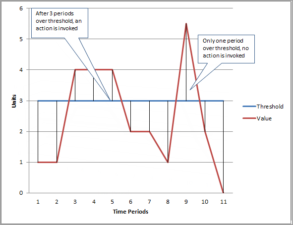

# CloudWatch

## 1. CloudWatch

- DevOps 엔지니어, 개발자, SRE(사이트 안정성 엔지니어) 및 IT 관리자를 위해 구축된 **모니터링** 및 **관찰 기능** 서비스이다.
- 애플리케이션을 모니터링하고 시스템 전반의 성능 변경 사항에 대응하며, 리소스 사용률을 최적화하고 운영 상태에 대한 **통찰력**을 제공한다.
- AWS에서 제공하는 **애플리케이션 모니터링 서비스**이다.
- **Public 서비스**로, 인터넷을 통해 접근하거나 **Interface Endpoint**를 통해 접근 가능하다.
- 로그, 지표, 이벤트 등의 운영 데이터를 수집하여 **시각화** 및 **처리**한다.
- **경보 생성**을 통해 자동화된 대응이 가능하다.
- AWS의 거의 대부분의 서비스와 기본적으로 **연동**된다.

## 2. 지표(Metric)

- 시간 순서로 정리된 **데이터의 집합**으로, 다수의 **데이터 포인트**로 구성된다.
- AWS의 대부분의 서비스는 기본적으로 **지표**를 제공한다(예: EC2 CPU 사용량, 네트워크 등).
- **커스텀 지표** 생성이 가능하다.
  - 유저가 직접 원하는 데이터 포인트를 생성해서 CloudWatch로 전달한다
  - 예: EC2 메모리 사용량 등
- **리전 단위**로 동작한다.
- 데이터는 **15개월**간 보관되며, 지속적으로 새로운 데이터가 들어오면 15개월 이전 데이터는 사라지는 형식이다.

### 2.1. 데이터 포인트(Data Point)

- 지표를 구성하는 **시간**과 **값**의 데이터 단위이다.
  - 시간은 **초 단위**까지 기록된다.
- 내부적인 통계 및 알람 처리를 위해 **UTC 기준** 사용이 권장된다.

#### 데이터 포인트 Resolution

- 데이터가 얼마나 **자주 수집**되는지를 나타내는 개념이다.
- 기본적으로 **60초 단위**로 수집한다(Standard Resolution).
- **High Resolution** 모드에서는 **1초 단위**로 수집 가능하다.
- 조회 시 초 단위로 1, 5, 10, 30 혹은 60의 **배수**로 조회가 가능하다.

#### 데이터 포인트 기간(Period)

- 데이터가 얼마만큼의 시간을 기준으로 **묶여서(Aggregation)** 보이는지에 관한 개념이다.
- 최소 **1초**에서 최대 **86400초(1일)** 까지 설정 가능하다.
  - **60초 미만**은 **High-Resolution** 모드의 데이터만 가능하다.
- **보관 기간**에 따라 데이터의 해상도가 달라진다.
  - **60초 미만**: 최대 **3시간** 확인 가능하다.
  - **60초(1분)**: **15일** 확인 가능하다.
  - **300초(5분)**: **63일** 확인 가능하다.
  - **3600초(1시간)**: **455일(15개월)** 확인 가능하다.
- 작은 단위의 데이터는 시간이 지나면 큰 단위로 **자동 통합**된다.
  - 1분 단위 데이터는 15일이 지나면 5분 단위로, 63일이 지나면 1시간 단위로만 확인 가능하다.
- 2주 이상 업데이트되지 않은 Metric은 콘솔에서 보이지 않으며, CLI를 통해서만 확인 가능하다.

### 2.2. 네임스페이스(Namespace)

- CloudWatch 지표의 **컨테이너**이다.
- 지표의 출처 혹은 성격에 따라 논리적으로 묶은 **단위**이다.
- AWS 기본 지표는 `AWS/서비스명` 형식을 따른다(예: `AWS/EC2`, `AWS/RDS`).
- **필수 항목**이며 기본값이 없으므로 반드시 직접 명시해야 한다.

### 2.3. 지표 이름(Metric Name)

- 지표의 **고유 이름**이다.
- 무엇에 관한 지표인지 나타내며 **필수 항목**이다.

### 2.4. 차원(Dimensions)

- 지표를 구분할 때 사용하는 일종의 **태그/카테고리**이다.
- **Key-Value** 쌍으로 구성되며 최대 **30개**까지 할당 가능하다.
- 예: `AWS/EC2` 네임스페이스에 모든 EC2 지표가 수집되면, **InstanceID** 차원을 통해 개별 인스턴스를 구분해서 확인한다.

### 2.5. 기타

- 지표 시각화: 지표들을 확인하고 적절한 그래프로 시각화가 가능하며, 비교 분석할 수 있다.
- Metric Insight: 지표를 SQL 형식으로 조회하고 통합하여 분석할 수 있는 기능이다. 자연어로 쿼리 생성도 가능하다.

## 3. 경보(Alarm)

- 수집된 지표 값의 변동에 따라 발생하는 **알림**을 생성하는 **기능**이다.
- 일정 수치(**Threshold**)에 도달하거나 이상/이하일 때 **이벤트**가 발생한다.
- 다양한 방법으로 **대응**이 가능하다.
  - **SNS**를 통해 Lambda 실행, 이메일 전달 등이 가능하다.
  - 예: 웹 서버의 **500 에러**가 일정 수치 이상일 때 슬랙 알림을 전송한다.
- 지표의 **Resolution**에 따라 경보의 **평가 주기**가 변동된다.
  - **High Resolution**이라면 60초 미만 주기로 평가 가능하다.
  - 그 외에는 모두 **60초의 배수** 단위로 평가한다.

### 3.1. 경보의 3가지 상태

- **OK**: 정상 상태이다.
- **ALARM**: 경보 상태이다.
- **INSUFFICIENT_DATA**: 경보 상태를 확인하기 위한 **정보**가 부족한 상태이다.

### 3.2. 결합 경보(Composite Alarm)

- 여러 경보를 **결합**한 경보이다.
  - **Boolean(AND, OR, NOT)** 관계로 경보를 묶어서 조건을 설정한다.
- 많은 경보의 결과를 **효율적**으로 전달받기 위해 사용한다.
  - 예: **CPU 사용량** 경보 AND **네트워크 사용량** 경보 발생 시 개발팀에 알림을 전송한다.
- **Suppressor Alarm** 설정이 가능하다.
  - 이 경보가 **ALARM** 상태일 경우 Composite 경보의 알림을 **중지**하는 기능이다.

## 4. 로그 수집 및 관리

- AWS 서비스 및 온프레미스 서비스에서 수집한 로그를 저장, 관리 및 확인할 수 있다.
  - AWS의 대부분의 서비스와 기본적으로 **연동**된다.
- **Lambda**, **EC2**, **Route53**, **ECS** 등 여러 AWS 서비스의 **로그**를 수집한다.
  - **로그 모으기**: 다양한 계정에서 하나의 계정으로 로그를 모아서 관리한다.
  - **실시간 모니터링**: 로그 유입을 실시간으로 감시한다.
  - **로그 수명 주기 관리**: 일정 기간 후에 로그를 아카이브하거나 삭제한다.
  - 자체적으로 확인하거나 **쿼리**가 가능하다.
- 수집된 로그를 **Kinesis**, **S3** 등 다른 서비스나 계정으로 **전달** 가능하다.

### 4.1. 로그 그룹(Log Group)

- 로그의 관리 단위를 주로 같은 **애플리케이션/서비스/리소스** 단위로 분류한다.
  - 예: `application-{스테이지}`, Lambda 함수명 등
- 다양한 설정의 **기본 단위**이다.

### 4.2. 로그 스트림(Log Stream)

- 같은 소스에서 순차적으로 받는 **로그들의 집합**이다.
  - 예: EC2 클러스터로 구성된 웹 서버에서 특정 **인스턴스 ID**에서 생성된 로그 집합

### 4.3. 로그 이벤트(Log Event)

- **타임스탬프**와 **데이터**로 구성된 특정 이벤트의 **기록**이다.

### 4.4. 보존 기간(Retention Policies)

- 로그가 자동으로 삭제되기까지 걸리는 **시간**이며, **무기한** 보관도 가능하다.

### 4.5. 로그 클래스(Log Class)

- **Standard**: 실시간 모니터링이 필요하거나 **자주 사용**되는 로그이며 **기본값**이다.
- **Infrequent Access**: 자주 사용되지 않는 로그를 **비용 효율적**으로 저장한다. CloudWatch의 일부 기능만 활용 가능하다.
  - **Subscription Filter**, **Metric Filter**, **Insights** 서비스 등 사용이 불가능하다.
- 로그 그룹 생성 후 **변경**은 불가능하다.

### 4.6. Log Insights

- **대화식 검색**으로 CloudWatch 로그를 분석할 수 있는 **서비스**이다.
  - **JSON 형식**으로 구성된 로그를 쿼리 가능하다.
  - 하나의 요청으로 최대 **20개**의 로그 그룹을 동시에 쿼리 가능하다.
- S3나 OpenSearch 등 별도의 로그 분석 작업 없이 로그를 **분석** 가능하다.
- 쿼리 저장 및 **대시보드**로 시각화가 가능하다.

### 4.7. Metric Filter

- CloudWatch Log에 필터를 걸어 필터링된 로그를 **지표화**시켜주는 **기능**이다.
- 특정한 **필터 패턴**과 일치되는 로그만 지표화한다.
  - 예: `{$.eventType="*" && $.sourceIPAddress != 123.123.*}`
  - 다양한 **비교** 및 **정규식** 적용이 가능하다.
- 필터가 **적용된 시점**부터 지표화된다.

### 4.8. 기타

- **Live Tail**: 실시간으로 올라오는 로그를 확인하는 기능이며 **콘솔** 및 **CLI** 활용이 가능하다.
- **이상 탐지(Anomaly Detection)**: **머신러닝**을 활용해서 로그 그룹 단위로 패턴에서 벗어난 로그를 탐지한다.
- **Log Subscription(구독 필터)**: 실시간으로 다른 서비스나 보관 장소로 로그를 **전달**하는 기능이다.
  - 로그에 대한 분석, 로그 전용 계정으로 **이관**, **백업** 등의 용도로 활용한다.
  - **필터링**이 가능하다.
  - **S3**에 백업, **다른 계정**으로 전송, **OpenSearch(Elasticsearch)** 등으로 전달하여 분석한다.

## 5. 대시보드

- 수집한 **로그/지표**를 기반으로 **대시보드**를 구성한다.
- 외부 리소스를 활용해서 **커스텀 대시보드** 구성이 가능하다.
  - **S3 객체** 표시, **HTML** 커스텀 그래프 표시 등을 지원한다.
- 대시보드의 **외부 공유**가 가능하다.

## 6. 기타 서비스

### 6.1. Synthetics Canary

- 일정 주기로 스크립트인 **Canary**를 수행해서 **엔드포인트** 및 **API**를 모니터링할 수 있는 서비스이다.
- **Canary**는 **Puppeteer** 또는 **Selenium Webdriver**를 통해 헤드리스 Google Chrome 브라우저로 여러 액션을 수행한다.
  - Node.js 혹은 Python으로 코딩 가능하다.
  - **1~60분** 간격으로 수행 설정이 가능하다.
- 주기적으로 실행되어 **엔드포인트**의 상태를 확인하고 에러 혹은 평소와 다른 내용이 있다면 기록한다.
  - **시각 모니터링**이 가능하다(스크린샷 기반으로 비교 분석).
  - HTTP 응답 코드 기반으로 **HAR 파일**을 생성한다.
- 직접 **지표**를 생성하여 게시하며, 다른 지표들처럼 **대시보드** 구성 및 **알람** 설정이 가능하다.

### 6.2. 인사이트 서비스

- **애플리케이션**, **컨테이너**, **Lambda** 등의 문제를 자동으로 찾아주는 서비스이다.

### 6.3. 인터넷/네트워크 모니터

- 전 세계 **인터넷 날씨 지도**를 제공한다.
- 전 세계의 **인터넷 장애** 발생 상황과 영향을 받은 고객 위치 확인이 가능하다.
- **VPC**, **CloudFront**, **NLB** 등 AWS 서비스와 관련된 내용을 별도로 모니터링 가능하다.
- **네트워크 모니터**로 **온프레미스**와 **AWS** 간의 네트워크 모니터링이 가능하다.

### 6.4. CloudWatch Resource Health

- **Amazon EC2**의 현재 상태 정보를 모아서 시각적으로 표현해 주는 서비스이다.
  - 별도의 설정 없이 모든 EC2의 **메트릭**, **태그** 등을 종합하여 실시간으로 **시각화**한다.
- **CPU 사용률**, **메모리 사용률**, **상태** 기준으로 색상을 입혀 인스턴스를 표시한다.
  - 예: CPU 0~10은 흰색, 10~50은 주황색, 50~100은 빨간색
- **시각화 커스터마이징**이 가능하다.
  - **묶음 표시** 기능(Group By, Filter by 인스턴스 타입, 이미지명, VPC ID 등)을 제공한다.
  - 인스턴스의 각 **임계값** 별 **색상** 커스터마이징이 가능하다.

## 7. CloudWatch 요금

- 프리 티어(월)
  - **기본 모니터링 지표** 및 **커스텀 지표** 10개
  - **대시보드** 3개
  - **경보** 10개
  - **5GB**의 로그 데이터 등
- **요금** 부과 항목
  - **로그** 저장 비용, 분석 비용, **Live Tail** 비용 등이 발생한다.
  - **지표 개수**에 따라 비용이 발생한다.
  - **경보 개수**에 따라 비용이 발생한다.
  - 기타 **대시보드**, **모니터링**, **분석** 등 사용 서비스당 비용이 발생한다.
