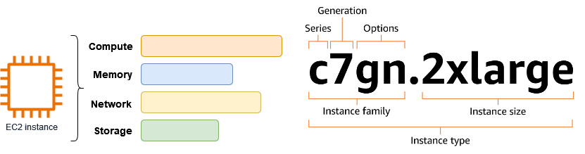
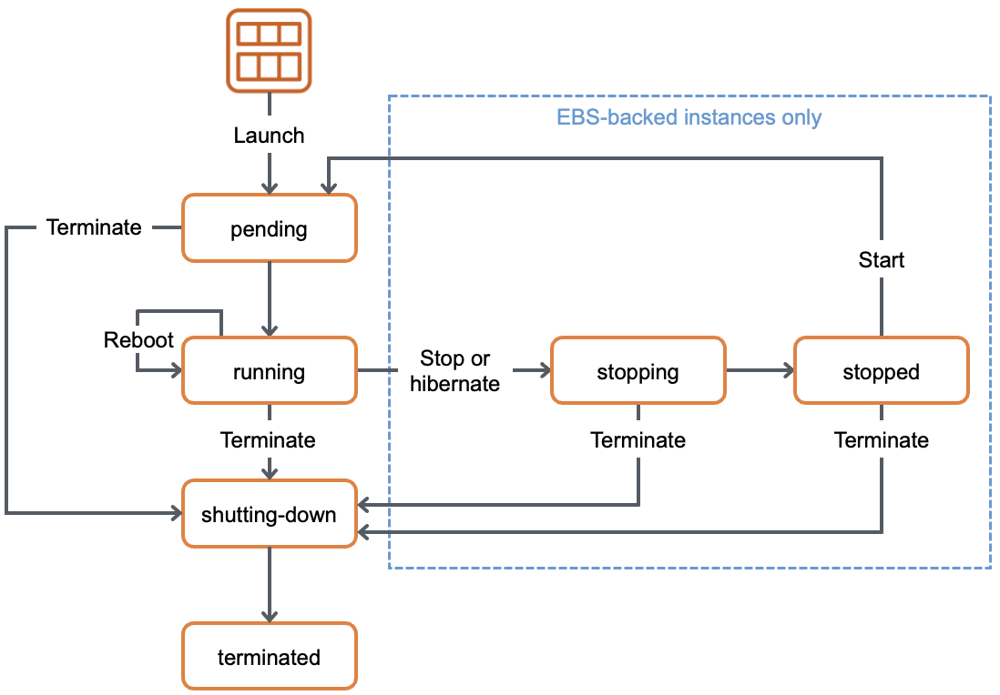

# EC2

## 1. EC2(Elastic Compute Cloud)

- 안전하고 크기 조정이 가능한 컴퓨팅 파워를 클라우드에서 제공하는 **웹 서비스**이다.
- 개발자가 더 쉽게 웹 규모의 클라우드 컴퓨팅 작업을 할 수 있도록 설계되었다.

### 1.1. EC2의 장점

- 초 단위 **온디맨드 가격 모델**을 제공한다.
  - 서비스 요금을 미리 약정하거나 선입금이 필요 없으며, 미리 약정하면 더 저렴하다.
- **빠른 구축 속도**와 **확장성**을 가진다.
  - 몇 분이면 전 세계에 인스턴스 수백여 대를 구축할 수 있다.
- **다양한 구성 방법**을 지원한다.
  - 머신러닝, 웹서버, 게임 서버, 이미지 처리 등 다양한 용도에 최적화된 서버 구성이 가능하다.
  - 다양한 과금 모델을 사용할 수 있다.
- 여러 **AWS 서비스와 연동**된다.
  - 오토스케일링, Elastic Load Balancer, CloudWatch 등과 연동된다.

### 1.2. 사용 사례

- 데이터베이스
- 웹 서버
- 머신 러닝
- 백엔드 서버
- 데이터 프로세싱
- 기타 서버가 필요한 모든 작업

## 2. 인스턴스

- EC2에서 컴퓨팅을 담당한다.
- 다양한 유형과 크기로 구성된다.
- 저장 방법에 따라 **EBS 연동**과 **인스턴스 스토어** 두 가지로 분류된다.
  - **EBS 연동**은 저장을 담당하는 **EBS**와 네트워크로 연결된다.
    - 유연하지만 속도가 느리다.
    - 또한, 대역폭에 영향을 받고 최대폭에 제한이 있다.
  - **인스턴스 스토어**는 물리적으로 연결되어 있다.
    - 빠르게 파일을 가져오거나 사용하는 파일양이 많은 경우에 사용한다.
    - 속도가 중요한 경우 사용한다.
- 하나의 **가용 영역(AZ)** 에 존재한다.

### 2.1. 인스턴스 유형(패밀리)

- 인스턴스의 유형에 따라 **CPU, 메모리, 스토리지, 네트워크 등을 조합한 구성**이다.
- 각 인스턴스 유형별로 사용 목적에 따라 최적화되어 있다.
- 유형별로 이름이 존재한다.
  - t 유형: 저렴한 범용
  - m 유형: 범용
  - .. 등 다양한 유형이 있다.
- 같은 유형의 인스턴스들을 **인스턴스 패밀리**라 부른다.
- 타입별로 세대별로 숫자를 부여한다.
  - m5 = m 인스턴스의 5번째 세대이다.
- 아키텍처 및 프로세서/추가 기술에 따라 접미사가 붙는다.
  - c7gn = c 인스턴스 중 AWS Graviton 프로세서를 사용(g) + Network Optimized(n)이다.

### 2.2. 인스턴스 크기

- 같은 인스턴스 패밀리에서 다양한 크기가 존재한다.
- 인스턴스의 CPU 개수, 메모리 크기, 성능 등으로 크기가 결정된다.
- 크기가 클수록 다음과 같은 특징을 가진다.
  - 더 많은 메모리를 가진다.
  - 더 많은 CPU를 가진다.
  - 더 많은 네트워크 대역폭을 가진다.

## 3. EBS(Elastic Block Store)

- AWS 클라우드의 EC2 인스턴스에 사용할 **영구 블록 스토리지** 볼륨을 제공하는 서비스이다.
- 각 Amazon EBS 볼륨은 **가용영역 내**에 자동으로 복제되어 구성 요소 장애로부터 보호해주며, 고가용성 및 내구성을 제공한다.
- **가상의 하드드라이브**라고 할 수 있다.
- EC2 인스턴스가 종료되어도 계속 유지가 가능하다.
  - 단, 루트 볼륨으로 사용 시 EC2가 종료되면 같이 삭제될 수 있으나, 설정을 통해 EBS만 따로 존속시킬 수 있다.
- 용량을 범위에 따라 자유롭게 설정할 수 있다.
- 특수하게 하나의 EBS를 여러 EC2에 장착 가능한 경우도 있다(EBS Multi Attach).
- EC2 인스턴스와 **같은 가용 영역**에, 즉 하나의 가용 영역에 존재한다.
- 가용영역 안에 자동으로 분산 저장되며 **99.999% 가용성**을 목표로 한다.
- EC2의 유형을 바꾸고 싶을 때, 새로운 유형의 인스턴스에 네트워크로 연결만 하면 된다.
- 특정 인스턴스에 저장 공간을 추가하고 싶을 때도 추가 EBS를 네트워크로 연결하면 된다.

### 3.1. EBS 유형

- 범용(General Purpose: GP): SSD
- 프로비저닝 된 IOPS(Provisioned IOPS: io): SSD
- 쓰루풋 최적화(Throughput Optimized HDD: st): HDD
- 콜드 HDD(SC): HDD
- 마그네틱(Standard): HDD

### 3.2. Snapshot

- EBS의 특정 시점을 저장한 **이미지**이다.
- 이후 EBS로 다시 복구 가능하다.
- EBS의 **백업** 용도로 활용 가능하다.
- **증분식**으로 바뀐 부분만 저장한다.
  - 100GB 볼륨의 스냅샷을 5번 찍어도 500GB가 아닌 100GB + 4번간 변경 부분만 저장하여 **비용 최적화**가 가능하다.
- **S3**에 저장되며 **99.999999999% 내구성**을 가진다.
- **Data Lifecycle Manager** / AWS Backup 등으로 자동화해서 생성이 가능하다.
- 암호화도 가능하다.
- **아카이브**를 통해 더 적은 비용으로 저장할 수 있으나, 최소 90일 이상 저장해야 하고 복원에 최대 72시간이 소요되는 등 몇 가지 제약 사항이 있다.
- 다른 계정에 공유 가능하다.
- **EBS Direct API**를 활용해서 스냅샷에 직접 내용을 쓰거나 읽기가 가능하다.

## 4. AMI(Amazon Machine Image)

- EC2 인스턴스를 실행하기 위해 필요한 정보를 모은 **템플릿**이다.
- 구성 요소는 다음과 같다.
  - 1개 이상의 **EBS 스냅샷**
  - **사용 권한**(어떤 AWS 어카운트가 사용할 수 있는지)
  - **블록 디바이스 맵핑**(EC2 인스턴스를 위한 볼륨 정보, 즉 EBS의 용량 및 개수 정보)
- 필요에 따라 **private**으로 가지고 있거나 **public**으로 공개 가능하다.

### 4.1. 인스턴스 저장 유형에 따른 AMI의 생성 방법

- **EBS**: 스냅샷을 기반으로 루트 디바이스를 생성한다.
- **인스턴스 저장**: S3에 저장된 템플릿을 기반으로 생성한다.

## 5. EC2 요금 모델 기초

- 미리 내지 않고, 사용한 만큼만 내고, 많이 쓸수록 적게 내고, 예약할수록 더 적게 낸다.
- **미리 내지 않고 사용한 만큼 내고**
  - 미리 예치금 등이 없고, 사용한 만큼(On-Demand)만 요금을 지불한다.
- **많이 쓸수록 적게 내고**
  - 사용하면 사용할수록 단위 가격이 더 저렴해진다.
- **예약할수록 더 적게 낸다**
  - 미리 요금을 낼 필요는 없지만, 미리 예약하면 더 많이 저렴하다.
  - 즉, **On-Demand**는 유용하지만 비싸며, 약정을 통해 많은 할인 혜택 적용이 가능하다.

### 5.1. EC2의 요금 구성

- 인스턴스 요금
- 데이터 전송
- Public IPv4 IP
- 연동 서비스(ELB, CloudWatch, EBS 등)

### 5.2. EC2 요금 모델

#### On-Demand

- 실행하는 인스턴스에 따라 **초당** 혹은 **시간당** 컴퓨팅 파워로 측정된 가격을 지불한다.
- 약정이 필요 없다.
- 수요 예측이 힘들거나 유연하게 EC2를 사용하고 싶을 때, 또는 테스트 용도로 사용하기에 적합하다.

#### EC2 예약 인스턴스(Reserved Instance: RI)

- EC2 인스턴스를 일정 기간 **약정**하여 요금을 할인받는 방식이다.
- 온디맨드 EC2 사용 요금을 할인받는 방식으로 적용된다.
- 할인받고 싶은 EC2 인스턴스와 같은 리전, 유형을 구매해야 한다.
- 약정 기간이 길수록 더 큰 할인율이 적용된다.
  - **1년** 혹은 **3년**을 선택할 수 있다.
- 최대 72%까지 저렴하다.

#### 스팟 인스턴스(Spot Instance)

- AWS에서 보유 중인 **남는 인스턴스**를 저렴한 가격으로 제공하는 방식이다.
- 가용영역별, 인스턴스 유형별 다른 풀로 관리된다.
- 최대 90%까지 절약이 가능하다.
- 가격은 상황에 따라 변동되지만, 항상 On-Demand보다 저렴하다.
- 단, 인스턴스가 언제 종료될지 예측 불가능하다(**Spot Instance interruption**).

#### Saving Plan

- 컴퓨팅 파워의 **사용량**을 약정하는 요금 모델이다.
- 종류는 다음과 같다.
  - **Compute Saving Plans**: 다른 서비스(Lambda, Fargate)와 같이 약정한다.
  - **EC2 Instance Saving Plans**: EC2 인스턴스 패밀리를 지정해서 약정한다.
- 최대 72%까지 저렴하다.

#### 전용 인스턴스(Dedicated Instance)

- 물리적으로 인스턴스/호스트 단위로 **격리된 서버**에서 EC2를 실행하는 방식이다.
- 주로 **라이선스 이슈**나 **퍼포먼스 이슈**를 해결하기 위해서 사용된다.

## 6. 보안 그룹(Security Group)

- 인스턴스에 대한 **인바운드** 및 **아웃바운드** 트래픽을 제어하는 **가상 방화벽** 역할이다.
- EC2의 방화벽 역할을 하는 서비스이다.
- **Port 허용** 규칙을 설정한다.
  - 기본적으로 모든 포트는 비활성화되어 있다.
  - 선택적으로 트래픽이 지나갈 수 있는 Port와 Source를 설정 가능하다.
  - **Deny는 불가능**하다.
- **인스턴스 단위**로 적용된다.
  - 하나의 인스턴스에 하나 이상의 보안 그룹 설정이 가능하다.
  - 인스턴스에 여러 보안 그룹이 적용될 경우, 모든 보안 그룹의 규칙을 적용받는다.

## 7. EC2 접근 방법

### 7.1. SSH 연결

- **SSH 키 페어**로 인증한다.
  - SSH 키 페어는 프라이빗 키와 퍼블릭 키로 구성되며 다시 발급이 불가능하다. 분실 시 EBS를 분리해 다른 인스턴스에 연결 혹은 스냅샷을 통해 재생성해야 한다.
  - **리전 단위**이다.
- 직접 로깅 혹은 기타 **3rd Party 애플리케이션**이 필요하다.
- 연결 요구사항으로 **인터넷 연결**이 필요하다(Security Group, Public Subnet, Bastion Host 등).
- AMI별 SSH **기본 유저 이름**이 다르다.

### 7.2. EC2 인스턴스 연결

- **임시 SSH 키**를 생성해서 EC2로 밀어 넣어 연결하는 방식이다.
- **IAM**으로 인증한다.
- **CloudTrail**을 통해 연결 기록만 감사 가능하다.
- **인터넷 연결**이 필요하며, **Ec2-instance-connect 에이전트** 설치가 필요하다.

### 7.3. Session Manager

- **AWS Credential**을 이용해서 인증한다.
- 별도의 key가 필요 없으며, **private instance**에 접근할 때 **Bastion Host**가 필요 없다.
- 세션 명령 및 세부 정보를 **S3** 버킷 또는 **CloudWatch** 로그 그룹에 기록할 수 있다.

### 7.4. EC2 직렬 콘솔

- EC2 **시리얼 포트**로 연결한다.
- 연결 인증 방식은 **IAM 인증**과 **Root Password**이다.
- **CloudTrail**을 통해 연결 기록만 감사 가능하다.
- 계정 단위 활성화, OS Password 설정이 필요하며, **특정 인스턴스 타입/리전**에서만 사용 가능하다.
- 직접 컴퓨터에 모니터와 키보드를 붙인 것 같이 동작한다.
- **부팅** 및 **네트워크 문제** 해결에 유용하다.

## 8. EC2 생명주기

### 8.1. 보류 중인 인스턴스(pending)

- 인스턴스를 시작하면 인스턴스가 **pending** 상태로 전환된다.
- 인스턴스는 시작 시 사용자가 지정한 **AMI**를 사용하여 부팅한다.
- 인스턴스 사용이 준비되고 나면 인스턴스가 **running** 상태로 전환된다.

### 8.2. 중지된 인스턴스(stopped)

- 인스턴스를 중지하면 **stopping** 상태로 전환되고 나서 **stopped** 상태로 전환된다.
- 인스턴스가 **stopped**인 경우 인스턴스에 대한 요금이 청구되지 않는다.
  - 단, **EBS 요금**이나 다른 구성 요소(**Elastic IP** 등)는 청구된다.
- 중지 후 재시작 시 **퍼블릭 IP**가 변경된다.

### 8.3. 최대 절전 모드로 전환된 인스턴스(stopped)

- **메모리 내용**을 보존해서 재시작 시 중단 지점에서 시작할 수 있는 정지 모드이다.

### 8.4. 재부팅 중인 인스턴스(reboot)

- 인스턴스 재부팅은 **운영체제 재부팅**과 같다.
- **퍼블릭 IP** 변동이 없다.

| 인스턴스 상태     | 설명                                          | 인스턴스 사용 요금         |
| :---------------- | :-------------------------------------------- | :------------------------- |
| **pending**       | 인스턴스가 running 상태로 될 준비             | 미청구                     |
| **running**       | 인스턴스 사용 중                              | 청구                       |
| **stopping**      | 인스턴스가 중지 또는 최대 절전 모드로 전환 중 | 미청구 최대절전 시 청구 |
| **stopped**       | 인스턴스가 중지 상태: 재시작 가능             | 미청구                     |
| **shutting-down** | 인스턴스가 종료 중                            | 미청구                     |
| **terminated**    | 인스턴스가 영구적으로 삭제됨                  | 미청구                     |

## 9. ENI(Elastic Network Interface)

- EC2의 **가상의 랜카드**이다.
- **IP 주소**와 **Mac 주소**를 보유한다.
- 하나의 인스턴스에 여러 개의 ENI를 연동 가능하다.
  - 즉, 하나의 인스턴스가 한 개 이상의 아이피를 보유 가능하다.
- 인스턴스 유형 및 사이즈에 따라 최대 보유 가능한 IP 주소가 다르다.
- 내부적으로 **보안 그룹**은 ENI에 부착된다.
- 기본적으로 **private IP** 주소와 private DNS를 보유하며, 선택적으로 **public IP**, public DNS를 보유한다.
- 탄력적 네트워크 인터페이스는 VPC에서 가상 네트워크 카드를 나타내는 **논리적 네트워킹 구성 요소**이다.

## 10. Elastic IP(탄력적 IP)

- EC2의 **퍼블릭 IP**를 **고정**해주는 서비스이다.
  - 즉, 인스턴스를 중지했다가 재시작해도 고정적인 IP를 확보 가능하다.
- EC2 이외에 다른 서비스(NLB 등)에도 사용된다.
- 내가 보유한 IP 주소를 AWS에서 사용 가능하다.
- **리전 단위**이다.
- 연결하지 않고 보유하기만 해도 비용이 발생한다(**IPV4 비용 발생**).
