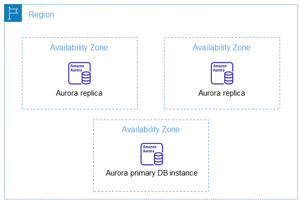
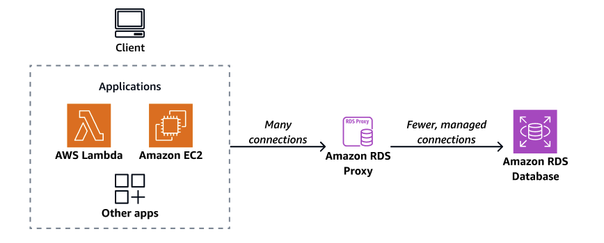

# RDS

## 1. 관계형 데이터 베이스 (RDBMS)

- 데이터 간의 **관계**에 집중한 데이터베이스이다.
- 사전에 정의된 **형식**과 **타입**의 데이터만 저장 가능하다.
- 행(Row)과 열(Column)로 구성된 **테이블** 형식으로 데이터를 관리한다.
- **고유의 키(Primary Key)**로 각 데이터를 식별한다.
- **트랜잭션**을 지원하여 데이터의 무결성을 보장한다(모두 성공하거나, 모두 실패하거나).

## 2. Amazon RDS(Relational Database Service)

- 클라우드에서 관계형 데이터베이스를 간편하게 설정, 운영 및 확장할 수 있는 **관리형 서비스**이다.
- 하드웨어 프로비저닝, 데이터베이스 설정, 패치 및 백업과 같은 시간 소모적인 관리 작업을 **자동화**해 준다.
- 사용자가 인프라 관리가 아닌 **애플리케이션 개발**에 집중할 수 있도록 지원한다.
- **가상 머신** 위에서 동작하지만, 사용자가 OS에 직접 로그인할 수 없다(AWS가 관리).
- **Serverless** 서비스가 아니다.
  - **Aurora Serverless**는 예외이다.
- **암호화** 및 **자동 백업**을 지원한다.

### 2.1. RDS와 EC2

- 내부적으로 **EC2** 인스턴스를 활용하여 동작한다.
- **VPC** 내부에서 동작하며, 기본적으로 외부 접근이 차단되지만 설정에 따라 **Public IP**를 부여하여 접근 가능하다.
- **서브넷**과 **보안 그룹** 지정이 필요하다.
- **EC2 타입** 지정이 필요하며, 스토리지는 **EBS**를 활용한다.
- **일시 중지**가 가능하지만, 최대 **7일** 후에 자동으로 다시 시작된다.
- 백업을 위한 **스냅샷** 생성이 가능하다.
- **예약 인스턴스(Reserved Instance)**를 활용하여 비용 할인이 가능하다.

### 2.2. RDS 인증 방법

- 전통적인 **ID/Password** 방식을 지원하며, **AWS Secrets Manager**와 연동하여 자동 로테이션이 가능하다.
- **IAM DB 인증**을 통해 IAM 역할로 데이터베이스 접근 관리가 가능하다.
- **Kerberos 인증**을 지원한다.

### 2.3. RDS에서 제공하는 DB 엔진

- **상용 엔진**: **Oracle**, **MS SQL Server**, **IBM Db2** (라이선스 비용 추가)
- **오픈 소스 엔진**: **MySQL**, **PostgreSQL**, **MariaDB**
- **클라우드 네이티브**: **Amazon Aurora**

### 2.4. RDS Multi AZ (다중 가용 영역)

- 두 개 이상의 **AZ**에 걸쳐 데이터베이스를 구축하고 원본과 **Standby DB**를 자동으로 **동기화(Sync)**한다.
- 원본 DB 장애 발생 시 자동으로 Standby DB가 **승격(Failover)**된다(DNS가 Standby DB를 가리킴).
- Standby DB는 평소에 **접근 불가능**하다.
- 성능 향상이 아닌 **고가용성(안정성)**을 위한 기능이다.

### 2.5. 읽기 전용 복제본 (Read Replica)

- 데이터베이스의 **읽기 전용 복제본**을 생성하며 **비동기(Async)** 방식을 사용한다.
- 쓰기는 원본, 읽기는 복제본에서 처리하여 **워크로드 분산**이 가능하다.
- 안정성이 아닌 **성능 향상**을 위한 기능이다.
- 원본 DB 장애 발생 시 **수동**으로 승격 및 DNS 변경이 필요하다.

### 2.6. RDS Multi Region

- 다른 리전에 지속적으로 동기화시키는 **DB 클러스터**를 생성한다(비동기 복제).
- 주로 **로컬 성능** 확보 혹은 **재해 복구(DR)** 시나리오로 활용한다.

### 2.7. DB Subnet Group

- RDS가 위치할 **서브넷**들을 묶은 논리적 그룹이다.
- 보안을 위해 주로 **프라이빗 서브넷**으로 구성한다.
- 최소 **두 개 이상**의 가용 영역(AZ)에 속한 서브넷이 필요하다.
- 퍼블릭 접근을 허용하려면 **퍼블릭 서브넷**으로 구성해야 한다.

### 2.8. Parameter Group

- 데이터베이스의 주요 설정값(**Timezone**, **Character Set** 등)을 묶은 **논리적 단위**이다.
- 미리 정의해 둔 설정을 여러 RDS 인스턴스에 일괄 **적용** 가능하다.

## 3. RDS 접속

- RDS 생성 시 두 종류의 **IP**가 할당된다.
  - **Private IP**
    - 기본적으로 할당되며, VPC 내부의 리소스가 접근하기 위해 사용한다.
    - DB 인스턴스가 위치한 **서브넷**에 따라 Range가 결정된다.
  - **Public IP**
    - 퍼블릭 접근 옵션을 선택했을 때 할당된다.
    - 단, **Private 서브넷**에 DB 인스턴스가 있을 경우 할당되지 않는다.
- RDS의 **IP**는 다양한 상황(중지 후 재시작, 교체, 점검, OS 패치, 엔진 업데이트 등)에서 **변경**될 수 있다.
  - 따라서 가능하면 **DNS**로 접근하는 것이 좋다.
- 일반적으로 **Production DB**는 보안을 위해 **프라이빗 서브넷**에 배치한다.

### 3.1. 프라이빗 서브넷 접속 방법

- **Bastion Host**를 통해 접속 가능하다.
- **Instance Connect Endpoint**를 활용할 수 있다(무료). 단, 포트 활용에 제약이 있을 수 있다(예: 2289/3389 포트 등).
- **VPN** 또는 **Direct Connect**로 VPC와 연결하여 접속한다.

## 4. RDS 인증

- 일반적인 **Username/Password** 방식이다. **AWS Secrets Manager**와 연동하여 관리 가능하다.
- **IAM 인증** 방식이다.
  - IAM을 활용해 **임시 토큰**을 생성하여(유효기간 15분) RDS에 접속하는 방법이다.
  - DB 내부에 IAM 인증을 허용할 유저를 **등록**해야 한다.
  - 토큰 생성을 위해서는 `rds-db:connect` **권한**이 필요하다.
  - **IAM Condition**을 활용하여 세밀한 제어(특정 태그, IP, 시간대 등)가 가능하다.
- **Kerberos 인증**을 지원한다.

## 5. Amazon Aurora

- 상용 데이터베이스 비용의 1/10 수준으로 **완전한 MySQL 및 PostgreSQL 호환성**을 통해 전 세계적으로 탁월한 **고성능** 및 **가용성**을 제공하는 서비스이다.
- **MySQL**의 5배, **PostgreSQL**의 3배 처리량을 제공한다.
- AWS에서 클라우드 환경에 최적화된 **엔진**을 자체 개발하여 사용한다.
- **용량**이 자동으로 증감한다(10GB부터 시작해서 10GB 단위로 최대 **128TB**까지 증가).
- **연산 능력**은 최대 128vCPU와 1024GiB 메모리까지 확장 가능하다.
- 데이터를 **분산 저장**하며 **Quorum 모델**을 사용한다.
  - 각 AZ마다 2개씩, 최소 3개 이상의 AZ에 총 **6개의 복제본**을 저장한다.
  - 3개 이상 손실 전까지 **쓰기** 능력을 유지한다.
  - 4개 이상 손실 전까지 **읽기** 능력을 유지한다.
  - 손실된 복제본은 **자가 치유(Self-healing)** 기능을 통해 지속적으로 검사 및 복구한다.

### 5.1. Amazon Aurora DB Clusters

- 하나 이상의 **DB 인스턴스**와 데이터를 관리하는 **Cluster 볼륨**을 묶은 단위이다.
- **Cluster 볼륨**은 데이터베이스의 저장 공간으로, 여러 가용 영역에 걸쳐 데이터를 **복제 분산 저장**한다.
- 구성은 다음과 같다.
  - **Primary(Write) DB 인스턴스**: Read/Write 모두 가능한 인스턴스로 클러스터당 **하나**만 존재한다.
  - **Aurora Replica(Reader DB 인스턴스)**: Cluster 볼륨에 접근 가능한 Read-only 인스턴스로 클러스터당 최대 **15개**까지 생성 가능하다.
- 인스턴스 간에 **Async 복제**를 수행한다.
- Writer 장애 시 자동으로 Replica 중 하나가 Writer로 **Failover**된다. 데이터 손실 없이 승격 가능하여 **고가용성(High Availability)** 을 확보한다.

### 5.2. Aurora Global Database

- 전 세계 리전에서 **1초 내**의 지연 시간으로 데이터 액세스가 가능하다.
- **재해 복구(DR)** 용도로 활용 가능하다.
  - 유사시 보조 리전 중 하나를 승격하여 메인으로 활용한다.
  - **RPO(복구 목표 지점)** 는 1초이다.
    - **RPO(Recovery Point Objective)**: 시스템 장애 시 허용 가능한 **최대 데이터 손실량**이다.
  - **RTO(복구 목표 시간)** 는 1분 미만이다.
    - **RTO(Recovery Time Objective)**: 장애 발생 시 시스템을 원 상태로 복원하는 데 소요되는 **지연 시간**이다.

### 5.3. Aurora의 백업

- **읽기 복제본(Read Replica)** 을 지원한다(Aurora Replica와 다른 개념).
  - MySQL의 **Binary log(Binlog)** 복제 방식을 사용한다.
  - 단, **다른 리전**에만 생성 가능하다.
- RDS와 마찬가지로 **자동/수동 백업**이 가능하다.
  - **자동 백업**의 경우 1~35일 동안 **S3**에 보관된다.
  - **수동 백업(스냅샷)** 이 가능하다.
  - 백업 데이터를 복원할 경우 **새로운 데이터베이스**를 생성한다.

### 5.4. Aurora 데이터베이스 클로닝

- 기존 데이터베이스에서 **새로운 데이터베이스**를 복제하는 기능이다.
- 스냅샷을 통해 새로운 데이터베이스를 생성하는 것보다 **빠르고 저렴**하다.
- **Copy-On-Write 프로토콜**을 사용하므로, 기존 클러스터를 삭제해도 복제된 DB는 정상 동작한다.

### 5.5. Backtrack(역추적)

- 기존 DB를 특정 시점으로 **되돌리는** 기능이다(새로운 DB 생성이 아님).
- DB 관리 실수를 쉽게 만회 가능하며, 새로운 DB 생성보다 훨씬 **빠르다**.
- 앞뒤로 시점을 이동할 수 있어 원하는 지점을 빠르게 찾을 수 있다.
- **Backtrack Window** 설정이 필요하다.
  - **Target Backtrack Window**: 어느 시점만큼 되돌릴 데이터를 저장할지 설정하는 목표치이다(지정 시점 이전으로는 Backtrack 불가능).
  - **Actual Backtrack Window**: 실제로 되돌릴 수 있는 시간이다(Target보다 작아야 함).
- Backtrack 활성화 시 시간당 DB의 변화를 저장하며, 저장된 용량만큼 **비용**을 지불한다.
  - DB 변화가 많을수록 로그가 많아져 비용이 증가한다.
  - DB 로그가 너무 많아 Actual Window가 Target Window보다 작을 경우 **알림**이 발생한다.
- **MySQL 호환** 버전에서만 사용 가능하다.
  - Aurora 생성 시 **Backtrack**을 설정한 DB만 사용 가능하며, 스냅샷 복구 혹은 **Clone**을 통해 기능 활성화가 가능하다.
- 사용 시 **다운 타임**이 존재한다.

## 6. Aurora Serverless

- Amazon Aurora의 **온디맨드 Auto Scaling** 구성이다.
- 애플리케이션 요구 사항을 기반으로 자동으로 시작 및 종료하고 **용량**을 확장 또는 축소한다.
- 데이터베이스 용량을 관리하지 않고도 클라우드에서 데이터베이스를 실행할 수 있는 **Serverless** 버전이다.
  - 인스턴스를 미리 **프로비전**하거나 관리할 필요가 없다.
  - t2.micro 등의 인스턴스 타입을 선택할 필요가 없다.
- **V1**과 **V2**가 존재하며, **V1**은 2024년 12월 31일 지원 종료되었다.
- 장점
  - 초당 수만 건의 트랜잭션에서 0 트래픽까지 장애 없이 **스케일링**이 가능하다(컴퓨팅/스토리지 자동 스케일링).
  - 사용한 만큼 **비용**을 지불한다.
  - **개발용 리소스**, **Read Replica**, **Failover** 대비 리소스 등으로 활용하기 적합하다.

### 6.1. ACU(Aurora Capacity Unit)

- Aurora Serverless의 **Scale 단위**이다.
- **1 ACU**는 약 **2GB RAM**, CPU, 네트워크 자원에 해당한다.
- **최소/최대 ACU** 설정이 가능하며, 요금은 ACU 소모량에 따라 과금된다.
- **ServerlessDatabaseCapacity** 및 **ACUUtilization** 지표를 통해 실제 사용 용량을 확인할 수 있다.

| 용량 범위(ACU) | Aurora MySQL 지원 버전 | Aurora PostgreSQL 지원되는 버전 |
| :------------- | :--------------------- | :------------------------------ |
| **0.5 ~ 128**  | 3.02.0 이상            | 13.6, 14.3, 15.2, 16.1 이상     |
| **0.5 ~ 256**  | 3.06.0 이상            | 13.13, 14.10, 15.5, 16.1 이상   |
| **0 ~ 256**    | 3.08.0 이상            | 13.15, 14.12, 15.7, 16.3 이상   |

### 6.2. Aurora Serverless 유휴(Auto Pause) 기능

- 트랜잭션이나 연결이 없는 **유휴 기간**에는 ACU를 **0**으로 유지하는 기능이다.
- **컴퓨팅 리소스** 비용을 절감할 수 있으나, **스토리지** 및 기타 비용은 부과된다.
- 특정 버전 이상(용량 범위 0 지원)에서만 지원한다.
- **Cold Start**가 발생하여 다시 트랜잭션을 처리하기 전 약 **15초**의 대기 시간이 발생한다.
- **비활성 후 일시 정지 시간**을 설정할 수 있다(5분 ~ 24시간).
- 유휴/재시작 시 **AWS RDS 이벤트**가 발생하며 **EventBridge**로 확인 가능하다.
- `instance.log`에서 중지 이유 등을 리포트로 확인 가능하다.

### 6.3. Aurora Serverless 사용 전 주의 사항

- Amazon Aurora의 일부 **기능** 사용이 불가능하다(데이터베이스 활동 스트림(DAS), 클러스터 캐시 관리 등).
- 단위 시간 당 비용은 기존 Aurora에 비해 **비싼 편**이다.
  - Saving Plan, Reserved Instance 등 할인 혜택 적용이 불가능하다.
- **ACU**는 생각보다 민감하게 변동된다.
  - 유휴 상태에서 단순한 **로그 조회**로도 다시 ACU가 올라갈 수 있다.
  - 툴(Workbench, Datagrip 등)로 **연결**을 지속해둔 경우 유휴 상태로 전환되지 않을 수 있다.

## 7. AWS Secrets Manager

- 애플리케이션, 서비스, IT 리소스에 액세스할 때 필요한 **보안 정보**를 보호하는 서비스이다.
- 데이터베이스 **자격 증명**, **API 키** 등의 보안 정보를 수명 주기에 걸쳐 손쉽게 **교체**, **관리**, **검색**할 수 있다.
  - **RDS**, **RedShift** 등의 암호를 안전하게 저장하고 관리한다.
- 보안 정보의 주기적인 **교체(Rotation)** 를 지원한다.
  - 일정 주기로 자동으로 RDS의 암호를 교체하고 데이터베이스에 **적용**한다.
- **CloudFormation** 등 다른 서비스와 연동하여 안전한 보안 확보가 가능하다.
- **RDS** 및 관련 서비스(**RDS Proxy** 등)와 연동된다.
- 바로 삭제가 불가능하며, 최소 **7일**의 대기 기간이 필요하다.
- AWS System Manager Parameter Store와 유사하다.
  - Parameter Store는 **Rotation 기능이 없지만 무료**이다.

## 8. Amazon RDS Proxy

- AWS에서 제공하는 RDS의 **Connection Pool 서비스**이다.
  - **Connection Pool**: 데이터베이스와의 연결을 관리하고 재사용하여 애플리케이션의 **성능**을 향상시키는 기능이다.
  - RDS로 연결하는 Connection들을 중간에서 관리하여 효율적으로 **배분** 및 **관리**한다.
- AWS의 **EC2** 혹은 **Lambda**와 같이 대규모 **Connection**이 필요할 경우 활용 가능하다.
- **AWS Secrets Manager(User/Password) 인증** 혹은 **IAM 인증(`rds-db:connect` 권한)** 을 지원한다.
- 주의 사항
  - **VPC 내부**에서만 활용 가능하며, **Public Internet**에서 접근이 불가능하다(데이터베이스의 접근 가능 여부와 무관).
  - 별도의 **Endpoint**를 보유하므로 RDS와 다른 Endpoint 사용이 필요하며, 추가로 **Endpoint** 생성이 가능하다.
  - 기타 **DB 엔진**별 Port 및 **제약 사항**이 존재한다.

### 8.1. RDS Proxy와 Secrets Manager

#### Proxy -> DB

- **RDS Proxy**가 실제 RDS 데이터베이스에 접속하기 위해서는 **Secrets Manager**가 필수이다.
- **Secrets Manager**에 RDS의 **ID**와 **비밀번호**를 저장해 두어야 한다.
- 사용하려는 **DB 계정**마다 별도의 **Secret**을 생성해야 한다.

#### Client -> Proxy

- **애플리케이션**이 RDS Proxy에 접속할 때는 **IAM 인증**과 **비밀번호** 방식 모두 사용 가능하다.
- 단, **IAM 인증** 방식을 사용했더라도 Proxy에서 DB에 접속할 때는 **Secrets Manager**에 저장된 ID와 비밀번호를 사용한다.
