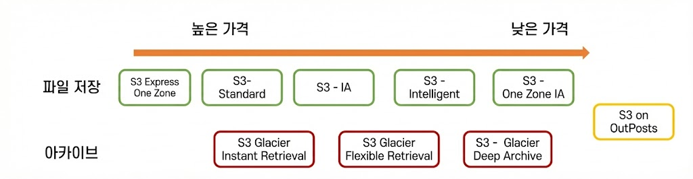
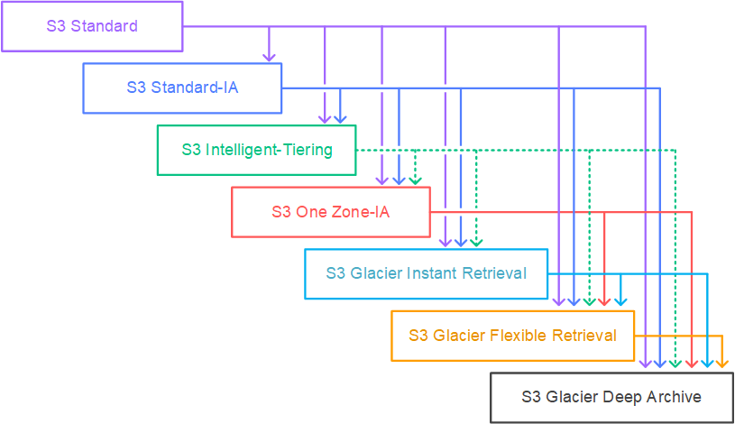

# S3

## 1. S3(Simple Storage Service)

- 업계 최고의 확장성과 데이터 가용성 및 보안과 성능을 제공하는 **객체 스토리지 서비스**이다.
- 지정된 기간 동안 객체에 대해 **99.999999999%의 내구성**(파일을 잃어버리지 않음)과 **99.99%의 가용성**(파일을 원할 때 사용할 수 있음)을 제공하도록 설계되었다.
- 전 세계 기업의 수백만 **애플리케이션**을 위한 데이터를 저장한다.
- AWS에서 제공하는 **Object 스토리지 서비스**이다.
  - **파일 스토리지**: 파일을 **계층 구조**로 관리하며, 빠르게 찾고 **업데이트** 작업이 가능하다. 확장이 **제한적**이다(수십 테라바이트 수준).
  - **오브젝트 스토리지**: 파일을 **오브젝트**(데이터, 메타데이터, 아이디) 단위로 관리한다. 정확한 **경로**를 알아야 찾기가 가능하며, 확장이 **쉽다**(수십 페타바이트 이상).
- 주요 사용 사례
  - 파일을 저장하고 활용하고 싶을 때(미디어, 로그, 소스코드, 파일, 백업) 사용한다.
  - **Static Hosting** 기능을 통해 서버 없이 웹 페이지를 제공하고 싶을 때 사용한다.
  - 기타 **파일 관리**가 필요할 때 사용한다.
- 주요 기능
  - **Presigned URL**을 통해 제한된 사람에게만 전달 가능하다.
  - **버저닝** 및 **권한 관리**가 가능하다.
  - 주기적인 **복제**, 일정 기간 **파일 삭제 방지**, **암호화** 등을 지원한다.

## 2. S3 기초

- **객체 스토리지 서비스**이며 **파일**만 보관 가능하다. **애플리케이션** 설치는 불가능하다.
- **글로벌 서비스**이지만 데이터는 특정 **리전**에 저장된다.
- **무제한 용량**을 제공하며, 하나의 객체는 **0byte**(데이터가 없는 경우)에서 **5TB**까지 저장 가능하다.

### 2.1. 버킷

- S3의 저장 공간을 구분하는 **단위**로, **디렉터리**나 **폴더**와 같은 개념이다.
- 버킷 이름은 전 세계에서 **고유한 값**이어야 하며, 리전에 관계없이 **중복된 이름**이 존재할 수 없다.

### 2.2. 객체의 구성

- **Owner**: 소유자이다.
- **Key**: 파일의 이름이다.
- **Value**: 파일의 데이터이다(없는 경우 0byte).
- **Version ID**: 파일의 버전 아이디이다.
- **Metadata**: 파일의 정보를 담은 데이터이다.
- **ACL**: 파일의 권한을 담은 데이터이다.
- **Torrents**: 토렌트 공유를 위한 데이터이다.

### 2.3. 내구성

- Standard 클래스의 경우 최소 **3개**의 **가용 영역(AZ)** 에 데이터를 분산 저장한다.
- **99.999999999%(11 Nines)** 의 내구성을 가지며, 이는 0.000000001% 확률로 파일을 잃어버릴 수 있음을 의미한다.
- 스토리지 클래스에 따라 다르지만, 일반적으로 **99.9%** 의 **SLA(Service Level Agreement)** 가용성을 보장한다.

### 2.4. 보안 설정

- S3의 모든 버킷은 생성 시 기본적으로 **Private(비공개)** 이며, 별도 설정을 통해 등 불특정 다수에게 공개가 가능하다.
- 보안 설정은 **객체 단위**와 **버킷 단위**로 구성된다.
  - **Bucket Policy**: 버킷 단위의 보안 설정이다.
  - **ACL(Access Control List)**: 객체 단위의 보안 설정이다.
- **MFA**를 활용해 객체 삭제 방지가 가능하다.
- **Versioning**을 통해 파일 관리가 가능하다.
- **액세스 로그**를 생성하여 다른 버킷이나 다른 계정으로 전송이 가능하다.

### 2.5. 비용

- **데이터 보관/요청/전송 비용**이 발생한다.
- 기타 **암호화**, **스토리지 관리**, **복제** 등의 비용이 발생한다.
- 상세 요금은 [AWS S3 요금 페이지](https://aws.amazon.com/s3/pricing/)에서 확인 가능하다.

## 3. S3 스토리지 클래스

- 다양한 스토리지 클래스를 제공하며, 데이터의 **저장 목적**, **액세스 빈도**, **비용** 등에 따라 적절한 클래스를 선택하여 적용한다.

| 스토리지 클래스                                     | 설계 목적 및 특징                                                                                  | 내구성 / 가용성 (AZ)               | 제약 사항 (최소 기간/용량) | 성능 및 비용 (ap-northeast-2 기준)                                                                         |
| :-------------------------------------------------- | :------------------------------------------------------------------------------------------------- | :--------------------------------- | :------------------------- | :--------------------------------------------------------------------------------------------------------- |
| **S3 Standard** (STANDARD)                       | **자주 액세스**하는 데이터(한 달에 한 번 이상), 일반적인 웹 호스팅, 클라우드 애플리케이션 등       | 99.999999999% 99.99% (>= 3 AZ)  | 없음 없음               | **밀리초** 단위 액세스 요청: \$0.0045/1,000req 저장: \$0.025/GB                                      |
| **S3 Standard-IA** (STANDARD_IA)                 | **자주 액세스하지 않지만** 필요시 빠르게 접근해야 하는 **중요 데이터**(백업, 재해 복구 등)         | 99.999999999% 99.9% (>= 3 AZ)   | **30일** **128KB**      | **밀리초** 단위 액세스 요청: \$0.0045/1,000req 저장: \$0.0025/GB **GB당 검색 요금 발생**          |
| **S3 One Zone-IA** (ONEZONE_IA)                  | **자주 액세스하지 않고** 쉽게 **복구 가능**한 데이터(오래된 썸네일 등), 단일 AZ 저장으로 비용 절감 | 99.999999999% 99.5% (**1 AZ**)  | **30일** **128KB**      | **밀리초** 단위 액세스 요청: \$0.01/1,000req 저장: \$0.011/GB **GB당 검색 요금 발생**             |
| **S3 Express One Zone** (EXPRESS_ONEZONE)        | **지연 시간**에 민감한 애플리케이션, 고성능 컴퓨팅용(**Directory Bucket** 사용)                    | 99.999999999% 99.95% (**1 AZ**) | 없음 없음               | **10ms 미만** 액세스(Standard 대비 10배) 저장: 한국 사용 불가 Standard 대비 **50% 저렴한 요청 비용** |
| **S3 Intelligent-Tiering** (INTELLIGENT_TIERING) | 액세스 패턴이 **불규칙**하거나 예측할 수 없는 데이터, 머신러닝으로 계층 자동 이동                  | 99.999999999% 99.9% (>= 3 AZ)   | 없음 없음               | **밀리초** 단위 액세스 객체당 **모니터링 비용** 발생(\$0.0025/1,000 객체) **검색 요금 없음**         |
| **S3 Glacier Instant Retrieval** (GLACIER_IR)    | 분기에 한 번 액세스하지만 **즉시 접근**이 필요한 아카이브(의료 이미지, 뉴스 등)                    | 99.999999999% 99.9% (>= 3 AZ)   | **90일** **128KB**      | **밀리초** 단위 액세스 저장: \$0.005/GB **GB당 검색 요금 발생(\$0.05)**                              |
| **S3 Glacier Flexible Retrieval** (GLACIER)      | 1년에 한 번 액세스하는 **백업** 및 **장애 복구** 데이터                                            | 99.999999999% 99.99% (>= 3 AZ)  | **90일** **40KB**       | **분~시간** 단위 엑세스 저장: \$0.0045/GB 무료 대량 검색 제공                                        |
| **S3 Glacier Deep Archive** (DEEP_ARCHIVE)       | 1년에 한 번 미만 액세스, **장기 보관** 로그, 법적 보관 서류(가장 저렴)                             | 99.999999999% 99.99% (>= 3 AZ)  | **180일** **40KB**      | **12~48시간** 엑세스 저장: \$0.002/GB 가장 높은 검색 비용(\$0.10)                                    |
| **S3 On Outposts** (OUTPOSTS)                    | **온프레미스** 환경에서 S3 API와 기능을 사용해야 하는 경우                                         | 해당 Outposts 장비 종속            | 해당 사항 없음             | 온프레미스 스토리지 용량 사용 AWS 클라우드와 동일한 보안/기능 제공                                      |

## 4. S3 권한 관리

- **IAM 정책**: 자격 증명(IAM 사용자, 그룹, 역할) 등에 부여하는 정책으로 S3에 대한 권한을 **부여/거부**하는 방식이다.
  - 같은 계정의 **IAM 엔티티**의 S3 권한을 관리할 때 사용한다.
  - S3 이외에 **다른 AWS 서비스**와 같이 권한을 관리할 때 사용한다.
- **버킷 정책**: 버킷 자체에 특정 주체가 행사할 수 있는 권한을 **부여/거부**하는 방식이다.
  - 주체는 **IAM 사용자**, **역할** 등이다.
  - **익명 사용자** 혹은 **다른 계정**의 엔티티의 S3 이용 권한을 관리할 때 사용한다.
  - **S3 만의 권한**을 정밀하게 관리할 때 사용한다.
- ACL(Access Control List) - 잘 사용하지 않는다: 버킷 혹은 객체 단위로 읽기, 쓰기의 권한을 단순하게 부여하는 방식이다.
  - S3 설정에서 ACL을 활성화시킨 후에 적용 가능하다.
  - 파일 업로드 시 설정 가능하다.
  - 간단하고 단순한 권한 관리만 가능하며, 최근에는 잘 사용되지 않는 추세이다.

## 5. S3 계층 구조

- AWS 콘솔에서는 편의상 S3의 **디렉터리(폴더)** 를 생성하고 확인하는 것처럼 보인다.
- 하지만 S3 내부적으로는 **계층 구조**가 존재하지 않는 **플랫(Flat)** 한 구조이다.
- 객체의 **키(Key)** 에 포함된 **"/"** 문자를 이용해 계층 구조처럼 표현할 뿐이다.

## 6. S3 버킷 정책

- 버킷 단위로 부여되는 **리소스 기반 정책**이다.
- 해당 버킷의 데이터에 대해 **언제**, **어디서**, **누가**, **어떻게**, **무엇을** 할 수 있는지 정의 가능하다.
  - 리소스의 **계층 구조**에 따라 권한 조절이 가능하다.
  - **다른 계정**의 엔티티에 대해 권한 설정이 가능하다.
  - **익명 사용자**에 대한 권한 설정이 가능하다(퍼블릭 액세스).
- 기본적으로 모든 버킷은 **Private**이며 외부 접근이 불가능하다.

## 7. S3 업로드와 다운로드

### 7.1. 수동 파일 공유(엑세스 키 방식)의 문제점

- **IAM 유저**의 개수 제한이 있다.
- **관리**가 어렵다.
- **만료 기간** 설정이 어렵다.
- 유출 시 모두에게 **다시 공유**가 필요하다.
- 세세한 **권한 조절**이 불가능하다.

### 7.2. S3 업로드/다운로드 방법

- **AWS Web Console**
- **AWS SDK/AWS CLI**
- **일반 URL**(버킷/파일이 공개되어 있을 경우, 다운로드만 가능)
- **미리 서명된 URL(Presigned URL)**

### 7.3. 미리 서명된 URL(Presigned URL)

- 프론트엔드와 백엔드 구조일 때 프론트엔드에서 **백엔드를 거치지 않고 S3로 직접 업로드**한다.
- S3의 파일을 **안전하게 공유**하고 싶을 때 사용한다.
- 생성자가 가진 권한으로 파일에 접근 가능한 **임시 URL**을 생성한다.
  - **만료 기간** 지정이 가능하다.
  - **Method(Get, Put 등)** 설정이 가능하다.
- URL의 권한은 **생성자**가 가진 권한 중 일부 혹은 전체를 사용한다.
  - 생성자가 **Get 권한**이 없다면 URL로 GET이 불가능하다.

### 7.4. 멀티파트 업로드

- 하나의 파일을 여러 파트로 나누어서 **업로드**하는 방식이다.
- 장점
  - 빠른 **속도**를 제공한다.
  - 파일 업로드의 **컨트롤**을 보장한다(중단 지점부터 다시 업로드하기).
- 단점
  - 업로드 로직이 단일 파트보다 조금 더 **복잡**하다.
  - 업로드에서 발생하는 파일들의 **관리 포인트**가 증가한다.
- AWS에서는 **100MB 이상**의 파일을 업로드할 경우 멀티파트 업로드를 **권장**한다.
- 멀티파트 업로드가 **중단**되거나(명시적 중지가 아닌 에러 등), 업로드 이후 **합치지 않을** 경우 업로드된 파트 파일은 S3에 **잔류**한다.
  - 잔류된 파일에서 **비용**이 발생한다.
  - **S3 Storage Lens** 등의 서비스로 현재 완료되지 않은 멀티파트 업로드 파일 확인이 가능하다.
  - **S3 생명주기 설정**을 통해 일정 시간 이후 삭제가 가능하다.

## 8. S3 버전관리

- 객체의 **생성**, **업데이트**, **삭제**의 모든 단계를 저장하는 **기능**이다.
- 삭제 시에는 실제 객체를 삭제하는 것이 아니라 **삭제 마커(Delete Marker)** 를 추가한다.
- **버킷 단위**로 활성화가 필요하며, 기본적으로 **비활성화**되어 있다.
  - **중지(Suspend)** 만 가능하고, 완전한 **비활성화**는 불가능하다.
  - 한번 버전 관리를 시작하면 비활성화는 불가능하므로, 초기화하려면 **버킷 삭제** 후 재생성해야 한다.
- **수명 주기 관리**와 연동 가능하다.
- **MFA Delete** 기능을 통해 객체 삭제 시 추가 인증을 요구하여 **보안 강화**가 가능하다.
- **모든 버전**에 대해 **비용**이 발생한다.
  - 예를 들어 10GB 객체의 버전이 5개 있다면 **50GB**에 대해 비용이 발생한다.

## 9. S3 객체 잠금

- **Write Once, Read Many(WORM)** 모델을 활용하여 객체를 저장하는 **기능**이다.
- **고정된 시간** 혹은 **무기한**으로 객체의 **삭제/덮어쓰기 방지**가 가능하다.
- **규정 준수** 및 **객체 보호**를 위해 사용한다.
- **버전 관리**의 활성화가 선행되어야 한다.

### 9.1. 객체 보관 관리 방법

- **보관 기간(Retention Period)** 설정이 가능하다. 일정 기간 동안 수정을 방지한다.
  - **규정 준수 모드(Compliance Mode)**: 누구도 잠금 설정을 변경하거나 객체를 삭제할 수 **없다**(Root 사용자 포함).
  - **거버넌스 모드(Governance Mode)**: 특별한 권한 없이는 삭제 혹은 잠금 설정 변경이 불가능하다.
    - 객체 삭제 방지 혹은 규정에 따라 보관하기 위해 사용한다.
    - 규정 준수 모드 적용 전 **테스트** 용도로도 사용한다.
- **법적 보존(Legal Hold)** 방식이 있다.
  - **Hold**를 객체에 부여하고, Hold가 존재하는 한 객체 삭제 및 수정이 불가능하다.
  - 별도의 **제한 기간(Expire Date)**이 없다(On/Off 방식).

## 10. S3 수명주기

- 일정 기간 이후 오브젝트의 **상태**를 변경하는 **기능**이다.
- 두 가지 **작업**이 가능하다.
  - **전환 작업(Transition actions)**: 다른 **스토리지 티어**로 옮기는 작업이다(예: 30일 후 아카이브로 이동).
  - **만료 작업(Expiration actions)**: 오브젝트를 **삭제**하는 작업이다.
- 수명 주기 설정 시 **소급 적용**된다. 예를 들어 30일 후 만료 작업을 설정했다면, 기존 버킷의 30일 이상 된 오브젝트에도 적용된다.
- **필터** 및 **날짜** 적용이 가능하다.
  - 예: `image/thumbnail` 디렉터리의 5MB 이상 파일을 30일 뒤에 모두 아카이브한다.
  - 예: 2025-12-05일부터 `image/dev` 디렉터리에 1MB 이상 파일을 모두 삭제한다.

### 10.1. 전환 작업

- 일정 기간 이후 오브젝트의 **스토리지 클래스**를 변경하는 작업이다.
- **Waterfall 모델**을 따른다. 상위 티어에서 하위 티어로는 전환이 가능하지만, **반대**는 불가능하다.
- **제약 사항**이 존재한다.
  - 객체를 **S3 Standard-IA** 또는 **S3 One Zone-IA**로 전환하기 전에 최소 **30일** 동안 저장해야 한다.
  - **128KB 미만**의 객체는 기본적으로 어떤 스토리지 클래스로도 전환되지 않는다.
  - **최소 저장 기간** 이전에 객체를 전환하면 **요금**이 부과된다.

### 10.2. 만료 작업

- **버저닝** 여부에 따라 동작 방식이 다르다.
  - **버저닝이 없을 때**: 비동기(Async)로 **영구 삭제**된다.
  - **버저닝이 있을 때**: **삭제 마커(Delete Marker)** 가 현재 버전이 아니라면 마커를 추가하여 현재 버전으로 만든다. 현재 버전이 이미 삭제 마커라면 동작하지 않는다.
- 삭제 날짜에 바로 삭제되지 않고 일정 **지연(Delay)** 이 발생할 수 있다.
  - 그동안 **비용**은 발생하지 않는다.
  - **HeadObject/GetObject API**로 삭제 예정 확인이 가능하다.
- **UTC** 기준 정각에 수행되며, 첫 번째 Rule 적용은 약 **48시간** 정도 소요될 수 있다.
- 실패한 **멀티파트 업로드** 파일 삭제 설정도 가능하다.

### 10.3. 조건

- **객체의 수명**: 전환 혹은 생성부터 일정 **기간** 경과 후 효과가 발생한다.
- **날짜**: 특정 **날짜**부터 효과가 발생한다. 단, 콘솔에서는 설정이 불가능하고 확인만 가능하다.
- **필터**: 설정한 조건들을 모두 만족해야 규칙이 발동한다.

### 10.4. 필터

- 특정 조건으로 **필터링**이 가능하다.
- **Prefix**(접두사)를 지정할 수 있다.
- **Tag**를 지정할 수 있으며, 여러 태그를 **AND** 조건으로 연결 가능하다.
- **오브젝트 사이즈**를 지정할 수 있다.
- 위 필터링 조건들의 **조합**이 가능하다.

## 11. S3 암호화

- S3의 데이터 암호화는 크게 **3가지 단계**로 구성된다.
  - **On Transit**: **SSL/TLS(HTTPS)** 를 통해 전송 구간을 암호화한다.
  - **At Rest(Server Side)**: 서버에 저장될 때 암호화하는 방식이다.
    - **SSE-S3**: S3 관리형 키를 사용하며 **기본값(Default)** 으로 적용된다.
    - **SSE-KMS**: **KMS(Key Management Service) 서비스**를 이용해 암호화 키를 관리한다.
    - **SSE-C**: **클라이언트**가 제공한 암호화 키를 사용한다.
    - **DSSE-KMS**: KMS를 활용하여 **Dual Layer(2 계층)** 암호화를 적용한다.
  - **Client Side**: **클라이언트**가 직접 데이터를 암호화하여 업로드하는 방식이다.
- 기본적으로 **SSE-S3**가 **활성화**되어 있다.
- 암호화 설정 시 데이터의 **복제**가 불가능한 경우가 발생할 수 있다.

## 12. S3 정적 호스팅

- S3를 사용해서 **정적(Static) 웹 콘텐츠**를 호스팅하는 기능이다.
- 장점
  - **고가용성** 및 **장애 내구성**을 확보할 수 있다.
  - 별도의 서버가 없는 **Serverless** 방식이다.
    - 즉 사용한 만큼만 **비용**을 지불한다.
    - **배포**와 **수정**이 쉽다.
- 자체적으로 **도메인 주소** 변경 및 **HTTPS** 적용이 불가능하다.
  - **Route53** 혹은 **CloudFront** 등과 연동하여 주소 변경 및 HTTPS 구현이 가능하다.
  - Route53 레코드로 Static Hosting을 연결하려면, 버킷명과 도메인명이 같아야 한다.

## 13. S3 액세스 로깅

- S3의 버킷을 정해 **활동 로그**를 다른 S3 버킷에 저장하는 **기능**이다.
- 지정한 버킷에 **로그 파일**을 저장한다.
- 반드시 **기록 대상 버킷**과 **저장 버킷**의 분리가 필요하다(무한 파일 생성 방지).
- **보안 감사** 및 **분석** 목적으로 활용한다.

## 14. 이벤트 호출

- 객체의 **생성/삭제/변경** 이벤트 발생 시 **다른 서비스**를 호출하는 기능이다.
  - 예: 파일 업로드 시 Lambda를 호출해 이미지 리사이징 수행 등
- SNS, SQS, Lambda 호출이 가능하다.

## 15. S3 기타 기능

- 복제(Replication): 지정 S3 버킷의 변경 내역을 다른 버킷으로 비동기로 복제하는 기능이다.
  - 다른 리전, 다른 계정의 버킷으로도 복제 가능하다.
  - Delete Marker 복제가 가능하다.
- Transfer Acceleration: CloudFront를 통해 다운로드를 최적화시키는 서비스이다.
- Requester Pays: 버킷의 소유자 대신 요청자가 요청 및 다운로드 비용을 부담하는 모드이다.

## 16. Amazon Athena

- **표준 SQL**을 사용하여 S3에 저장된 데이터를 간편하게 분석하는 **대화형 쿼리 서비스**이다.
- **서버리스**(Serverless) 서비스이므로 별도의 서버 설치나 관리가 필요 없다.
- 실행한 **쿼리** 양에 대해서만 비용을 지불하면 된다.
- S3에 쌓인 각종 로그 파일이나 데이터를 조회할 때 주로 사용한다.
- **AWS Glue**와 연동하여 데이터의 구조(스키마)를 생성하고 활용한다.

## 17. AWS Glue

- 흩어진 데이터를 추출하고, 변환하여, 적재하는 **완전 관리형 ETL 서비스**이다.
- 여러 데이터 저장소 사이에서 데이터를 효율적으로 **분류**, **정리**, **이동**하는 작업을 돕는다.
