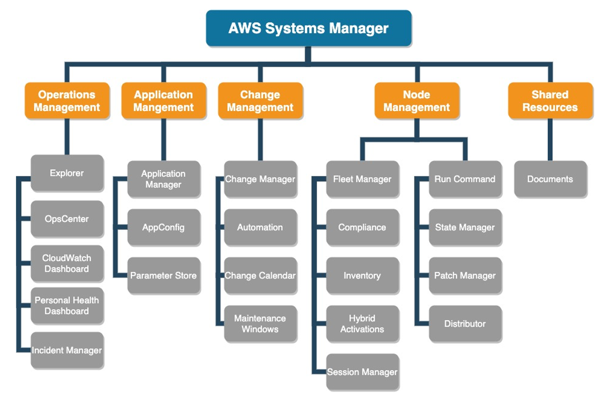

# Systems Manager

## 1. Systems Manager

- AWS에서 인프라를 보고 제어하기 위해 사용할 수 있는 **AWS 서비스**이다.
- **Systems Manager 콘솔**을 사용하여 여러 AWS 서비스의 운영 데이터를 보고, AWS 리소스에서 **운영 태스크**를 자동화할 수 있다.
- **관리형 인스턴스**를 검사하고 탐지된 정책 위반을 보고하거나 시정 조치를 취해서 **보안** 및 **규정 준수**를 유지하는 데 도움이 된다.
- 주요 사용 사례
  - AWS 리소스를 쉽게 **관리**하고 **파악하고 싶을 때** 사용한다.
  - AWS 및 온프레미스 리소스에 쉽게 **접근하고 싶을 때** 사용한다.
  - AWS 위에서 구동되는 다양한 **앱**, **소프트웨어**, **OS** 등의 **상태를 확인하고 싶을 때** 사용한다.
  - 다양한 시스템 환경 구성 설정 및 **파라미터를 관리하고 싶을 때** 사용한다.
- 작동 방식
  - **Agent** 설치로 운영 중인 AWS/온프레미스 서버의 **상태**를 파악한다.
  - 다양한 **자동화 서비스** 및 **조회 서비스**로 제어 및 현황을 파악한다.
  - 기타 **관리 기능**을 제공한다.

### 1.1. 주요 기능

- **Run Command**: 등록된 여러 EC2 인스턴스 및 On-Premise 인스턴스에 **명령**을 실행한다.
  - 예: OS 업데이트, 전체 서버 리부팅 등
- **Patch Manager**: **패치 기준**을 정하여 인스턴스가 항상 정한 기준을 지켜 **최신 업데이트 상태**를 유지할 수 있도록 설정한다.
- **Inventory**: 등록된 인스턴스의 데이터를 종합해 **통계 데이터**를 생성하여 표시한다.
  - 예: 설치된 OS 종류별 통계, 설치된 애플리케이션, 실행 중인 서비스 목록 등
- **State Manager**: 인스턴스의 **상태 기준**을 정해 인스턴스들이 정한 기준의 상태를 **준수**하도록 설정한다.
  - 예: 특정 소프트웨어가 설치되어 있어야 함, 방화벽이 켜져 있어야 함 등
- **Parameter Store**: AWS 및 여러 서비스에서 사용하는 **값**을 저장하고 손쉽게 사용하기 위한 서비스이다.
- **Session Manager**: 인스턴스에 대해 **원클릭 액세스**를 제공하는 관리형 서비스이다.
  - 인스턴스에 **SSH 연결** 없이, **포트**를 열 필요 없이, **배스천 호스트(Bastion Host)** 를 유지할 필요 없이 인스턴스에 **로그인** 가능하다.
- **Automation**: AWS에서 미리 지정된 행동들을 **자동화**하여 실행시켜 주는 서비스이다.
  - 예: AMI 생성, EC2의 시작/정지 등
- **Incident Manager**: 갑작스러운 사고 및 장애 상황 등의 대응을 위한 **워크플로우**를 제공하는 서비스이다.
- **Change Calendar**: 리소스 **관리 일정**을 설정해 주는 서비스이다.
  - 예: 특정 날짜에 인스턴스 업데이트, 특정 주기별로 인스턴스 중지/시작 등
- **Quick Setup**: 다양한 Systems Manager의 기능을 엮어서 **빠르게** 사용할 수 있도록 준비한 서비스이다.

### 1.2. SSM Agent

- **Systems Manager Agent**: EC2 인스턴스, 온프레미스, VM에 설치해서 사용하는 **Systems Manager 전용 Agent**이다.
  - Systems Manager의 노드 **업데이트**, **관리**, **설정**을 지원한다.
- Systems Manager와 **통신**할 수 있는 환경이 필요하다.
  - `ssmmessages`, `ec2messages` 서비스와 통신한다.
  - **보안 그룹**, **NACL**, **방화벽** 등의 허용이 필요하다.
- **IAM 권한**이 필요하다.
  - 대표 정책: `AmazonSSMManagedInstanceCore`
- **Amazon Linux AMI** 및 AWS 지원 AMI 등에는 **기본 설치**되어 있다.
- 기타 AWS 서비스 등을 활용해서 SSM Agent의 **자동 업데이트**가 가능하다.

## 2. SSM Parameter Store

- AWS에서 주요 설정과 값들을 **저장/관리/활용**하기 위한 서비스이다.
  - 예: API 주소, DB 호스트명, AMI ID, API Token, 사용자 ID/패스워드, 환경 변수 등
- **Key-Value** 기반으로 필요한 값을 저장하고 불러오는 기능을 제공한다.
- **저장 가능한 값의 형식**은 다음과 같다.
  - **String**: 일반 텍스트
  - **StringList**: 콤마(`,`)로 구분된 값의 리스트
  - **SecureString**: **KMS** 기반으로 암호화된 텍스트
- **IAM**으로 권한 관리가 가능하다.
  - **접근 권한**(계층 구조 적용 가능)을 제어한다.
  - **복호화 권한**(`SecureString`)을 제어한다.

### 2.1. Parameter Store 티어

| 구분                            | Standard                 | Advanced                   |
| :------------------------------ | :----------------------- | :------------------------- |
| **최대 파라미터 숫자 (리전당)** | 10,000개                 | 100,000개                  |
| **최대 파라미터 사이즈**        | 4 KB                     | 8 KB                       |
| **Parameter 정책**              | No                       | **Yes**                    |
| **Cost**                        | 무료                     | 유료 (개당 $0.05)          |
| **기타**                        | Advanced로 변경 **가능** | Standard로 변경 **불가능** |

### 2.2. Parameter Store SecureString

- **KMS**를 활용해서 파라미터를 **암호화**하여 저장한다.
  - KMS Managed Key를 선택해 암호화한다(기본 `aws/ssm` 키 사용).
  - 조회 시 `WithDecryption` 옵션을 주어야 **복호화**된 값을 받을 수 있다.
- **조회 권한**과 **Decrypt 권한**이 분리되어 있다.
  - 즉, 값을 조회하려면 KMS 복호화 권한도 함께 필요하다.

### 2.3. Parameter Store Versioning

- **Versioning(버전 관리)** 이 가능하다.
  - 기본 **1**부터 내용 변경 시마다 버전이 계속 증가한다.
  - 최대 **100개**까지 저장된다.
    - 100개 이상 생성 시 예전 버전부터 삭제된다(단, Parameter Label이 붙은 버전은 예외).
- 참조 시 `parameter_name:version` 형식으로 사용 가능하다.
- 조회 시 **특정 버전**의 파라미터를 조회할 수 있다.

### 2.4. Parameter Store Parameter Labels

- 유저가 각 버전에 부여하는 **텍스트(별칭)** 이다.
  - 태그처럼 파라미터의 버전에 식별 가능한 **목적/정보** 등을 부여한다(최대 100글자).
  - 한 버전에 **여러 Label** 부여가 가능하다(최대 10개).
  - 중복 부여는 **불가능**하다.
- **Label의 관리**
  - 파라미터에 Label **추가/삭제**가 가능하다.
  - 하나의 Label을 다른 버전으로 **이동** 가능하다.
  - 히스토리 조회가 가능하다.
- **Label 단위**로 조회가 가능하다.

### 2.5. Parameter Store 계층 구조

- Parameter Store의 Key를 **계층 구조**로 관리 가능하다.
  - **슬래시(`/`)** 를 기반으로 각 계층을 구분한다.
  - 첫 글자가 `/`로 시작하지 않을 경우, 계층 구조 없는 파라미터로 생성된다.
- **계층 구조 단위**로 조회가 가능하다(`GetParametersByPath`).
- **계층 구조 단위**로 권한 부여가 가능하다.

### 2.6. Parameter Store Parameter Policies

- 파라미터에 지정할 수 있는 **관리 정책**이다.
  - **Advanced Tier**에서만 사용 가능하다.
  - **Expiration**: 일정 기간 이후 **삭제(TTL)** 된다.
  - **ExpirationNotification**: 삭제 전에 **EventBridge** 이벤트를 생성한다.
  - **NoChangeNotification**: 일정 기간 이상 파라미터 변경이 없을 경우 **EventBridge** 이벤트를 생성한다.
- 정책의 **삭제/갱신**이 가능하다.

### 2.7. Parameter Store Public Parameters

- AWS에서 **공식적으로 배포**하는 파라미터이다.
  - 각 OS별 **AMI ID**
  - AWS의 모든 **리전 목록**
  - AWS의 모든 **서비스 목록**
  - 특정 서비스를 사용 가능한 **리전 목록**
- 별도의 **권한 요구**가 없다.

### 2.8. Parameter Store 주의할 점

- `GetParameter` API 호출 시 최대 **10,000 TPS** 제한이 있다.
- 따라서 매번 API로 접근해서 값을 가져오기보다는, 애플리케이션 내에서 **캐싱(Caching)**해두고 사용하는 편이 좋다.

## 3. SSM Run Command

- 관리 중인 노드에게 원격에서 명령을 실행할 수 있는 **서비스**이다.
  - **관리 중인 노드**: SSM Agent가 설치된 상태에서 Systems Manager의 관리를 받는 **EC2 인스턴스** 혹은 **온프레미스 서버**를 의미한다.
- 주로 **단발성**의 명령을 수행할 때 활용한다.
  - 관리 중인 서버 전체에 신규 서비스 설치, 특정 서비스 혹은 애플리케이션 재시작, 로그 파일 캡처 등을 수행한다.
- 미리 준비된 **문서(Document)** 에 지정된 명령을 수행할 수 있다.
  - **문서**: AWS에서 제공하거나 사용자가 직접 작성한 **명령어 모음**이다.
  - 버전 관리가 가능하다.
- **태그**, **대상 이름**, **인스턴스 ID** 기반으로 대상을 선정하여 다수의 인스턴스 **클러스터**에 명령 수행이 가능하다.
  - 단, **Eventual Consistency**를 지향하므로 **비동기(Async)**적으로 명령을 처리한다.

## 4. SSM Session Manager

- 인스턴스에 대해 **원클릭 액세스**를 제공하는 관리형 서비스이다.
  - 인스턴스에 **SSH 연결** 없이, **포트**를 열 필요 없이, **배스천 호스트(Bastion Host)** 를 유지할 필요 없이 로그인 가능하다.
- **IAM 사용자** 단위로 제어 가능하다(Key 파일로 제어할 필요 없음).
  - 수백 개의 인스턴스에 대해 일일이 로그인을 위한 **키 파일**을 관리할 필요가 없다.
- **웹 브라우저** 기반으로 OS와 무관하게 사용 가능하다.
- **로깅**과 **감사** 기능을 제공한다.
  - 언제, 어디서, 누가 접속했는지 확인 가능하다(**CloudTrail**).
  - 접속 기록과 사용한 모든 **커맨드** 및 출력 내역을 **S3** 혹은 **CloudWatch Logs**로 전송 가능하다.
  - AWS의 서비스와 연동되어 다양한 시나리오 구현이 가능하다.
    - 예: **EventBridge**와 연동하여 실시간으로 접근에 대한 알림을 받는다.

### 4.1. Session Manager 요구사항

- EC2 **Instance**에 **SSM Agent**가 설치되어 있어야 한다.
  - Amazon Linux 및 여러 공식 **AMI**에는 기본 설치되어 있다.
- EC2에 `AmazonSSMManagedInstanceCore` **Managed Policy**가 포함된 **IAM Role**이 적용되어 있어야 한다.
- SSM Agent가 SSM 및 필요한 서비스에 **접근**할 수 있어야 한다.
  - **Private Subnet**이라면 **VPC Endpoint**가 해당 VPC에 있어야 한다.
    - `ssm` (SSM API 요청)
    - `ssmmessages` (Session Manager 통신)
    - `ec2messages` (Run Command 등 통신)
    - `logs` (CloudWatch 로깅 활성화 시)
    - `s3` (S3 로깅 활성화 시)
  - **Security Group**에서 **Outbound 443** 포트가 열려 있어야 한다(Inbound 포트 오픈은 필요 없다).

## 5. SSM Quick Setup

- AWS SSM의 기능들을 **활용**해서 가장 모범이 되는 방법으로 노드들을 빠르게 관리할 수 있는 서비스이다.
  - 자주 활용되는 **패턴** 및 **관리 절차**를 모아둔 서비스이다.
- **장점**은 다음과 같다.
  - **다수의 계정** 및 **Organization** 내에 있는 다수의 관리 노드에 적용 가능하다.
  - **모범 사례(Best Practices)** 들을 모아두었기에 복잡도가 감소한다.
  - 각 사용 사례를 위한 **UI**를 제공한다.
  - 주기적으로 **Drift(구성 변경)** 를 감지해서 처리한다.
- 내부적으로 **CloudFormation**을 활용하므로 관련 권한이 필요하다.
- SSM의 이해를 바탕으로 설정 과정을 **간소화**하고 싶은 사용자에게 적합하다.
  - 서비스를 처음 사용하거나 단순히 쉽게 사용하고 싶은 사용자를 대상으로 하는 것은 아니다(기반 지식 필요).

### 5.1. Quick Setup 주요 기능

- **SSM Agent**를 주기적으로 **업데이트**한다.
- **30분**마다 서버 **인벤토리**(Application, OS, Network 정보 등)를 수집한다.
- **하루**마다 시스템/애플리케이션의 누락 **패치**를 확인하고 패치를 적용한다(Patch Manager).
- **CloudWatch Agent**를 설정 및 설치한다.
- **EC2** 자동 **시작** 및 **중지**를 스케줄링한다(Scheduler).
- **AWS 서비스 설정**을 지원한다.
  - **AWS Config** 레코딩 설정
  - **DevOps Guru** 활성화
  - **Resource Explorer** 설정
