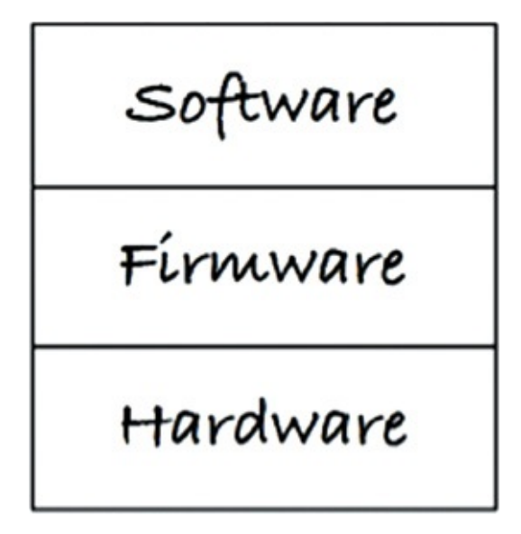
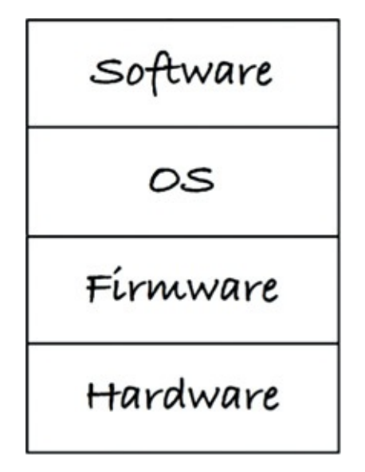

# 클린 임베디드 아키텍처

- 소프트웨어는 닳지 않지만, 펌웨어와 하드웨어에 대한 **의존성을 관리하지 않으면** 안으로부터 파괴될 수 있다.
- 잠재적으로 오래 살아남을 수 있던 임베디드 소프트웨어가 **하드웨어 의존성에 오염되는 바람에** 짧게 삶을 마감하는 일은 드물지 않다.
- **펌웨어(Firmware)** 는 저장되는 위치(ROM 등)에 따라 정의되는 것이 아니라, **무엇에 의존하는지**, 그리고 **하드웨어 발전에 맞춰 수정하기가 얼마나 어려운지**에 따라 정의된다.
- 하드웨어는 반드시 발전하며 교체된다. 따라서 임베디드 코드는 이러한 변화를 전제로 구조화되어야 한다.
- **펌웨어는 더 적게 만들고, 소프트웨어는 더 많이 만들어야 한다.**
- 코드 곳곳에 SQL이나 플랫폼 의존성을 직접 심어두면, 본질적으로 펌웨어를 작성하는 것과 다름없다.

## 1. 앱-티튜드 테스트 (App-titude Test)

- 켄트 벡(Kent Beck)은 소프트웨어를 구축하는 세 가지 활동을 이렇게 기술했다.
  1. **먼저 동작하게 만들어라 (Make it work):** 소프트웨어가 동작하지 않는다면 사업은 망한다.
  2. **그리고 올바르게 만들어라 (Make it right):** 코드를 리팩터링해서 당신을 포함한 나머지 사람들이 이해할 수 있게 만들고, 요구가 변경되거나 요구를 더 잘 이해하게 되었을 때 코드를 개선할 수 있게 만들어라.
  3. **그리고 빠르게 만들어라 (Make it fast):** 코드를 리팩터링해서 요구되는 성능을 만족시켜라.
- 대부분의 임베디드 시스템 소프트웨어는 **'동작하게 하라'** 는 활동만 염두에 두고 만들 것처럼 보인다.
  - 임베디드 시스템 소프트웨어 외에 대다수의 앱들도 코드를 올바르게 작성해서 유효 수명을 길게 늘리는 데 관심 없이 그저 동작하도록만 만들어진다.
- 앱이 그저 동작하도록 만드는 것을 개발자용 **'앱-티튜드 테스트(App-titude test)'** 라고 부른다.
  - 프로그래머가 오직 앱이 동작하도록 만드는 일만 신경 쓴다면, 자신의 제품과 고용주에게 **몹쓸 짓**을 하는 것이다.

## 2. 타깃-하드웨어 병목현상 (Target-Hardware Bottleneck)

- 임베디드 개발자들은 임베디드가 아니었다면 다루지 않았을 특수한 문제들(메모리 공간, 실시간성 제약과 처리 완료 시간, 특이한 사용자 인터페이스, 여러 센서와 실제 세상과의 상호작용 등)을 다룬다.
- 거의 모든 경우에 하드웨어, 소프트웨어, 펌웨어가 **동시에 만들어진다**.
- 이러한 임베디드가 지닌 특수한 문제 중 하나는 **타깃-하드웨어 병목현상**이다.
  - 임베디드 코드가 클린 아키텍처 원칙과 실천법을 따르지 않고 작성된다면, 대개의 경우 코드를 테스트할 수 있는 환경이 해당 특정 **타깃 장비로 국한될 것**이다.
  - 그리고 그 타깃 장비가 테스트가 가능한 유일한 장소라면, **타깃-하드웨어 병목 현상**이 발생하여 개발 진척이 크게 느려질 것이다.

### 2.1. 클린 임베디드 아키텍처는 테스트하기 쉬운 임베디드 아키텍처다

- 몇 가지 아키텍처 원칙을 임베디드 소프트웨어와 펌웨어에 적용하여 타깃-하드웨어 병목현상을 줄일 수 있다.

#### 계층 (Layers)

- 위 그림처럼 세 개의 계층(하드웨어, 펌웨어, 소프트웨어)이 있다고 할 때 맨 아래는 **하드웨어**다.
  - 하드웨어는 기술의 발전에 따라 더 나은 성능을 제공하며, 더 저렴해질 것이다.
  - 이처럼 불가피하게 하드웨어를 변경해야 하는 시점이 마침내 닥쳤을 때, 임베디드 엔지니어는 **필요 이상의 작업을 하기를 원치 않는다**.
- 하드웨어가 정의된 이후라면, 하드웨어와 나머지 시스템 사이의 **분리(Separation)** 는 자연스럽게 주어진다.
  - 이 상태에서 그저 '앱-티튜드 테스트'만 통과하도록 코드를 짜면 대체로 문제가 발생한다.
  - 하드웨어 관련 정보가 코드 전체를 **오염시키지 못하게 막을 방법**이 전혀 없기 때문이다.
  - 무엇을 어디에 위치시킬지, 그리고 한 모듈이 다른 모듈에 대해 어디까지 알게 할지를 신중하게 처리하지 않는다면, 완성된 코드는 **변경하기가 매우 어렵다**.
  - 이는 하드웨어 변경뿐만 아니라 사용자가 변경을 요청할 때나 버그를 고쳐야 할 때도 마찬가지다.
- **소프트웨어와 펌웨어가 서로 섞이는 일은 안티 패턴(Anti-pattern)이다.**
  - 이 안티 패턴을 보이는 코드는 변화에 저항하게 된다.
  - 변경하기 어려울 뿐만 아니라 변경하는 일 자체가 위험을 수반하여, 때로는 의도치 않은 결과를 불러온다.
  - 가벼운 변경에도 **시스템 전체를 대상으로 회귀 테스트 전부를 실행**해야 한다.
  - 기기를 외부 환경에서(PC 등에서) 테스트할 수 있게 구성하지 않았다면, 지루한 타깃 기기 **수동 테스트**를 비켜 갈 방법이 없다.

#### 하드웨어는 세부사항이다

- 소프트웨어와 펌웨어 사이의 경계는, 코드와 하드웨어 사이의 물리적 경계와는 달리 대체로 **잘 정의하기가 힘들다**.
- 임베디드 소프트웨어 개발자가 해야 할 주요한 일 하나는 이 **경계를 분명하게 만드는 것**이다.
- 소프트웨어와 펌웨어 사이의 경계를 **하드웨어 추상화 계층(Hardware Abstraction Layer: HAL)** 이라고 부른다.
- HAL은 자신보다 **위에 있는 소프트웨어를 위해 존재**하므로, HAL의 API는 철저히 **소프트웨어의 필요에 맞게** 만들어져야 한다.
- 한 가지 예로, 펌웨어는 바이트(Byte) 또는 바이트의 배열을 플래시 메모리에 직접 저장할 수 있다.
  - 반대로 애플리케이션(소프트웨어)에서는 '이름/값(Name/Value)'과 같이 쌍으로 된 데이터를 영속성 장치에 저장하거나 읽을 수 있어야 한다.
  - 소프트웨어는 이 '이름/값' 쌍이 플래시 메모리에 저장되는지, 하드디스크에 저장되는지, 클라우드에 저장되는지를 전혀 개의치 않는다.
  - 이러한 서비스를 **HAL이 제공**하며, 데이터를 구체적으로 '어떻게' 저장하는지에 대한 하드웨어적인 세부사항은 **소프트웨어에게 드러내지 않는다**.

### 2.2. HAL 사용자에게 하드웨어 세부사항을 드러내지 말라

- 클린 임베디드 아키텍처로 설계된 소프트웨어는 **타깃 하드웨어와 무관하게 테스트 가능해야 한다**.
- HAL(하드웨어 추상화 계층)은 타깃에 종속되지 않는 경계 계층이며, 하드웨어를 대체할 수 있는 테스트 지점을 제공하는 역할을 한다.
- HAL 위의 코드는 하드웨어 존재 여부와 관계없이 실행 가능해야 한다.

#### 프로세서는 세부사항이다

- 임베디드 환경에서는 특정 툴체인이 제공하는 헤더 파일과 확장 문법을 사용하는 경우가 많다.
- 일부 컴파일러는 C 언어를 확장하여 특정 프로세서 기능에 접근할 수 있는 키워드를 제공한다.
- 이러한 코드는 겉으로는 C처럼 보이지만, 실제로는 특정 프로세서와 컴파일러에 종속되어 **더 이상 표준 C가 아니다.**.
  - 왜냐하면 다른 프로세서에서는 컴파일되지 않을 것이고, 심지어는 동일한 프로세서라도 다른 컴파일러로는 컴파일하지 못할 수도 있기 때문이다.
- 이를 막기 위해서는 **프로세서 확장 기능을 아는 코드는 극히 제한된 파일에만 존재해야 한다**.
- 모든 소프트웨어가 프로세서 독립적이어야 하는 것은 아니지만, 의존 범위는 최소화되어야 한다.
- 장치 접근 레지스터를 직접 다루는 코드는 **소수의 순수 펌웨어 영역으로 한정하는 것이 바람직하다**.
- 프로세서에 직접 결합된 코드는,
  - 하드웨어가 완성되기 전에 테스트하기 어렵게 만들고,
  - 새로운 프로세서로 이식할 때 큰 부담이 된다.
- 이를 방지하기 위해 펌웨어는 저수준 기능을 **프로세서 추상화 계층(Processor Abstraction Layer: PAL)** 형태로 격리한다.
- PAL 위에 위치한 펌웨어와 소프트웨어는 **타깃-하드웨어와 무관하게 테스트 가능해야 한다**.
- 이렇게 구조화하면 시스템은 덜 경직되고, 변경과 이식에 유연해진다.

#### 운영체제는 세부사항이다

- 베어메탈(Bare-metal) 임베디드 시스템이라면 코드가 운영 환경에 **깊숙이 종속되지 않도록** 만드는 데 HAL만으로 충분할 것이다.
  - 하지만 임베디드 시스템에서 실시간 운영체제(RTOS)를 사용하거나, 임베디드 버전의 리눅스/윈도우를 사용한다면 어떨까?
  - 작성한 코드의 수명을 늘리려면 무조건 운영체제를 **세부사항**으로 취급하고, 소프트웨어가 운영체제에 **직접 의존하는 일을 막아야** 한다.
- 소프트웨어는 운영체제를 통해 운영 환경이 제공하는 서비스에 접근한다.
  - OS는 소프트웨어를 펌웨어로부터 분리하는 계층이다.
- 따라서 **OS를 직접 사용하면 문제가 된다**.
  - 비즈니스적 혹은 비용적 이유로 OS가 바뀌거나, OS 자체가 업데이트되면서 기능이 변경되는 경우가 있다.
  - 이런 경우 수많은 코드를 변경해야만 한다.
- 클린 임베디드 아키텍처는 **운영체제 추상화 계층(OSAL, Operating System Abstraction Layer)** 을 통해 소프트웨어를 운영체제로부터 **격리**시킨다.
  - OSAL 구현은 단순히 기존 OS의 함수 이름을 바꿔주는 정도로 단순할 수도 있다.
  - 또는 여러 함수를 하나로 묶어(Wrapping) 제공해야 할 수도 있다.
- 소프트웨어가 OS에 직접적으로 의존하는 대신 **OSAL에 의존**한다면, 향후 이식 작업의 대부분은 새로운 OS에 맞춰 기존 OSAL과 호환되는 **새로운 OSAL을 작성하는 데** 소요될 것이다. (애플리케이션 코드는 무사하다.)
- 이쯤 되면 **코드 비대화(Code Bloat)** 문제가 **염려될 수 있다**.
  - 하지만 OSAL은 OS를 사용하는 데 따른 수많은 중복 코드가 **격리되는 장소**일 뿐이다. 이러한 중복 처리는 생각보다 큰 추가 비용을 초래하지 않는다.
  - OSAL을 정의하는 일은 결국 애플리케이션이 **공통 구조**를 가지도록 힘쓰는 **일이기도 하다**.
  - OSAL은 **테스트 지점**을 만드는 데 큰 도움이 되며, 그 덕분에 소프트웨어 계층의 귀중한 애플리케이션 코드를 타깃 장비나 OS에 관계없이 독립적으로 테스트할 수 있다.

### 2.3. 인터페이스를 통하고 대체 가능성을 높이는 방향으로 프로그래밍하라

- HAL을 추가하거나 때로는 OSAL을 추가해야 할 뿐만 아니라, 모든 주요 계층(소프트웨어, OS, 펌웨어, 하드웨어) 내부에도 이 책에서 설명한 원칙들을 적용할 수 있다.
- 이들 원칙은 **관심사를 분리**시키고, **인터페이스를 활용**하며, **대체 가능성(Substitutability)을 높이는 방향**으로 프로그래밍하도록 유도한다.
- 계층형 아키텍처는 **인터페이스를 통해 프로그래밍하자**는 발상을 기반으로 한다.
- 모듈들이 서로 인터페이스를 통해 상호작용한다면, 특정 서비스 제공자를 다른 제공자로 쉽게 **대체할 수 있다**.
- 인터페이스의 정의는 C/C++의 경우 **헤더 파일**에 넣어야 하며, 헤더 파일에는 함수 선언과 그 함수에서 사용하는 상수, 구조체 이름만 포함시켜야 한다.
- 오직 구현체에서만 필요한 데이터 구조, 상수, 타입 정의들로 인터페이스 헤더 파일을 어지럽히면 안된다.
  - 이는 원치 않는 **의존성을 만들어 낸다**.
  - 구현 세부사항의 가시성을 엄격히 제한해야 한다.
  - 세부사항을 알고 있는 부분이 적을수록, 나중에 추적하고 변경해야 할 코드도 적어진다.
- 클린 임베디드 아키텍처에서는 모듈들이 인터페이스를 통해 상호작용하기 때문에 각각의 계층 내부에서 **독립적인 테스트가 가능하다**.
  - 각 인터페이스는 타깃 장비와는 별개로 흉내 내어(Mocking/Stubbing) 테스트할 수 있도록 **해주는 경계층** 또는 **대체 지점**을 제공한다.

### 2.4. DRY 원칙: 조건부 컴파일 지시자를 반복하지 말라

- 코드를 반복하는 일은 **DRY(Don't Repeat Yourself, 반복하지 말라)** 원칙을 위배하는 것이다.
- 임베디드 **시스템의** 경우 **타깃 하드웨어의** 유형을 식별하기 위해 `#ifdef` 같은 **조건부 컴파일**을 반복해서 **사용할 때가 많다**.
- 하드웨어 유형은 철저히 **HAL 뒤에 가려진 세부사항**이 되어야 한다.
- 만약 HAL이 조건부 컴파일 **대신** 사용할 수 있는 일련의 **인터페이스**를 제공한다면, 우리는 링커(Linker) 또는 어떤 형태의 실시간 바인딩(다형성)을 사용해서 소프트웨어와 특정 하드웨어 구현체를 깔끔하게 연결할 수 있다.
