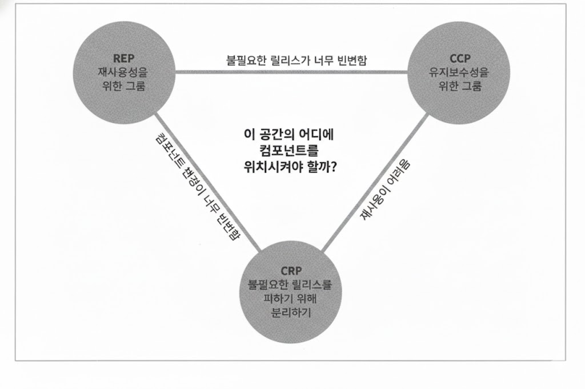

# 컴포넌트 응집도

## 1. REP: 재사용/릴리스 등가 원칙 (Release/Reuse Equivalency Principle)

> **재사용 단위는 릴리스 단위와 같다.**

- 지난 10년은 메이븐(Maven), 라이닝언(Leiningen)과 같은 모듈 관리 도구가 우후죽순으로 등장한 시기였다.
  - 이 기간에 **재사용 가능한 컴포넌트**나 컴포넌트 라이브러리가 엄청나게 많이 만들어졌다.
  - 우리는 **소프트웨어 재사용**의 시대에 살고 있다.
  - **객체 지향 모델**의 오랜 약속 중 하나가 실현되었다.
- 소프트웨어 컴포넌트가 **릴리스 절차**를 통해 추적 관리되지 않거나 **릴리스 번호**가 부여되지 않는다면, 해당 컴포넌트를 재사용하고 싶어도 할 수도 없고 하지도 않을 것이다.
  - 릴리스 번호가 없다면 재사용 컴포넌트들이 서로 **호환되는지** 보증할 방법이 전혀 없다. 또한, 새로운 버전이 언제 출시되고 무엇이 변했는지를 소프트웨어 개발자들이 파악할 수 없다.
  - 새로운 릴리스가 나온다는 소식을 접하면 개발자는 새 릴리스의 **변경 사항**을 살펴보고 **업데이트 여부**를 결정하곤 한다.
  - 따라서 릴리스 절차에는 적절한 **공지**와 함께 **릴리스 문서** 작성도 포함되어야 한다.
- 이 원칙을 **소프트웨어 설계**와 **아키텍처 관점**에서 보면, 단일 컴포넌트는 **응집성 높은** 클래스와 모듈들로 구성되어야 함을 뜻한다.
- 단순히 뒤죽박죽 임의로 선택된 클래스와 모듈로 구성되어서는 **안 된다**.
- 컴포넌트를 구성하는 모든 모듈은 서로 공유하는 **중요한 테마**나 **목적**이 있어야 한다.
- 하나의 컴포넌트로 묶인 클래스와 모듈은 반드시 **함께 릴리스** 할 수 있어야 한다.
  - 즉, 하나의 컴포넌트로 묶인 클래스와 모듈은 **버전 번호**가 같아야 하며, 동일한 릴리스로 **추적 관리**되고, 동일한 **릴리스 문서**에 포함되어야 한다는 사실이다.

## 2. CCP: 공통 폐쇄 원칙 (Common Closure Principle)

> **동일한 이유로 동일한 시점에 변경되는 클래스를 같은 컴포넌트로 묶어라.**
> **서로 다른 시점에 다른 이유로 변경되는 클래스는 다른 컴포넌트로 분리하라.**

- 위 원칙은 **SRP(단일 책임 원칙)** 을 컴포넌트 관점에서 다시 쓴 것이다.
- 대다수의 애플리케이션에서 **유지보수성**은 재사용성보다 훨씬 중요하다.
  - 애플리케이션에서 코드가 반드시 변경되어야 한다면, 이러한 변경이 여러 **컴포넌트** 도처에 분산되어 발생하기보다는 차라리 변경 모두가 **단일 컴포넌트**에서 발생하는 편이 낫다.
  - 만약 단일 컴포넌트만 변경된다면 해당 컴포넌트만 **재배포**하면 된다.
- CCP도 위와 같은 이유로 **변경될 가능성**이 있는 클래스는 모두 한 곳으로 묶을 것을 권한다.
  - 물리적 또는 개념적으로 강하게 결합되어 항상 **함께 변경**되는 클래스들은 하나의 컴포넌트에 속해야 한다.
- 이 원칙은 **OCP(개방-폐쇄 원칙)** 에서 말하는 **폐쇄**와 동일한 의미를 가지고 있다.
  - OCP에서는 클래스가 **변경**에는 닫혀 있고 **확장**에는 열려있어야 한다고 말한다.
  - 즉, 우리는 발생할 가능성이 있거나 과거에 **발생했던** 대다수의 공통적인 변경에 대해서 클래스가 **닫혀 있도록** 설계한다.

## 3. CRP: 공통 재사용 원칙 (Common Reuse Principle)

> **컴포넌트 사용자들을 필요하지 않는 것에 의존하게 강요하지 마라.**

- CRP도 클래스와 모듈을 어느 컴포넌트에 위치시킬지 결정할 때 **도움되는** 원칙이다.
- CRP에서는 같이 **재사용**되는 경향이 있는 클래스와 모듈들은 **같은 컴포넌트**에 포함해야 한다고 말한다.
- 개별 클래스가 **단독**으로 재사용되는 경우는 거의 **없다**.
  - 대체로 재사용 가능한 클래스는 **재사용 모듈**의 일부로써 해당 모듈의 다른 클래스와 **상호작용**하는 경우가 많다.
  - CRP에서는 이런 클래스들이 동일한 컴포넌트에 **포함**되어야 한다고 말한다.
- CRP는 동일한 컴포넌트로 묶어서는 **안 되는** 클래스가 무엇인지도 말해준다.
  - 어떤 컴포넌트가 다른 컴포넌트를 사용하면 두 컴포넌트 사이에는 **의존성**이 생겨난다.
  - 어쩌면 사용하는 컴포넌트가 사용되는 컴포넌트에서 단 하나의 클래스만 사용할 수도 있다.
  - 그렇다고 해서 의존성은 조금도 **약해지지 않는다**.
  - 사용하는 컴포넌트는 사용되는 컴포넌트에 **여전히** 의존적이다.
  - 의존성으로 인해 **사용되는** 컴포넌트가 변경될 때마다 사용하는 컴포넌트도 변경해야 할 가능성이 높다.
- 강하게 결합되지 않는 클래스들을 동일한 컴포넌트에 위치시켜서는 **안 된다**.
- CRP는 **ISP(인터페이스 분리 원칙)** 의 **포괄적**인 버전이다.

## 4. 컴포넌트 응집도에 대한 균형 다이어그램

- **REP**와 **CCP**는 **포함 원칙**이다. 즉, 두 원칙은 컴포넌트를 더욱 **크게** 만든다.
- **CRP**는 **배제 원칙**이며 컴포넌트를 더욱 **작게** 만든다.
- 즉, 이 원칙들이 **균형**을 이루는 방법을 찾아야 한다.
- 오로지 **REP**와 **CRP**에만 중점을 두면 사소한 변경이 생겼을 때 너무 많은 컴포넌트에 **영향**을 미친다(CCP 포기).
- 반대로 **CCP**와 **REP**에만 과도하게 집중하면 불필요한 **릴리스**가 너무 빈번해진다(CRP 포기).
- 프로젝트가 발전되고 사용하는 방법이 변화되면 중점적으로 보는 원칙 또한 **변경**된다.
