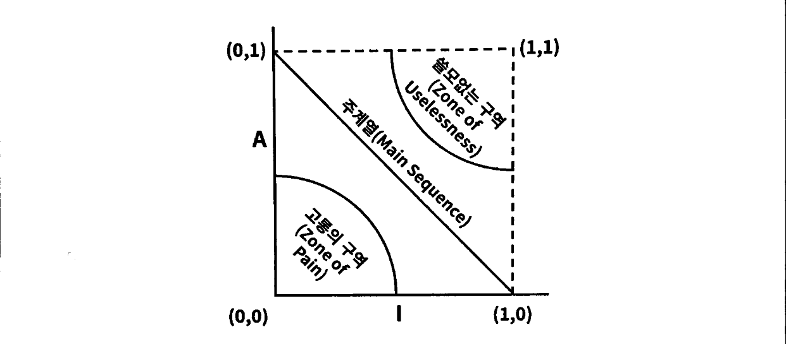

# 컴포넌트 결합

## 1. ADP: 의존성 비순환 원칙 (Acyclic Dependencies Principle)

> **컴포넌트 의존성 그래프에 순환(Cycle)이 있어서는 안 된다.**

- 인원수가 많은 개발팀에서 근무한다고 했을 때, 하루 종일 작업해서 마무리한 코드가 다음날에 **동작하지 않게** 되는 경우가 있다.
- 이를 **숙취 증후군(The Morning After Syndrome)** 이라고 부른다.
- 숙취 증후군은 많은 **개발자**가 동일한 소스 파일을 수정하는 환경에서 발생한다.
  - 이 문제의 해결책으로는 **주 단위 빌드(Weekly Build)** 와 **의존성 비순환 원칙(ADP)** 이 있다.

### 1.1. 주 단위 빌드 (Weekly Build)

- **중간 규모**의 프로젝트에서 흔하게 사용된다.
- 주 단위 빌드는 모든 개발자가 일주일의 **첫 4일(월요일~목요일)** 까지 서로를 신경 쓰지 않고 개발한다.
  - 개발자는 모두 코드를 개인적으로 복사하여 작업하며, 전체적인 기준에서 작업을 어떻게 통합할지는 걱정하지 않는다.
  - 그런 후 **금요일**이 되면 변경된 코드를 모두 통합하여 시스템을 빌드한다.
- 이 접근법은 5일 중 4일 동안 개발자를 **고립된 세계**에서 살 수 있게 보장해 주지만, 금요일에 통합과 관련된 막대한 **대가(업보)** 를 치르게 한다.
- 프로젝트가 커지면 프로젝트 통합을 금요일 하루 만에 끝낼 수 없게 되고, 개발보다 **통합**에 더 큰 시간을 들이게 된다.
  - 이와 같은 흐름은 효율성을 유지하기 **위해** 빌드 일정을 계속 늘려야 하고, 빌드 주기가 늦어질수록 프로젝트가 감수할 **위험**은 커진다.
  - 통합과 테스트를 수행하기 점점 어려워지고, 팀은 **빠른 피드백**이 주는 장점을 잃는다.

### 1.2. 순환 의존성 제거하기

- 이 문제의 해결책은 개발 환경을 **릴리스 가능한 컴포넌트 단위**로 분리하는 것이다.
  - 이를 통해 컴포넌트는 개별 개발자 또는 단일 개발팀이 책임질 수 있는 **작업 단위**가 된다.
- 개발자는 해당 컴포넌트가 동작하도록 만든 후, 해당 컴포넌트를 **릴리스**하여 다른 개발자가 사용할 수 있도록 한다.
  - 담당 개발자는 이 컴포넌트에 **릴리스 번호**를 부여하고, 다른 팀에서 사용할 수 있는 디렉터리로 이동시킨다.
- 컴포넌트가 새로 릴리스 되면 다른 팀에서는 새 릴리스를 적용할지 여부를 **판단**한다.
- 따라서 어떤 팀도 다른 팀에 의해 **좌우되지** 않는다.
  - 특정 컴포넌트가 변경되더라도 다른 팀에 즉각 영향을 주지는 않는다.
  - 각 팀은 특정 컴포넌트가 새롭게 릴리스 되면 자신의 컴포넌트를 해당 컴포넌트에 맞게 수정할 시기를 **스스로** 결정할 수 있다.
  - 뿐만 아니라 통합은 작고 **점진적**으로 이뤄진다.
- 이 작업 절차가 성공적으로 동작하려면 컴포넌트 사이의 **의존성 구조**를 반드시 관리해야 한다.
  - 의존성 구조에 **순환**이 있어서는 안 된다. 의존성 구조에 순환이 생기면 **숙취 증후군**을 피할 수 없다.
- 따라서 어느 컴포넌트에서 시작하더라도 의존성 관계를 따라가면서 최초의 **컴포넌트**로 되돌아갈 수 없도록 **비순환 방향 그래프(DAG)** 로 컴포넌트 구조를 만들어야 한다.
- 해당 그래프를 완성하게 되면 한 컴포넌트의 새로운 릴리스를 배포할 때 영향을 받게 되는 컴포넌트를 쉽게 찾을 수 있다.
  - 의존성 화살표를 **거꾸로** 따라가면 **된다**.

### 1.3. 순환이 컴포넌트 의존성 그래프에 미치는 영향

- **순환 의존성**이 발생한다면 컴포넌트들이 하나의 **거대한 컴포넌트**가 되어버린다.
- 이 말은 어떤 컴포넌트를 개발하더라도 **숙취 증후군**이 발생할 **수밖에 없다**.
- 순환이 생기면 컴포넌트를 **분리**하기가 상당히 어려워진다.
  - 단위 테스트를 하고 싶어도 순환 의존성에 걸린 모든 컴포넌트를 함께 빌드하고 테스트해야 한다.

### 1.4. 순환 끊기

- 컴포넌트 사이의 순환을 끊고 의존성을 다시 **DAG**로 원상 복구하는 일은 언제라도 가능하다.

1.  **의존성 역전 원칙(DIP)** 을 적용한다.
    - 인터페이스를 활용하여 의존성 방향을 역전시킨다.
2.  **새로운 컴포넌트**를 만든다.
    - 두 컴포넌트가 모두 의존하는 클래스들을 새로운 컴포넌트로 이동시킨다.

### 1.5. 흐트러짐 (Jitters)

- **두 번째** 해결책(새로운 컴포넌트 생성)에서 시사하는 바는 **요구사항**이 변경되면 **컴포넌트 구조**도 변경될 수 있다는 사실이다.
- 애플리케이션이 성장함에 따라 컴포넌트 의존성 구조는 서서히 흐트러지며 또 **성장**한다.
  - 따라서 의존성 구조에 순환이 발생하는지 항상 **관찰**해야 한다.

## 2. 하향식(Top-Down) 설계

- 컴포넌트 구조는 **하향식**으로 설계될 수 **없다**.
- 컴포넌트는 시스템에서 가장 먼저 설계할 수 있는 대상이 아니며, 오히려 **시스템**이 성장하고 변경될 때 **함께** 진화한다.
- **컴포넌트 의존성 다이어그램**은 애플리케이션의 **기능**을 기술하는 일과는 관련이 없다.
- 오히려 컴포넌트 의존성 다이어그램은 애플리케이션의 **빌드 가능성**과 **유지보수성**을 보여주는 **지도**와 같다.
- 이러한 이유 때문에 컴포넌트 구조는 프로젝트 **초기**에 설계할 수 없다.
  - 빌드하거나 유지보수할 소프트웨어가 없다면 빌드와 유지보수에 관한 지도 또한 **필요 없기 때문**이다.

## 3. SDP: 안정된 의존성 원칙 (Stable Dependencies Principle)

> **안정성의 방향으로(더 안정된 쪽에) 의존하라.**

- 설계는 결코 **안정적**일 수 없다. 설계를 유지하다 보면 **변경**은 불가피하다.
- **변경이 쉽지 않은 컴포넌트**가 **변동이 예상되는 컴포넌트**에 의존하게 만들어서는 절대로 **안 된다**.
  - 한 번 의존하게 되면 변동성이 큰 컴포넌트도 결국 **변경이 어려워진다**.
- **안정된 의존성 원칙**을 준수하면 변경하기 어려운 모듈이 변경하기 쉽게 만들어진 모듈에 **의존하지 않도록** 만들 수 있다.

### 3.1. 안정성 (Stability)

- 안정성은 변경을 만들기 위해 필요한 **작업량**과 관련된다.
  - 소프트웨어 컴포넌트를 변경하기 어렵게 만드는 데는 많은 요인이 존재하며, 그 예로는 컴포넌트의 크기, 복잡도, 간결함 등을 들 수 있다.
  - 소프트웨어 컴포넌트를 변경하기 어렵게 만드는 가장 확실한 요인은 **수많은 다른 컴포넌트**가 해당 컴포넌트에 **의존**하게 만드는 것이다.
- 컴포넌트 안쪽으로 들어오는 의존성이 많아지면 상당히 **안정적**이라고 볼 수 있는데, **사소한 변경**이라도 의존하는 모든 컴포넌트를 만족시키면서 변경하려면 상당한 노력이 들기 때문이다.
- 예를 들어 세 컴포넌트가 **X 컴포넌트**에 의존하고 있다면 X 컴포넌트는 변경하지 말아야 할 이유가 **세 가지**나 된다.
  - 이 경우 X는 세 컴포넌트를 **책임진다(Responsible)** 라고 말한다.
- 반대로 X는 어디에도 의존하지 않는 경우, X가 변경되도록 만들 수 있는 외적인 영향이 전혀 없다.
  - 이 경우 X는 **독립적이다(Independent)** 라고 말한다.

### 3.2. 안정성 지표

- 컴포넌트로 들어오고 나가는 의존성의 개수를 세어 이 숫자를 통해 컴포넌트가 위치상 어느 정도의 **안정성**을 가지는지 계산할 수 있다.
- **Fan-in**: 안으로 들어오는 의존성. 이 지표는 컴포넌트 **내부**의 클래스에 의존하는 컴포넌트 **외부**의 클래스 개수를 나타낸다.
- **Fan-out**: 바깥으로 나가는 의존성. 이 지표는 컴포넌트 **외부**의 클래스에 의존하는 컴포넌트 **내부**의 클래스 개수를 나타낸다.
- **I(불안정성)**: $I = Fan\_out \div (Fan\_in + Fan\_out)$
  - 이 지표는 **0과 1** 범위의 값을 갖는다.
  - $I = 0$이면 최고로 **안정된** 컴포넌트라는 뜻이다.
  - $I = 1$이면 최고로 **불안정한** 컴포넌트라는 뜻이다.

#### I = 1 (최고로 불안정함)

- 어떤 컴포넌트도 해당 컴포넌트에 의존하지 않지만, 해당 컴포넌트는 다른 컴포넌트에 **의존한다**는 뜻이다.
- 컴포넌트가 가질 수 있는 최고로 **불안정한 상태**이다.
- 이 컴포넌트는 **책임성이 없으며(Irresponsible)** **의존적(Dependent)** 이다.
- 변경하지 말아야 할 이유가 없고, 해당 컴포넌트를 **변경해야 할 이유**가 있다는 뜻이다.

#### I = 0 (최고로 안정됨)

- 해당 컴포넌트에 의존하는 다른 컴포넌트가 있지만, 해당 컴포넌트 자체는 다른 컴포넌트에 **의존하지 않는다**는 뜻이다.
- 다른 컴포넌트를 **책임지며(Responsible)** **독립적(Independent)** 이다.
- 컴포넌트가 가질 수 있는 최고로 **안정된 상태**이다.

### 3.3. 모든 컴포넌트가 안정적이어야 하는 것은 아니다

- 모든 컴포넌트가 최고로 안정적인 시스템이라면 **변경이 불가능**하다. 이는 바람직한 상황이 아니다.
- 컴포넌트 구조를 설계할 때는 **불안정한 컴포넌트**와 **안정된 컴포넌트** 둘 다 존재하는 상태여야 한다.
- 또한 이를 다이어그램으로 나타낼 때는 **불안정한 컴포넌트**를 **위**에 두는 관습이 있다.
  - 이럴 경우 **위로 향하는 화살표**가 있으면 **SDP를 위반**하고 있다는 사실을 쉽게 파악할 수 있다.
- 만약 이러한 SDP를 위반하는 문제가 발생한다면 **순환 끊기**처럼 **의존성 역전(DIP)** 혹은 **새로운 컴포넌트 만들기**를 통해 해결할 수 있다.

## 4. SAP: 안정된 추상화 원칙 (Stable Abstractions Principle)

> **컴포넌트는 안정된 정도만큼만 추상화되어야 한다.**

### 4.1. 고수준 정책을 어디에 위치시켜야 하는가?

- 고수준 아키텍처나 정책 결정과 관련된 소프트웨어는 시스템에서 자주 **변경**해서는 절대로 안 된다.
- 시스템에서 **고수준 정책**을 캡슐화하는 소프트웨어는 반드시 **안정된 컴포넌트($I=0$)** 에 위치해야 한다.
  - **불안정한 컴포넌트($I=1$)** 는 반드시 변동성이 큰 소프트웨어, 즉 쉽고 빠르게 변경할 수 있는 소프트웨어만을 포함해야 한다.
- 하지만 고수준 정책을 **안정된** 컴포넌트에 위치시키면 그 정책을 포함하는 소스 코드는 **수정하기가 어려워진다**.
  - 이로 인해 시스템 전체 아키텍처가 **유연성**을 잃는다.
- 컴포넌트가 최고로 안정된 상태이면서도 동시에 변경에 충분히 대응할 수 있는 유연한 상태를 가지게 하려면 **개방-폐쇄 원칙(OCP)** 을 도입하면 된다.
  - OCP에서는 클래스를 수정하지 않고도 확장이 충분히 가능할 정도로 클래스를 유연하게 만들 수 있다.
- 이는 **추상 클래스**를 통해 구현할 수 있다.

### 4.2. 안정된 추상화 원칙

- **안정성**과 **추상화 정도** 사이의 관계를 정의한다.
- **안정된 컴포넌트**는 **추상 컴포넌트**여야 하며, 이를 통해 **안정성**이 컴포넌트를 확장하는 일을 방해해서는 안 된다고 말한다.
- **불안정한 컴포넌트**는 반드시 **구체 컴포넌트**여야 한다.
  - 컴포넌트가 불안정하므로 컴포넌트 내부의 구체적인 코드를 쉽게 변경할 수 **있어야** 하기 때문이다.
- **SAP**와 **SDP**를 결합하게 되면 컴포넌트에 대한 **DIP**나 마찬가지가 된다.
  - **SDP**에서는 의존성이 반드시 **안정성**의 방향으로 향해야 한다고 말하며, **SAP**에서는 안정성이 결국 **추상화**를 의미한다고 말하기 때문이다.
  - 즉, 의존성은 **추상화**의 방향으로 향하게 된다.

### 4.3. 추상화 정도 측정하기

- **A 지표**는 컴포넌트의 추상화 정도를 측정한 값이다.
- **Nc**: 컴포넌트의 클래스 개수
- **Na**: 컴포넌트의 추상 클래스와 인터페이스의 개수
- **A (추상화 정도)**: $A = Na \div Nc$
- A 지표는 **0과 1** 사이의 값을 갖는다.
  - $A = 0$이면 컴포넌트에는 추상 클래스가 하나도 없다는 뜻이다.
  - $A = 1$이면 컴포넌트는 오로지 추상 클래스만을 포함한다는 뜻이다.

### 4.4. 주계열 (The Main Sequence)

- 수직축에는 **A(추상화 정도)**, 수평축에는 **I(불안정성)** 를 나타내는 그래프를 그렸을 때,
  - 좌측 상단인 **(0, 1)** 은 최고로 **안정적**이며 **추상화된** 컴포넌트를 의미한다.
  - 우측 하단인 **(1, 0)** 은 최고로 **불안정**하며 **구체화된** 컴포넌트를 의미한다.
- 모든 컴포넌트가 위 두 지점에만 위치하는 것은 아닌데, 대체로 컴포넌트는 추상화와 안정화의 정도가 **다양**하기 때문이다.
- 모든 컴포넌트가 (0, 1) 또는 (1, 0)에 위치해야 한다는 규칙을 강요할 수는 없으므로, A/I 그래프 상에서 컴포넌트가 위치할 수 있는 **합리적인 지점**을 정의하는 점의 **궤적**이 있으리라고 가정해 볼 수 있다.
- 이 궤적은 컴포넌트가 **절대 위치해서는 안 되는 영역**, 다시 말해 **배제할 구역**을 찾는 방식으로 추론할 수 있다.

#### 고통의 구역 (Zone of Pain)

- **(0, 0)** 주변은 배제해야 할 구역이며, **고통의 구역**이라고 부른다.
- 이 컴포넌트들은 **안정적**이며 **구체적**이다.
- 추상적이지 않으므로 **확장**할 수 없고, 안정적이므로 **변경**하기도 상당히 어렵다.
  - 따라서 제대로 설계된 컴포넌트라면 (0, 0) 근처에는 위치하지 않을 것이라고 보는 게 일반적이다.
- **데이터베이스 스키마**와 같은 일부 소프트웨어 엔티티는 고통의 구역에 위치하곤 한다.
  - 데이터베이스 스키마는 변동성이 높기로 악명이 높으며, **극단적으로 구체적**이며, 많은 컴포넌트가 여기에 의존한다.
  - 이러한 이유로 애플리케이션과 데이터베이스 **사이**에 위치한 **인터페이스**는 관리하기가 굉장히 어려울 뿐만 아니라, 스키마가 변경되면 대체로 **고통**을 수반한다.
- `String` 컴포넌트처럼 **변동성이 없는** 컴포넌트는 (0, 0)에 위치하더라도 해롭지 않다(변동성 없는 라이브러리 등).
- 고통의 구역에 위치한 컴포넌트가 **변동성**이 크면 클수록 수반되는 **고통**은 더욱 고통스럽다.

#### 쓸모없는 구역 (Zone of Uselessness)

- **(1, 1)** 주변 또한 배제해야 할 구역이며, **쓸모없는 구역**이라고 부른다.
- 여기에 위치한 컴포넌트들은 최고로 **추상적**이지만, 누구도 그 컴포넌트에 **의존하지 않는다**.
  - 따라서 **쓸모가 없다**.
- 이 영역에 존재하는 소프트웨어 엔티티는 **폐기물**과도 같다.
  - 이러한 엔티티는 누구도 구현하지 않은 채 남겨진 **추상 클래스**인 경우가 많다.

### 4.5. 배제 구역 벗어나기

- 변동성이 큰 컴포넌트 **대부분**은 두 배제 구역으로부터 가능한 **멀리** 떨어뜨려야 한다.
- 각 배제 구역으로부터 최대한 멀리 떨어진 점의 궤적은 **(1, 0)과 (0, 1)** 을 잇는 선분이다. 이 선분을 **주계열(Main Sequence)** 이라고 부른다.
- 주계열에 위치한 컴포넌트는 자신의 안정성에 비해 너무 추상적이지도 않고, 추상화 정도에 비해 너무 불안정하지도 않다.
  - 이 컴포넌트는 쓸모없지 않으면서도 심각한 고통을 **안겨주지도** 않는다.
- 컴포넌트가 추상화된 **수준**에 어울릴 정도로만 다른 컴포넌트가 **의존하며**, 구체화된 수준에 어울릴 정도로만 다른 컴포넌트에 **의존한다**.

### 4.6. 주계열과의 거리

- 컴포넌트가 주계열 바로 위에 또는 가까이 있는 것이 바람직하다면, 이상적인 상태로부터 컴포넌트가 얼마나 떨어져 있는지 측정하는 지표를 만들어볼 수 있다.
- **D 거리**: $D = |A + I - 1|$
  - 이 지표의 유효범위는 **0과 1** 사이이다.
  - $D = 0$이면 컴포넌트가 **주계열 바로 위**에 위치한다는 뜻이다.
  - $D = 1$이면 **주계열로부터 가장 멀리** 위치한다는 뜻이다.
- $D$가 0에 가깝지 않은 컴포넌트가 있다면 해당 컴포넌트는 **재검토**한 후에 **재구성**할 수 있다.
- 주계열에서 멀리 떨어진 컴포넌트는 자신에게 **의존하는** 컴포넌트가 거의 없는데도 너무 추상적이거나(쓸모없는 구역), 자신에게 **의존하는** 컴포넌트가 많은데도 너무 구체적일 것이다(고통의 구역).
- 또한, D 지표를 활용하는 다른 방법으로 시간에 따라 한 컴포넌트의 **D 값 변화**를 보는 것이다.
  - 급작스럽게 D 값이 커졌다면 그 **원인**을 파악하는 것이 중요하다.
