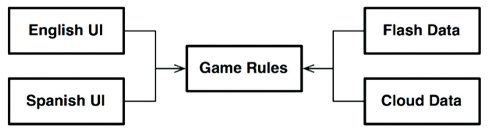
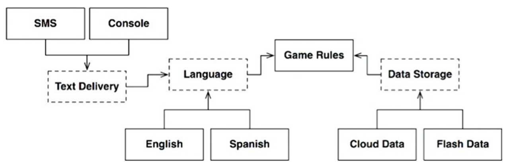
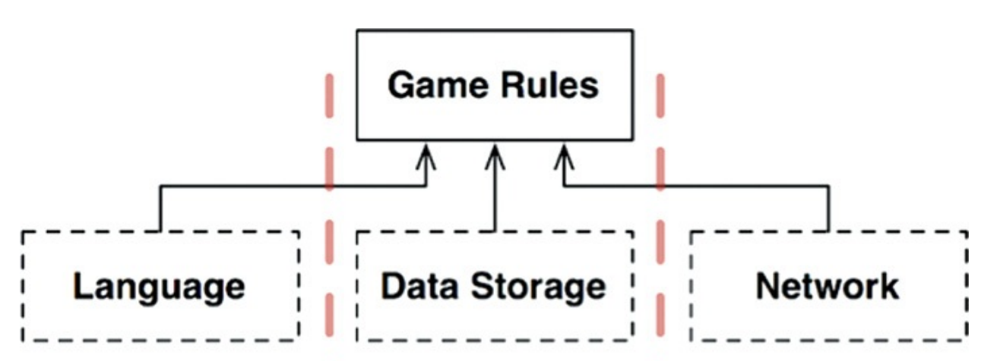
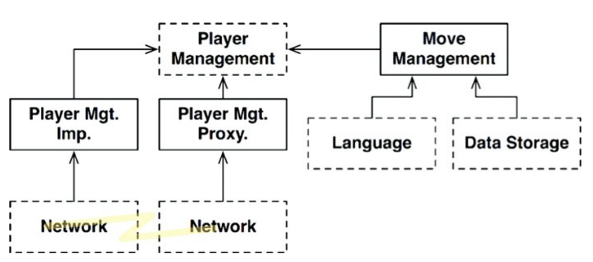

# 계층과 경계

- 시스템이 오직 **UI, 업무 규칙, 데이터베이스** 이 세 가지 컴포넌트로만 구성된다고 생각하기 쉽다.
  - 아주 단순한 시스템은 이것으로 충분하지만, 대다수의 시스템에서 컴포넌트의 개수는 이보다 훨씬 많다.

## 1. 움퍼스 사냥 게임

- 텍스트 기반의 사냥 게임이 있다고 가정한다.
  - 플레이어는 `GO EAST`, `SHOOT WEST`와 같은 명령어를 입력하며, 컴퓨터는 플레이어가 보고, 냄새 맡고, 듣고, 경험할 것들로 응답한다.
  - 플레이어는 동굴로 된 시스템 안에서 움퍼스를 사냥하며, 함정이나 위험들을 피해야 한다.
- 텍스트 기반 UI는 그대로 유지한 채, **게임 규칙**과 **UI**를 분리해서 여러 시장에 다양한 언어로 발매할 수 **있게** 만든다고 가정한다.
  - **게임** 규칙은 언어 독립적인 API를 사용해서 UI 컴포넌트와 통신할 것이고, UI는 API를 사람이 이해할 수 있는 언어로 변환할 것이다.
- UI가 게임 규칙에 의존하도록 **만든다면**, UI 컴포넌트가 어떤 언어를 사용하더라도 게임 규칙을 **재사용**할 수 있다.
- 또한 **게임**의 상태를 영속적인 저장소에 저장한다고 **할 때**, 게임 규칙이 어디에 저장되는지 **모르도록** 하는 **것이** 좋다. (즉, 데이터베이스 경계를 분리한다.)

## 2. 클린 아키텍처?

- 위 예제의 맥락이라면 클린 아키텍처 접근법을 적용해서 유스케이스, 경계, 엔티티, 그리고 관련된 데이터 구조를 모두 만드는 일은 꽤 쉬운 일이다.
  - 그런데 중요한 아키텍처 경계를 정말로 **모두** 발견한 것일까?
- 예를 들어, UI에서 **언어(Language)** 가 유일한 변경의 축은 아니다. 이밖에도 텍스트를 주고받는 **통신 메커니즘(채팅 앱, SMS, 콘솔 화면 등)** 을 다양하게 만들고 싶을 수도 있다.
  - 언어가 변경되는 이유와, 텍스트를 전달하는 메커니즘이 변경되는 이유는 서로 **다르다**.
  - 따라서 이 **변경의 축**에 의해 정의되는 새로운 아키텍처 경계가 잠재되어 있을 수도 **있다**.
  - 아마도 해당 경계를 가로지르는, 그래서 **언어**를 **통신 메커니즘으로부터** 완전히 격리하는 API를 추가로 생성해야 할 수도 있다.

## 3. 흐름 횡단하기

- 위 게임 예제에 멀티플레이를 위한 **네트워크 기능**이 추가된다고 가정해 보자.
- 이때는 네트워크 컴포넌트를 새롭게 추가해야 한다.
  - 이렇게 되면 기존의 '사용자 입력 흐름'에 더해, 다른 플레이어로부터 오는 '네트워크 메시지 흐름'이 추가된다.
- 이 구성은 데이터 흐름을 **세 개의 흐름(UI, 데이터베이스, 네트워크)**으로 분리하며, 이들 흐름은 모두 중앙의 `GameRules`가 제어하게 된다.
  - 따라서 시스템이 복잡해질수록 컴포넌트 구조는 더 **다양한 형태의 데이터 흐름**으로 분리될 것이다.

## 4. 흐름 분리하기

- 이쯤 되면 모든 흐름이 결국에는 상단의 단일 컴포넌트(`GameRules`)에서 **서로 만난다고** 생각할 수도 있다.
- **하지만 현실에서는 게임 규칙조차도 단일 컴포넌트가 아니다.**
  - 게임 규칙 내에서도 게임의 승패 조건을 관리하는 **고수준 정책**이 있고, 캐릭터의 체력이나 이동 반경을 계산하는 **저수준 로직**이 존재한다.
  - 데이터 흐름은 상단의 단일 지점에서 만나는 것이 아니라, 이러한 정책들의 **서로 다른 수준(Level)에서 교차**하며 더 복잡하게 분리된다.

## 5. 결론

- 단 200줄이면 구현할 수 있는 단순한 게임 예제로 시작해서 아키텍처 경계를 모두 추론해 낸 **이유**는, 아키텍처 경계가 **어디에나 존재한다**는 사실을 보여주기 위함이다.
- 아키텍트로서 우리는 아키텍처 경계가 **언제 필요한지**를 신중하게 파악해 내야 한다.
- 이러한 완벽한 경계를 제대로 구현하려면 **비용이 많이 든다**는 사실도 인지하고 있어야 한다.
  - 반대로, 경계가 무시되었다면 나중에 시스템이 커졌을 때 추가하는 비용이 엄청나게 크다는 사실도 알아야 한다.
- 그렇다고 해서 추상화가 필요하리라고 **미리 예측해서는 안 된다**. 이는 **YAGNI(You Aren't Gonna Need It)** 가 말하는 철학이다.
  - **오버 엔지니어링(Over-Engineering)** 이 언더 엔지니어링(Under-Engineering)보다 나쁠 때가 훨씬 많다.
- 반면, 아키텍처 경계도 존재하지 않는 상황에서 경계가 정말로 필요하다는 사실을 나중에 발견한 경우, **그때서야 경계를 추가하려면 비용이 많이 들고 큰 위험을 감수**해야 한다.
- 프로젝트 초반에는 구현할 경계가 무엇인지와 무시할 경계가 무엇인지를 **쉽게 결정할 수 없다**.
  - 따라서 계속 지켜보며 경계가 필요할 수도 있는 부분에 주목하고, 경계가 존재하지 않아 생기는 **마찰의 어렴풋한 첫 조짐**을 신중하게 관찰해야 한다.
  - 첫 조짐이 보이는 시점이 되면, 해당 경계를 **구현하는 비용**과 **무시할 때 감수할 비용(기술 부채)** 을 가늠해 본다. 그리고 **결정된 사항을 자주 검토**한다.
  - 우리의 목표는 경계의 구현 비용이 그걸 무시해서 생기는 비용보다 적어지는 **바로 그 변곡점**에서 경계를 구현하는 것이다.
