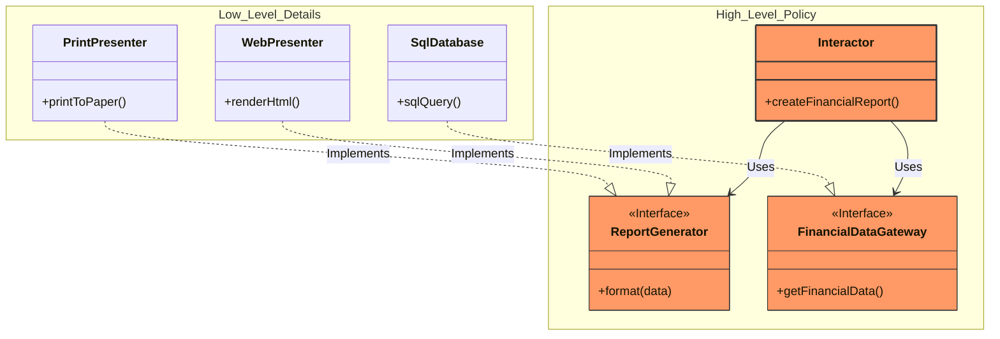

# OCP: 개방-폐쇄 원칙 (Open-Closed Principle)

## 1. 개방-폐쇄 원칙

> 소프트웨어 개체(Artifact)는 **확장**에는 열려 있어야 하고, **변경**에는 닫혀 있어야 한다.

- 소프트웨어 개체의 행위는 **확장**할 수 있어야 하지만, 이때 개체를 **변경**해서는 안 된다.

## 2. 사고실험

### 2.1. 상황 설정

- **재무제표** 애플리케이션을 만든다고 가정한다.
  - 데이터베이스에서 재무 데이터를 읽어온다.
  - 수익과 지출을 계산하고, 적자인지 흑자인지 판단한다(**업무 규칙**).
  - 이 결과를 **웹 페이지**에 보여준다.

### 2.2. 변경 발생

- 이해관계자가 새로운 요구사항을 가져온다.
  - "동일한 데이터를 웹 페이지뿐만 아니라 종이로 출력하게 해 주세요."
- 이때 개방-폐쇄 원칙이 잘 지켜졌다면 다음과 같다.
  - **확장에는 열려 있음**: 프린트 출력을 위한 코드를 새로 작성하는 것은 **쉬워야** 한다.
  - **변경에는 닫혀 있음**: 프린터 기능을 추가한다고 해서 기존 **업무 규칙**이나 **웹 페이지 출력 코드**를 수정해서는 안 된다.

### 2.3. 계층 구조와 레벨

- 이 목표를 달성하기 위해 시스템을 컴포넌트 단위로 분리하고, **중요도(Level)** 에 따라 계층을 나눈다.

#### 고수준 - 보호받아야 하는 영역

- **Interactor(업무 규칙)**
- 입력과 출력으로부터 가장 멀리 떨어져 있는 **순수한 비즈니스 로직**이다.
- 웹이든, 프린터든, 혹은 데이터베이스가 바뀌든 이 로직은 **변하지 않아야** 한다.

#### 저수준 - 변경이 잦은 영역

- **Web Presenter**, **Print Presenter**, **Database**(세부사항)
- 사용자의 요구, 기기의 발전, 프레임워크의 유행에 따라 **빈번하게 변경**된다.
- 고수준 정책에 맞춰 언제든지 **갈아 끼울 수 있어야** 한다.

### 2.4. 의존성의 방향과 인터페이스

- 계층을 나누는 핵심 메커니즘은 **인터페이스**를 활용한 **의존성 역전(DIP)**이다.
- **제어 흐름(Flow of Control)**
  - Interactor가 데이터를 처리해서 Presenter에게 전달하는 것이다.
  - `Interactor -> Presenter`
- **의존성 방향(Dependency Direction)**
  - 하지만 소스 코드 레벨에서는 **Interactor**가 **Presenter**를 알면 안 된다.
  - 따라서 **Interactor** 내부에 인터페이스를 두고, **Presenter**가 이를 구현하게 한다.
  - `Presenter -> Interactor` (방향이 **역전**됨)

#### Financial Report Interactor (고수준)

- 가장 **높은 곳**에 위치하며 누구에게도 **의존하지 않는다**.
- 자신이 사용할 인터페이스를 직접 **정의**하고 **소유**한다.

#### Web Presenter (세부사항)

- **Interactor**를 바라본다(**의존**).
- Interactor가 정의한 인터페이스를 구현하여 **웹 브라우저**에 보여준다.

#### Print Presenter (세부사항)

- **Interactor**를 바라본다.
- Interactor가 정의한 인터페이스를 구현하여 **프린트**한다.

## 4. 결론

- 개방-폐쇄 원칙은 시스템의 아키텍처를 떠받치는 **원동력** 중 하나이다.
- OCP의 목표는 시스템을 **확장**하기 쉬운 동시에 **변경**으로 인해 시스템이 너무 많은 영향을 받지 않도록 하는 데 있다.
- 이러한 목표를 달성하려면 시스템을 **컴포넌트 단위**로 분리하고, **저수준 컴포넌트**에서 발생한 변경으로부터 **고수준 컴포넌트**를 보호할 수 있는 형태의 **의존성 계층 구조**가 만들어지도록 해야 한다.
