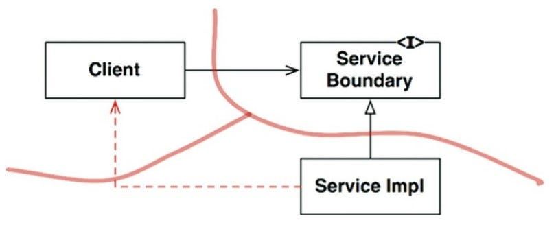
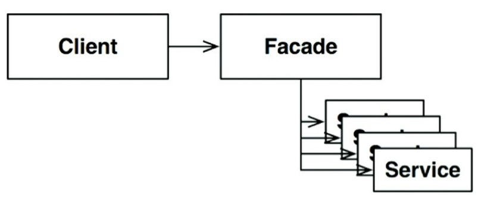

# 부분적 경계

## 1. 부분적 경계의 필요성

- 아키텍처 경계를 **완벽하게** 만드는 데는 **비용**이 많이 든다.
- 쌍방향의 다형적 **Boundary 인터페이스**, **Input/Output**을 위한 데이터 구조를 만들어야 할 뿐만 아니라, 두 영역을 **독립적으로 컴파일**하고 **배포**할 수 있는 컴포넌트로 격리하는 데 필요한 모든 **의존성**을 관리해야 한다.
- 이렇게 만들려면 엄청난 노력을 기울여야 하고, 유지하는 데도 또 엄청난 **노력이 든다**.
- 이때 비용을 줄이면서도 유연성을 확보하기 위해 **부분적 경계(Partial Boundaries)** 를 구현해볼 수 있다.

## 2. 마지막 단계를 건너뛰기

- 부분적 경계를 생성하는 방법 하나는 독립적으로 컴파일하고 배포할 수 있는 컴포넌트를 만들기 위한 작업은 **모두 수행한 후**, 단일 컴포넌트에 **그대로 모아만 두는 것**이다.
- 쌍방향 인터페이스도 그 컴포넌트에 있고, 입력, 출력 데이터 구조도 거기에 있으며, **모든 것이 완전히 준비**되어 있다.
  - 하지만 이 모두를 **단일 컴포넌트(예: 하나의 .jar)** 로 컴파일해서 배포한다.
- 이처럼 부분적인 경계를 만들면 완벽한 경계를 만들 때만큼의 **코드량**과 **사전 설계**가 필요하다.
- 하지만 다수의 컴포넌트를 관리하는 작업은 하지 않아도 된다.
  - 추적을 위한 **버전 번호**나 **배포 관리** 부담도 없다.

## 3. 일차원 경계 (One-Dimensional Boundaries)

- 완벽한 형태의 아키텍처 경계는 양방향으로 **격리된 상태**를 유지해야 하므로 **쌍방향 Boundary 인터페이스**를 사용한다.
- 하지만 양방향으로 격리된 상태를 유지하려면 초기 설정할 때나 지속적으로 유지할 때도 **비용**이 많이 든다.
- 추후 완벽한 형태의 경계로 확장할 수 있는 공간을 **확보하고자 할 때 전략 패턴(Strategy Pattern)** 을 사용할 수 있다.
  - 이는 **의존성 역전**을 통해 클라이언트를 서비스 구현체로부터 분리하지만, 쌍방향 인터페이스만큼 엄격하지는 않은 **일차원적인 경계**를 형성한다.

## 4. 퍼사드 (Facade)

- 이보다 훨씬 더 **단순한 경계**는 **퍼사드(Facade) 패턴**이다.
  - 이 경우에는 심지어 **의존성 역전**까지도 **희생**한다.
- 경계는 **Facade 클래스로만** 간단히 정의된다.
  - Facade 클래스에는 모든 **서비스 클래스를 메서드 형태**로 정의하고, 서비스 호출이 발생하면 해당 서비스 클래스로 호출을 **전달**한다.
- 클라이언트는 이들 서비스 클래스에 **직접 접근**할 수 없다.
- 하지만 Client가 모든 서비스 클래스에 대해 **추이 종속성(Transitive Dependency)** 을 **가지게 된 것이다**.
  - 즉, 서비스 클래스 중 하나가 변경되면 Facade가 변경되고, 이에 따라 Client까지 재컴파일해야 할 수도 있다.
