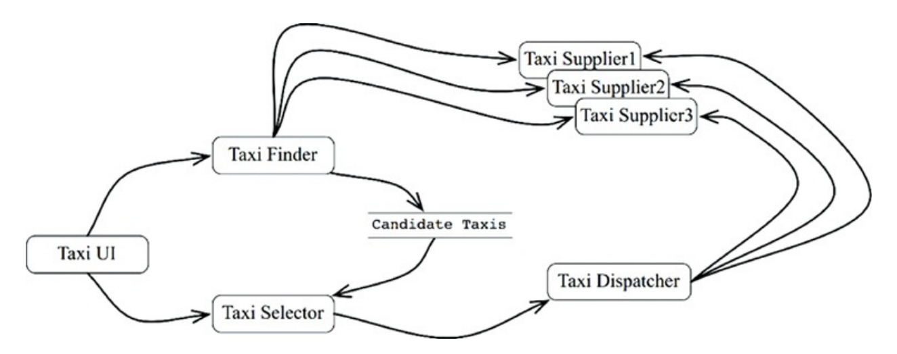
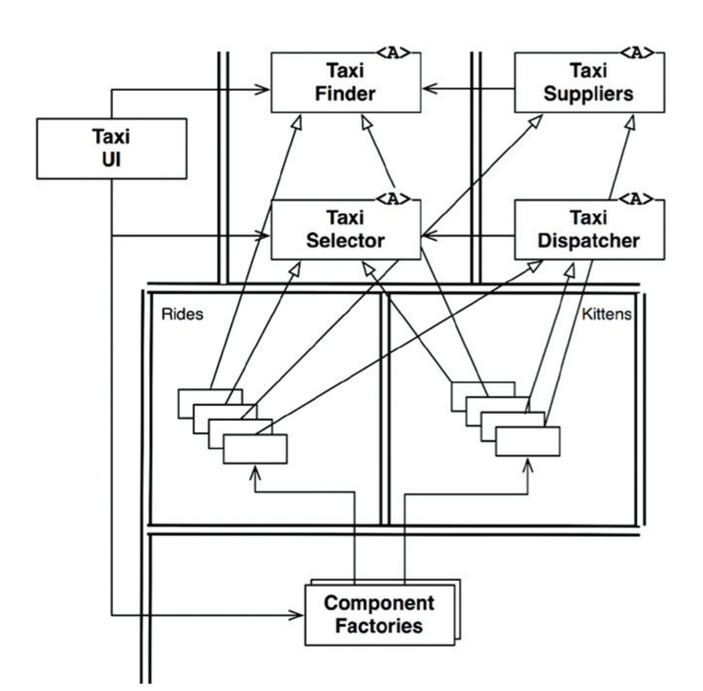

# 크고 작은 모든 서비스들

- **서비스 지향 아키텍처(SOA)** 와 **마이크로서비스 아키텍처(MSA)** 는 최근 큰 인기를 끌고 있다.
  - 서비스를 사용하면 상호 결합이 철저하게 **분리되는 것처럼** 보인다. 하지만 이는 **일부만 맞는 말**이다.
  - 서비스를 사용하면 개발과 배포 **독립성**을 지원하는 것처럼 보인다. 이 역시도 **일부만 맞는 말**이다.

## 1. 서비스 아키텍처?

- 시스템의 아키텍처는 **의존성 규칙**을 준수하며, 고수준의 정책을 저수준의 세부사항으로부터 분리하는 **경계**에 의해 정의된다.
  - 따라서 단순히 **서비스(Service)** 를 이용한다는 것 자체가 본질적으로 아키텍처에 해당하는 것은 아니다.
  - 애플리케이션의 행위를 분리할 뿐인 서비스라면, 이는 그저 **값비싼 함수 호출**에 불과하며 아키텍처 관점에서 꼭 중요하다고 볼 수는 없다.
- 물론 모든 서비스가 반드시 아키텍처 관점에서 중요해야만 한다는 뜻은 아니다.
  - 기능을 프로세스나 플랫폼에 **독립적**이 되게끔 서비스들을 생성하면, 의존성 규칙 준수 여부와 상관없이 큰 도움이 될 때가 많다.
  - 그러나 **서비스 그 자체로는 아키텍처를 정의하지 않는다.**
- 모노리틱 시스템이나 컴포넌트 기반 시스템에서 아키텍처를 정의하는 요소는, 의존성 규칙을 따르며 **아키텍처 경계를 넘나드는 함수 호출들**이다.
  - 시스템의 나머지 함수들은 행위를 서로 분리할 뿐이며, 아키텍처적으로는 전혀 중요하지 **않다**.
- **서비스**도 마찬가지로 프로세스나 플랫폼 경계를 가로지르는 **함수 호출**에 지나지 않는다.

## 2. 서비스의 이점?

### 2.1. 결합 분리의 오류 (The Decoupling Fallacy)

- 시스템을 서비스로 분리함으로써 얻게 되리라 예상되는 큰 이점 하나는 서비스 사이의 **결합이 확실히 분리된다**는 점이다.
  - 각 서비스는 서로 다른 프로세스에서, 심지어는 서로 다른 **프로세서**에서 실행된다.
  - 따라서 서비스는 다른 **서비스의 변수**에 직접 접근할 수 없다.
  - 또한, 모든 서비스의 인터페이스는 반드시 **잘 정의되어** 있어야 한다.
- **하지만 이는 착각이다.**
  - 서비스는 개별 변수 수준에서는 각각 결합이 분리되지만, 프로세서 내의 또는 네트워크 상의 **공유 자원** 때문에 결합될 가능성이 여전히 존재한다.
  - 예를 들어, 서비스 사이를 오가는 **데이터 레코드**에 새로운 필드를 추가한다면, 이 필드를 사용해 **동작하는** 모든 서비스는 반드시 **변경되어야 한다**.
  - 따라서 서비스들은 이 데이터 레코드에 **강하게 결합**되고, 서비스들 사이는 서로 **간접적으로 결합**되어 버린다.

### 2.2. 개발 및 배포 독립성의 오류 (The Fallacy of Independent Development and Deployment)

- 서비스를 사용함에 따라 예측되는 또 다른 이점은 **전담팀**이 서비스를 소유하고 운영한다는 점이다.
  - 데브옵스(DevOps) 전략의 일환으로 **전담팀**에서 각 서비스를 작성하고, 유지보수하며, 운영하는 책임을 질 수 있다.
  - 이러한 개발 및 배포 **독립성**은 확장 가능한 것으로 **간주된다**.
- **하지만 이 역시도 완벽한 진실은 아니다.**
  - 대규모 **엔터프라이즈** 시스템은 서비스 기반 시스템 이외에도, 모노리틱 시스템이나 컴포넌트 기반 시스템으로도 얼마든지 확장 가능하게 구축할 수 있다. 즉, 서비스가 확장 가능한 시스템을 구축하는 **유일한 선택지**가 아니다.
  - 서비스라고 해서 **항상 독립적으로** 개발하고, 배포하며, 운영할 수 있는 것은 아니다.
    - 시스템의 데이터나 행위가 어느 정도 **결합**되어 있다면, 결합된 정도에 맞게 팀 간의 개발, 배포, 운영 일정을 서로 **조정해야 한다**.

## 3. 야옹이 문제 (The Kitty Problem)

- 카카오 택시와 같은 택시 애플리케이션이 있다고 가정하자.
- 이때 택시 호출 기능 말고도 **고양이 운송 서비스**를 시작한다고 한다.
- 기존에는 `TaxiUI` 서비스는 고객을 담당하고,
  - `TaxiFinder` 서비스는 여러 `TaxiSupplier`의 현황을 검토하여 사용자에게 적합한 택시 후보를 선별하고,
  - `TaxiSelector` 서비스는 사용자가 지정한 비용, 시간 등의 조건을 기초로 후보 택시 중 가장 적합한 택시를 선택한다.
  - `TaxiDispatcher` 서비스는 택시에 배차 지시를 한다.
- 개발팀은 위 서비스를 각각 분리하여 유지보수 및 운영하고 있었다.
- 이때 고양이 운송 서비스를 시작하려면, 개발과 배포 전략을 매우 **신중하게 조정**해야 한다.
  - 이 서비스들은 모두 **결합**되어 있어서 독립적으로 개발하고, 배포하거나, 유지될 수 없다.
- 이게 바로 **횡단 관심사(Cross-cutting concern)** 가 지닌 문제다.
- 모든 소프트웨어 시스템은 서비스 지향이든 아니든 이 문제에 직면한다.
- 이때 단순한 **기능적 분해**는 새로운 기능이 여러 서비스의 행위를 가로지르는(횡단하는) 상황에 매우 **취약하다**.

## 4. 객체가 구출하다

- **컴포넌트 기반 아키텍처**는 **SOLID 설계 원칙**을 통해 이 문제를 해결했다.
  - 다형적으로 확장할 수 있는 클래스 집합을 생성해 새로운 기능을 처리하도록 한다.
- 배차에 특화된 로직 부분은 `Rides` 컴포넌트로 추출되고, **야옹이에 대한** 신규 기능은 `Kittens` 컴포넌트에 들어갔다.
- 이 두 컴포넌트는 기존 컴포넌트들에 있던 **추상 기반 클래스**를 **템플릿 메서드**나 **전략 패턴** 등을 이용해서 **오버라이드(Override)** 한다.
  - 즉, 기존 코드를 수정하지 않고 새로운 코드를 추가하는 방식(개방-폐쇄 원칙, OCP)으로 해결한다.

## 5. 컴포넌트 기반 서비스

- 서비스에도 이러한 객체 지향 원칙을 똑같이 적용할 수 있다.
- 서비스가 반드시 소규모 **단일체(Monolith)** 여야 할 이유는 없다.
- 서비스는 **SOLID 원칙**대로 설계할 수 있으며, 내부적으로 **컴포넌트 구조**를 갖출 수도 있다.
- 이를 통해 서비스 내의 **기존 컴포넌트들을 변경하지 않고도** 새로운 **컴포넌트를 추가할 수 있다**.
- 자바의 경우 서비스를 하나 이상의 `.jar` 파일에 포함되는 **추상 클래스들의 집합**이라고 생각하라.
  - 새로운 기능 추가 혹은 기능 확장은 새로운 `.jar` 파일로 만든다.
- 이때 새로운 `.jar` 파일은 기존에 **정의된** 추상 클래스들을 **확장해서** 만들어진다.
- 즉, 새로운 기능 배포는 전체 서비스를 재배포하는 문제가 아니라, 서비스를 로드하는 경로에 단순히 **새로운 `.jar` 파일을 추가하는 문제**가 **된다**.

## 6. 횡단 관심사 (Cross-Cutting Concerns)

- 아키텍처 경계는 서비스 **사이**에 있지 않다.
- 경계는 서비스를 **관통하며**, 서비스를 **컴포넌트 단위로 분할**한다.
- 모든 주요 시스템이 **직면하는** 횡단 관심사를 처리하려면, 서비스 내부 역시 의존성 규칙을 준수하는 **컴포넌트 아키텍처**로 설계해야 한다.
- 이 서비스들은 시스템의 아키텍처 경계를 정의하지 **않는다**.
- 아키텍처 경계를 정의하는 것은 서비스 내에 위치한 **컴포넌트**다.
