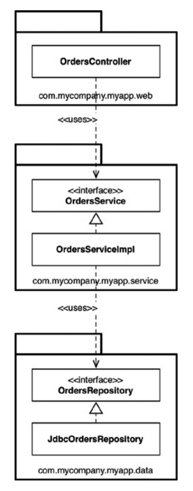
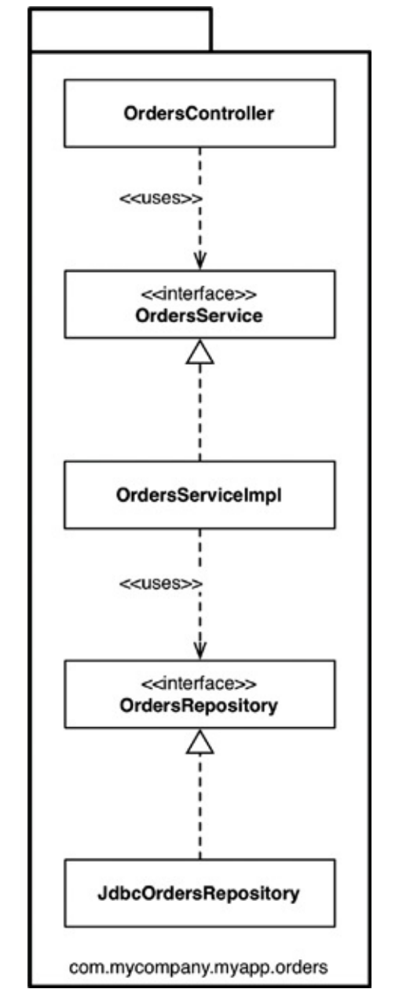
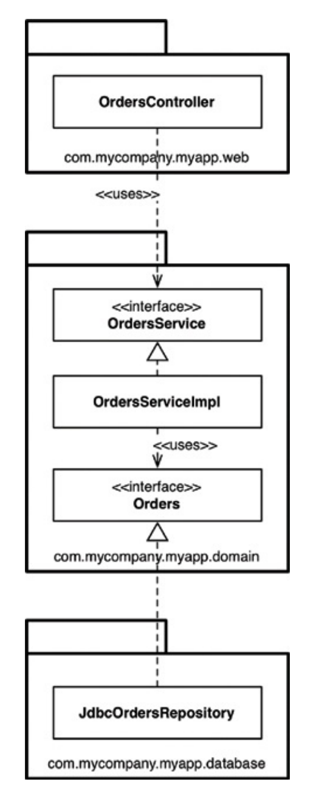
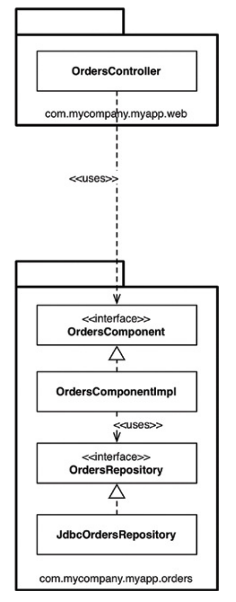
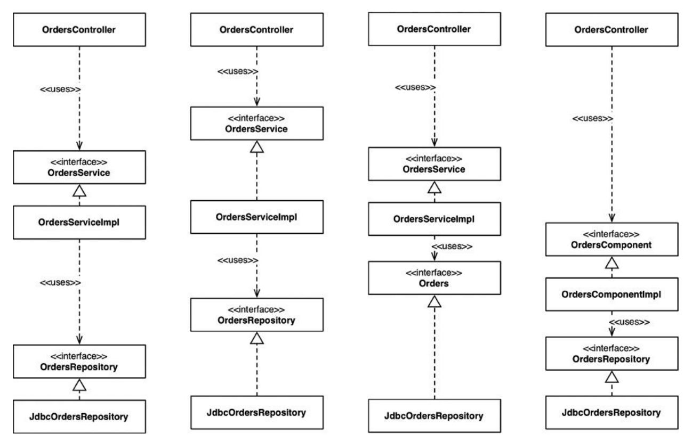
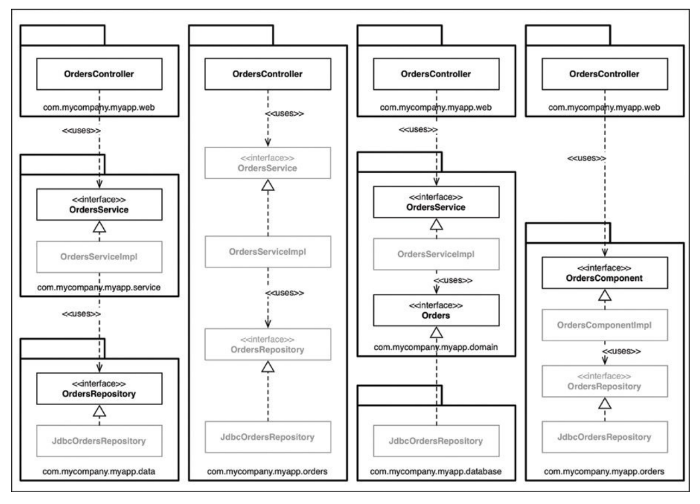

# 빠져 있는 장

- 온라인 서점 애플리케이션을 구축하고 있으며, 고객이 주문 상태를 조회할 수 있어야 한다는 유스케이스를 구현해야 한다고 가정한다.

## 1. 계층 기반 패키지 (Package by Layer)

- 가장 단순한 첫 번째 설계 방식은 전통적인 **수평 계층형 아키텍처**다.
- 기술적인 관점에서 해당 코드가 하는 일에 기반해 그 코드를 분할한다.
- **흔히** 이 방식을 **계층 기반 패키지(Package by Layer)** 라고 부른다.
- 전형적인 계층형 아키텍처에는 웹, '업무 규칙', 영속성 코드를 위해 계층이 각각 하나씩 존재한다.
  - 코드는 계층이라는 얇은 수평 조각으로 나뉘며, 각 계층은 유사한 종류의 것들을 묶는 도구로 사용된다.
  - 엄격한 계층형 아키텍처의 경우 계층은 반드시 **바로 아래 계층에만 의존**해야 한다.
  - 자바의 경우 주로 패키지를 사용해 구현한다.

### 1.1. 컴포넌트 구성

- `OrdersController`: 웹 컨트롤러이며, **웹 기반 요청**을 처리한다.
- `OrderService`: 주문 관련 **업무 규칙**을 정의하는 인터페이스다.
- `OrderServiceImpl`: `OrderService`의 구현체다.
- `OrdersRepository`: 영구 저장된 주문 정보에 접근하는 방법을 정의하는 인터페이스다.
- `JdbcOrdersRepository`: `OrdersRepository` 인터페이스의 구현체다.

### 1.2. 장단점

- 마틴 파울러(Martin Fowler)는 처음 시작하기에는 계층형 아키텍처가 적합하다고 했다.
  - 이 아키텍처는 엄청난 **복잡함**을 겪지 않고도 무언가를 작동시켜주는 아주 빠른 방법이다.
- 문제는 마틴이 지적했듯이 소프트웨어가 커지고 복잡해지기 시작하면, 머지않아 **큰 그릇 세 개만으로는 모든 코드를 담기엔 부족하다**는 것을 깨닫고, **더 잘게 모듈화**해야 할지 고민하게 될 것이다.
- 또한 계층형 아키텍처는 **업무 도메인에 대해 아무것도 말해주지 않는다**는 치명적인 문제도 있다. (소리치는 아키텍처의 부재)
  - 전혀 다른 업무 도메인이라도 코드를 계층형 아키텍처로 만들어서 나란히 놓고 보면, 웹, 서비스, 리포지터리로 구성된 모습이 거의 똑같이 보일 것이다.

## 2. 기능 기반 패키지 (Package by Feature)

- **기능 기반 패키지**는 서로 **연관된** 기능, 도메인 개념, 또는 (도메인 주도 설계 용어를 사용한다면) **애그리거트 루트(Aggregate Root)** 에 기반하여 **수직의 얇은 조각**으로 코드를 나누는 방식이다.
  - 관련된 모든 타입이 단 하나의 자바 패키지에 속하며, 패키지 이름은 그 안에 담긴 개념(예: `orders`)을 반영해 짓는다.
- 위 그림을 보면 인터페이스와 클래스의 역할은 이전(계층형)과 같지만, 이들 모두가 (세 개의 계층 패키지가 아닌) **단 하나의 패키지**에 속하게 된다.
  - 이제 코드의 최상위 수준 구조가 **업무 도메인에 대해 무언가를 알려주게 된다** (소리치는 아키텍처).
  - 따라서 코드를 열어봤을 때 이 코드 베이스가 단순한 웹, 서비스, 리포지터리의 집합이 아니라 '주문(Order)'과 관련한 무언가를 한다는 걸 직관적으로 볼 수 있다.
  - 또 다른 이점으로는 '주문 조회하기' 유스케이스가 변경될 경우, 변경해야 할 코드를 **찾는 작업이 더 쉬워질** 수 있다.
  - 변경해야 할 코드가 여러 패키지에 흩어져 있지 않고 **모두 한 패키지에 담겨 있기 때문**이다.
- 그러나 엄밀히 말해 계층 기반 패키지(수평적 계층화)나 기능 기반 패키지(수직적 계층화) 모두 아키텍처의 핵심 관점에서는 **차선책**에 불과할 수 있다.

## 3. 포트와 어댑터

- **포트와 어댑터** 혹은 **육각형 아키텍처(Hexagonal Architecture)**, '경계(Boundary), 컨트롤러(Controller), 엔티티(Entity)' 등의 방식으로 접근하는 이유는, 업무/도메인에 초점을 둔 코드가 프레임워크나 데이터베이스 같은 기술적인 세부 구현과 **독립적**이며 **분리된 아키텍처**를 만들기 위해서다.
- 코드 베이스는 크게 **내부(도메인)** 와 **외부(인프라)** 로 구성된다.
  - **내부 영역**은 도메인 개념을 모두 포함하는 반면,
  - **외부 영역**은 외부 세계(UI, 데이터베이스 등)와의 상호작용을 포함한다.
  - 이때 **외부가 내부에 의존**하며, 그 반대로는 **절대 안 된다** (의존성 규칙).
- '주문 조회하기' 유스케이스를 이 방식으로 구현하면 위 그림처럼 된다.
  - `com.mycompany.myapp.domain` 패키지가 **'내부'** 이며, 나머지 패키지는 모두 **'외부'** 다.
  - 이때 모든 의존성이 **내부를 향해 흐른다**.
  - 이전 다이어그램의 `OrderRepository`가 `Orders`라는 간단한 이름으로 바뀌었다.
  - 이는 **도메인 주도 설계(DDD)** 에서 내부에 존재하는 모든 것의 이름은 반드시 **유비쿼터스 도메인 언어(Ubiquitous Domain Language)** 관점에서 기술하라고 조언하기 때문이다.
  - 도메인에 대해 논의할 때 우리는 **'주문'** 에 대해 말하는 것이지, '주문 리포지터리'에 대해 말하는 것이 아니기 때문이다.
- 위 다이어그램에서는 인터랙터(Interactor)와 의존성 경계를 가로질러 데이터를 마샬링(Marshalling)하는 객체 등을 누락하여 UML 클래스 다이어그램을 간소화하였다.

## 4. 컴포넌트 기반 패키지

- **계층형 아키텍처**의 주된 목적은 기능이 같은 코드끼리 서로 분리하는 것이다.
  - 웹 관련 코드는 업무 로직으로부터 분리하고, 업무 로직은 다시 데이터 접근(영속성)으로부터 분리한다.
  - UML 클래스 다이어그램에서 봤듯이, 구현 관점에서 보면 각 계층은 일반적으로 **자바 패키지**에 해당한다.
  - 코드 의존성 관점에서 `OrdersController`가 `OrderService` 인터페이스에 의존하려면 `OrderService` 인터페이스는 반드시 `public`으로 선언되어 있어야 한다.
  - 두 인터페이스가 서로 다른 패키지에 속하기 때문이다.
  - 마찬가지로 `OrdersRepository` 인터페이스도 `public`이어야만 repository 패키지 외부에 있는 `OrderServiceImpl` 클래스에서 접근할 수 있다.

### 4.1. 완화된 계층형 아키텍처와 의존성 문제

- **엄격한 계층형 아키텍처**에서는 의존성 화살표가 항상 아래를 향해야 하며, 각 계층은 반드시 **바로 아래 계층에만 의존**해야 한다.
  - 이런 방식으로 멋지고 깔끔한 비순환 의존성 그래프를 만들 수 있을 거라 생각할 수도 있지만, 코드 베이스의 요소들이 서로 의존할 때는 몇 가지 규칙을 반드시 지켜야만 한다.
  - 속임수를 써서 몇몇 의존성을 의도치 않은 방식으로 추가하더라도, 보기에는 여전히 좋은 비순환 의존성 그래프가 완성될 수 있다.
  - 예를 들어 신규 팀원이 들어왔을 때 `OrdersController`가 이미 존재하고, 구현하려고 하는 기능이 아주 간단하기에 Controller에서 바로 `OrdersRepository`에 접근해버릴 수도 있다.
- 이처럼 계층이 인접한 계층(들)을 건너뛰는 일이 허용되는 구조를 **완화된 계층형 아키텍처(Relaxed Layered Architecture)** 라고 부른다.
  - 경우에 따라서는 이것이 의도된 결과이기도 한데, CQRS 패턴을 지키려고 시도하는 중이라면 업무 로직 계층을 우회하는 일은 바람직하지 못하다.
  - 특히 개별 레코드에 대해 인증된 접근만 허용하는 일을 업무 로직이 책임지는 경우라면 더더욱 우회해서는 안 된다.
  - 새롭게 구현한 기능이 당장 동작은 하겠지만, 팀이 아키텍처적으로 기대하던 형태와는 크게 다를 수 있다는 것이 문제다.

### 4.2. 아키텍처 원칙 강제하기

- 이때 필요한 것이 "웹 컨트롤러는 절대로 리포지터리에 직접 접근해서는 안 된다"와 같은 **아키텍처 지침(원칙)** 이다.
  - 하지만 **문제는 강제성**이다.
  - 대부분의 팀은 '코드 리뷰'를 통해서 이를 강제한다고 말하지만, 현실에서는 사람이 하는 일이기에 완벽하게 막아내기 쉽지 않다.
- 따라서 빌드 시 **정적 분석 도구**(NDepend, Structure101, CheckStyle 등)를 사용해서 아키텍처적인 위반 사항이 없는지를 검사하여 **자동으로 강제**해야 한다.
  - 이 방식은 다소 조잡해 보일 수 있지만 효과가 확실하다. 팀 차원에서 정의한 아키텍처 원칙을 위반하는 항목을 알려주고, 위반 시 **빌드가 실패**하게 만들기 때문이다.
  - 가능하면 컴파일러를 사용해서 아키텍처를 강제하는 방식이 가장 좋다.

### 4.3. 컴포넌트 기반 패키지의 도입

- **컴포넌트 기반 패키지**를 도입해야 하는 이유가 바로 이 강제성과 응집도 때문이다.
  - 이 접근법은 큰 단위의 단일 컴포넌트와 관련된 모든 책임을 **하나의 자바 패키지로 묶는 데** 주안점을 둔다.
  - 서비스 중심적인 시각으로 소프트웨어 시스템을 바라보는 방식이며, 이는 마이크로서비스 아키텍처(MSA)가 가진 시각과도 동일하다.
  - 포트와 어댑터 패턴에서 웹을 그저 '또 다른 전달 메커니즘'으로 취급하는 것과 마찬가지로, 컴포넌트 기반 패키지에서도 사용자 인터페이스를 큰 단위의 컴포넌트로 분리해서 유지한다.
- 이 접근법에서는 **업무 로직**과 **영속성 관련 코드**를 하나로 묶는데, 이 묶음을 **컴포넌트**라고 부른다.
  - 컴포넌트는 멋지고 깔끔한 인터페이스로 감싸진 연관된 기능들의 묶음으로, 애플리케이션과 같은 실행 환경 내부에 존재한다.
  - 소프트웨어 시스템의 정적 구조를 컨테이너, 컴포넌트, 클래스의 측면에서 계층적으로 생각하는 간단한 방법이다 (C4 모델 참고).
    1. 시스템은 하나 이상의 **컨테이너**(웹 애플리케이션, 모바일 앱 등)로 구성된다.
    2. 각 컨테이너는 하나 이상의 **컴포넌트**를 포함한다.
    3. 각 컴포넌트는 하나 이상의 **클래스**로 구현된다.
  - 이때 각 컴포넌트가 개별 `.jar` 파일로 분리될지 여부는 아키텍처와는 별개의 직교적인(Orthogonal) 관심사다.
- 주된 이점으로는 주문과 관련된 무언가를 코딩해야 할 때 **한 곳(주문 컴포넌트 패키지)만 둘러보면 된다**는 점이다.
  - 컴포넌트 내부에서 관심사의 분리는 여전히 유효하며, 따라서 업무 로직은 데이터 영속성과 철저히 분리되어 있다.
  - 하지만 이는 컴포넌트 구현과 관련된 '세부사항'이 되므로, 컴포넌트를 사용하는 외부 사용자는 내부의 영속성 계층을 알 필요가 없다.
  - 모노리틱 애플리케이션에서 컴포넌트를 이렇게 잘 정의해 두면, 향후 **마이크로서비스 아키텍처로 넘어가기 위한 훌륭한 발판**으로 삼을 수 있다.

## 5. 구현 세부사항엔 항상 문제가 있다

- 표면상으로는 앞서 살펴본 네 가지 접근법이 코드를 조직화하는 완전히 다른 방식처럼 보이며, 따라서 서로 다른 아키텍처 스타일로 여길 수도 있다.
- 하지만 **구현 세부사항이 잘못되면** 이러한 견해도 아주 빠르게 흐트러지기 시작한다.
- 자바(Java)와 같은 언어에서 `public` 접근 지시자를 지나칠 정도로 남발하는 모습을 자주 볼 수 있다.
  - 이는 수평적 계층형, 수직적 계층형, 포트와 어댑터 등 어떤 아키텍처 스타일을 적용하든 모두 마찬가지로 발생하는 문제다.
- 모든 타입에 `public` 지시자를 사용한다는 것은, 사용하는 프로그래밍 언어가 제공하는 **캡슐화(Encapsulation)** 관련 이점을 전혀 활용하지 않겠다는 뜻이다.
- 이로 인해 누군가가 인터페이스를 우회하여 **구체적인 구현 클래스의 인스턴스를 직접 생성하는 코드**를 작성하는 일을 컴파일러 단에서 절대 막을 수 없게 되며, 결국 팀이 지향하던 **아키텍처 스타일을 위반**하게 될 것이다.

## 6. 조직화 vs 캡슐화 (Organization vs. Encapsulation)

- 만약 자바 애플리케이션에서 **모든 타입을 `public`으로 지정**한다면, 패키지는 단순히 **조직화를 위한 메커니즘**(마치 폴더처럼)으로 전락하여 **캡슐화를 위한 메커니즘이 될 수 없다**.
- `public` 타입을 코드 베이스 어디에서든 마음대로 사용할 수 있다면, 패키지를 사용하는 데 따른 이점이 거의 없다.
  - 따라서 사실상 패키지를 사용하지 않는 것과 같다.
  - 패키지를 무시해버리면 (캡슐화나 정보 은닉을 하는 데 아무런 도움이 되지 않으므로) 최종적으로 어떤 아키텍처 스타일로 만들려고 하는지는 **아무런 의미가 없어진다**.

- 위 그림은 앞선 4가지 방식에서 **오직 `public`만을 사용했을 때의 의존 관계**를 상상해 본 것이다.
  - 개념적으로 이 접근법들은 매우 다르지만, 구문적으로는 **완전히 똑같다**.
  - 모든 타입을 `public`으로 선언한다면, 사실상 **수평적 계층형 아키텍처**를 표현하는 4가지 방식을 변형해서 사용할 뿐이다.
- 반면 자바에서 **접근 지시자를 적절하게 사용하면**, 타입을 패키지로 배치하는 방식에 따라서 각 타입에 접근할 수 있는 정도가 크게 달라질 수 있다.
  - 다이어그램에서 패키지 구조를 살려 **더 제한적인 접근 지시자(package-private 등)** 를 사용할 수 있는 타입을 표시해 보면, 다이어그램은 매우 인상적으로 변한다.

### 6.1. 접근 지시자를 적용한 4가지 접근법 비교

1. **계층 기반 패키지 (Package by Layer)**
   - `OrdersService`와 `OrdersRepository` 인터페이스는 외부 패키지의 클래스(컨트롤러 등)로부터 자신이 속한 패키지 내부로 들어오는 의존성이 존재하므로 **`public`** 으로 선언되어야 한다.
   - 반면 구현체 클래스(`OrderServiceImpl`, `JdbcOrdersRepository`)는 더 제한적으로 선언할 수 있다 (예: **패키지-프라이빗(package-private)**).
   - 이 구현체들은 외부에서 누구도 알 필요가 없는 **구현 세부사항**이다.

2. **기능 기반 패키지 (Package by Feature)**
   - `OrdersController`가 해당 패키지로 들어올 수 있는 **유일한 통로**를 제공하므로, 나머지는 모두 **패키지-프라이빗(package-private)** 으로 지정할 수 있다.
   - 이 방식에서 주의할 점은, 이 패키지 밖의 코드에서는 **컨트롤러를 통하지 않으면** 주문 관련 정보에 절대 접근할 수 없다는 것이다.

3. **포트와 어댑터 (Ports and Adapters)**
   - `OrdersService`와 `Orders` 인터페이스는 외부로부터 들어오는 의존성을 가지므로 **`public`** 을 지정해야 한다.
   - 이 경우에도 구현 클래스는 **패키지-프라이빗(package-private)** 으로 지정하며, 런타임에 의존성을 주입(DI)할 수 있다.

4. **컴포넌트 기반 패키지 (Package by Component)**
   - `OrdersController`에서 `OrdersComponent` 인터페이스로 향하는 의존성만 가지며, 그 외의 **모든 것**은 **패키지-프라이빗(package-private)** 으로 지정할 수 있다.
   - `public` 타입이 적으면 적을수록 관리해야 할 의존성의 수도 적어진다.
   - 이제 이 패키지 **외부의 코드**에서는 `OrdersRepository` 인터페이스나 구현체를 **직접 사용할 수 있는 방법이 전혀 없다**.
   - 따라서 우리는 사람의 리뷰가 아닌, **컴파일러의 도움을 받아서** 컴포넌트 기반 패키지 아키텍처 접근법을 완벽하게 **강제**할 수 있다.

### 6.2. 결론

- 위 내용은 **모노리틱 애플리케이션(Monolithic Application)** 에 대한 것으로, 모든 코드가 단 하나의 소스 코드 트리에 존재하는 경우다.
- 이러한 애플리케이션을 구축 중이라면, 아키텍처 원칙을 강제할 때 자기 규율(팀 규칙)이나 컴파일 후처리 도구(정적 분석 도구)에만 의존하지 말고, 가급적 **반드시 컴파일러(접근 지시자 캡슐화)에 의지할 것**을 강력히 권장한다.

## 7. 다른 결합 분리 모드

- 프로그래밍 언어가 제공하는 접근 지시자(`public`, `private` 등) 외에도 **소스 코드 의존성을 분리**하는 다른 방법들이 존재할 수 있다.

### 7.1. 모듈 시스템 활용

- 예를 들어 자바에는 OSGi 같은 모듈 프레임워크나 **자바 9(Java 9)** 에서 제공하는 새로운 **모듈 시스템(JPMS)** 이 있다.
- 모듈 시스템을 제대로 사용하면 `public` 타입과 **외부에 공표할 타입**을 분리할 수 있다.
  - `Orders` 모듈을 생성할 때 내부의 모든 타입을 `public`으로 지정하더라도, `module-info.java`를 통해 **그중 일부 타입만을 외부에서 사용할 수 있도록 공표**할 수 있다. (즉, 모듈 수준의 캡슐화가 가능해진다.)

### 7.2. 빌드 도구를 통한 소스 코드 트리 분리 (Multi-module)

- 다른 선택지로는 소스 코드 수준에서 의존성을 원천적으로 분리하는 방법도 있다.
  - 즉, 컴포넌트들을 **서로 다른 소스 코드 트리(프로젝트/모듈)** 로 분리하는 방법이다.
- **포트와 어댑터**를 예로 들면 코드를 세 가지 트리로 나눌 수 있다.
  1. **업무와 도메인용 소스 코드** (선택된 기술이나 프레임워크와는 독립적인 핵심): `OrdersService`, `OrderServiceImpl`, `Orders`
  2. **웹용 소스 코드**: `OrdersController`
  3. **데이터 영속성용 소스 코드**: `JdbcOrdersRepository`
- 이렇게 하면 마지막 두 소스 코드 트리(웹, 영속성)는 업무와 도메인 코드에 대해 **컴파일 시점에 의존성**을 가지게 되며, 업무와 도메인 코드 자체는 웹이나 데이터 영속성 코드에 대해서 **전혀 알지 못한다**.
- 이를 구현하기 위해서는 빌드 도구(**메이븐(Maven)**, **그래들(Gradle)** 등)를 사용해서 모듈이나 하위 프로젝트가 서로 엄격히 분리되도록 구성해야 한다.
- 이상적으로는 이러한 형태를 반복적으로 적용하여 모든 컴포넌트 각각을 개별적인 소스 코드 트리로 구성해야 한다.

### 7.3. 페리페리크 안티 패턴 (The Périphérique Anti-Pattern)

- 다만 현실적으로는 관리의 편의성을 위해 **도메인 코드(내부)** 와 **인프라 코드(외부)** 딱 두 개 정도로만 소스 코드 트리를 만드는 경우가 많다.
- 이 접근법은 소스 코드를 크게 조직화할 때는 효과가 있겠지만, 잠재적으로 **절충해야 할 치명적인 단점**이 있다.
  - 이를 포트와 어댑터에 대한 **페리페리크 안티 패턴(Périphérique Anti-pattern)** 이라고 부른다. (파리 외곽 순환도로인 페리페리크처럼, 중심부인 도메인을 거치지 않고 외곽으로만 우회해서 통신한다는 의미)
- 인프라 코드를 단일 소스 코드 트리(외부)에 모두 모아둔다는 말은?
  - 애플리케이션의 특정 영역(예: 웹 컨트롤러)에 있는 인프라 코드가, 애플리케이션의 다른 영역(예: 데이터베이스 리포지터리)에 있는 코드를 **직접 호출할 수 있다**는 뜻이다.
  - 즉, **도메인을 통하지 않고(우회해서)** 인프라끼리 직접 통신하는 문제가 발생한다.
  - 특히 해당 인프라 코드들에 적절한 **접근 지시자(캡슐화)** 가 적용되어 있지 않다면, 컴파일러 단에서 이러한 불법적인 호출을 **막기 매우 어렵다**.
