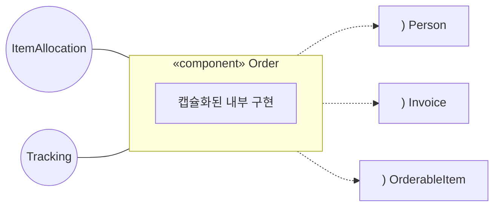
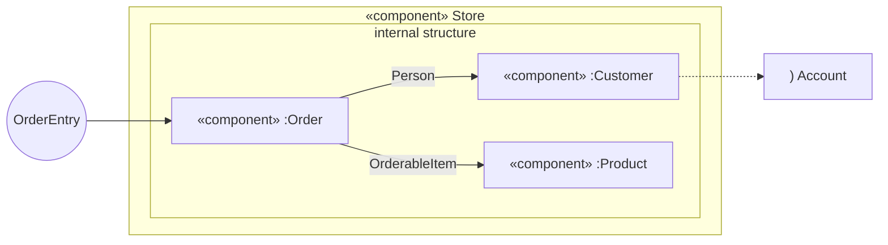
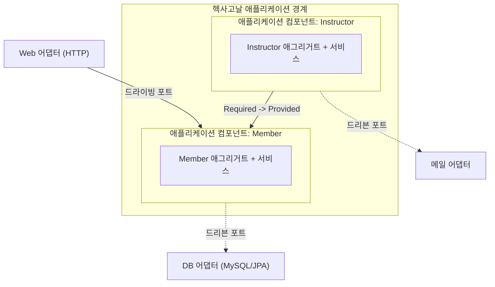
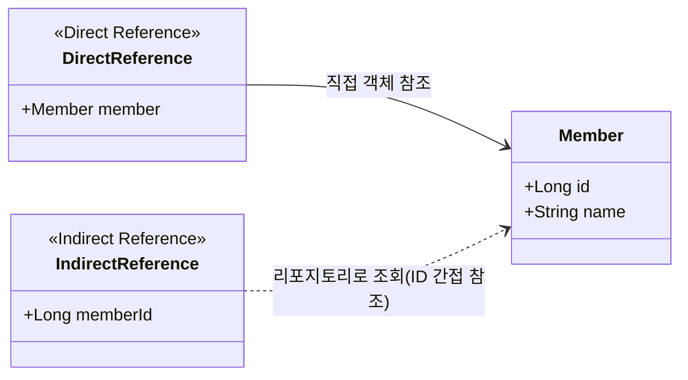

# 토비의 클린 스프링 - 도메인 모델 패턴과 헥사고날 아키텍처 Part 2

## 1. 포트(Port)

- 애플리케이션 핵심 비즈니스가 **외부 세계와 명확한 의도(Intention)를 가지고 상호작용**하도록 추상화한 진출입구이다.
- 단순한 데이터 입출력 채널을 넘어, 명확한 비즈니스 목적과 방향성을 정의하여 외부 시스템과 연결하는 인터페이스 역할을 담당한다.

### 1.1. 소통 의도를 기준으로 애플리케이션 포트 구성

- 어댑터와 애플리케이션 컴포넌트가 각자 필요한 인터페이스에만 선택적으로 의존할 수 있어 인터페이스 분리 원칙(ISP)을 충족한다.
- 하위 구현 클래스를 외부 영향 없이 독립적으로 리팩터링하고 클린하게 재구성하기 용이하다.
- 테스트 시 구체 클래스가 아닌 포트 인터페이스를 기반으로 상호작용을 검증하는 설계를 정립할 수 있다.
- 포트 인터페이스를 기반으로 테스트 대역을 쉽게 생성할 수 있어 목(Mock) 기반 단위 테스트 작성이 편리하다.
- 모듈 간 결합도가 낮아져 추후 멀티 모듈 아키텍처 분리나 마이크로서비스(MSA) 전환 시 유연한 확장이 가능하다.

## 2. 모듈과 컴포넌트의 개념

- **모듈의 개념**
  - 시스템을 더 작은 단위로 분할한 논리적 단위를 의미하며, 패키지, 네임스페이스, 클래스 등이 해당한다.
  - 모듈의 분할 기준은 아키텍처 및 도메인 설계 목적에 따라 결정된다.
- **UML 컴포넌트의 정의**
  - 시스템을 구성하는 **독립적이고 교체 가능한(Replaceable) 모듈 단위이다**.
  - **내부 구현 캡슐화**: 외부 환경으로부터 컴포넌트 내부의 세부 구현을 완전히 은닉한다.
  - **명확한 인터페이스 노출**
    - **제공 인터페이스(Provided Interface)**: 컴포넌트가 외부에 제공하는 기능 규약이며, 롤리팝 기호(`○`)로 표현한다.
    - **요구 인터페이스(Required Interface)**: 컴포넌트의 정상 동작을 위해 외부에 요구하는 기능 규약이며, 소켓 기호(`)`)로 표현한다.
  - **교체 가능성**: 동일한 인터페이스 명세를 충족한다면 내부 구현 컴포넌트를 완전히 대체하거나 컴포넌트 기반 개발(CBD) 방식으로 재조합할 수 있다.



## 3. UML 컴포넌트의 중첩(Nesting)

- UML 컴포넌트는 서브패키지나 내부 클래스와 유사하게 **컴포넌트 내부에 하위 컴포넌트를 포함하는 중첩 구조**를 지원한다.
- 하위 컴포넌트 간의 상호작용뿐만 아니라, 내부 인터페이스를 상위 컴포넌트의 Provided/Required 인터페이스로 직접 위임하거나 연결할 수 있다.



## 4. 헥사고날 아키텍처와 컴포넌트

- **컴포넌트와 전략(Strategy) 패턴의 결합**
  - 헥사고날 아키텍처의 핵심 애플리케이션 영역(헥사곤 내부) 자체가 거대한 하나의 독립된 컴포넌트로 기능한다.
  - 고전 UML 컴포넌트가 정적 연결을 전제로 하는 반면, 헥사고날 아키텍처는 **런타임 동적 주입(전략 패턴)** 을 통해 외부 환경과의 결합도를 낮춘다.
  - 스프링 프레임워크의 DI/IoC 컨테이너 환경에서는 빈(Bean) 조립을 통해 이러한 동적 바인딩이 자연스럽게 실현된다.
- **포트(Port)와 컴포넌트 인터페이스의 매핑**
  - **인바운드/드라이빙 포트(Primary Port)**: 컴포넌트의 Provided Interface에 해당하며, 웹 어댑터, UI, 단위 테스트 등의 외부 호출 진입점 역할을 담당한다.
  - **아웃바운드/드리븐 포트(Secondary Port)**: 컴포넌트의 Required Interface에 해당하며, 데이터베이스, 메일 발송, 테스트 대역(Mock) 등 외부 기술 계층을 요구하는 인터페이스 역할을 담당한다.

## 5. 헥사고날 아키텍처의 중첩 한계와 애플리케이션 컴포넌트

- **헥사고날 아키텍처 중첩의 지양**
  - **헥사고날 아키텍처 내부의 중첩 구조를 지양해야 한다고 명시했다**.
  - 헥사고날 아키텍처의 경계는 핵심 도메인을 변경 빈도가 높은 외부 기술 인프라(UI, DB, 외부 API)로부터 격리 보호하기 위한 아키텍처 경계이다.
  - 따라서 헥사곤 내부에 또 다른 헥사곤을 중첩하는 것은 기술 격리라는 본래의 경계 목적에 부합하지 않으며, 불필요한 시스템 복잡도만 가중시킨다.
- **내부 구조화를 위한 애플리케이션 컴포넌트**
  - 헥사고날 아키텍처 자체를 중첩하지 않는 대신, **내부 비즈니스 로직 영역을 UML 컴포넌트 방식으로 모듈화하는 구조**를 적용한다.
  - 도메인의 **애그리거트(Aggregate)와 애플리케이션 서비스** 단위를 묶어 단일 애플리케이션 컴포넌트로 구성한다.
  - `HttpServletRequest`나 특정 ORM 구현체 같은 프레임워크 종속 코드가 내부 인터페이스에 침투하지 않도록 순수 객체지향 설계를 유지한다.
  - 기술 어댑터는 반드시 **헥사고날 외부 레이어**에 격리 배치하고 런타임에 주입받아 연결한다.
  - 컴포넌트의 Provided 인터페이스는 드라이빙 포트로서 외부로 노출되거나, 다른 도메인 컴포넌트의 Required 인터페이스와 협력하는 연결점으로 활용된다.



## 6. 애그리거트 간의 참조 방식: 직접 참조 vs 식별자 참조

- **직접 객체 참조**
  - 도메인 모델을 객체지향 패러다임에 맞춰 자연스럽게 투영한다.
  - 객체 그래프 탐색이 용이하며 연관관계의 응집도와 표현력이 높아진다.
  - JPA와 같은 ORM 매핑 및 쿼리 최적화에 유리하다.
  - 모든 연관관계를 식별자로만 처리하면 코드가 데이터베이스 중심 설계로 변질될 위험이 존재한다.
- **식별자 간접 참조**
  - 애그리거트 경계를 엄격히 유지하기 위해 다른 애그리거트 루트의 ID 값(예: `Long memberId`)만 필드로 보관한다.
  - 분산 환경, 마이크로서비스 아키텍처(MSA), 메시지 큐 기반 이벤트 처리 구조에 적합하다.



## 7. 애그리거트 및 컴포넌트 연관관계 4가지 설계 원칙

- **기본 연관관계는 직접 참조로 시작**
  - 분산 환경 구성 등 특별한 사유가 없다면 도메인 표현력과 JPA 친화성을 위해 직접 객체 참조를 기본으로 채택한다.
- **도메인 변경 단위의 경계 준수 (경계를 넘는 수정 금지)**
  - 직접 참조로 연결된 다른 애그리거트의 상태는 단순 조회 및 참조 목적으로만 활용한다.
  - 다른 애그리거트 내부의 필드를 변경하는 수정 메소드를 직접 호출하는 행위를 엄격히 차단한다.
- **애그리거트 간 협력 및 다중 변경은 애플리케이션 서비스 계층에서 조율**
  - 단일 트랜잭션 내에서 둘 이상의 애그리거트 변경이 필요한 경우, 도메인 내부가 아닌 **애플리케이션 서비스 간의 호출** 또는 **도메인 이벤트**를 통해 조율한다.
- **컴포넌트 간 통신(포트 호출) 시 식별자(ID) 전달**
  - 컴포넌트 간 포트 인터페이스를 호출할 때는 엔티티 객체 자체를 전달하지 않고 **애그리거트 루트의 식별자(ID)** 를 전달한다.
  - 외부 어댑터(HTTP 요청 등) 진입 방식과의 일관성을 유지하며, JPA 1차 캐시 활용을 통해 추가 조회에 따른 성능 부하를 극소화한다.

## 8. 애플리케이션 컴포넌트 간의 단방향 의존성

- **컴포넌트 연결 구조**
  - 각 컴포넌트(`Member`, `Instructor` 등)는 독립된 Provided/Required 포트를 보유한다.
  - Instructor 컴포넌트의 Required 포트가 Member 컴포넌트의 Provided 포트를 호출하는 방식으로 상호작용을 수행한다.
- **단방향 의존성 원칙**
  - 컴포넌트 간 의존 방향은 반드시 **단방향**을 유지해야 한다.
  - 순환 참조(`Instructor -> Member` 및 `Member -> Instructor`)는 아키텍처 안정성을 해치고 확장을 저해하므로 금지한다.

## 9. 커스텀 스테레오타입 합성 애노테이션

### 9.1. 메타 애노테이션

- **메타 애노테이션(Meta-Annotation)** 은 다른 애노테이션에 적용하는 애노테이션이다.
- 애노테이션 자체의 **특성, 동작, 역할을 정의하거나 설명하는 데 사용**한다.
- Spring은 애노테이션에 선언된 **메타 애노테이션 계층을 탐색**하여 필요한 기능을 적용한다.
- 이를 활용하면 여러 애노테이션을 하나의 커스텀 애노테이션으로 묶은 **합성 애노테이션(Composed Annotation)** 을 만들 수 있다.

#### Spring의 메타 애노테이션 활용 예시

```java
@Target(ElementType.TYPE)
@Retention(RetentionPolicy.RUNTIME)
@Documented
@Indexed
public @interface Component {
}

@Target(ElementType.TYPE)
@Retention(RetentionPolicy.RUNTIME)
@Documented
@Component
public @interface Service {
}

@Target(ElementType.TYPE)
@Retention(RetentionPolicy.RUNTIME)
@Documented
@Inherited
@BootstrapWith(DataJpaTestContextBootstrapper.class)
@ExtendWith(SpringExtension.class)
@OverrideAutoConfiguration(enabled = false)
@TypeExcludeFilters(DataJpaTypeExcludeFilter.class)
@Transactional
@AutoConfigureCache
@AutoConfigureDataJpa
@AutoConfigureTestDatabase
@AutoConfigureTestEntityManager
@ImportAutoConfiguration
public @interface DataJpaTest {
}
```

- `@Service`는 `@Component`를 메타 애노테이션으로 사용하므로 **컴포넌트 스캔의 대상**이 된다.
- `@DataJpaTest`는 테스트에 필요한 여러 애노테이션을 조합한 **합성 애노테이션**이다.
- 이처럼 메타 애노테이션을 활용하면 반복적으로 선언해야 하는 설정을 하나의 애노테이션으로 추상화할 수 있다.

### 9.2. 스테레오타입 애노테이션

- 일반적인 의미에서 **스테레오타입(Stereotype)** 은 고정관념이나 정형화된 인식을 의미한다.
- UML에서는 기존 모델 요소에 **특정 역할이나 의미를 부여하기 위한 레이블**을 의미한다.
  - 예시는 `<<entity>>`, `<<interface>>`, `<<component>>` 등이다.
- Spring에서 **스테레오타입 애노테이션**은 클래스에 특정 역할을 부여하고, Spring 컨테이너가 이를 인식하여 활용할 수 있도록 하는 애노테이션이다.
  - 대표적으로 `@Component`, `@Service`, `@Controller`, `@Repository`가 있다.
- 사용자가 직접 **커스텀 스테레오타입 애노테이션**을 정의하여 애플리케이션의 아키텍처나 도메인에 맞는 의미와 역할을 부여할 수도 있다.
- 커스텀 스테레오타입을 사용하면 클래스의 역할을 애노테이션만으로 명확하게 표현할 수 있어 **코드의 의도와 아키텍처 구조를 드러내기 쉽다**.

## 10. 테스트 데이터 준비

- **예제 기반 테스트(Example-based Testing)** 는 미리 정한 입력값과 기대값을 사용하여 동작을 검증하는 테스트이다.
  - 정상값뿐만 아니라 최소값, 최대값, 경계 직전·직후 값 등을 사용하는 **경계값 테스트(Boundary Value Testing)** 를 함께 수행할 수 있다.
- **랜덤 데이터 테스트(Random Data Testing)** 는 임의로 생성한 다양한 데이터를 입력하여 예상하지 못한 오류를 찾는 테스트이다.
- **프로퍼티 기반 테스트(Property-based Testing)** 는 다양한 입력 데이터를 자동으로 생성하고, 입력값이 달라져도 **항상 성립해야 하는 성질(Property)** 을 검증하는 테스트이다.
  - 특정 입력과 기대값을 하나씩 작성하기보다 프로그램이 만족해야 하는 **불변 조건이나 규칙**을 정의하는 방식이다.
- **형식 검증(Formal Verification)** 은 프로그램이 만족해야 할 조건을 수학적으로 표현하고, 해당 조건이 항상 성립하는지를 논리적으로 검증하는 방식이다.
  - 테스트 케이스를 실행하여 오류를 찾는 방식보다 더 엄밀하게 프로그램의 정확성을 검증하는 접근이다.
  - 함수형 프로그래밍을 비롯하여 프로그램의 성질을 명확하게 표현할 수 있는 분야에서 활용할 수 있다.

### 10.1. 랜덤 데이터 테스트 도구

- DataFaker
- Fixture Monkey
- Easy Random
- jqwik
- Instancio
  - 테스트에 필요한 **객체 그래프(Object Graph)를 자동으로 생성**하는 라이브러리이다.
  - 객체 내부 필드뿐만 아니라 **중첩 객체, 컬렉션, 배열**까지 자동으로 생성할 수 있다.
  - **Selector**를 이용하여 특정 필드를 선택하고 원하는 값이나 생성 규칙을 지정할 수 있다.
  - Java의 **Record 타입**을 지원한다.
  - **Bean Validation과 JPA 애노테이션을 인식**하여 객체 생성에 활용할 수 있다.
