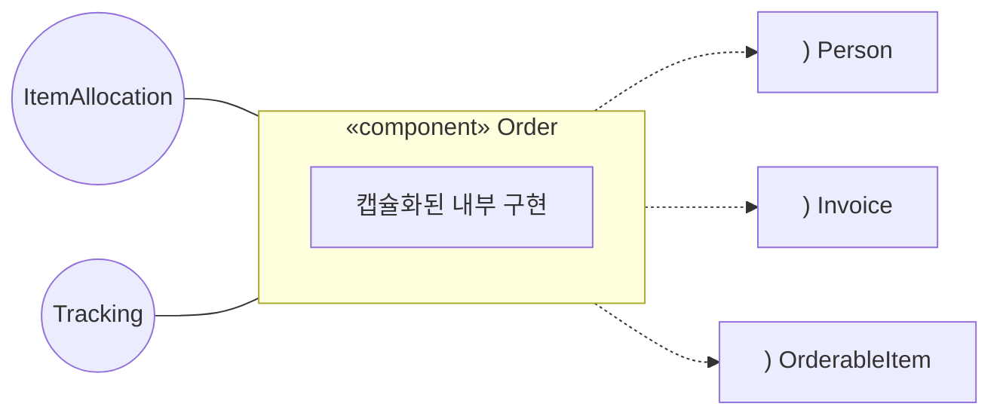
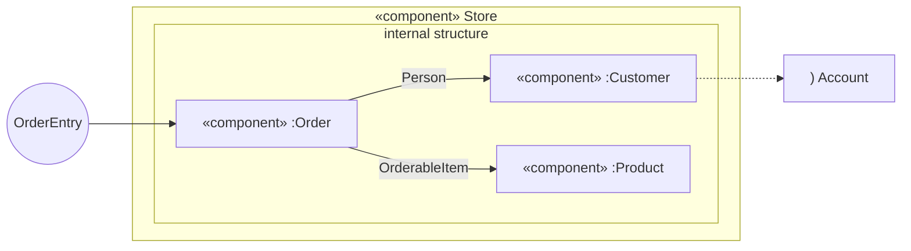
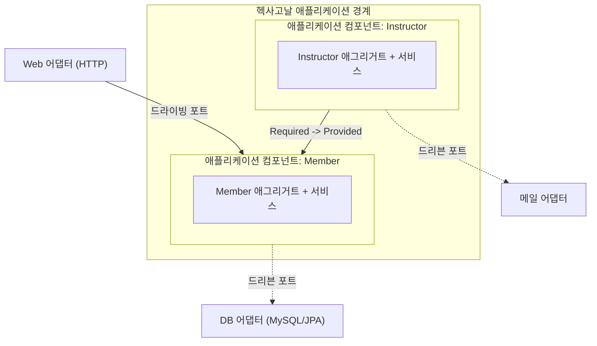

# 토비의 클린 스프링 - 도메인 모델 패턴과 헥사고날 아키텍처 Part 2

## 1. 포트(Port)

- 애플리케이션 핵심 비즈니스가 **외부 세계와 명확한 의도(Intention)를 가지고 상호작용**하도록 추상화한 진출입구이다.
- 단순한 데이터 입출력 채널을 넘어, 명확한 비즈니스 목적과 방향성을 정의하여 외부 시스템과 연결하는 인터페이스 역할을 담당한다.

### 1.1. 소통 의도를 기준으로 애플리케이션 포트 구성

- 어댑터와 애플리케이션 컴포넌트가 각자 필요한 인터페이스에만 선택적으로 의존할 수 있어 인터페이스 분리 원칙(ISP)을 충족한다.
- 하위 구현 클래스를 외부 영향 없이 독립적으로 리팩터링하고 클린하게 재구성하기 용이하다.
- 테스트 시 구체 클래스가 아닌 포트 인터페이스를 기반으로 상호작용을 검증하는 설계를 정립할 수 있다.
- 포트 인터페이스를 기반으로 테스트 대역을 쉽게 생성할 수 있어 목(Mock) 기반 단위 테스트 작성이 편리하다.
- 모듈 간 결합도가 낮아져 추후 멀티 모듈 아키텍처 분리나 마이크로서비스(MSA) 전환 시 유연한 확장이 가능하다.

## 2. 모듈과 컴포넌트의 개념

- **모듈의 개념**
  - 시스템을 더 작은 단위로 분할한 논리적 단위를 의미하며, 패키지, 네임스페이스, 클래스 등이 해당한다.
  - 모듈의 분할 기준은 아키텍처 및 도메인 설계 목적에 따라 결정된다.
- **UML 컴포넌트의 정의**
  - 시스템을 구성하는 **독립적이고 교체 가능한(Replaceable) 모듈 단위이다**.
  - **내부 구현 캡슐화**: 외부 환경으로부터 컴포넌트 내부의 세부 구현을 완전히 은닉한다.
  - **명확한 인터페이스 노출**
    - **제공 인터페이스(Provided Interface)**: 컴포넌트가 외부에 제공하는 기능 규약이며, 롤리팝 기호(`○`)로 표현한다.
    - **요구 인터페이스(Required Interface)**: 컴포넌트의 정상 동작을 위해 외부에 요구하는 기능 규약이며, 소켓 기호(`)`)로 표현한다.
  - **교체 가능성**: 동일한 인터페이스 명세를 충족한다면 내부 구현 컴포넌트를 완전히 대체하거나 컴포넌트 기반 개발(CBD) 방식으로 재조합할 수 있다.

## 3. UML 컴포넌트의 중첩(Nesting)

- UML 컴포넌트는 서브패키지나 내부 클래스와 유사하게 **컴포넌트 내부에 하위 컴포넌트를 포함하는 중첩 구조**를 지원한다.
- 하위 컴포넌트 간의 상호작용뿐만 아니라, 내부 인터페이스를 상위 컴포넌트의 Provided/Required 인터페이스로 직접 위임하거나 연결할 수 있다.

## 4. 헥사고날 아키텍처와 컴포넌트

- **컴포넌트와 전략(Strategy) 패턴의 결합**
  - 헥사고날 아키텍처의 핵심 애플리케이션 영역(헥사곤 내부) 자체가 거대한 하나의 독립된 컴포넌트로 기능한다.
  - 고전 UML 컴포넌트가 정적 연결을 전제로 하는 반면, 헥사고날 아키텍처는 **런타임 동적 주입(전략 패턴)** 을 통해 외부 환경과의 결합도를 낮춘다.
  - 스프링 프레임워크의 DI/IoC 컨테이너 환경에서는 빈(Bean) 조립을 통해 이러한 동적 바인딩이 자연스럽게 실현된다.
- **포트(Port)와 컴포넌트 인터페이스의 매핑**
  - **인바운드/드라이빙 포트(Primary Port)**: 컴포넌트의 Provided Interface에 해당하며, 웹 어댑터, UI, 단위 테스트 등의 외부 호출 진입점 역할을 담당한다.
  - **아웃바운드/드리븐 포트(Secondary Port)**: 컴포넌트의 Required Interface에 해당하며, 데이터베이스, 메일 발송, 테스트 대역(Mock) 등 외부 기술 계층을 요구하는 인터페이스 역할을 담당한다.

## 5. 헥사고날 아키텍처의 중첩 한계와 애플리케이션 컴포넌트

- **헥사고날 아키텍처 중첩의 지양**
  - **헥사고날 아키텍처 내부의 중첩 구조를 지양해야 한다고 명시했다**.
  - 헥사고날 아키텍처의 경계는 핵심 도메인을 변경 빈도가 높은 외부 기술 인프라(UI, DB, 외부 API)로부터 격리 보호하기 위한 아키텍처 경계이다.
  - 따라서 헥사곤 내부에 또 다른 헥사곤을 중첩하는 것은 기술 격리라는 본래의 경계 목적에 부합하지 않으며, 불필요한 시스템 복잡도만 가중시킨다.
- **내부 구조화를 위한 애플리케이션 컴포넌트**
  - 헥사고날 아키텍처 자체를 중첩하지 않는 대신, **내부 비즈니스 로직 영역을 UML 컴포넌트 방식으로 모듈화하는 구조**를 적용한다.
  - 도메인의 **애그리거트(Aggregate)와 애플리케이션 서비스** 단위를 묶어 단일 애플리케이션 컴포넌트로 구성한다.
  - `HttpServletRequest`나 특정 ORM 구현체 같은 프레임워크 종속 코드가 내부 인터페이스에 침투하지 않도록 순수 객체지향 설계를 유지한다.
  - 기술 어댑터는 반드시 **헥사고날 외부 레이어**에 격리 배치하고 런타임에 주입받아 연결한다.
  - 컴포넌트의 Provided 인터페이스는 드라이빙 포트로서 외부로 노출되거나, 다른 도메인 컴포넌트의 Required 인터페이스와 협력하는 연결점으로 활용된다.

