# 마이크로서비스 설계

- 소프트웨어 개발 역사에서 **모듈화**는 언제나 핵심적인 가치였다.
- 모듈화의 근본 목적은 각 모듈을 기능적으로 **응집성** 있게 만들고, 서로 다른 모듈 간의 **의존도(결합도)** 를 낮추는 것이다.
- 마이크로서비스 설계 역시 기능적으로 응집된 서비스를 도출하고, 서비스 간 의존도를 최소화하는 것에 집중한다.
- 마이크로서비스 내부 구조를 구성하는 요소들 또한 역할별로 철저히 모듈화되어야 한다.
- 즉, **역할이 분명하고 독립적인 모듈**들이 모여 하나의 서비스를 이루고, 이 서비스는 다시 다른 서비스와 **느슨하게 결합**되어야 한다.

## 1. 마이크로서비스를 도출하는 방법

- 마이크로서비스가 비즈니스 변화에 대응하며 독립적으로 변경 및 배포되려면, 타 서비스와 의존하지 않는 구조로 도출되어야 한다.

### 1.1. 비즈니스 능력에 근거한 도출

- 마이크로서비스를 식별하는 가장 쉬운 방법은 경험적인 원칙을 적용하는 것이다.
- 각 도메인은 이미 비즈니스가 규정하는 **업무 방식, 조직, 부서 체계**가 정의되어 있으며, 이러한 부서들은 업무 처리의 응집성이 높고 타 부서와의 의존도는 낮다.
- 이처럼 비즈니스 부서가 가진 역할 처리 능력을 체계적으로 분해하는 것을 **업무 기능 분해**라고 한다.
- 이 방식은 비즈니스 전체를 대략적으로 이해할 때는 유용하지만, 서비스 간의 상세 관계나 구체적인 관리 데이터를 식별하기에는 미흡하다.

### 1.2. DDD의 바운디드 컨텍스트(Bounded Context) 기반 도출

- 마이크로서비스는 각자 **독립된 저장소**를 보유하며, 다른 서비스의 데이터를 직접 참조해서는 안 된다.
- 이러한 데이터 독립성은 서비스를 독립적으로 수정 및 배포할 수 있게 만드는 강력한 장점이 된다.
- 따라서 마이크로서비스 도출 시 해당 서비스가 **소유권을 가진 데이터를 독립적으로 식별**하는 것이 무엇보다 중요하다.
- 서비스 내부 기능에 의해서만 접근 가능한 **캡슐화된 데이터**를 파악해야 한다.
- 기존 방식은 기능과 데이터를 분리하여 식별하는 경향이 있었으나, **DDD(도메인 주도 설계)** 는 하위 도메인마다 별도의 도메인 모델을 정의하여 이를 통합한다.
- **도메인 모델**은 각 업무에 특화된 **유비쿼터스 언어**로 정의되며, 해당 업무의 핵심 개념들로 구성된다.

## 2. DDD에서의 설계

- 마이크로서비스를 잘 설계하려면 **응집성 있는 단위로 서비스를 식별하는 것**이 중요하다.
- DDD에서는 비즈니스적으로 응집된 영역을 **바운디드 컨텍스트(Bounded Context)** 로 구분한다.
- 이 바운디드 컨텍스트는 **마이크로서비스를 나누는 좋은 기준**이 될 수 있다.
- 또한 DDD는
  - 전략적 설계를 통해 서비스 경계를 식별하고,
  - 전술적 설계를 통해 내부 객체 구조를 상세하게 설계한다.

## 3. DDD의 전략적 설계

### 3.1. 도메인과 서브도메인

- DDD는 하나의 거대한 도메인을 그대로 다루지 않고, **중요도와 역할에 따라 여러 영역으로 분리**한다.
- 복잡한 비즈니스 도메인을 논리적으로 나눈 하위 영역을 **서브도메인(Sub Domain)** 이라 한다.
- 이렇게 분리하면 문제 영역을 더 쉽게 이해하고 관리할 수 있다.
- 서브도메인은 중요도에 따라 세 가지로 나뉜다.
  - **핵심 서브도메인(Core Sub Domain)**
    - 비즈니스 경쟁력을 만드는 핵심 영역이다.
    - 가장 중요한 투자와 전략이 집중되는 영역이다.
  - **지원 서브도메인(Supporting Sub Domain)**
    - 핵심은 아니지만 비즈니스 운영에 반드시 필요한 영역이다.
    - 핵심 도메인을 지원하는 역할을 한다.
  - **일반 서브도메인(Generic Sub Domain)**
    - 비즈니스 차별성과는 거리가 멀다.
    - 기존 솔루션이나 패키지 제품으로 대체 가능한 영역이다.

### 3.2. 유비쿼터스 언어와 도메인 모델, 바운디드 컨텍스트

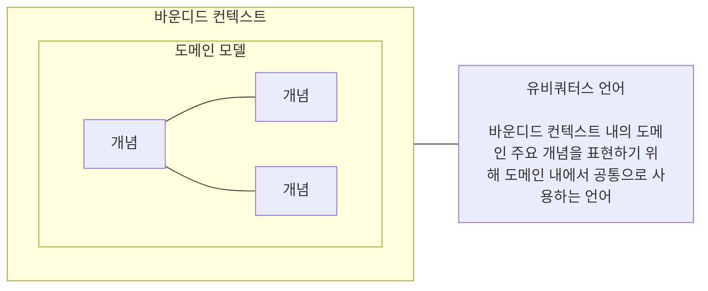

- 특정 도메인의 핵심 개념과 의도를 명확히 표현하기 위해 사용하는 공통 언어를 **유비쿼터스 언어(Ubiquitous Language)** 라 한다.
- 유비쿼터스 언어는 도메인 전문가와 개발자가 함께 사용하는 공통 개념 체계이다.
- 도메인 개념들이 서로 관계를 맺으며 형성된 모델을 **도메인 모델(Domain Model)** 이라 한다.
- **도메인 모델은 비즈니스 자체를 이해할 수 있게 만들어야 한다**.
- 여러 도메인 모델을 구성하다 보면 서로 다른 언어와 개념이 사용되는 경계가 생긴다.
- 이 경계를 **바운디드 컨텍스트(Bounded Context)** 라 한다.
- 보통 바운디드 컨텍스트는 하나의 독립된 모델과 언어 체계를 가진다.

### 3.3. 컨텍스트 매핑

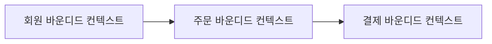

- 바운디드 컨텍스트는 내부 응집도는 높고, 외부 의존성은 낮게 설계해야 한다.
- 하지만 실제 비즈니스에서는 여러 컨텍스트가 서로 협력해야 하는 경우가 많다.
- 이처럼 컨텍스트 간의 관계와 의존성을 정의한 것을 **컨텍스트 매핑(Context Mapping)** 이라 한다.
- 그리고 이러한 관계를 시각적으로 표현한 다이어그램을 **컨텍스트 맵(Context Map)** 이라 한다.
- 컨텍스트 맵을 설계할 때는 다양한 컨텍스트 매핑 패턴을 이해해야 한다.
- 아래는 주요 컨텍스트 매핑 관계다.

#### 공유 커널(Shared Kernel)

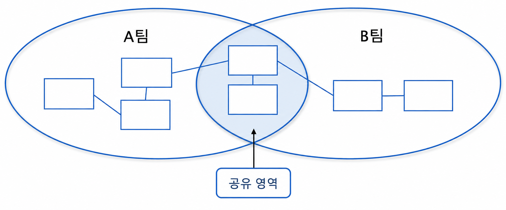

- 바운디드 컨텍스트 사이에 **공통적인 도메인 모델을 공유하는 관계**다.
- 두 개 이상의 팀이 작지만 공통의 도메인 모델을 상호 합의 하에 공유한다.
- **공통 라이브러리** 등이 여기에 해당하며, 공유 모델이 변경되면 연관된 모든 컨텍스트에 영향을 미친다. 따라서 공유 코드의 빌드 관리와 테스트를 전담하는 거버넌스가 필요하다.

#### 소비자와 공급자(Customer-Supplier)

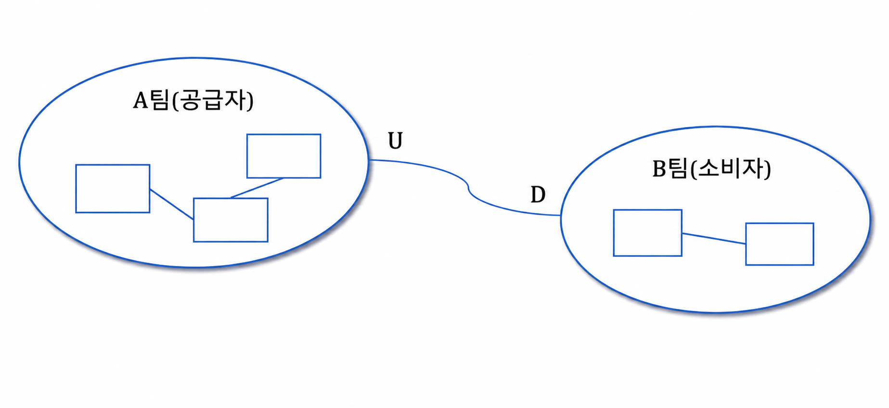

- 공급하는 컨텍스트를 **상류(Upstream, U)**, 소비하는 컨텍스트를 **하류(Downstream, D)** 로 표시한다.
- 데이터와 영향도는 상류에서 하류로 흐른다. 상류에 변화가 생기면 하류 팀이 이를 따라야 하므로, 공급자는 소비자가 원하는 요구사항을 적절히 지원해야 한다.

#### 준수자(Conformist)

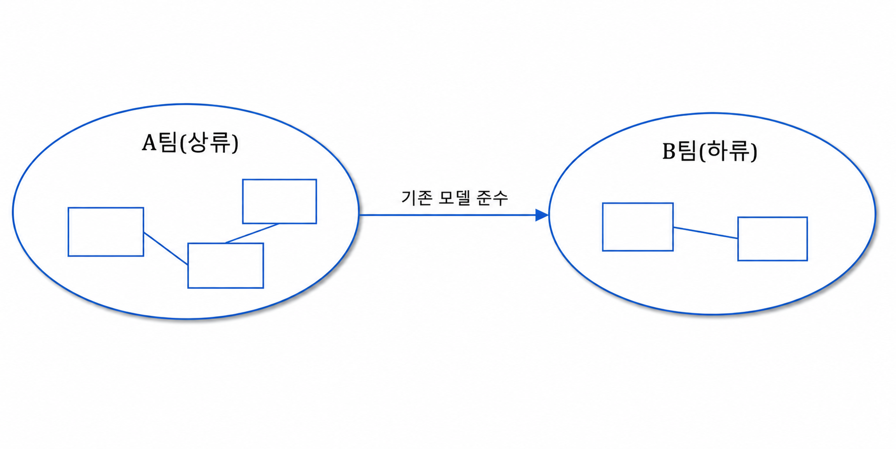

- 소비자와 공급자 관계와 유사하나, 상류 팀이 하류 팀의 요구를 지원하지 않거나 못하는 상황에서 사용한다.
- 하류 팀은 상류 팀의 비즈니스 모델을 변경할 수 없으므로, **상류에서 제공하는 도메인 모델을 그대로 준수**하여 사용한다.

#### 충돌 방지 계층(Anti-Corruption Layer: ACL)

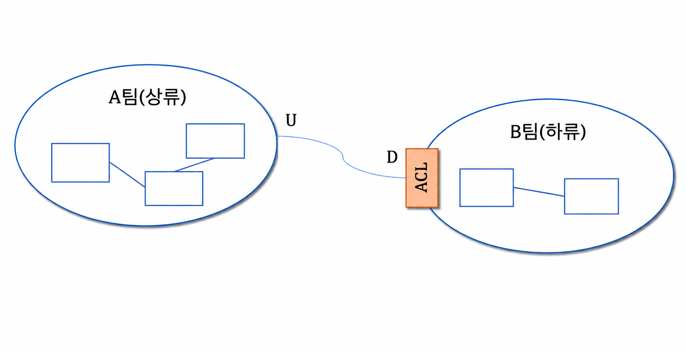

- 하류 팀이 상류 팀의 도메인 모델에 오염되지 않도록, 하류 팀 고유의 모델을 지키기 위한 **번역 계층**을 두는 방식이다.
- 두 컨텍스트 사이의 모델 차이를 번역하여 하류 모델의 독립성을 유지한다. 즉, 상류 시스템을 수정하지 않고 하류 시스템과 통합하기 위한 **데이터 변환 메커니즘**을 구현한다.
- 주로 **레거시 시스템과 신규 시스템을 통합**할 때 신규 시스템의 도메인 모델을 보호하기 위해 사용한다.

#### 공개 호스트 서비스(Open Host Service: OHS)

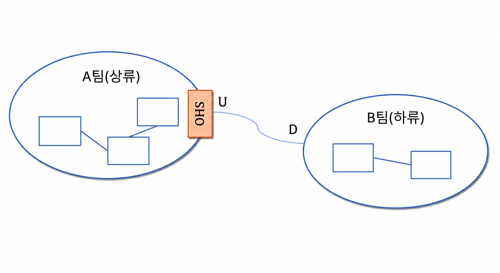

- 바운디드 컨텍스트에 대한 접근을 제공하는 **공식 프로토콜이나 인터페이스를 정의**하는 방식이다.
- 다수의 하류 컨텍스트가 상류 컨텍스트의 기능을 쉽게 사용할 수 있도록 표준화된 접근 창구를 공개한다.
- 일반적으로 타 서비스에서 범용적으로 호출할 수 있도록 잘 정돈된 **공유 API(REST API 등)** 가 여기에 해당한다.

#### 발행된 언어(Published Language: PL)

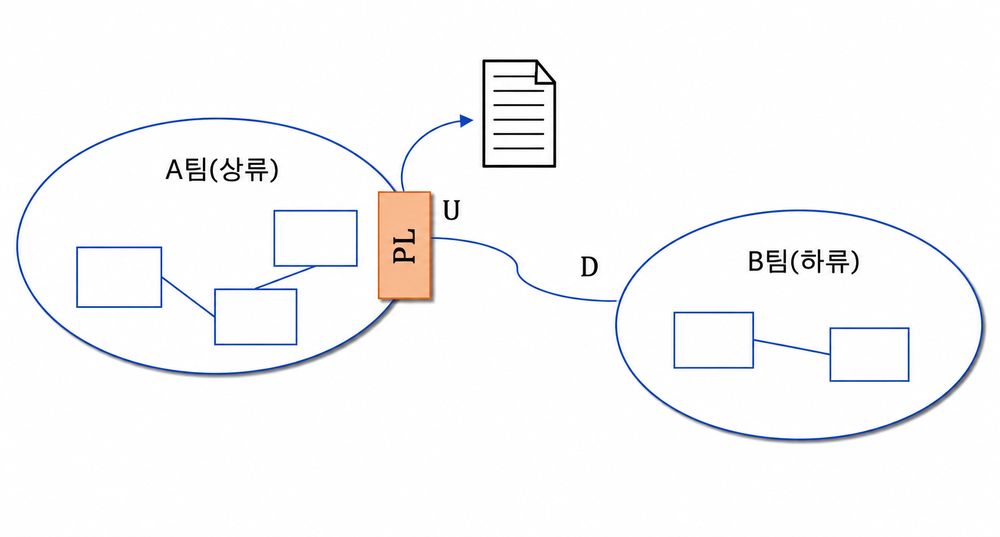

- 하류 컨텍스트가 상류 컨텍스트의 기능을 사용할 수 있도록 돕는, 번역이 용이한 **문서화된 정보 교환 언어**다.
- 주로 **XML이나 JSON 스키마(Schema)** 형태로 표현되며, 다수의 소비자와 효율적으로 소통하기 위해 보통 **공개 호스트 서비스(OHS)와 짝을 이뤄 사용**한다.

#### 컨텍스트 맵

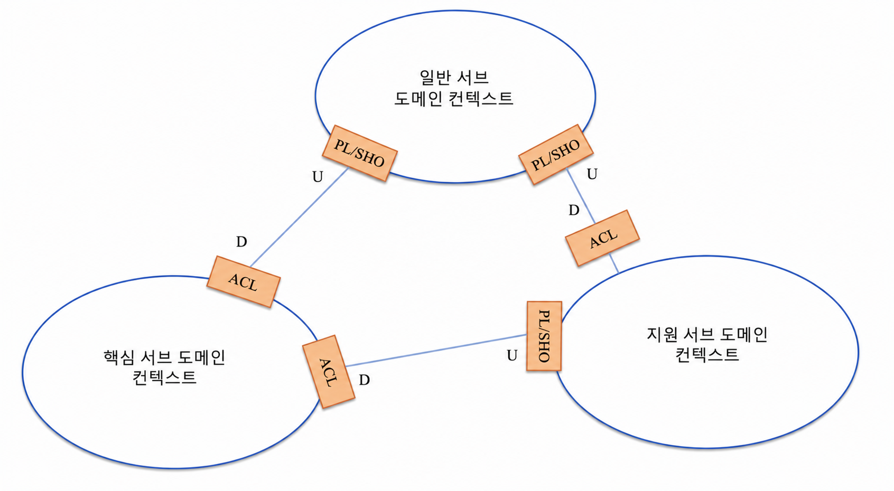

- 하나의 큰 도메인을 여러 개의 바운디드 컨텍스트로 식별하고, 이들 간의 연계 및 의존 관계를 유기적으로 표현한 다이어그램을 **컨텍스트 맵(Context Map)** 이라 한다.
- 앞서 다룬 다양한 컨텍스트 매핑 패턴(공유 커널, OHS, ACL 등)을 활용하여 시스템 전체의 지형도를 구체화할 수 있다.
- 기본적인 흐름 관점에서 핵심 서브도메인이 정상적으로 동작하기 위해 지원 서브도메인과 일반 서브도메인의 정보를 활용하고, 지원 서브도메인 역시 일반 서브도메인을 활용하는 구조를 띈다.
- 위 그림의 서브도메인 간의 관계를 요약하면 다음과 같다.
  - 일반 서브도메인은 핵심 및 지원 서브도메인과 **공급자/소비자(Customer-Supplier)** 관계를 맺는다.
  - 이때 일반 서브도메인은 **공개 호스트 서비스(OHS)** 인터페이스를 개방하고, 규격화된 **발행된 언어(PL)** 를 다른 컨텍스트에 제공하여 범용적인 접근을 지원한다.
  - 하류(Downstream)에 위치한 두 컨텍스트는 **충돌 방지 계층(ACL)** 을 구축함으로써 상류 모델의 변경에 영향을 받지 않고 고유의 도메인 모델을 안전하게 보호하며 번역해서 사용한다.
- 즉, 전략적 관점에서 핵심 서브도메인의 컨텍스트는 일반/지원 컨텍스트를 소비하고, 지원 서브도메인의 컨텍스트는 일반 서브도메인의 컨텍스트를 소비하는 구조적 계층이 형성된다.
- 매핑 구현 방안이 구체화되면 상류에서 하류 컨텍스트로 데이터를 전달하기 위한 물리적인 인터페이스 체계와 데이터 흐름을 명확히 정의할 수 있다.

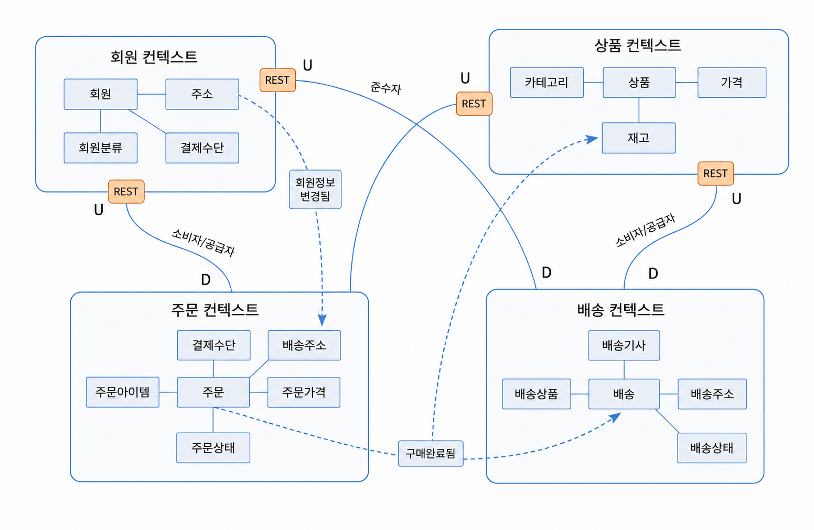

- 구체적인 예시로 **회원, 상품, 주문, 배송** 컨텍스트 간의 매핑 관계를 다음과 같이 정립할 수 있다.
  - **동기 통신**: 공급자(Upstream) 컨텍스트들은 표준화된 **HTTP/JSON 기반의 REST API(OHS)** 를 개방하여 하류 컨텍스트에 실시간 동기 통신 서비스를 제공한다.
  - **비동기 이벤트 통신**: 도메인의 상태 변화를 전파하기 위해 회원 컨텍스트는 주문 컨텍스트로, 주문 컨텍스트는 배송 컨텍스트로 각각 **비동기 도메인 이벤트 메시지**를 발행하여 시스템 간의 결합도를 느슨하게 유지한다.

## 4. 이벤트 스토밍을 통한 마이크로서비스 도출

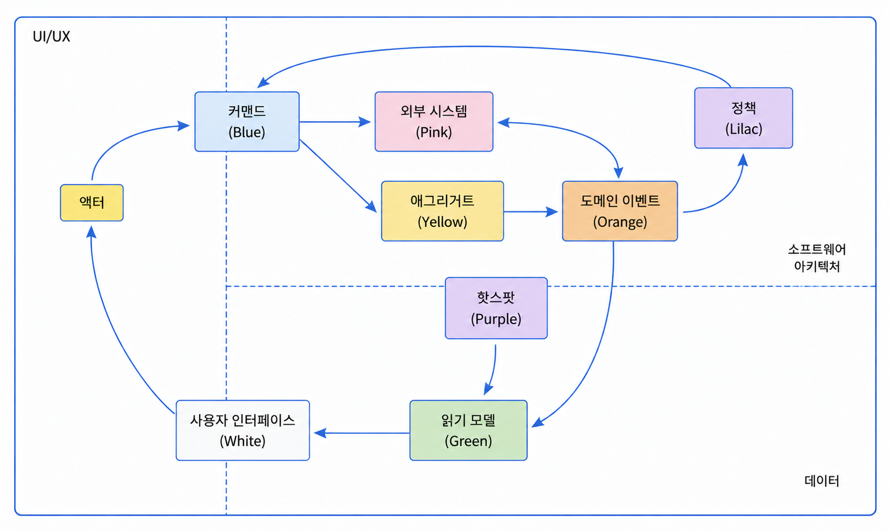

- 마이크로서비스 간의 의존성을 줄이기 위해서는 서비스 간 **비동기 메시지 기반의 도메인 이벤트**를 적극적으로 활용해야 한다.
- 그러나 도메인 이벤트를 명확히 식별하고, 이를 통해 서비스 간의 의존 관계를 올바르게 정립하는 것은 기존 설계 방식으로는 쉽지 않다.
- 이를 해결하기 위한 혁신적인 방법론이 바로 **이벤트 스토밍(Event Storming)** 이다.
- 이벤트 스토밍은 **도메인 이벤트(Domain Event)를 중심**으로 개발자, 아키텍트뿐만 아니라 도메인 전문가, 기획자 등 모든 이해관계자가 한자리에 모여 브레인스토밍하는 워크숍을 의미한다.
- 모든 이해관계자가 각자의 관점에서 비즈니스 흐름을 논의하고 오해를 바로잡는 과정을 거친다. 이는 요구사항 정의, 프로세스 모델링, 설계가 단절되어 장기간 진행되던 기존 방법론을 탈피하여 **압도적인 민첩성과 협업 효율성**을 보여준다.
- 포스트잇과 같은 쉽고 간편한 도구를 사용하여 빠른 시간 내에 도메인 지식을 공유 및 시각화하므로, 팀원 간의 **상호 학습과 도메인 탐색을 촉진**한다.
- 비즈니스 흐름 관점에서 시스템의 **액터(Actor)**는 원하는 목적을 달성하기 위해 시스템에 명령을 내리며, 시스템은 이에 반응하여 데이터를 생성하거나 상태를 변경한다. 처리된 결과 정보는 단순한 스케치 형태의 **UI 화면**을 통해 다시 액터에게 제공되며, 비즈니스는 이러한 상호작용의 반복으로 이루어진다.
- 이벤트 스토밍은 이처럼 복잡한 현실 세계의 도메인 흐름과 시스템 상호작용을 **정해진 색상의 스티커(포스트잇)** 를 활용하여 직관적인 모형으로 표현한다.
