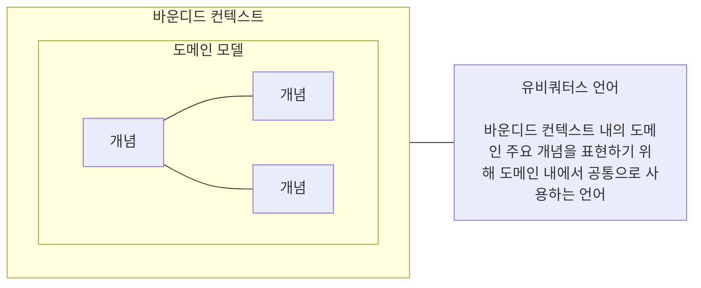
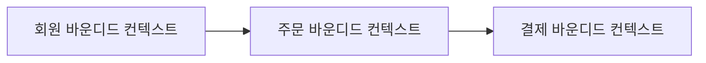

# 마이크로서비스 설계

- 소프트웨어 개발 역사에서 **모듈화**는 언제나 핵심적인 가치였다.
- 모듈화의 근본 목적은 각 모듈을 기능적으로 **응집성** 있게 만들고, 서로 다른 모듈 간의 **의존도(결합도)** 를 낮추는 것이다.
- 마이크로서비스 설계 역시 기능적으로 응집된 서비스를 도출하고, 서비스 간 의존도를 최소화하는 것에 집중한다.
- 마이크로서비스 내부 구조를 구성하는 요소들 또한 역할별로 철저히 모듈화되어야 한다.
- 즉, **역할이 분명하고 독립적인 모듈**들이 모여 하나의 서비스를 이루고, 이 서비스는 다시 다른 서비스와 **느슨하게 결합**되어야 한다.

## 1. 마이크로서비스를 도출하는 방법

- 마이크로서비스가 비즈니스 변화에 대응하며 독립적으로 변경 및 배포되려면, 타 서비스와 의존하지 않는 구조로 도출되어야 한다.

### 1.1. 비즈니스 능력에 근거한 도출

- 마이크로서비스를 식별하는 가장 쉬운 방법은 경험적인 원칙을 적용하는 것이다.
- 각 도메인은 이미 비즈니스가 규정하는 **업무 방식, 조직, 부서 체계**가 정의되어 있으며, 이러한 부서들은 업무 처리의 응집성이 높고 타 부서와의 의존도는 낮다.
- 이처럼 비즈니스 부서가 가진 역할 처리 능력을 체계적으로 분해하는 것을 **업무 기능 분해**라고 한다.
- 이 방식은 비즈니스 전체를 대략적으로 이해할 때는 유용하지만, 서비스 간의 상세 관계나 구체적인 관리 데이터를 식별하기에는 미흡하다.

### 1.2. DDD의 바운디드 컨텍스트(Bounded Context) 기반 도출

- 마이크로서비스는 각자 **독립된 저장소**를 보유하며, 다른 서비스의 데이터를 직접 참조해서는 안 된다.
- 이러한 데이터 독립성은 서비스를 독립적으로 수정 및 배포할 수 있게 만드는 강력한 장점이 된다.
- 따라서 마이크로서비스 도출 시 해당 서비스가 **소유권을 가진 데이터를 독립적으로 식별**하는 것이 무엇보다 중요하다.
- 서비스 내부 기능에 의해서만 접근 가능한 **캡슐화된 데이터**를 파악해야 한다.
- 기존 방식은 기능과 데이터를 분리하여 식별하는 경향이 있었으나, **DDD(도메인 주도 설계)** 는 하위 도메인마다 별도의 도메인 모델을 정의하여 이를 통합한다.
- **도메인 모델**은 각 업무에 특화된 **유비쿼터스 언어**로 정의되며, 해당 업무의 핵심 개념들로 구성된다.

## 2. DDD에서의 설계

- 마이크로서비스를 잘 설계하려면 **응집성 있는 단위로 서비스를 식별하는 것**이 중요하다.
- DDD에서는 비즈니스적으로 응집된 영역을 **바운디드 컨텍스트(Bounded Context)** 로 구분한다.
- 이 바운디드 컨텍스트는 **마이크로서비스를 나누는 좋은 기준**이 될 수 있다.
- 또한 DDD는
  - 전략적 설계를 통해 서비스 경계를 식별하고,
  - 전술적 설계를 통해 내부 객체 구조를 상세하게 설계한다.

## 3. DDD의 전략적 설계

### 3.1. 도메인과 서브도메인

- DDD는 하나의 거대한 도메인을 그대로 다루지 않고, **중요도와 역할에 따라 여러 영역으로 분리**한다.
- 복잡한 비즈니스 도메인을 논리적으로 나눈 하위 영역을 **서브도메인(Sub Domain)** 이라 한다.
- 이렇게 분리하면 문제 영역을 더 쉽게 이해하고 관리할 수 있다.
- 서브도메인은 중요도에 따라 세 가지로 나뉜다.
  - **핵심 서브도메인(Core Sub Domain)**
    - 비즈니스 경쟁력을 만드는 핵심 영역이다.
    - 가장 중요한 투자와 전략이 집중되는 영역이다.
  - **지원 서브도메인(Supporting Sub Domain)**
    - 핵심은 아니지만 비즈니스 운영에 반드시 필요한 영역이다.
    - 핵심 도메인을 지원하는 역할을 한다.
  - **일반 서브도메인(Generic Sub Domain)**
    - 비즈니스 차별성과는 거리가 멀다.
    - 기존 솔루션이나 패키지 제품으로 대체 가능한 영역이다.

### 3.2. 유비쿼터스 언어와 도메인 모델, 바운디드 컨텍스트

- 특정 도메인의 핵심 개념과 의도를 명확히 표현하기 위해 사용하는 공통 언어를 **유비쿼터스 언어(Ubiquitous Language)** 라 한다.
- 유비쿼터스 언어는 도메인 전문가와 개발자가 함께 사용하는 공통 개념 체계이다.
- 도메인 개념들이 서로 관계를 맺으며 형성된 모델을 **도메인 모델(Domain Model)** 이라 한다.
- **도메인 모델은 비즈니스 자체를 이해할 수 있게 만들어야 한다**.
- 여러 도메인 모델을 구성하다 보면 서로 다른 언어와 개념이 사용되는 경계가 생긴다.
- 이 경계를 **바운디드 컨텍스트(Bounded Context)** 라 한다.
- 보통 바운디드 컨텍스트는 하나의 독립된 모델과 언어 체계를 가진다.

### 3.3. 컨텍스트 매핑

- 바운디드 컨텍스트는 내부 응집도는 높고, 외부 의존성은 낮게 설계해야 한다.
- 하지만 실제 비즈니스에서는 여러 컨텍스트가 서로 협력해야 하는 경우가 많다.
- 이처럼 컨텍스트 간의 관계와 의존성을 정의한 것을 **컨텍스트 매핑(Context Mapping)** 이라 한다.
- 그리고 이러한 관계를 시각적으로 표현한 다이어그램을 **컨텍스트 맵(Context Map)** 이라 한다.
- 컨텍스트 맵을 설계할 때는 다양한 컨텍스트 매핑 패턴을 이해해야 한다.
- 아래는 주요 컨텍스트 매핑 관계다.

#### 공유 커널(Shared Kernel)

- 바운디드 컨텍스트 사이에 **공통적인 도메인 모델을 공유하는 관계**다.
- 두 개 이상의 팀이 작지만 공통의 도메인 모델을 상호 합의 하에 공유한다.
- **공통 라이브러리** 등이 여기에 해당하며, 공유 모델이 변경되면 연관된 모든 컨텍스트에 영향을 미친다. 따라서 공유 코드의 빌드 관리와 테스트를 전담하는 거버넌스가 필요하다.

#### 소비자와 공급자(Customer-Supplier)

- 공급하는 컨텍스트를 **상류(Upstream, U)**, 소비하는 컨텍스트를 **하류(Downstream, D)** 로 표시한다.
- 데이터와 영향도는 상류에서 하류로 흐른다. 상류에 변화가 생기면 하류 팀이 이를 따라야 하므로, 공급자는 소비자가 원하는 요구사항을 적절히 지원해야 한다.

#### 준수자(Conformist)

- 소비자와 공급자 관계와 유사하나, 상류 팀이 하류 팀의 요구를 지원하지 않거나 못하는 상황에서 사용한다.
- 하류 팀은 상류 팀의 비즈니스 모델을 변경할 수 없으므로, **상류에서 제공하는 도메인 모델을 그대로 준수**하여 사용한다.

#### 충돌 방지 계층(Anti-Corruption Layer: ACL)

- 하류 팀이 상류 팀의 도메인 모델에 오염되지 않도록, 하류 팀 고유의 모델을 지키기 위한 **번역 계층**을 두는 방식이다.
- 두 컨텍스트 사이의 모델 차이를 번역하여 하류 모델의 독립성을 유지한다. 즉, 상류 시스템을 수정하지 않고 하류 시스템과 통합하기 위한 **데이터 변환 메커니즘**을 구현한다.
- 주로 **레거시 시스템과 신규 시스템을 통합**할 때 신규 시스템의 도메인 모델을 보호하기 위해 사용한다.

#### 공개 호스트 서비스(Open Host Service: OHS)

- 바운디드 컨텍스트에 대한 접근을 제공하는 **공식 프로토콜이나 인터페이스를 정의**하는 방식이다.
- 다수의 하류 컨텍스트가 상류 컨텍스트의 기능을 쉽게 사용할 수 있도록 표준화된 접근 창구를 공개한다.
- 일반적으로 타 서비스에서 범용적으로 호출할 수 있도록 잘 정돈된 **공유 API(REST API 등)** 가 여기에 해당한다.

#### 발행된 언어(Published Language: PL)

- 하류 컨텍스트가 상류 컨텍스트의 기능을 사용할 수 있도록 돕는, 번역이 용이한 **문서화된 정보 교환 언어**다.
- 주로 **XML이나 JSON 스키마(Schema)** 형태로 표현되며, 다수의 소비자와 효율적으로 소통하기 위해 보통 **공개 호스트 서비스(OHS)와 짝을 이뤄 사용**한다.

#### 컨텍스트 맵

- 하나의 큰 도메인을 여러 개의 바운디드 컨텍스트로 식별하고, 이들 간의 연계 및 의존 관계를 유기적으로 표현한 다이어그램을 **컨텍스트 맵(Context Map)** 이라 한다.
- 앞서 다룬 다양한 컨텍스트 매핑 패턴(공유 커널, OHS, ACL 등)을 활용하여 시스템 전체의 지형도를 구체화할 수 있다.
- 기본적인 흐름 관점에서 핵심 서브도메인이 정상적으로 동작하기 위해 지원 서브도메인과 일반 서브도메인의 정보를 활용하고, 지원 서브도메인 역시 일반 서브도메인을 활용하는 구조를 띈다.
- 위 그림의 서브도메인 간의 관계를 요약하면 다음과 같다.
  - 일반 서브도메인은 핵심 및 지원 서브도메인과 **공급자/소비자(Customer-Supplier)** 관계를 맺는다.
  - 이때 일반 서브도메인은 **공개 호스트 서비스(OHS)** 인터페이스를 개방하고, 규격화된 **발행된 언어(PL)** 를 다른 컨텍스트에 제공하여 범용적인 접근을 지원한다.
  - 하류(Downstream)에 위치한 두 컨텍스트는 **충돌 방지 계층(ACL)** 을 구축함으로써 상류 모델의 변경에 영향을 받지 않고 고유의 도메인 모델을 안전하게 보호하며 번역해서 사용한다.
- 즉, 전략적 관점에서 핵심 서브도메인의 컨텍스트는 일반/지원 컨텍스트를 소비하고, 지원 서브도메인의 컨텍스트는 일반 서브도메인의 컨텍스트를 소비하는 구조적 계층이 형성된다.
- 매핑 구현 방안이 구체화되면 상류에서 하류 컨텍스트로 데이터를 전달하기 위한 물리적인 인터페이스 체계와 데이터 흐름을 명확히 정의할 수 있다.

- 구체적인 예시로 **회원, 상품, 주문, 배송** 컨텍스트 간의 매핑 관계를 다음과 같이 정립할 수 있다.
  - **동기 통신**: 공급자(Upstream) 컨텍스트들은 표준화된 **HTTP/JSON 기반의 REST API(OHS)** 를 개방하여 하류 컨텍스트에 실시간 동기 통신 서비스를 제공한다.
  - **비동기 이벤트 통신**: 도메인의 상태 변화를 전파하기 위해 회원 컨텍스트는 주문 컨텍스트로, 주문 컨텍스트는 배송 컨텍스트로 각각 **비동기 도메인 이벤트 메시지**를 발행하여 시스템 간의 결합도를 느슨하게 유지한다.

## 4. 이벤트 스토밍을 통한 마이크로서비스 도출

- 마이크로서비스 간의 의존성을 줄이기 위해서는 서비스 간 **비동기 메시지 기반의 도메인 이벤트**를 적극적으로 활용해야 한다.
- 그러나 도메인 이벤트를 명확히 식별하고, 이를 통해 서비스 간의 의존 관계를 올바르게 정립하는 것은 기존 설계 방식으로는 쉽지 않다.
- 이를 해결하기 위한 혁신적인 방법론이 바로 **이벤트 스토밍(Event Storming)** 이다.
- 이벤트 스토밍은 **도메인 이벤트(Domain Event)를 중심**으로 개발자, 아키텍트뿐만 아니라 도메인 전문가, 기획자 등 모든 이해관계자가 한자리에 모여 브레인스토밍하는 워크숍을 의미한다.
- 모든 이해관계자가 각자의 관점에서 비즈니스 흐름을 논의하고 오해를 바로잡는 과정을 거친다. 이는 요구사항 정의, 프로세스 모델링, 설계가 단절되어 장기간 진행되던 기존 방법론을 탈피하여 **압도적인 민첩성과 협업 효율성**을 보여준다.
- 포스트잇과 같은 쉽고 간편한 도구를 사용하여 빠른 시간 내에 도메인 지식을 공유 및 시각화하므로, 팀원 간의 **상호 학습과 도메인 탐색을 촉진**한다.
- 비즈니스 흐름 관점에서 시스템의 **액터(Actor)**는 원하는 목적을 달성하기 위해 시스템에 명령을 내리며, 시스템은 이에 반응하여 데이터를 생성하거나 상태를 변경한다. 처리된 결과 정보는 단순한 스케치 형태의 **UI 화면**을 통해 다시 액터에게 제공되며, 비즈니스는 이러한 상호작용의 반복으로 이루어진다.
- 이벤트 스토밍은 이처럼 복잡한 현실 세계의 도메인 흐름과 시스템 상호작용을 **정해진 색상의 스티커(포스트잇)** 를 활용하여 직관적인 모형으로 표현한다.

### 4.1. 이벤트 스토밍 순서

#### 1. 도메인 이벤트(Domain Event) 찾기

- 시간의 흐름에 따라 발생하는 시스템의 유의미한 상태 변경(사건)을 도출한다.
- 데이터 구조가 아닌 **비즈니스 흐름 자체에 초점**을 맞추는 것이 핵심이다.

#### 2. 외부 시스템/외부 프로세스 찾기

- 레거시 시스템이나 외부 플랫폼과의 연계를 통해 업무가 진행되는 경우를 식별한다.
- 이벤트 우측 상단에 외부 시스템 명칭을 배치하고 호출 관계를 화살표로 명시한다.

#### 3. 커맨드(Command) 찾기

- 도메인 이벤트를 발생시키는 원인이 되는 **사용자의 명령이나 시스템 요청**을 도출한다.
- 하나의 커맨드가 조건이나 상황에 따라 여러 개의 이벤트를 연속적 또는 선택적으로 발생시킬 수 있다.

#### 4. 핫스폿(Hotspot) 찾기

- 워크숍 진행 중 발생하는 의문점, 참여자 간 이견이 좁혀지지 않는 사항, 외부 부서의 확인이 필요한 문제 등 **당장 해결할 수 없는 병목 구간**을 시각화하여 기록한다.

#### 5. 액터(Actor) 찾기

- 커맨드를 실행하는 주체(사용자, 조직, 구체적인 역할자)를 도출한다.
- '회원', '관리자' 같은 추상적인 명칭 대신 **'구매자', '판매자', '상품 관리자' 등 비즈니스 맥락이 살아있는 구체적인 역할**을 정의한다.

#### 6. 애그리거트(Aggregate) 정의하기

- 커맨드와 도메인 이벤트가 영향을 주는 데이터 요소이자, 비즈니스 규칙과 데이터 일관성을 보장하는 **도메인의 핵심 실체 객체(엔티티 군집)** 를 정의한다.

#### 7. 바운디드 컨텍스트(Bounded Context) 정의하기

- 도출된 구성요소들을 종합하여 **비즈니스 목적에 따른 논리적 경계**를 설정한다.
- 컨텍스트의 명칭은 내부의 핵심 애그리거트 이름을 기반으로 대표성 있게 명명한다.
- 유사하거나 흩어져 있는 애그리거트와 관련 포스트잇을 한곳으로 모아, 기능을 제공할 책임들을 **애그리거트 중심으로 응집성 있게 모듈화**한다.

#### 8. 컨텍스트 매핑(Context Mapping)하기

- 식별된 바운디드 컨텍스트 간의 관계를 파악하고 의존성의 방향을 설정한다.
- 시스템 간의 연계 방식이 **실시간 동기 방식(REST API 등)인지, 이벤트 기반의 비동기 방식인지** 명확히 결정한다.
- 동기 방식의 연동은 꼭 필요한 경우에만 제한적으로 사용하며, 최근에는 시스템 안정성을 위해 **비동기 연동을 통해 결과적 일관성(데이터 정합성)을 맞추는 아키텍처**를 주로 채택한다.
- 비동기 연동 방식은 동기 방식에 비해 마이크로서비스가 철저한 **독립성**을 갖게 하고, 시스템 전체의 **높은 가용성**을 보장받을 수 있도록 돕는다.

## 5. 마이크로서비스 상세설계

### 5.1. 프론트엔드 모델링

- 웹과 모바일 기술이 발전함에 따라 사용자 경험(UX)에 민감하게 반응하는 UI 기술 및 개념이 등장했고, 이를 지원하는 다양한 프론트엔드 프레임워크가 탄생했다.
- 대표적인 프레임워크로 **앵귤러(Angular)**, **리액트(React)**, **뷰(Vue)** 등이 있으며, 모두 뛰어난 사용자 경험을 제공하는 **SPA(Single-Page Application)** 구조를 지원한다.
- 이는 프론트엔드에서 수행해야 할 역할과 비중이 점차 커지고 있음을 의미한다. 이에 따라 프론트엔드 영역의 모노리스 구조를 해체하기 위한 **마이크로 프론트엔드(Micro Frontends)** 같은 아키텍처 패턴이 등장하며 유연성을 높이고 있다.
- 프론트엔드 상세설계 관점에서 팀이 기민하게 움직이기 위해 준비해야 할 최소한의 핵심 설계 영역은 다음과 같다.

#### 프론트엔드 아키텍처 정의

- **채널 및 UI 지향점 수립**: 모바일과 웹 채널을 모두 고려하여, 모든 매체에서 사용자 경험에 민감하게 반응하는 **반응형 UI**를 지향한다. 최근 추세는 컴포넌트 기반의 재사용 구조 및 마이크로 프론트엔드 패턴 적용이 유리한 **리액트(React)와 뷰(Vue)** 를 주로 사용한다.
- **기술 검토 및 제약사항 확인**: 일부 B2C 환경에서 사용되는 RIA(Rich Internet Application) 기반의 전용 클라이언트 툴은 백엔드의 표준 **REST API 형식을 온전히 지원하지 못하는 경우**가 있으므로 사전 기술 검토가 필수적이다.
- **아키텍처 검증**: 프론트엔드 프레임워크가 결정되면 백엔드 API와 연계하는 **스파이크 솔루션(Spike Solution, 기술 검증을 위한 간단한 프로그램)** 을 수행하여 아키텍처가 사용자 요건을 충족하는지 검증한다.
- **패키지 오너십(Ownership) 정립**: 프론트엔드 프로그램의 패키지 구조를 정의할 때는 마이크로서비스 팀의 업무 책임을 고려해야 한다. 마이크로 프론트엔드 패턴을 통해 물리적으로 완전히 분리하거나, 모노리스 구조를 유지하더라도 **패키지별로 명확히 개발 오너십이 구분되도록 설계**한다.

#### 표준 화면 유형 정의

- 프론트엔드 프레임워크의 기술적 특성을 고려하여 **표준 화면 레이아웃**을 정의한다.
- 비즈니스 처리에 가장 많이 사용되는 **CUD/R(생성, 수정, 삭제 및 목록 조회)** 등의 대표 업무 화면 유형을 정립하고, 이에 맞는 사용자 경험을 검토한다.
- 표(Table), 그리드(Grid), 입출력 폼(Form), 표준 버튼 등 화면을 구성하는 컴포넌트들의 배치 방식, 크기, 동작 규칙 등을 표준화한다.
- 웹, 모바일 앱, 리포트 등 각 채널의 고유한 특성에 맞춘 화면 유형을 별도로 정의하여 대응한다.

#### UI 레이아웃 설계

- 정의된 표준 유형을 기반으로 개별 기능을 만족하는 **UI 레이아웃을 상세히 설계**한다. 화면에 노출되거나 입력받을 속성 정보를 식별하고, 기능을 수행할 컴포넌트와 버튼을 배치한다.
- 업무 흐름(Workflow)에 맞춰 화면이 유기적으로 전환되도록 흐름을 도출하며, 이를 누락 없이 설계한 결과물을 **UI 스토리보드(Storyboard)** 라고 한다.

#### UI 디자인 가이드 및 레이아웃 반영

- 표준 화면 유형에 부합하는 시각적 UI 디자인을 정의한다.
- 디자이너의 의도가 화면에 정확히 구현되기 위해서는 프론트엔드 엔지니어와의 긴밀한 협의가 필요하며, 마이크로서비스 팀 내에 디자이너가 독립적으로 속해 있을 때 협업 효율이 극대화된다.
- 프론트엔드 엔지니어는 디자인 시스템과 가이드를 기반으로 컴포넌트를 구현하고 화면 레이아웃에 반영한다.

#### 화면 이벤트 설계

- 사용자의 조작(클릭, 입력, 페이지 전환 등)에 따른 **화면 내부의 이벤트 변화를 정의**한다.
- 특정 이벤트가 발생했을 때 **백엔드 API를 호출하는 매커니즘(동기/비동기 처리, 상태 관리, 에러 핸들링 등)을 설계**하여 화면과 데이터의 정합성을 보장한다.

### 5.2. 백엔드 모델링

- 백엔드 마이크로서비스 설계는 **헥사고날 아키텍처(Hexagonal Architecture)** 를 적용하여 비즈니스 중심의 내부 영역과 기술 중심의 외부 영역으로 구분하여 진행한다.
- **이벤트 스토밍(Event Storming)** 결과물은 다음과 같이 헥사고날 아키텍처의 구성요소로 자연스럽게 매핑된다.
  - **커맨드(Command)** ➡️ 인바운드 어댑터의 핵심인 **REST API**
  - **애그리거트(Aggregate)** ➡️ 내부 영역의 중심인 **도메인 모델(Domain Model)**
  - **도메인 이벤트(Domain Event)** ➡️ 아웃바운드 메시지 처리 어댑터의 **발행 대상**
  - **외부 시스템(External System)** ➡️ 아웃바운드 어댑터가 호출할 **외부 연계 시스템**
- 이벤트 스토밍 매핑은 백엔드 모델링의 시작점일 뿐이므로, 실제 구현을 위해서는 외부 영역 설계를 위한 **API 설계**와 내부 영역 설계를 위한 **도메인 모델링 및 데이터 모델링**으로 구체화해야 한다.

#### API 설계

- 마이크로서비스 팀은 프론트엔드와 백엔드의 구현을 모두 책임지므로, 두 영역의 개발자가 긴밀하게 협업하기 위한 계약서인 **API 설계**가 선행되어야 한다.
- API 영역은 헥사고날 아키텍처의 외부 영역(인바운드 어댑터)에 속하며, 현재는 HTTP 프로토콜과 JSON 포맷을 사용하는 **REST API**가 업계 표준으로 자리 잡았다.

#### REST API의 핵심 개념

- REST(Representational State Transfer)는 HTTP 프로토콜의 장점을 극대화하는 아키텍처 스타일로, **자원(Resource), 행위(Verb), 표현(Representations)** 의 세 가지 요소로 구성된다.
- **자원(Resource)**: API가 다루는 주체로, **명사 형태의 URI**로 표현하며 특정 항목은 ID를 붙여 식별한다. (예: `/users`, `/users/01`)
- **행위(Verb)**: 자원에 대한 조작으로, **HTTP 메서드**를 활용해 표현한다.
- **표현(Representations)**: 주고받는 데이터의 형태로, 직관적이고 다루기 쉬운 **JSON 포맷**을 주로 사용한다.

| 기능          | HTTP 메서드 | 리소스 URI  | 데이터 표현 (JSON)           |
| :------------ | :---------- | :---------- | :--------------------------- |
| **전체 조회** | `GET`       | `/users`    | 회원 목록 전체 반환          |
| **개별 조회** | `GET`       | `/users/01` | ID가 01인 회원 정보 반환     |
| **자원 추가** | `POST`      | `/users`    | 요청 바디에 생성할 정보 전달 |
| **자원 수정** | `PUT`       | `/users/01` | 요청 바디에 수정할 정보 전달 |
| **자원 삭제** | `DELETE`    | `/users/01` | 특정 자원 삭제 처리          |

#### 리처드슨 REST 성숙도 모델 (Richardson Maturity Model)

- 마틴 파울러(Martin Fowler)가 제시한 REST API의 성숙도 단계로, 시스템이 REST 원칙을 얼마나 잘 따르고 있는지 평정하는 기준이다.
- **레벨 0 (HTTP 사용)**: REST 원칙을 전혀 사용하지 않고, HTTP 프로토콜만을 단일 엔드포인트로 활용하는 전통적인 **원격 프로시저 호출(RPC) 방식**이다. (예: `/ProductService?Flag=create`)
- **레벨 1 (자원 분리)**: 서비스의 모든 기능을 하나의 엔드포인트로 처리하지 않고, **URI에 개별적인 자원(Resource)을 명사로 표현**하여 특정한다. (예: `/products/apple`)
- **레벨 2 (HTTP 메서드 준수)**: 자원의 행위를 처리할 때 약속된 **HTTP 메서드(GET, POST, PUT, DELETE)를 격식에 맞게 사용**한다. API 사용자에게 직관적인 행위 예측 가능성을 제공한다.
- **레벨 3 (HATEOAS 도입)**: **HATEOAS(Hypertext As The Engine Of Application State)**를 적용한다. 응답 값에 요청한 데이터뿐만 아니라, 클라이언트가 그 다음에 탐색할 수 있는 **연관 링크(URI) 정보를 함께 포함**하여 반환하는 가장 성숙한 단계다.

#### API 문서화 가이드

- 애자일 모델링의 기조에 따라 불필요하고 방대한 설계 산출물을 남기는 것은 지양해야 하나, **API 설계서는 프론트엔드와 백엔드 간의 협업을 위한 필수 산출물**이다.
- 개발 초기 단계에 위키(Wiki)나 공유 시스템을 활용해 문서화하거나 가벼운 엑셀 형태로 관리할 수 있으며, 최소한 다음 항목들은 반드시 포함해야 한다.
  - **기본 정보**: 서비스 명, API 명, 리소스 주소(URI 및 HTTP 메서드)
  - **매개변수**: Request 및 Response 파라미터 명세
  - **샘플 데이터**: 실제 요청(Request)과 응답(Response)의 JSON 데이터 샘플

## 6. 도메인 모델링

### 6.1. DDD의 전술적 설계(도메인 모델링 구성 요소)

#### 엔티티(Entity)

- 다른 객체와 고유하게 구별할 수 있는 **식별자(Identity)를 가진 도메인의 실체 개념을 표현하는 객체**다.
- 시스템이 구동되는 동안 식별자는 결코 변하지 않지만, 엔티티가 가진 내부 속성과 상태는 비즈니스 흐름에 따라 계속해서 변할 수 있다.
- 도메인 내에서 명확한 개별성과 생명주기를 가진 개념들을 엔티티로 식별하며, 이러한 **고유 식별자의 존재 여부와 상태 변경 가능성**이 값 객체와 구분되는 핵심 차이점이다.

#### 값 객체(Value Object, VO)

- 각 속성이 개별적으로 변화하지 않는 **개념적 완전성(Conceptual Whole)을 표현하는 객체**다.
- 값 객체는 내부에 포함된 모든 속성의 합에 의해 전체 개념이 부여된다. 따라서 일부 속성만 별개로 수정할 수 없으며, 고유한 값을 나타내기 위해 **객체 전체가 한 번에 생성되거나 완전히 대체**되어야 한다.
- 엔티티처럼 식별자의 유무로 존재를 구별하지 않고, 객체가 가진 **모든 속성값들을 상호 비교(Equality)하여 동일성을 결정**한다.
- 값 객체의 주요 특징은 다음과 같다.
  - 도메인 내에서 대상의 상태를 측정하거나 수량화하고, 성격을 설명하는 용도로 쓰인다.
  - 연관된 특징들을 하나로 모아 분리할 수 없는 필수 단위로 모델링한다.
  - 측정값이나 설명이 변경될 때는 기존 객체의 속성을 수정하는 것이 아니라, 새로운 객체로 **완벽히 대체**해야 한다.
  - 모든 속성값이 같으면 두 객체는 동등한 것으로 판정하는 등가성 비교를 지원한다.
  - 부수 효과(Side Effect)를 방지하기 위해, 일단 생성되면 내부 상태를 절대 변경할 수 없는 **불변성(Immutability)**을 가진다.
