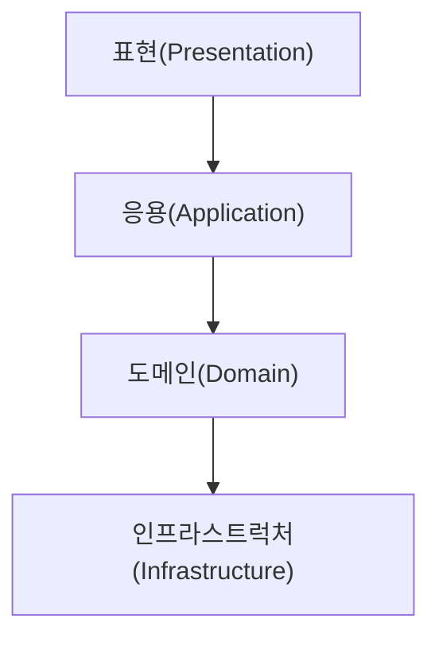

# 아키텍처 개요

## 1. 네 개의 영역

- **표현, 응용, 도메인, 인프라스트럭처**는 아키텍처를 설계할 때 나타나는 대표적인 **네 가지 영역**이다.
- **표현 영역**은 사용자의 요청을 받아 응용 영역에 전달하고, 응용 영역의 처리 결과를 다시 사용자에게 보여주는 역할을 한다.
- 웹 애플리케이션에서 표현 영역의 사용자는 웹 브라우저이거나 REST API를 호출하는 외부 시스템일 수 있다.
- **응용 영역**은 시스템이 사용자에게 제공해야 할 **기능을 구현**한다.
- 응용 영역은 기능을 구현하기 위해 **도메인 영역**의 **도메인 모델**을 사용한다.
- **도메인 영역**은 **도메인 모델**을 구현하는 곳으로, 도메인의 **핵심 로직**이 여기에 포함된다.
- **인프라스트럭처 영역**은 **구현 기술**에 대한 것을 다룬다.
- RDBMS 연동을 처리하고 메시징 큐에 메시지를 전송하거나 수신하는 기능은 인프라스트럭처 영역에서 구현된다.
- 인프라스트럭처 영역은 논리적인 개념보다는 **실제 구현**을 다룬다.
- 도메인, 응용, 표현 영역은 구현 기술을 사용한 코드를 직접 만들지 않는다.
- 대신 **인프라스트럭처 영역에서 제공하는 기능**을 사용해서 필요한 기능을 개발한다.

## 2. 계층 구조 아키텍처

- 표현 계층과 응용 계층이 도메인 계층을 사용하고, 도메인 계층이 다시 인프라스트럭처 계층을 사용하는 구조는 **계층형으로 구성하기에 적합하다**.
- 다만, 도메인의 복잡도에 따라 **응용 계층과 도메인 계층을 하나의 계층으로 합치기도 한다**.
- 이 구조의 핵심 규칙은 **상위 계층에서 하위 계층으로만 의존 관계가 존재**한다는 것이다.
- 하지만 이런 단순한 구조에서는 **표현, 응용, 도메인 계층이 구현 기술을 다루는 인프라스트럭처 계층에 직접 의존**하게 된다.
- 그 결과 **테스트가 어렵고 기능 확장이 힘들어지는 문제**가 발생할 수 있다.

## 3. DIP (의존 역전 원칙)

- **고수준 모듈**은 의미 있는 단일 기능을 제공하며, **저수준 모듈**은 이 고수준 모듈의 하위 기능을 실제로 구현한 것이다.
- 일반적으로 고수준 모듈이 제대로 동작하려면 저수준 모듈을 사용해야 한다.
- 하지만 고수준 모듈이 저수준 모듈에 직접 의존하면, **구현을 변경하거나 테스트하기 어려워지는 문제**가 발생한다.
- **DIP(Dependency Inversion Principle)**는 이 문제를 해결하기 위해, 저수준 모듈이 고수준 모듈에서 추상화한 인터페이스에 의존하도록 **의존 관계를 역전**시킨다.
- DIP를 적용하면 인프라스트럭처 계층에 직접 의존할 때 발생했던 문제들을 효과적으로 해결할 수 있다.
- 하지만 **항상 DIP를 적용할 필요는 없다**. 때로는 구현 기술에 의존적인 코드를 도메인에 일부 포함하는 것이 더 효율적일 수 있으므로, DIP의 이점을 얻는 수준에서 적용 범위를 신중하게 검토해야 한다.

### 3.1. DIP 주의 사항

- DIP를 단순히 인터페이스와 구현 클래스를 분리하는 것으로 오해하면 안 된다.
- DIP의 핵심은 **고수준 모듈이 저수준 모듈에 의존하지 않게 하는 것**이다. 이를 잘못 이해하고 저수준 모듈에서 인터페이스를 추출하는 것은 올바른 접근이 아니다.
- 올바른 DIP를 적용하려면, **인터페이스는 저수준 모듈이 아닌 고수준 모듈의 관점에서 도출**해야 하며, **인터페이스 자체도 고수준 모듈에 위치**해야 한다.

### 3.2. DIP와 아키텍처

- 아키텍처에서 **응용 영역과 도메인 영역은 고수준 모듈**, **인프라스트럭처 영역은 저수준 모듈**에 해당한다.
- 기존 계층형 구조와 달리 아키텍처에 DIP를 적용하면, **저수준 모듈인 인프라스트럭처가 고수준 모듈인 응용 및 도메인 영역에 의존하는 구조**가 된다.
- 결과적으로 인프라스트럭처의 클래스가 도메인이나 응용 영역에 정의된 인터페이스를 구현하는 구조가 된다.
- 이를 통해 **상위 계층에 영향을 주지 않으면서 구현 기술을 유연하게 변경**하는 것이 가능해진다.
