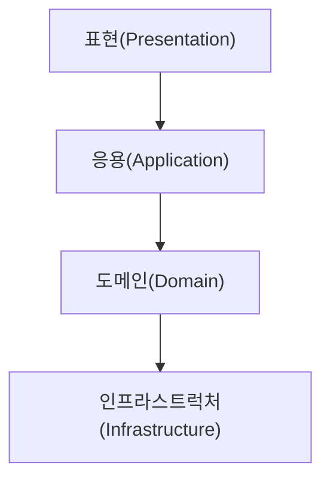

# 아키텍처 개요

## 1. 네 개의 영역

- **표현, 응용, 도메인, 인프라스트럭처**는 아키텍처를 설계할 때 나타나는 대표적인 **네 가지 영역**이다.
- **표현 영역**은 사용자의 요청을 받아 응용 영역에 전달하고, 응용 영역의 처리 결과를 다시 사용자에게 보여주는 역할을 한다.
- 웹 애플리케이션에서 표현 영역의 사용자는 웹 브라우저이거나 REST API를 호출하는 외부 시스템일 수 있다.
- **응용 영역**은 시스템이 사용자에게 제공해야 할 **기능을 구현**한다.
- 응용 영역은 기능을 구현하기 위해 **도메인 영역**의 **도메인 모델**을 사용한다.
- **도메인 영역**은 **도메인 모델**을 구현하는 곳으로, 도메인의 **핵심 로직**이 여기에 포함된다.
- **인프라스트럭처 영역**은 **구현 기술**에 대한 것을 다룬다.
- RDBMS 연동을 처리하고 메시징 큐에 메시지를 전송하거나 수신하는 기능은 인프라스트럭처 영역에서 구현된다.
- 인프라스트럭처 영역은 논리적인 개념보다는 **실제 구현**을 다룬다.
- 도메인, 응용, 표현 영역은 구현 기술을 사용한 코드를 직접 만들지 않는다.
- 대신 **인프라스트럭처 영역에서 제공하는 기능**을 사용해서 필요한 기능을 개발한다.

## 2. 계층 구조 아키텍처

- 표현 계층과 응용 계층이 도메인 계층을 사용하고, 도메인 계층이 다시 인프라스트럭처 계층을 사용하는 구조는 **계층형으로 구성하기에 적합하다**.
- 다만, 도메인의 복잡도에 따라 **응용 계층과 도메인 계층을 하나의 계층으로 합치기도 한다**.
- 이 구조의 핵심 규칙은 **상위 계층에서 하위 계층으로만 의존 관계가 존재**한다는 것이다.
- 하지만 이런 단순한 구조에서는 **표현, 응용, 도메인 계층이 구현 기술을 다루는 인프라스트럭처 계층에 직접 의존**하게 된다.
- 그 결과 **테스트가 어렵고 기능 확장이 힘들어지는 문제**가 발생할 수 있다.
