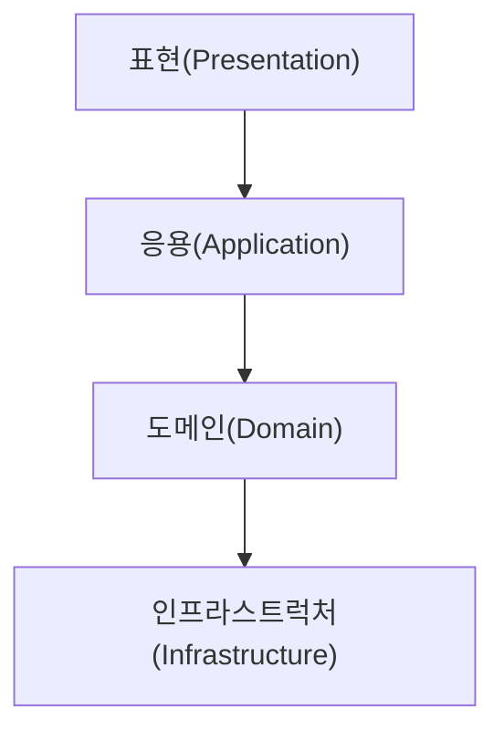

# 아키텍처 개요

## 1. 네 개의 영역

- **표현, 응용, 도메인, 인프라스트럭처**는 아키텍처를 설계할 때 나타나는 대표적인 **네 가지 영역**이다.
- **표현 영역**은 사용자의 요청을 받아 응용 영역에 전달하고, 응용 영역의 처리 결과를 다시 사용자에게 보여주는 역할을 한다.
- 웹 애플리케이션에서 표현 영역의 사용자는 웹 브라우저이거나 REST API를 호출하는 외부 시스템일 수 있다.
- **응용 영역**은 시스템이 사용자에게 제공해야 할 **기능을 구현**한다.
- 응용 영역은 기능을 구현하기 위해 **도메인 영역**의 **도메인 모델**을 사용한다.
- **도메인 영역**은 **도메인 모델**을 구현하는 곳으로, 도메인의 **핵심 로직**이 여기에 포함된다.
- **인프라스트럭처 영역**은 **구현 기술**에 대한 것을 다룬다.
- RDBMS 연동을 처리하고 메시징 큐에 메시지를 전송하거나 수신하는 기능은 인프라스트럭처 영역에서 구현된다.
- 인프라스트럭처 영역은 논리적인 개념보다는 **실제 구현**을 다룬다.
- 도메인, 응용, 표현 영역은 구현 기술을 사용한 코드를 직접 만들지 않는다.
- 대신 **인프라스트럭처 영역에서 제공하는 기능**을 사용해서 필요한 기능을 개발한다.

## 2. 계층 구조 아키텍처

- 표현 계층과 응용 계층이 도메인 계층을 사용하고, 도메인 계층이 다시 인프라스트럭처 계층을 사용하는 구조는 **계층형으로 구성하기에 적합하다**.
- 다만, 도메인의 복잡도에 따라 **응용 계층과 도메인 계층을 하나의 계층으로 합치기도 한다**.
- 이 구조의 핵심 규칙은 **상위 계층에서 하위 계층으로만 의존 관계가 존재**한다는 것이다.
- 하지만 이런 단순한 구조에서는 **표현, 응용, 도메인 계층이 구현 기술을 다루는 인프라스트럭처 계층에 직접 의존**하게 된다.
- 그 결과 **테스트가 어렵고 기능 확장이 힘들어지는 문제**가 발생할 수 있다.

## 3. DIP (의존 역전 원칙)

- **고수준 모듈**은 의미 있는 단일 기능을 제공하며, **저수준 모듈**은 이 고수준 모듈의 하위 기능을 실제로 구현한 것이다.
- 일반적으로 고수준 모듈이 제대로 동작하려면 저수준 모듈을 사용해야 한다.
- 하지만 고수준 모듈이 저수준 모듈에 직접 의존하면, **구현을 변경하거나 테스트하기 어려워지는 문제**가 발생한다.
- **DIP(Dependency Inversion Principle)**는 이 문제를 해결하기 위해, 저수준 모듈이 고수준 모듈에서 추상화한 인터페이스에 의존하도록 **의존 관계를 역전**시킨다.
- DIP를 적용하면 인프라스트럭처 계층에 직접 의존할 때 발생했던 문제들을 효과적으로 해결할 수 있다.
- 하지만 **항상 DIP를 적용할 필요는 없다**. 때로는 구현 기술에 의존적인 코드를 도메인에 일부 포함하는 것이 더 효율적일 수 있으므로, DIP의 이점을 얻는 수준에서 적용 범위를 신중하게 검토해야 한다.

### 3.1. DIP 주의 사항

- DIP를 단순히 인터페이스와 구현 클래스를 분리하는 것으로 오해하면 안 된다.
- DIP의 핵심은 **고수준 모듈이 저수준 모듈에 의존하지 않게 하는 것**이다. 이를 잘못 이해하고 저수준 모듈에서 인터페이스를 추출하는 것은 올바른 접근이 아니다.
- 올바른 DIP를 적용하려면, **인터페이스는 저수준 모듈이 아닌 고수준 모듈의 관점에서 도출**해야 하며, **인터페이스 자체도 고수준 모듈에 위치**해야 한다.

### 3.2. DIP와 아키텍처

- 아키텍처에서 **응용 영역과 도메인 영역은 고수준 모듈**, **인프라스트럭처 영역은 저수준 모듈**에 해당한다.
- 기존 계층형 구조와 달리 아키텍처에 DIP를 적용하면, **저수준 모듈인 인프라스트럭처가 고수준 모듈인 응용 및 도메인 영역에 의존하는 구조**가 된다.
- 결과적으로 인프라스트럭처의 클래스가 도메인이나 응용 영역에 정의된 인터페이스를 구현하는 구조가 된다.
- 이를 통해 **상위 계층에 영향을 주지 않으면서 구현 기술을 유연하게 변경**하는 것이 가능해진다.

## 4. 도메인 영역의 주요 구성요소

- 도메인 영역은 도메인의 **핵심 모델을 구현하는 부분**이다.
- 이 모델은 도메인의 주요 개념을 표현하고 핵심적인 비즈니스 로직을 포함하며, 주로 아래와 같은 요소로 구성된다.

| 구성요소                           | 설명                                                                                                                              |
| ---------------------------------- | --------------------------------------------------------------------------------------------------------------------------------- |
| **엔티티 (Entity)**                | **고유한 식별자**를 갖는 객체로, 자신만의 라이프사이클을 가진다. 도메인 모델의 데이터를 포함하며 관련 기능을 함께 제공한다.       |
| **밸류 (Value)**                   | **고유한 식별자가 없는** 객체로, 개념적인 값을 표현할 때 사용된다. 주로 엔티티나 다른 밸류 객체의 속성으로 사용될 수 있다.        |
| **애그리거트 (Aggregate)**         | 연관된 **엔티티와 밸류 객체를 개념적으로 하나로 묶은 것**이다. 일관성과 트랜잭션 관리의 단위가 된다.                              |
| **리포지터리 (Repository)**        | 도메인 모델의 **영속성(Persistence)을 처리**하는 역할이다. 즉, 애그리거트 단위로 도메인 객체를 저장하고 조회하는 기능을 제공한다. |
| **도메인 서비스 (Domain Service)** | 하나의 엔티티에 포함시키기 어려운, **여러 엔티티나 밸류가 필요한 도메인 로직**을 구현하는 역할이다.                               |

### 4.1. 엔티티와 밸류

- 도메인 모델의 엔티티와 DB 관계형 모델의 엔티티는 **같은 것이 아니다**.
- 가장 큰 차이점은, 도메인 모델의 엔티티는 **데이터와 함께 도메인 기능까지 제공**한다는 점이다.
- 즉, 도메인 모델의 엔티티는 단순한 데이터 구조가 아니라, **관련 기능을 함께 제공하는 객체**이다. 이처럼 기능을 캡슐화함으로써 **데이터가 임의로 변경되는 것을 방지**한다.
- 또 다른 차이점으로, 도메인 모델은 여러 데이터를 **개념적으로 하나로 묶어 밸류(Value) 타입으로 표현**할 수 있지만, 관계형 데이터베이스는 이러한 밸류 타입을 온전히 표현하기 어렵다.
- 밸류 타입은 **불변(Immutable)으로 구현하는 것을 권장한다**. 따라서 엔티티에 포함된 밸류 타입 데이터를 변경할 때는, 기존 객체를 수정하는 것이 아니라 **새로운 밸류 객체로 완전히 교체**해야 한다.

### 4.2. 애그리거트

- 도메인 모델이 커지고 엔티티와 밸류 객체가 많아질수록 모델은 점점 더 복잡해진다. 이때 개별 객체에만 집중하다 보면, **전체 구조를 보지 못하고 큰 틀에서 모델을 관리하기 어려운 상황**에 빠질 수 있다.
- 이러한 복잡성을 관리하기 위해 상위 수준의 모델이 필요한데, 이것이 바로 **애그리거트(Aggregate)** 이다. 애그리거트는 관련된 엔티티와 밸류 객체를 **하나의 군집으로 묶은 것**이다.
- 애그리거트는 자신에 속한 객체들을 관리하는 **루트 엔티티(Root Entity)** 를 갖는다.
- 애그리거트를 사용하는 코드는 **루트 엔티티가 제공하는 기능만을 실행**하며, 이를 통해 애그리거트 내부의 다른 객체들에는 간접적으로만 접근할 수 있다.
- 이러한 방식은 애그리거트의 **내부 구현을 숨겨서, 애그리거트 단위로 캡슐화를 강화**하는 데 도움을 준다.
- 애그리거트를 어떻게 구성하느냐에 따라 **구현의 복잡도나 트랜잭션의 범위가 달라질 수 있으며**, 사용하는 구현 기술이 애그리거트 구현 방식에 영향을 주기도 한다.

### 4.3. 리포지터리

- 도메인 객체를 파일, RDBMS, NoSQL 등 물리적인 저장소에 보관하여 **영속성(Persistence)을 부여하는 역할**을 하는 것이 **리포지터리(Repository)** 이다.
- 리포지터리는 단순히 데이터를 저장하는 것을 넘어, **애그리거트 단위로 도메인 객체를 저장하고 조회하는 기능을 정의**한다.
- 도메인 모델 관점에서 리포지터리는 영속화 기능을 추상화한 **인터페이스**이다. 따라서 **고수준 모듈인 도메인 영역에 속한다**.
- 반면, 실제 데이터베이스 연동을 처리하는 리포지터리의 **구현체**는 저수준 모듈로 **인프라스트럭처 영역**에 위치한다.
- **응용 서비스**는 리포지터리의 주된 사용자이다. 응용 서비스는 의존성 주입(DI) 등을 통해 리포지터리 구현체에 접근하며, **필요한 도메인 객체를 가져오거나 저장**하는 데 사용한다.
- 또한 응용 서비스는 트랜잭션을 관리하는데, 이 **트랜잭션 처리는 리포지터리의 실제 구현 기술에 영향**을 받기 때문에 둘은 밀접한 연관을 가진다.
- 따라서 리포지터리 인터페이스는 응용 서비스가 필요로 하는 메서드들을 제공하며, 주로 다음과 같은 메서드를 포함한다.
  - 애그리거트를 저장하는 메서드 (`save`)
  - 애그리거트 식별자로 조회하는 메서드 (`findById`)
  - 필요에 따른 기타 메서드 (`delete`, `count` 등)

## 5. 요청 처리 흐름

- 사용자 입장에서 소프트웨어는 다양한 **기능을 제공하는 시스템**이다. 특정 기능이 실행되는 과정은 일반적으로 다음과 같은 흐름을 가진다.
- **1. 표현(Presentation) 영역**은 사용자의 요청을 가장 먼저 받는다. 이 계층은 사용자가 전송한 데이터의 형식이 올바른지 검사하고, 데이터를 응용 서비스가 처리할 수 있는 형식으로 변환하여 전달하는 역할을 한다.
- **2. 응용(Application) 서비스**는 도메인 모델을 사용하여 실질적인 기능을 구현한다. 리포지터리에서 도메인 객체를 가져와 실행하거나, 새로운 도메인 객체를 생성하여 리포지터리에 저장하는 방식으로 동작한다.
- 응용 서비스가 도메인의 상태를 변경하는 경우, **변경 사항이 물리 저장소에 올바르게 반영되도록 트랜잭션을 관리**할 책임을 진다.

## 6. 인프라스트럭처 개요

- **인프라스트럭처(Infrastructure)**는 표현, 응용, 도메인 영역을 지원하는 계층이다. 도메인 객체의 영속성 처리, 트랜잭션 관리, 이메일 발송 등 **다른 영역에서 필요로 하는 프레임워크나 외부 기술을 지원**하는 역할을 한다.
- 도메인이나 응용 영역에서 인프라스트럭처의 기능을 직접 사용하기보다는, **상위 계층에 정의된 인터페이스를 인프라스트럭처에서 구현**하는 것이 시스템을 더 유연하고 테스트하기 쉽게 만들어준다.
- 하지만 **반드시 모든 의존을 없앨 필요는 없다**. 때로는 구현의 편리함을 위해 약간의 의존을 허용하는 것이 더 효율적일 수 있다. 예를 들어, 스프링 프레임워크에서 제공하는 `@Transactional` 애너테이션을 응용 서비스에서 사용하는 것이 편리하다.
- **구현의 편리함** 또한 중요한 가치이므로, **DIP가 주는 장점(유연성, 테스트 용이성)을 크게 해치지 않는 범위** 내에서 응용 및 도메인 영역이 특정 구현 기술에 의존하는 것은 충분히 고려해볼 수 있는 선택이다.
- 특히 **표현 영역**은 웹 프레임워크와 같이 **특정 인프라스트럭처 기술을 기반으로 구현**되는 경우가 많다.

## 7. 모듈 구성

- 아키텍처의 각 영역(표현, 응용, 도메인, 인프라스트럭처)은 **일반적으로 별도의 패키지에 위치**시킨다.
- 패키지 구성에 절대적인 정답은 없지만, 다음과 같은 규칙을 따를 수 있다.
  - 도메인의 크기가 크다면, 여러 **하위 도메인으로 나누고 각 하위 도메인마다 별도의 패키지를 구성**할 수 있다.
  - 도메인 패키지 내에서는 **애그리거트를 기준으로 다시 하위 패키지를 구성**하는 것이 일반적이다. 이때 관련된 애그리거트 루트, 엔티티, 밸류, 리포지터리 인터페이스 등은 **모두 동일한 패키지에 위치**시킨다.
  - 만약 도메인이 매우 복잡하다면, 도메인 모델과 도메인 서비스를 각각 별도의 패키지로 분리하는 것도 고려해볼 수 있다.
- 패키지 세분화에 대한 엄격한 규칙은 없지만, **코드를 찾기 불편할 정도로 한 패키지에 너무 많은 타입이 몰리지 않도록** 관리하는 것이 좋다.
- 일반적으로 한 패키지에는 **10개에서 15개 미만의 타입을 유지**하는 것을 권장한다.
