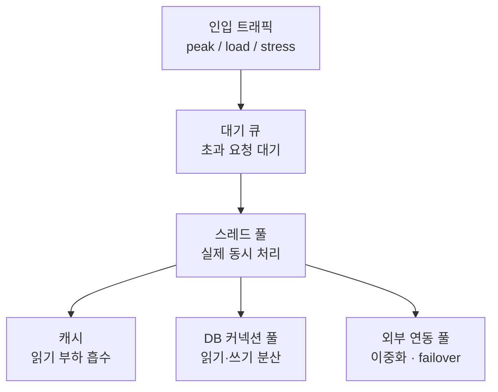

# 벌크헤드(Bulkhead) 및 이중화(Failover) 전략

## 1. 이중화 및 자원 격리의 필요성

- 회로 차단(Circuit Breaker), 트랜잭션 분리(Saga), 커넥션 풀 산정이 완료되었더라도 외부 서비스(PG사)가 장애를 일으키거나 점검에 들어가면 단일 연동 구조에서는 시스템 전체의 가용성이 파괴된다.
- 단일 PG 구조는 PG 장애 시 폴백(`PENDING`)만 수행되어 결제 성공률이 급락한다.
- 격리 구조(Bulkhead)가 부재할 경우 특정 외부 연동의 지연이 공유 풀 전체를 점유하여 멀쩡한 내부 연동(포인트, 쿠폰 등)까지 자원을 기아 상태로 만드는 자원 침범 현상이 발생한다.

### 1.1. 단일 PG 및 공유 풀 구조의 두 가지 결핍

1. **대체 경로 부재 (No Redundancy)**
   - Primary PG 장애 발생 시 대체할 수단이 없어 결제 처리율(`confirmed_rate`)이 폭락한다.
   - **해결책**: 장애 발생 시 Secondary PG로 요청을 전환하는 **이중화(Failover)** 를 구축한다.
2. **자원 격리 부재 (No Resource Isolation)**
   - 지연이 발생한 외부 호출이 공유 풀의 스레드를 모두 점유하여 다른 연동까지 처리 불가능한 상태로 만든다.
   - **해결책**: 의존성별 자원 풀을 분리하는 **벌크헤드(Bulkhead)** 를 적용한다.

## 2. 벌크헤드(Bulkhead) 패턴을 통한 자원 격리

의존성별로 자원(스레드/커넥션 풀)을 분리하여 한 의존성의 포화나 장애가 전체 시스템으로 전파되지 않도록 차단하는 패턴이다.

### 2.1. 공유 풀 vs 격리 풀 구조 비교

- **공유 풀 (Shared Pool)**: 느린 PG 호출이 공유 자원을 모두 점유할 경우, 짧은 지연 시간을 가진 포인트/쿠폰 호출까지 자원 획득(`acquire`)에 실패한다.
- **격리 풀 (Isolated Pool)**: PG 전용 풀이 포화되더라도 포인트 전용 풀은 독립적으로 작동하여 정상 흐름을 유지한다.

### 2.2. Resilience4j 벌크헤드 유형 비교

| 구분            | SemaphoreBulkhead                                                                                                                                                            | ThreadPoolBulkhead                                                                                                                                                                      |
| :-------------- | :--------------------------------------------------------------------------------------------------------------------------------------------------------------------------- | :-------------------------------------------------------------------------------------------------------------------------------------------------------------------------------------- |
| **격리 방식**   | 세마포어 (동시 호출 수 상한 제한)                                                                                                                                            | **전용 스레드풀 + 대기 큐**                                                                                                                                                             |
| **스레드 동작** | 호출 스레드를 그대로 사용하며 슬롯 부족 시 즉시 거절한다.                                                                                                                    | 별도 워커 스레드풀에서 작업을 실행한다.                                                                                                                                                 |
| **오버헤드**    | 컨텍스트 스위칭(Context Switching) 오버헤드가 없어 가볍고 빠르다.                                                                                                            | 컨텍스트 스위칭 및 큐 메모리 비용이 발생한다.                                                                                                                                           |
| **적합한 상황** | • 간단한 동시성 상한 제어가 필요할 때 적합하다.<br>• 호출 스레드를 그대로 사용하므로 오버헤드가 거의 없다.<br>• 단, 동시성 상한만 두는 것이라 스레드 자체는 여전히 공유된다. | • 의존성 간 **완전한 자원 격리**가 필요할 때 주로 사용된다.<br>• 실무에서 가장 흔하게 선택되는 방식이다.<br>• 전용 풀과 큐로 확실히 분리되지만 컨텍스트 스위칭과 큐 메모리 비용이 든다. |

### 2.3. 풀 산정(Little's Law)과 벌크헤드의 관계

- **풀 산정**: 시스템 목표 처리량과 지연 시간을 기반으로 필요한 자원 크기를 계산한다 ($L = \lambda \times W$).
- **벌크헤드**: 산정된 자원 풀을 어떤 의존성들과 나눌 것인지 소유권을 격리한다.
- 아무리 정확히 풀 크기를 산정했더라도 자원을 공유하면 단일 지연에 의해 전체 시스템이 마비되므로 산정과 격리는 함께 적용되어야 한다.

## 3. 결제 PG 이중화(Failover) 구현 및 정책

Primary PG에 장애가 발생했을 때 Secondary PG로 연동을 자동 전환하여 시스템 가용성을 유지하는 Active-Passive 이중화 구조를 구축한다.

### 3.1. FailoverPgConnector 핵심 구현

```kotlin
fun confirm(cmd: PgCommand): PgResult =
    try {
        primary.confirm(cmd)
    } catch (e: PgServerException) {
        // Primary 5xx / Timeout 발생 시 전환 (회로 OPEN 전 단계)
        if (enabled) {
            log.warn("Primary PG failure -> Failover to Secondary PG")
            secondary.confirm(cmd)
        } else {
            throw e // 이중화 OFF 시 기본 동작 유지
        }
    }
    // PgDeclinedException(비즈니스 거절)은 catch 하지 않고 상위로 전파
```

## 4. 성능 테스트 종류

### 4.1. 부하 테스트(Load Test)

- 평소 트래픽 100%를 30분~1시간 동안 지속적으로 발생시킨다.
- 시스템이 장시간 안정적으로 버티는지 확인한다.

### 4.2. 피크 테스트(Peak Test)

- 잔잔한 상태에서 순간적으로 트래픽이 몰리는 상황을 연출한다.
- 순간적인 압력을 시스템이 버티는지 검증한다.

### 4.3. 스트레스 테스트(Stress Test)

- 한계 도달 시점까지 트래픽을 계속 늘린다.
- 시스템의 파괴 점(Breakeven Point)과 임계치를 확인한다.

### 4.4. 내구성 테스트(Soak Test)

- 일정 부하를 며칠 동안 계속 흘려보낸다.
- 시간이 지남에 따라 커넥션 누수, 메모리 누수 등이 발생하는지 확인한다.

## 5. Active-Passive vs Active-Active

### 5.1. 동작 방식 비교

| 구성               | 평시                             | 장애 시                            | 특징                                                      |
| :----------------- | :------------------------------- | :--------------------------------- | :-------------------------------------------------------- |
| **Active-Passive** | Primary만 사용, Secondary는 대기 | Primary 실패 시 Secondary 승격     | 구조가 단순하며 정합성을 맞추기 쉽다.                     |
| **Active-Active**  | 둘 다 트래픽 처리 (부하 분산)    | 한쪽이 빠져도 나머지가 트래픽 흡수 | 처리량이 높으나 양쪽의 정합성 및 멱등성 보장 부담이 크다. |

### 5.2. 트레이드오프 비교

| 전략               | 비용                     | 정합성 부담           | 운영 복잡도                 | 가용성                            |
| :----------------- | :----------------------- | :-------------------- | :-------------------------- | :-------------------------------- |
| **단일 PG**        | 최저 (1대)               | 없음                  | 최저                        | 장애 발생 시 마비                 |
| **Active-Passive** | 중 (Secondary 유휴 비용) | 낮음 (멱등키로 충분)  | 중 (전환 및 헬스 체크 관리) | 장애 발생 시에도 서비스 지속 가능 |
| **Active-Active**  | 높음 (둘 다 가동)        | 높음 (양쪽 보장 필요) | 높음 (분산 및 모니터링)     | 트래픽 흡수 및 처리량 증가        |

## 6. 트래픽 흐름과 자원 계층

- 요청 한 건은 여러 자원 계층을 순서대로 통과한다.
- 각 계층은 저마다 처리할 수 있는 양의 한계를 가진다.
- **전체 처리량은 그중 가장 좁은 계층이 결정한다**.
- 따라서 병목을 찾으려면 요청이 어떤 계층을 지나는지 먼저 알아야 한다.

### 6.1. 전체 흐름



- 인입 트래픽은 **대기 큐 → 스레드 풀 → 자원 풀(캐시 / DB 커넥션 풀 / 외부 연동 풀)** 순서로 흐른다.

### 6.2. 계층별 실제 컴포넌트

- 각 계층은 추상적인 개념이 아니라 **실제 설정으로 크기가 정해지는 구체적인 컴포넌트**다.
- 스레드 풀 뒤에 있는 자원 풀은 DB나 외부 API에 접근하기 위해 필요한 커넥션의 묶음을 뜻한다.
  - 스레드가 일꾼이라면, 자원 풀은 그 일꾼이 자원에 접근하려면 반드시 손에 쥐어야 하는 출입증에 해당한다.
- 각 계층의 한계치는 **서로 다른 설정 값으로 독립적으로 정해진다**.
- 병목은 이 값들 중 가장 작은 곳에서 발생한다.

| 계층             | 실제 컴포넌트             | 설정 키                                      | 역할                                                     |
| :--------------- | :------------------------ | :------------------------------------------- | :------------------------------------------------------- |
| **대기 큐**      | 톰캣 accept 큐            | `server.tomcat.accept-count`                 | 스레드가 모두 사용 중일 때 초과 요청을 임시로 대기시킨다 |
| **스레드 풀**    | 톰캣 워커 스레드          | `server.tomcat.threads.max`                  | 실제로 요청을 동시에 처리하는 일꾼의 수이다              |
| **DB 커넥션 풀** | HikariCP                  | `spring.datasource.hikari.maximum-pool-size` | 동시에 DB에 접근할 수 있는 커넥션 수이다                 |
| **외부 연동 풀** | HTTP 클라이언트 커넥션 풀 | WebClient / RestClient 설정                  | 외부 서비스 호출에 사용하는 커넥션 수이다                |

### 6.3. 세션 라우팅

- 외부 연동을 이중화할 때 두 서비스가 상태를 각자 보관한다면, 한 사용자의 요청을 같은 대상으로 계속 연결하는 **스티키 세션**이 필요하다.

## 7. 계층별 처리 용량과 병목

### 7.1. 병목 공식

- 블로킹 모델에서 스레드 하나는 요청 하나를 응답이 끝날 때까지 붙잡는다.
- 그래서 동시에 처리할 수 있는 양은 **스레드 수와 커넥션 풀 크기 중 더 작은 쪽**으로 정해진다.
- 톰캣 스레드가 200개, Hikari 풀이 50개라면 DB 작업의 병목은 `min(200, 50) = 50`이다.
  - 이때 나머지 150개 스레드는 커넥션을 얻지 못한 채 대기한다.
  - 스레드가 아무리 많아도 **커넥션이 부족하면 그 이상 처리하지 못한다**.
- 반대로 톰캣 스레드가 50개, Hikari 풀이 200개라면 이번에는 스레드가 병목이 된다.
- 즉 병목은 언제나 `min(톰캣 스레드, Hikari 풀)`처럼 **둘 중 좁은 쪽**이며, 넓은 쪽만 키우는 것은 낭비다.

### 7.2. 블로킹 vs 리액티브

| 모델         | 스레드 점유 방식                            | 처리량 상한               |
| :----------- | :------------------------------------------ | :------------------------ |
| **블로킹**   | 응답이 끝날 때까지 스레드가 요청을 붙잡는다 | `min(스레드 수, 풀 크기)` |
| **리액티브** | I/O를 기다리는 동안 스레드를 반납한다       | 풀 크기까지 확장된다      |

- **동일한 풀 크기라면 두 모델의 처리량 상한은 결국 풀 크기에서 만난다**.
- 리액티브의 진짜 이점은 상한 자체가 아니라, **더 적은 스레드로 같은 상한에 도달해 스레드와 메모리 비용을 아끼는 것**이다.

### 7.3. 대기 큐의 역할과 한계

- 대기 큐는 순간적으로 몰리는 트래픽을 잠시 받아 두는 **완충 장치일 뿐, 처리량 자체를 늘리지는 못한다**.
- 큐가 길어질수록 응답 지연이 쌓이며, 큐가 가득 차면 요청은 거절(Timeout)된다.
- 느린 외부 호출이 스레드를 오래 붙잡으면 스레드가 제때 반납되지 못해 큐가 빠르게 가득 찬다.
  - 이 지점을 막는 것이 **타임아웃과 벌크헤드**다.

### 7.4. 계층별 모니터링 지표

| 계층             | 핵심 지표                                               |
| :--------------- | :------------------------------------------------------ |
| **대기 큐**      | 큐 길이, 대기 시간, 거절 수                             |
| **스레드 풀**    | `tomcat_threads_busy`, 큐 적재량                        |
| **DB 커넥션 풀** | Hikari active / max, 커넥션 획득 대기 시간, 타임아웃 수 |
| **외부 연동**    | 호출 지연(p95 / p99), 에러율                            |

- 여러 계층의 사용률을 함께 봐야 **어느 풀이 먼저 포화되는지, 즉 진짜 병목이 어디인지 특정할 수 있다**.
