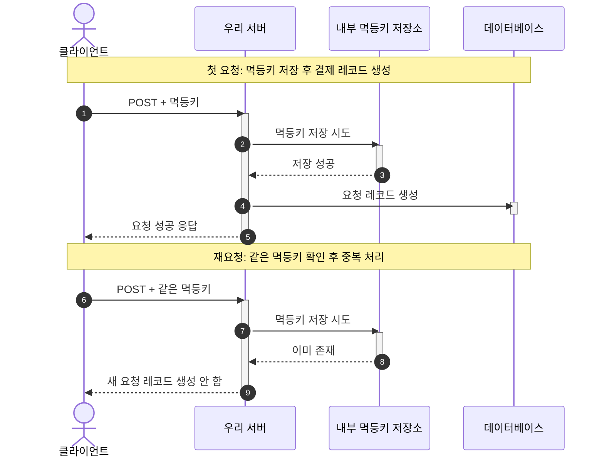

## 외부 시스템 장애에 대응하는 회복 전략

## 1. 외부 시스템 장애

- 외부 시스템(예: PG, 외부 연동 예약 등)과의 연동 과정에서 발생할 수 있는 장애와 지연에 대응하기 위해 타임아웃, 재시도, 서킷 브레이커, 폴백 처리 등 다양한 회복 전략을 사용한다.
- 로컬 환경에서 다른 함수를 호출하는 경우는 동일한 프로세스 안에서 완료된다.
- 따라서 성공과 실패에 대한 판단 기준이 명확하다.
- 하지만 외부 연동은 중간에 네트워크가 존재하며, 상대 시스템의 처리를 거쳐야 한다.
- 이에 따라 응답이 늦거나 중간에 연결이 끊길 수 있으며, 상대 시스템에서 처리가 완료되었음에도 그 결과를 받지 못하는 상황이 발생할 수 있다.

## 2. Timeout

- 외부 시스템의 응답 지연이 발생하는 경우, 언제까지 대기하다가 오류를 발생시킬지를 결정한다.
- 요청이 일정 시간 내에 응답하지 않으면 실패로 간주하고 종료한다.
- 외부 시스템에서 응답을 지연하거나 중단하면 요청의 끝을 기다리는 동안 스레드와 커넥션이 점유된 채 대기한다.
- 대기하는 스레드와 커넥션이 늘어날수록 서버 전체의 시스템이 느려지고, 외부 시스템 연동과 상관없던 요청까지 느려지게 된다.

### 2.1. ReadTimeout

- 커넥션은 이미 맺어진 상태에서, 응답 데이터가 도착하기까지 기다리는 시간에 대한 제한이다.
- 외부 시스템이 요청을 받고도 처리가 지연되어 응답을 보내지 않는 경우, ReadTimeout이 없으면 스레드가 무한정 대기하게 된다.
- 보통 외부 시스템의 평균 및 **p99 응답 시간**을 기준으로, 여유를 둔 값(예: p99의 1.5~2배)으로 설정한다.

### 2.2. ConnectionTimeout

- **TCP 커넥션** 자체를 맺는 데(3-way handshake 완료까지) 걸리는 시간에 대한 제한이다.
- 대상 서버 다운, 네트워크 장애, 방화벽 차단 등으로 커넥션 자체가 성립되지 않는 상황을 방지하기 위함이다.
- 커넥션 수립은 정상적인 상황에서 수백 ms 이내에 끝나야 하므로, 보통 ReadTimeout보다 훨씬 짧게(수 초 이내) 설정한다.

## 3. 멱등성(Idempotency)



- **재시도**를 안전하게 만드는 한 쌍의 개념이다.
- 같은 요청을 여러 번 처리해도 최종 상태가 한 번 처리한 결과와 같게 유지되는 성질이다.
- 요청이 서버에 도달했는지 확신할 수 없을 때, 카드가 두 번 결제되는 중복 작업 없이 안전하게 재시도할 수 있게 만드는 성질이다.

### 3.1. 멱등키

- 서버는 매 요청이 동일한 요청인지 새로운 요청인지 알 수 없다.
- 따라서 이를 식별하기 위한 식별자가 필요한데, 이를 **멱등키**라고 부른다.
- 멱등키는 보통 UUID와 시간 정보를 혼합해서 생성한다.
- `UUID.randomUUID()`(UUIDv4)는 122비트의 랜덤 엔트로피를 가진다.
- 생일 문제(Birthday Problem) 공식으로 계산하면, 하루 100만 TPS(약 864억 건) 규모에서도 키 충돌 확률은 약 $10^{-16}$ 수준으로 사실상 발생이 불가능하다.
- 따라서 대부분의 서비스 규모에서는 별도의 중복 방지 로직 없이 UUID 기반 멱등키만으로 충분하다.

### 3.2. 멱등키 전파 범위


- 클라이언트와 우리 서버, 그리고 우리 서버와 외부 서버의 각 경계에서 모두 **멱등성 지원**이 필요하다.
- 따라서 외부 서버와 연동할 때 외부 서버에서 멱등성을 지원하지 않는다면 완전한 멱등성을 보장하기 어렵다.
- 클라이언트와 우리 서버 사이에서는 우리 서버가 멱등키를 보관하고, 이를 통해 동일한 응답을 내려주어 중복된 요청에 대한 처리를 방지해야 한다.
- 우리 서버와 외부 서버 사이에서는 외부 서버가 멱등키를 보관하여 중복된 요청에 대한 처리를 방지해야 한다.
- 외부 서버와 연동할 때의 멱등키는 사내 규칙에 따라 클라이언트 멱등키를 그대로 다시 보내거나, 주문 번호 기반의 멱등키를 사용하는 것이 좋다.

### 3.3. 멱등키 발행

| 발행 위치          | 멱등 단위              | 특징                                                                      | 장점                                                        | 한계 및 주의할 점                                                                                                            |
| :----------------- | :--------------------- | :------------------------------------------------------------------------ | :---------------------------------------------------------- | :--------------------------------------------------------------------------------------------------------------------------- |
| **클라이언트**     | "이 사용자 행동 한 번" | 사용자의 동일한 결제 시도에 같은 키를 붙여 서버로 보낸다.                 | 새로고침, 더블클릭, 네트워크 재시도까지 하나의 키로 묶인다. | 클라이언트 데이터는 위변조될 수 있어 그대로 신뢰하면 위험하며, 키를 보내지 않으면 무력화되므로 서버 검증이 필요하다.         |
| **게이트웨이/API** | "이 HTTP 요청 한 번"   | 공통 진입점에서 키를 발급한다.                                            | 공통 적용(횡단 관심사)이 가능하다.                          | 게이트웨이는 요청의 의미를 모를 수 있어 도메인별 중복 판단까지 맡기면 위험하며, 주문 단위 등 비즈니스 의미와 어긋날 수 있다. |
| **도메인(서버)**   | "이 주문 한 건"        | 결제 시도 시작 시 서버가 키를 발급하고 클라이언트가 이후 요청에 사용한다. | 비즈니스 불변식과 정렬(주문당 1결제)이 가능하다.            | 클라이언트가 키를 받기 전 실패하면 다시 시작하는 흐름을 정의해야 하며, 클라이언트 재시도가 다른 키로 오면 막을 수 없다.      |

### 3.4. 멱등키 저장 위치

| 방식                                | 원리 및 선택 기준                                                                                                 | 장점                                                                                                                   | 단점 및 주의할 점                                                                                                                                                                                             | 적합한 상황                                                                                                            |
| :---------------------------------- | :---------------------------------------------------------------------------------------------------------------- | :--------------------------------------------------------------------------------------------------------------------- | :------------------------------------------------------------------------------------------------------------------------------------------------------------------------------------------------------------ | :--------------------------------------------------------------------------------------------------------------------- |
| **DB 방식**<br>(Unique Constraint)  | 유니크 키 INSERT 시 중복이면 제약 조건을 위반한다. Redis를 사용할 수 없거나 영속적 관리가 필요할 때 선택한다.     | **원자적**이며 인프라 추가가 없다. **영속성**이 보장되어 재시작이나 장애에도 남으며, "한 번 처리"가 데이터로 증명된다. | 충돌이 예외로 발생하므로 `DataIntegrityViolationException` 처리가 필요하다. DB 쓰기(Write) 한 줄이 추가된다. 동일 키 중복 저장은 DB 제약 조건으로 막아야 한다.                                                | **결제처럼 '정확히 한 번'이 절대 조건**일 때, 이미 DB가 데이터의 신뢰 원천(Single Source of Truth)일 때 가장 적합하다. |
| **Redis 방식**<br>(분산락 SETNX 등) | 키에 락을 걸고 임계 구역에 진입한다. 멱등키를 별도 저장소에서 관리하고 Redis 인프라를 활용할 수 있을 때 선택한다. | 빠르며 DB 외부에서 동시성을 제어할 수 있다.                                                                            | **락과 영속 기록은 동일하지 않다**. TTL 만료, 락 유실, Redis 장애 시 **이중 실행 위험**이 있으며, 락을 잡은 상태로 다운되면 정합성이 깨진다. 별도 인프라 운영 부담이 있고 장애 시 결제 자체가 실패할 수 있다. | 짧은 임계 구역의 동시성 제어가 필요할 때, 혹은 "최대 한 번" 수준의 보장으로 충분할 때 적합하다.                        |

- 인프라 구성 및 도메인 특성에 따라 적절한 저장 방식을 선택한다.
- 예를 들어 결제 요청처럼 어떤 상황에서도 보호가 필요하다면 DB에 저장하여 재시도가 언제 오더라도 처리할 수 있어야 한다.
- 분산락과 낙관락은 동시성(동일한 순간의 경합) 제어 도구이며, 유니크 키는 멱등(시간과 무관한 중복) 제어 도구이므로 결제 같은 도메인은 후자가 좋다.

#### DB 방식

- DB 방식에서는 멱등키와 요청에 대한 처리를 저장하는 테이블을 별도로 관리하는 것이 좋다.
- 대부분 멱등키의 생명주기와 요청 처리의 생명주기가 다르고, 요청을 처리하는 데이터와 멱등키는 의미하는 바가 다르기에 같은 테이블에 저장하는 것보다 분리하는 것이 좋다.
- 또한, 멱등키를 계속 보관할 필요는 없으므로 별도의 테이블에 저장하고 주기적으로 삭제하는 것이 좋다.

#### Redis 방식

- Redis 방식은 멱등키를 먼저 선점하여 중복 요청을 막는 방식이다.
- 선점에 성공해야만 요청에 대한 처리가 이루어진다.
- 따라서 Redis에 장애가 발생하는 경우 요청 처리가 되지 않을 수 있다.

## 4. 재시도(Retry)

- 일시적인 장애(Transient Fault), 즉 네트워크 오류나 서버의 일시적인 문제가 발생했을 때 재시도로 정상 응답을 받아내는 전략이다.
- 너무 잦은 재시도는 연동 서버에 부하를 가중할 수 있다.
- 따라서 대기 시간(**Backoff**)과 최대 시도 횟수를 제한해야 한다.
- 타임아웃과 조합하여 최대 몇 초 안에 몇 번까지만 시도할지 제어하며, 이마저도 실패했을 때는 **폴백(Fallback)** 처리를 수행한다.
- 외부 서버에서 멱등성 처리를 지원하지 않는다면 요청이 여러 번 중복 처리될 위험이 있다.
- 재시도를 진행할 때는 어떤 예외 상황(Exception)에 대해 재시도를 수행할지 명확하게 명시하는 것이 좋다.
- 확실한 오류(사용자 요청 오류, 서버 거절 등)는 재시도하더라도 동일한 예외가 발생하므로 제외해야 한다.

## 5. 서킷 브레이커(Circuit Breaker)

- 외부 시스템이 반복해서 실패하면 일시적으로 회로를 열어 외부 서버 호출을 차단한다.
- 계속해서 실패하는 요청을 끊어 전체 시스템을 보호하는 것이다.
- 응답이 지연되는(실패 혹은 응답까지 시간이 오래 걸림) 경우 외부 API를 계속 기다리면 처리 스레드가 묶이고, 요청 대기가 쌓여 외부 연동과 상관없는 API까지 느려질 수 있다.

### 5.1. 서킷 브레이커의 상태

| 상태 (State)  | 설명 (Description) | 동작 방식 (Behavior)                                                                                     |
| :------------ | :----------------- | :------------------------------------------------------------------------------------------------------- |
| **Closed**    | 정상 상태          | 모든 호출을 통과시키며, 실패율을 지속적으로 집계합니다.                                                  |
| **Open**      | 차단 상태          | 실패율이 기준치를 초과하여 호출을 차단하고, 즉시 폴백(Fallback)을 반환합니다.                            |
| **Half-Open** | 반열림 상태        | 일정 시간 후 일부 호출만 시도하여, 성공하면 **Closed**로 복구하고 실패하면 다시 **Open**으로 돌아갑니다. |

### 5.2. 서킷 브레이커 열림 기준

| 기준                      | 의미                                                   | 예시                                             |
| :------------------------ | :----------------------------------------------------- | :----------------------------------------------- |
| **실패율 임계치**         | 최근 호출 중 실패한 비율이 기준을 넘는지 봅니다.       | 설정한 윈도우 안에서 실패율이 기준을 넘으면 Open |
| **느린 호출 비율 임계치** | 정해둔 시간보다 오래 걸린 호출이 기준을 넘는지 봅니다. | 느린 호출 비율이 기준을 넘으면 Open              |

### 5.4. 서킷 브레이커 실패율

| 방식            | 계산 범위                                        | 어울리는 상황                   | 예시                                                 |
| :-------------- | :----------------------------------------------- | :------------------------------ | :--------------------------------------------------- |
| **Count-based** | 최근 N번의 호출 결과를 기준으로 계산합니다.      | 호출량이 비교적 일정한 API      | 최근 100번 호출 중 60번 실패 -> 실패율 60%           |
| **Time-based**  | 최근 N초 동안의 호출 결과를 기준으로 계산합니다. | 트래픽이 몰렸다 줄었다 하는 API | 최근 60초 동안 100번 호출 중 20번 실패 -> 실패율 20% |

## 6. 폴백(Fallback) 처리

- Timeout, CircuitBreaker를 통해 실패가 발생하거나 실패를 빨리 끊었을 때, Fallback을 통해 이후에 무엇을 반환할지 처리하는 것이다.
- 따라서 Fallback 처리에서는 무조건 성공했다고 위장하지 말고, 제대로 처리하지 못했다면 일단 '처리 중(202)' 응답을 준 뒤 비동기로 확정하거나 명확하게 실패 처리를 해야 한다.
- 거절(확정 실패)과 일시 장애/차단(회복 가능)을 구분해 다르게 처리한다.
- 폴백이 조용한 실패가 되지 않도록 메트릭 및 알람과 세트로 설계해야 한다.
- 주요 폴백 처리 방식:
  - **캐싱된 데이터 반환**: 마지막으로 성공한 조회 결과나 미리 계산한 값을 반환한다. 다만, 오래된 데이터로 잘못된 판단을 하거나 실제 상태와 다른 응답을 줄 위험이 있다.
  - **대체 API 호출**: 동일한 목적을 처리할 수 있는 다른 외부 API로 우회한다. 기존 API와 응답 스펙, 필드 의미, 에러 코드가 다를 수 있음에 유의해야 한다.
  - **기본 응답 제공**: 부가 조회가 실패했을 때 조회 불가 안내, 기본 목록, 기본 설정값 등을 응답한다. 장애를 무조건 감추기보다 정책적으로 정의한 안내 문구를 보여주는 것이 좋다.

### 6.1. 외부 API마다 다른 폴백 전략

- 같은 외부 API 실패라도 서비스 영향도에 따라 다른 응답 정책을 사용해야 한다.
- **결제와 같은 중요 도메인**: 성공/실패가 확실하지 않은 경우 '처리 중'으로 응답을 보낸 뒤, 비동기로 외부 연동 결과를 확인하여 최종 처리하는 것이 안전하다.
- **정보 조회 도메인**: 캐싱 데이터 반환, 대체 API 호출, 기본 응답 제공 등의 전략이 적합하다.

## 7. Resilience4j

- **Resilience4j**는 자바 생태계에서 가장 널리 사용되는 결함 허용(Fault Tolerance) 라이브러리이다.
- 함수형 프로그래밍을 지원하며 타임아웃, 재시도, 서킷 브레이커, 벌크헤드, 속도 제한기(Rate Limiter) 등 다양한 회복 전략을 독립된 모듈로 제공한다.
- 스프링 부트(Spring Boot) 환경에서는 설정 파일(YAML)을 통해 선언적으로 회복 전략을 관리할 수 있다.

### 7.1. PG 연동 예시 설정 (Circuit Breaker & Retry)

```yaml
resilience4j:
  circuitbreaker:
    instances:
      pg:
        sliding-window-type: COUNT_BASED # 호출 횟수 기준(Count-based)으로 실패율 계산
        sliding-window-size: 6 # 최근 6번의 호출 결과를 저장
        minimum-number-of-calls: 6 # 최소 6번은 호출되어야 서킷 브레이커 판단 시작
        failure-rate-threshold: 50 # 실패율이 50% 이상이면 Open 상태로 전환
        wait-duration-in-open-state: 60s # Open 상태에서 Half-Open으로 가기 전 대기 시간 (60초)
        permitted-number-of-calls-in-half-open-state: 2 # Half-Open 상태에서 허용할 시도 횟수
        register-health-indicator: true # 스프링 액추에이터(Actuator)에 모니터링 지표 등록
        record-exceptions:
          - com.failsafe.infrastructure.pg.PgServerException # 실패율로 집계할 예외 (서버 에러 등)
        ignore-exceptions:
          - com.failsafe.infrastructure.pg.PgDeclinedException # 실패율에서 제외할 예외 (잔액 부족 등)
  retry:
    instances:
      pg:
        max-attempts: 3 # 최대 3번 시도 (기본 요청 1번 + 재시도 2번)
        wait-duration: 50ms # 재시도 사이의 대기 시간 (50ms)
        retry-exceptions:
          - com.failsafe.infrastructure.pg.PgServerException # 재시도를 수행할 예외
        ignore-exceptions:
          - com.failsafe.infrastructure.pg.PgDeclinedException # 재시도하지 않고 바로 실패 처리할 예외
```

### 7.2. 주요 설정 값의 비즈니스적 의미와 주의점

#### 예외 분리의 중요성 (record/retry vs ignore)

- `PgServerException` (기록 및 재시도 대상): 타임아웃, 외부 서버 5xx 에러 등 일시적인 시스템 장애이다. 서킷 브레이커의 실패율을 높이고, 재시도를 통해 정상 응답을 기대할 수 있다.
- `PgDeclinedException` (무시 대상): 한도 초과, 잔액 부족, 유효기간 오류 등 비즈니스적 거절이다. 시스템 장애가 아니므로 재시도해도 결과가 같으며, 서킷 브레이커가 오작동하여 멀쩡한 회로를 열어버리지 않도록 반드시 제외(ignore)해야 한다.

#### 임계치 설정 (sliding-window & minimum-calls)

- 윈도우 크기와 최소 호출 수를 6으로 동일하게 맞추면, 최근 6번의 요청 중 3번 이상 `PgServerException`이 발생하는 즉시 서킷이 열린다(Open).
- 호출 수가 적은 환경에서 초반 결함을 빠르게 감지하기 좋으나, 트래픽이 몰리는 환경에서는 너무 쉽게 서킷이 열릴 수 있으므로 운영 환경의 TPS를 고려해 적절히 조절해야 한다.
