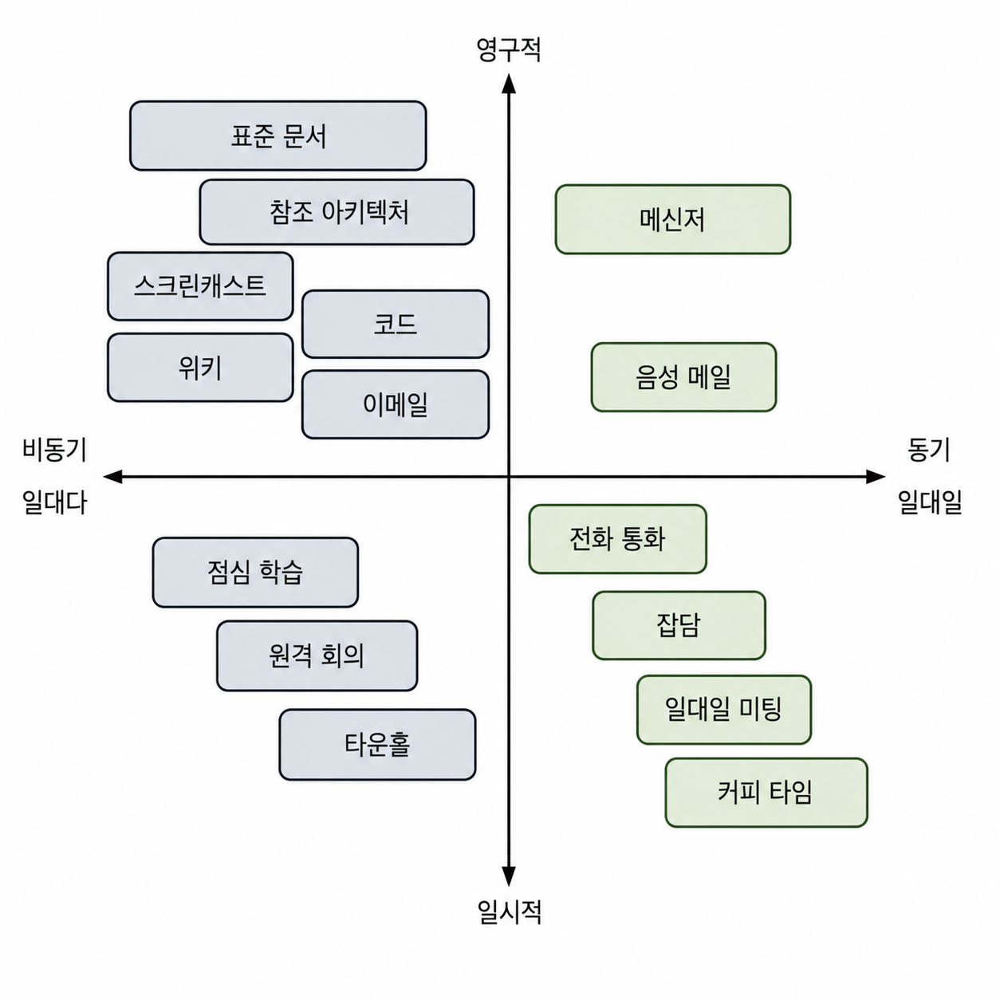

# 기술 세계의 소프트 스킬

- 소프트웨어 엔지니어가 되기까지 어떤 식으로든 기술 역량을 늘리기 위해 집중했을 것이다.
- 엔지니어로서 배운 기술에는 각각 유효기간이 있지만 은퇴할 때까지 평생 쓸 수 있는 기술이 있다.
- 바로 **소프트 스킬(Soft Skills)** 이다.
- 다른 사람들과 협업하고 명확하게 소통하는 법을 배우는 것은 다음 언어나 프레임워크를 배우는 것만큼이나 중요하다.
- 기술은 빠르게 변하지만 사람은 그렇지 않다.
- 효과적으로 소통하고, 다른 사람들과 협업 및 영향력을 행사하며, 시간을 관리하는 법은 경력 내내 보상을 가져다준다.

## 1. 협력적 소통

- 과거에는 개발자를 내향적인 은둔자로 보는 고정관념을 가지고 있었다.
- 하지만 소프트웨어 프로젝트는 **팀 스포츠**다.
- 더 이상 개인 한 명이 전체 코드를 머릿속에 담을 수 없다.
- 현대의 방대한 코드는 팀이 함께 작업해야 한다.
- 켄트 백(Kent Beck)이 말한 것처럼 소프트웨어 설계는 인간적인 과정이다. 즉, 인간이 인간을 위해 만드는 것이다.

### 1.1. 소통 수단

- 소통 수단을 선택할 때는 상대방의 상황도 함께 고려해야 한다.

#### 메신저

- 메신저를 활용하면 개인이나 그룹에 비동기적으로 문자 메시지를 쉽게 보낼 수 있다.
- 메시지는 보통 비공식적이고 빠른 질문이나 문제에 대한 알림에 유용하다.
- 소프트 스킬은 **좋은 습관의 집합**이다.
- 바쁜 상황에서 누군가 질문을 보내면, 지금 바빠서 나중에 답변하겠다고 정중히 미리 알리는 것이 좋다.
- 이때도 황금률이 적용된다. 대접받고 싶은 대로 동료를 대하는 것은 경력을 발전시키기 위해 가장 간단하게 할 수 있는 일 중 하나다.

#### 회의

- 개발자들은 상당한 시간을 회의에 사용하는 것으로 나타난다.
- 회의는 동기적이고 일시적이지만, 나중에 다시 볼 수 있도록 녹화본이나 슬라이드가 공유되기도 한다.
- 모든 회의에서 자신이 왜 참석하는지 파악하여 **역할을 명확히** 해야 한다.
- 또한 회의의 목표가 무엇인지 정확히 파악하는 것이 좋다.
- 회의 전에 미리 준비를 해야 한다.
- 검토해야 할 특정 사항이 있다면, 회의 전에 읽을 시간을 따로 확보하자.
- 좋은 회의를 위해 명확한 안건을 준비하고, 참석이 꼭 필요한 사람만 포함해야 한다.
- 제약이 오히려 자유를 준다.
- 회의를 30분으로 짧게 잡으면 주제에 더욱 집중하게 된다.

#### 발표

- 1분짜리 **엘리베이터 피치(Elevator Pitch)** 를 평소에 준비해두자.
  - 조직의 고위급 리더와 잠시 이야기를 나눌 기회가 언제 생길지 모르기 때문이다.
  - 핵심 내용을 서두에 배치하고 전하고 싶은 핵심 요점에 집중하도록 노력해야 한다.
- 발표자로 성장하는 지름길은 없다.
- 실력을 키우고 싶다면 발표 기회를 많이 가져야 한다.
- 발표는 새로운 것을 배우는 데 훌륭한 동기 부여 수단이 된다.

#### 소통 수단인 코드

- 기술 세계에서 좋은 소통 역량은 명확하고 효과적인 코드를 작성하는 능력으로 확장된다.
- 코드는 **궁극의 진실의 원천(Single Source of Truth)** 이며, 다른 개발자들에게 의미를 정확히 전달할 수 있어야 한다.
- 따라서 항상 읽는 사람을 염두에 두고 코드를 작성하는 것이 중요하다.
- 좋은 이름 짓기(Naming) 관행을 사용하고, 코드를 간결하게 유지하며, 교묘한 트릭을 피하는 것은 코드를 이어받을 개발자에 대한 필수적인 배려다.

### 1.2. 옮겨 말하기

- 말은 사람에서 사람으로 전달되면서 변질되기 쉽다.
- 조직에서도 이런 왜곡 현상이 자주 벌어진다.
- 만약 이러한 일의 당사자가 된다면 아래의 내용을 실천해야 한다.
  - 평정심을 유지하고 그런 일이 벌어지고 있다는 사실을 객관적으로 적시한다.
  - 말이 어디서부터 변질되었는지 명확히 파악한다.
  - 왜곡에 관련된 사람들을 확인한다.

### 1.3. 청중을 파악하라

- 소프트웨어 엔지니어는 상당한 시간을 기술 관계자들, 즉 동료 엔지니어, 아키텍트, 테스터, 제품 관리자(PM)와 소통하는 데 쓴다.
- 경력이 쌓이면 기술적 개념을 기술 비전공자인 이해관계자들과도 공유할 수 있어야 한다.
- 개발자의 언어를 **비즈니스의 언어**로 번역하는 것은 연습이 필요한 중요한 기술이다.
- 소통 방식이 매우 중요한데, 오만하거나 냉소적인 태도를 버리고 철저히 **사업적 가치**를 전달하는 데 집중해야 한다.

## 2. 영향력 행사

- 영향력은 상대방으로 하여금 자신이 원하는 방향으로 행동하게 만드는 기술이다.
- 이상적으로는 그것이 상대방 스스로의 생각인 것처럼 느끼게 하면서 말이다.

### 2.1. 가치 이해와 표현

- 어떤 사람이 특정 결정을 내리도록 설득하고 싶다면, 그 결정이 가져올 이점을 먼저 설명해야 한다.
- 또한, 의사 결정자가 원하는 결과가 그들의 목표를 달성하는 데 어떻게 도움이 되는지 증명해야 한다.
- 그들이 신뢰하는 공신력 있는 출처를 인용하는 것도 좋다.

### 2.2. 전략적 영향력 행사

- 이미 강한 반대 의견을 가진 사람의 마음을 바꾸기는 매우 어렵다.
- 이때는 두 가지 접근 방식이 있다.
  - **망치 방식**은 누군가에게 무언가를 하도록 강압적으로 명령하는 방식이며, 이는 거의 효과가 없다.
  - **닌자 방식**은 교묘하고 자연스럽게 접근하여 그것이 상대방 자신의 생각이라고 느끼게 만드는 방식이다.
- 영향력을 행사할 때는 평소 자신의 평판도 매우 중요하다.
- 주위에 자신을 지지해줄 적극적인 아군을 확보해야 한다.
- 말하는 사람 자체의 영향력과 함께 이해관계자들과 평소 소통하는 방식도 결정적인 역할을 한다.

### 2.3. 이해관계자 관리

- 이해관계자가 누구인지 명확히 파악하고 그들을 깊이 이해해야 효과적으로 소통할 수 있다.
- 모든 프로젝트에는 팀원, 관리자, 소프트웨어를 최종적으로 사용하는 고객에 이르기까지 다양한 이해관계자가 존재한다.
- 때로는 프로젝트에 직접 관여하지 않지만, 프로젝트 진행에 결정적인 도움이나 해를 끼치는 사람이 있다.
- 이를 **2차 관계자**라고 부르는데, 이런 사람의 존재를 놓치면 프로젝트가 차질을 빚을 수 있다.
  - 현장에 없는 사람과는 협상할 수 없기 때문이다.
- 모든 이해관계자가 동등한 중요도를 가지지는 않는다.
- 특히 **관심도와 권한이 모두 높은 사람**은 프로젝트 성공의 핵심 열쇠다.

## 3. 시간 관리

- 시간은 한 번 쓰고 나면 결코 되돌릴 수 없는 한정된 자원이다.
- 규모를 확장할 수 없고, 추가로 더 얻을 방법도 없다.
- 가장 중요한 일에 집중할 수 있도록 방해받지 않는 **집중 시간**을 적극적으로 확보해야 한다.
- 자신의 생체 리듬과 업무 스타일을 파악해야 한다.
- 하루 중 언제 가장 집중이 잘되는지 확인하고, 자신이 최상의 상태일 때 중요한 일정을 잡아야 한다.
- 온전히 생각할 공간을 갖는 것이 기능을 완성하거나 결함을 수정하는 것보다 생산성에 더 큰 영향을 줄 수 있다.

### 3.1. 제작자의 일정

- 소프트웨어 개발은 과학보다 **공예(Craftsmanship)** 에 가깝다.
- 소프트웨어 개발이란 궁극적으로 문제를 머릿속에 집어넣고, 애플리케이션의 **정신 모델(Mental Model)** 을 형성하는 과정이다.
  - 이 과정에서 방해를 받게되면 다시 집중하기 어렵다.
- 따라서 자신의 생산성을 보호하기 위해 집중이 필요할 때는 방해 금지 모드를 설정하여 외부 자극을 최소화해야 한다.

### 3.2. 집중력 유지

- 시간 관리의 핵심은 집중력을 흐트러뜨리지 않고 유지하는 것이다.
- 이를 위해 할 일 목록을 체계적으로 완수해 나가는 자신만의 구조를 만들어야 한다.
- **포모도로 기법(Pomodoro Technique)** 을 활용하는 것도 좋은 방법이다.
  - 타이머를 25분으로 맞추고, 그 시간 동안은 오직 하나의 작업에만 몰입한다.
  - 중간에 다른 해야 할 일이 떠오르면 메모장에 적어두고 즉시 현재 작업으로 돌아온다.
  - 타이머가 울리면 하던 일을 멈추고 짧은 휴식을 취한다.
  - 이 과정을 4번 반복한 후에는 더 긴 휴식을 취하며 자신에게 보상을 준다.
- 포커스 코스(Focus Course)처럼 명확한 목표를 설정하고 이를 달성하도록 돕는 다양한 기법들을 활용할 수 있다.
