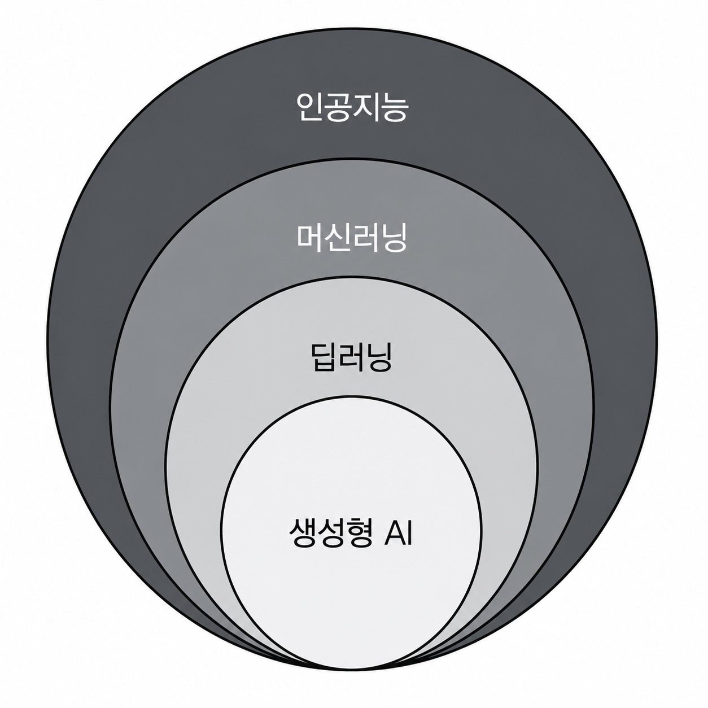

# AI로 무장한 소프트웨어 엔지니어

- AI가 코드를 작성하고, 버그를 수정하며, 시스템 전체를 설계하고 있다.
- 이에 따라 많은 개발자가 '조만간 개발자도 대체되는 것은 아닐까?'라는 불안감을 느끼고 있다.
- 과거 기술공이 도구를 통해 하루에 여러 개의 작품을 만들 수 있었던 것처럼, AI 덕분에 애플리케이션을 구축하고, 코드를 디버깅하며, 문제를 해결하는 속도가 그 어느 때보다 빨라졌다.
- 소프트웨어 엔지니어링의 탄탄한 기본기를 갖추고 AI를 **짝 프로그래머(Pair Programmer)** 로 완벽히 활용할 수 있다면, 도태되는 것이 아니라 오히려 시장에서 높은 수요를 받는 독보적인 존재가 된다.

## 1. AI란 정말 무엇인가

- AI는 단순한 규칙 기반 시스템부터 인간 두뇌의 정보 처리 방식을 모방하려는 인공신경망에 이르기까지, 모든 기술을 아우르는 포괄적인 용어다.

### 1.1 AI 용어 해설

#### 머신러닝

- 머신러닝(ML)은 현대 AI의 든든한 토대다.
- 모든 의사결정을 명시적으로 프로그래밍하는 대신, ML 알고리즘은 대규모 데이터 속에서 스스로 패턴을 학습한다.
- 대표적인 예시로는 사물 인식 프로그램이 있다.
- 전통적인 프로그래밍은 `입력 + 프로그램 = 출력`이라는 모델을 따른다.
- 즉, 인간이 작성한 명시적인 규칙이 존재한다. 반면 ML은 이를 완전히 뒤집어 입력과 정답 출력의 예시를 동시에 제공함으로써 `입력 + 출력 = 프로그램`의 방식으로 접근한다.
- 알고리즘이 데이터 사이의 규칙을 자동으로 파악하는 것이다.
- 이 방식은 인간이 직관적으로 처리하기는 쉽지만, 코드로 명시적으로 프로그래밍하기는 극도로 까다로운 문제를 해결하는 데 매우 효과적이다.
- 머신러닝 문제는 크게 아래 3가지 유형으로 나뉜다.
  - **분류(Classification)**:
    - 데이터가 어떤 범주(Category)에 속하는지 판별한다.
    - "이것은 정확히 무엇인가?"라는 질문에 답하는 과정이다.
    - 스팸 메일 필터링, 의료 진단 등이 이에 속한다. 알고리즘은 각 범주를 구분 짓는 고유한 특징과 패턴을 인식하는 법을 학습한다.
  - **회귀(Regression)**:
    - 연속적인 수치를 예측한다.
    - 범주를 나누는 것이 아니라, "값의 크기가 얼마나 되는가?" 혹은 "수량이 몇 개나 되는가?"를 구체적으로 묻는 작업이다.
    - 위치와 부동산 특성에 따른 주택 가격 예측, 택배 배송 시간 추정, 분기별 매출 예측 등이 대표적이다.
    - 알고리즘은 입력 특성들과 최종 수치 결과 사이의 상관관계를 학습한다.
  - **군집화(Clustering)**:
    - 사전에 정해진 기준 그룹 없이, 데이터의 유사성만을 바탕으로 유사한 항목들을 한데 묶는다.
    - "이 데이터 내부에는 어떤 자연스러운 그룹들이 존재하는가?"라는 질문에 답한다.
    - 구매 성향에 따른 고객 세분화, 대규모 문서 컬렉션의 카테고리 자동 정리 등이 있다.
    - 분류 분석과 다르게, 특정 그룹을 찾으라고 알고리즘에 직접 지시하지 않는다.
    - 알고리즘 스스로 데이터의 특성을 비교하여 최적의 그룹을 능동적으로 발견한다.
- 실무 개발자 관점에서의 머신러닝은 처음부터 복잡한 알고리즘을 직접 구현하기보다, 이미 잘 구축된 완성형 API나 사전 학습된 모델(Pre-trained Model)을 영리하게 가져다 활용하는 경우가 대부분이다.

#### 딥러닝

- 딥러닝(Deep Learning)은 다수의 계층을 사용하는 인공신경망을 활용하는 머신러닝의 하위 분야다.
- 계층이 깊게 쌓여 있다는 의미에서 '심층(Deep)'이라는 표현이 붙었다.
- 인공신경망은 인간 두뇌의 정보 처리 방식에서 영감을 받아 설계된 단순화된 수학적 모델이라고 생각하면 된다.
- 신경망은 인간의 두뇌에서 뉴런이 서로 연결되어 신호를 주고받는 매커니즘을 모방한다. 정보를 받아들이는 노드(Node, 인공 뉴런)를 갖추고, 이들의 조밀한 연결망을 통해 데이터를 전달한다.
- 신경망에서 각 계층(Layer)은 독립적인 데이터 처리 단계를 담당하며, 각각 특정 가중치 학습 작업에 배정된다.
- 심층 신경망은 가공되지 않은 원시 데이터를 받아들이는 **입력 계층(Input Layer)** 과 그 데이터를 추상화하여 처리 및 변환하는 여러 개의 **은닉 계층(Hidden Layer)** 으로 구성된다.
- 은닉 계층들의 복잡한 데이터 연산 처리가 모두 끝나면, 최종적으로 **출력 계층(Output Layer)** 에서 원하고자 하는 결과를 만들어낸다.
- 이 네트워크는 여러 계층(일반적으로 은닉 계층이 3개 이상이면 '심층 신경망'이라고 부른다)을 포함하고 있어 극도로 복잡한 비선형 패턴까지 학습할 수 있다.
- 덕분에 심층 신경망은 데이터 속에 숨겨진 고차원적이고 정밀한 패턴을 스스로 찾아내는 데 매우 뛰어나다.
- 전통적인 머신러닝이 컴퓨터에게 명시적인 피처 지표를 기반으로 패턴 인식을 가르친다면, 딥러닝은 스스로 미묘한 차이와 맥락적 특징까지 직접 추출하여 포착할 수 있는 능력을 부여한다.
- 예를 들어 얼굴 인식 과정에서 1차 계층은 단순한 모서리나 선을 감지하고, 다음 계층은 눈코입 등의 기본 형태를 인식하며, 최종 계층에 도달해서는 고유한 얼굴 구조 같은 매우 복잡한 특징을 완벽히 식별해 낸다.
- 머신러닝과 마찬가지로, 실무 개발자로서 처음부터 인공신경망 아키텍처를 직접 설계하고 구현하기보다는 이미 학습이 완료된 사전 학습 모델(Pre-trained Model)을 호출하여 상호작용하는 경우가 대부분이다.

#### 생성형 AI

- 생성형 AI(Generative AI)는 인공지능이 수행할 수 있는 작업 스펙트럼에 근본적인 변화를 가져왔다.
- 전통적인 AI가 주로 기존 데이터를 분석, 예측, 분류하는 데 그쳤다면, 생성형 AI는 이전에 존재하지 않던 완전히 새로운 독창적 콘텐츠를 만들어낸다.
- 머신러닝이 '어떤 그림이 명화인지' 컴퓨터에게 판별하도록 가르치는 학습 방식이라면, 생성형 AI는 '스스로 새로운 독창적 명화를 그리는 법'을 가르치는 기술이다.
- 생성형 AI를 활용하면 고품질의 텍스트와 소스 코드는 물론, 이미지, 오디오, 비디오 등 다채로운 미디어 콘텐츠를 즉각적으로 생성할 수 있다.

#### 대규모 언어 모델

- 대규모 언어 모델(Large Language Model, LLM)은 앞서 언급한 모든 인공지능 핵심 개념들이 집약된 결과물이다.
- 딥러닝 기반의 심층 신경망 아키텍처(Transformer 등)를 사용하며, 생성형 AI를 이끄는 핵심적인 유형이다.
- 이 모델들은 인터넷상에 존재하는 방대한 양의 말뭉치 데이터로부터 언어 패턴을 깊이 있게 추출하여, 인간과 유사한 수준의 정교한 텍스트 콘텐츠를 이해하고 생성한다.
- 대표적인 서비스 및 모델로는 OpenAI의 ChatGPT, Anthropic의 Claude 등이 있다.
- LLM이 이토록 강력한 성능을 발휘하는 비결은 인간 언어가 내포하고 있는 복잡한 맥락(Context)과 미묘한 뉘앙스(Nuance)를 포괄적으로 이해하는 능력에 있다.
- 덕분에 LLM은 문맥의 숨은 의미를 정확히 파악하고, 자연스러운 대화 맥락을 끊김 없이 이어가며, 명시적으로 주어지지 않은 암묵적 정보까지 깊이 있게 파악해 낸다.

### 1.2. AI의 능력과 한계 이해하기

- AI는 등장 이래 눈에 띄게 발전했지만, 현재의 뛰어난 능력에도 불구하고 반드시 이해해야 할 몇 가지 중요한 한계가 있다.

#### 소프트웨어 개발자 관점 AI의 강점

- **반복적인 코딩 작업**:
  - 반복적인 코딩 작업은 AI가 가장 큰 **투자 대비 효과(ROI, Return On Investment)** 를 가져다주는 영역이다.
  - AI는 지능적인 코딩 파트너로서 여러 파일에 걸쳐 유사한 패턴을 구현하고, 일관된 API를 만들며, 기능 전체 개발을 지원하는 데 도움을 준다.
  - 덕분에 개발자는 애플리케이션 고유의 복잡한 비즈니스 로직과 설계 문제에 집중할 시간을 확보할 수 있다.
- **자동화 스크립트와 접합 작업**:
  - 개발자는 서버에서 파일을 다운로드하거나, 디렉터리를 정리하고, 빌드 및 배포 단계를 자동화하는 등의 일상적인 운영 작업을 처리해야 할 때가 많다.
  - AI는 이러한 귀찮은 인프라 업무를 자동화하는 쉘 스크립트, 배치 파일, 자동화 스크립트를 생성하는 데 매우 탁월하다.
- **코드 설명**:
  - 이는 새로운 언어나 프레임워크를 배우거나, 처음 분석하는 레거시 코드에 합류하는 개발자에게 AI가 제공하는 가장 유용한 기능 중 하나다.
  - 소스 코드에 접근할 수 있다면 이 애플리케이션의 핵심 역할, 주요 진입점(Entry Point) 등 다양한 정적 분석에 대해 자유롭게 질문할 수 있으며, 새로운 기술을 배울 때는 해당 주제에 대한 종합적인 학습 로드맵도 작성해 준다.
- **문서 생성**:
  - AI가 압도적인 효율을 보여주는 또 다른 영역이다.
  - 대부분의 개발자는 문서 작성을 기피하는 경향이 있다.
  - AI는 개별 메서드와 클래스의 주석(Javadoc, Kdoc 등)부터 시스템의 포괄적인 아키텍처 문서까지 모든 수준의 코드 문서를 생성하는 데 큰 도움을 준다.
- **리팩터링과 최적화 제안**:
  - 리팩터링과 최적화 제안을 받는 과정은 마치 시니어 엔지니어가 곁에서 코드를 검토하고 피드백을 주는 것과 유사하다.
  - 성능 병목 지점을 정확히 찾아내고, 더 깔끔하고 가독성 높은 구현을 제안하며, 코드를 개선할 수 있는 최신 언어의 기능(예: Java의 Record나 Pattern Matching 등)이나 라이브러리를 적절히 추천해 준다.
- **테스트 케이스 생성**:
  - AI가 단순하고 지루한 단위 테스트 작성을 도맡아 처리해 줌으로써, 개발자가 더 창의적이고 복잡한 비즈니스 예외 케이스 검증에 집중할 수 있게 돕는다.
  - 코드 문서화와 마찬가지로 테스트 역시 일정 압박 속에서 소홀해지기 쉬운 부분인데, AI의 도움을 받으면 테스트 커버리지를 비약적으로 높일 수 있다.
- **코드 변환**:
  - 이미 작성된 프로그램을 다른 언어, 프레임워크, 자료형 간에 마이그레이션하거나 번역하는 데 도움을 준다.
  - 다만 AI는 언어 간의 미묘한 시맨틱 차이나 세부 구현 명세를 놓칠 수 있으므로, 변환된 코드는 반드시 사람이 검증하고 철저한 통합 테스트를 거쳐야 한다.
- **사용자 인터페이스 설계와 목업 제작**:
  - 설명을 기반으로 가벼운 UI 레이아웃, 컴포넌트 구조, 심지어 인터랙티브 프로토타입 소스 코드까지 빠르게 생성한다.
- **언어와 프레임워크 기능 이해**:
  - 적절한 프롬프트를 사용하면 공식 문서를 일일이 뒤져가며 검색하는 수고를 획기적으로 줄일 수 있다.
  - 챗봇에게 특정 API나 라이브러리의 동작 세부사항을 설명해 달라고 요청하는 것은 무한한 인내심과 경험을 가진 노련한 동료를 곁에 두고 질문하는 것과 같다.

#### AI의 현재 한계

- 기술을 도구로 올바르게 사용하려면 **모델(Model) 자체의 성능**과 이를 서비스화한 **제품(Product)** 을 명확히 구분하는 것이 중요하다.
- 챗봇을 사용할 때 우리는 특정 모델 위에서 동작하며 그 모델과 소통을 도와주는 제품과 상호작용하는 것이다.
- 아래의 한계들은 주로 기초 모델 수준에서 존재하지만, 현대의 AI 제품들은 이를 보완하기 위해 실시간 검색 도구 등의 보완 기능을 종종 제공하기도 한다.
- **실시간 정보의 부재**:
  - AI 시스템의 본질적인 한계 중 하나다.
  - 최신 공식 문서에 즉각적으로 접근하지 못하거나, 아주 최근에 출시된 최신 도구 및 프레임워크를 이해하지 못하며, 실시간 이벤트를 즉각 처리할 수 없다.
- **환각 현상(Hallucination)**:
  - AI가 의도적으로 거짓말을 하는 것은 아니지만, 사전 학습 데이터의 통계적 확률과 주어진 맥락(Context)만으로 응답을 생성하기 때문에 발생한다.
  - 따라서 논리적으로 매우 그럴듯하게 들리지만 실제로는 완전히 틀렸거나 존재하지 않는 부정확한 답을 당당하게 제시하기도 한다.
- **코드에 대한 맥락 정보 부족**:
  - AI가 프로젝트 전체의 거대한 아키텍처 흐름, 팀 내의 오랜 관행, 특수한 도메인의 비즈니스 규칙을 완벽하게 이해하지 못함을 의미한다.
  - 이러한 맥락이 결여된 상태에서 코드를 고립적으로 생성하게 되므로, 기존 시스템과 결합 시 충돌이 나거나 팀의 코딩 표준 및 코드 컨벤션을 따르는 데 어려움을 겪는다.
  - 이를 보완하기 위해 최근에는 프롬프트에 문맥을 주입하는 **하네스 엔지니어링(Harness Engineering)** 기술이 주목받고 있다.
- **학습 데이터에 내재된 편향**:
  - AI가 문제가 있는 패턴을 복제하여 생성하거나, 다양성을 반영하지 못하는 잘못된 가정을 내릴 수 있다.
  - AI 모델은 기존의 수많은 코드 저장소와 문서로 학습하는데, 여기에는 이미 시대에 뒤처진 레거시 관행, 문화적 편향, 그리고 접근성이나 포용성을 고려하지 않은 접근 방식이 다수 포함되어 있을 수 있다.
- **비즈니스 요구사항에 대한 무지**:
  - 시스템 성능과 유지보수성 사이의 정밀한 트레이드오프(Trade-off)를 조율하거나, 복잡한 컴플라이언스(규정 준수) 필요성을 스스로 판단할 수 없다.
  - 즉, 특정 산업군이나 사용자 기반에 따른 깊이 있는 도메인 전문 지식 기반의 고차원적 의사결정을 내릴 수 없다.
- **영역에 따른 성능 불일치**:
  - AI가 대중적이고 인기 있는 언어 및 일반적인 디자인 패턴에서는 독보적인 성능을 발휘하지만, 학습 데이터가 극도로 제한적인 틈새(Niche) 기술, 극초기 프레임워크, 특수 분야에서는 성능이 급격히 저하된다는 것을 뜻한다.
- **개인정보 보호 및 보안 위험**:
  - AI 도구에 소스 코드나 비즈니스 데이터를 직접 입력하여 공유할 때 발생하는 심각한 리스크다.
  - 기업의 독점 소스 코드, API 키 및 크리덴셜, 데이터베이스 스키마, 기밀 비즈니스 로직을 무심코 AI 도구에 입력하면 보안 취약점 노출 및 지적재산권 분쟁이 야기될 수 있다.
