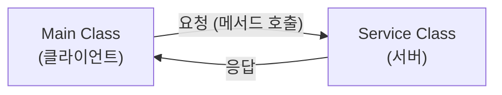
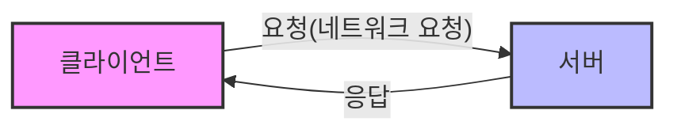
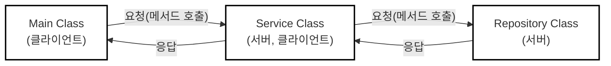

# 네트워크

## 1. 클라이언트와 서버

- **클라이언트**: 서비스를 요청하는 쪽이다. 식당에서 음식을 주문하는 손님처럼, 어떤 정보를 얻거나 작업을 처리해 달라고 요청하는 역할을 한다.
- **서버**: 클라이언트의 요청을 받아들이고 그 요청에 맞게 서비스를 제공하는 쪽이다. 식당에서 음식을 준비해 가져다주는 주방이나 웨이터와 같은 역할이다.
- 클라이언트가 요청을 보내고 서버가 이를 처리하여 응답을 돌려주는 이 구조를 **클라이언트-서버 모델**이라고 부른다.

### 1.1. 객체 간의 클라이언트-서버 관계



- `Main` 객체가 `Service` 객체의 메서드를 호출하면, `Main` 객체는 작업을 요청하는 **클라이언트**가 되고, `Service` 객체는 이를 수행하는 **서버**가 된다.
- 여기서 **응답**이란 단순히 결과값을 반환하는 것만을 뜻하지 않고, **요청한 서비스를 수행한 것 자체**를 의미한다. (반환 타입이 `void`여도 작업을 수행했다면 서버 역할을 한 것이다.)

### 1.2. 네트워크 상의 클라이언트-서버 관계



- 네트워크는 여러 대의 컴퓨터가 서로 연결되어 데이터를 주고받는 환경(예: 인터넷)이며, 여기서도 클라이언트-서버 모델이 핵심 역할을 한다.
- 스마트폰으로 웹사이트에 접속할 때 스마트폰이 클라이언트, 웹사이트를 운영하는 컴퓨터가 서버가 되어 웹페이지를 요청하고 응답받는 원리다.

### 1.3. 클라이언트와 서버가 동시에 될 수 있다



- 객체나 컴퓨터 시스템은 상황에 따라 역할이 유동적으로 변할 수 있다.
- `Main`이 `Service`를 호출할 때는 `Service`가 서버지만, 그 `Service`가 다시 `Repository`를 호출할 때는 `Service`가 클라이언트, `Repository`가 서버가 된다.
- 즉, 하나의 대상이 상황에 따라 **서버이면서 동시에 클라이언트**가 될 수 있다.

## 2. 네트워크 기본 이론

[인터넷 통신](../HTTP/http-internet-communication.md)

## 3. InetAddress

- 자바의 **`InetAddress`** 클래스를 사용하면 호스트 이름(Domain)을 통해 대상의 IP 주소를 찾을 수 있다.
- IP 주소를 찾는 과정은 다음과 같다.
  - 먼저 `InetAddress.getByName("호스트명")` 메서드를 사용하여 IP 주소 조회를 요청한다.
  - 이 과정에서 운영체제 시스템의 **로컬 호스트 파일**을 가장 먼저 확인한다.
    - 리눅스, Mac: `/etc/hosts`
    - 윈도우: `C:\Windows\System32\drivers\etc\hosts`
  - 만약 호스트 파일에 해당 이름이 정의되어 있지 않다면, 외부의 **DNS 서버**에 요청하여 최종적으로 IP 주소를 얻어온다.

## 4. Socket 연결과정

### 4.1. 클라이언트

```java
Socket socket = new Socket("localhost", PORT);
DataInputStream input = new DataInputStream(socket.getInputStream());
DataOutputStream output = new DataOutputStream(socket.getOutputStream());

output.writeUTF("TEST");
String received = input.readUTF();
```

- `localhost`를 통해 지정된 포트(예: 12345)로 TCP 접속을 시도한다.
- `localhost`는 IP가 아니므로 내부적으로 `InetAddress`를 사용하여 `127.0.0.1`이라는 매핑된 IP를 찾은 후 접속을 시도한다.
- 연결이 성공적으로 완료되면 서버와 통신할 수 있는 연결점인 **`Socket`** 객체를 반환한다.
- `Socket`은 서버와 데이터를 주고받기 위한 **스트림**을 제공한다.
  - **`InputStream`**: 서버에서 전달한 데이터를 클라이언트가 받을 때 사용한다.
  - **`OutputStream`**: 클라이언트에서 서버에 데이터를 전달할 때 사용한다.
- 순수 바이트(`byte`) 단위 변환의 번거로움을 줄이기 위해, 주로 `DataInputStream`이나 `DataOutputStream` 같은 보조 스트림을 연결하여 자바 데이터 타입 메시지를 편리하게 주고받는다.

### 4.2. 서버

```java
ServerSocket serverSocket = new ServerSocket(PORT);
```

- 클라이언트가 지정된 포트로 접속할 수 있도록 서버는 포트를 열어두어야 하며, 이때 **`ServerSocket`**(서버 소켓)이라는 특별한 소켓을 사용한다.
- 클라이언트가 해당 포트에 연결을 시도하면 운영체제(OS) 계층에서 **TCP 3-way handshake**가 발생하고 TCP 연결이 완료된다.
- 연결이 완료되면 서버의 운영체제는 **backlog queue**라는 공간에 클라이언트와 서버의 TCP 연결 정보(IP, PORT)를 보관한다.

```java
Socket socket = serverSocket.accept();
```

- `ServerSocket`은 단지 클라이언트와의 접속 연결(TCP)만 지원하는 특별한 소켓이므로, 실제 정보를 주고받기 위해서는 일반 **`Socket`** 객체가 별도로 필요하다.
- **`accept()`** 메서드를 호출하면 `backlog queue`에서 대기 중인 TCP 연결 정보를 조회한다.
  - 만약 큐에 연결 정보가 없다면 새로운 연결 정보가 생성될 때까지 **대기(블로킹)** 한다.
  - 연결 정보를 기반으로 통신용 `Socket` 객체를 생성하여 반환하고, 사용한 정보는 큐에서 제거한다.
- 연결된 소켓을 통해 클라이언트와 서버는 서로 데이터를 주고받게 되며, 클라이언트의 Output은 서버의 Input으로, 서버의 Output은 클라이언트의 Input으로 교차 연결된다.

### 4.3. 클라이언트와 랜덤 포트

- TCP 통신 시에는 클라이언트와 서버 양쪽 모두의 IP와 포트 정보가 필요하다.
- 클라이언트가 접속할 위치를 알아야 하므로 **서버의 포트는 명확하게 고정**되어 있어야 한다.
- 반면 통신을 시작하는 클라이언트의 경우에는 자신의 포트를 명시적으로 지정할 필요가 없다.
- 포트를 생략하고 연결을 시도하면, 클라이언트 PC의 운영체제가 현재 사용하지 않는 남는 포트 중 하나를 **랜덤으로 자동 할당**하여 통신에 사용한다.

## 5. ServerSocket과 여러 클라이언트

- 서버는 `ServerSocket`을 특정 포트(예: 12345)에 열어둔다.
- 50000번 포트를 사용하는 첫 번째 클라이언트가 접속을 시도하면, 운영체제(OS) 계층에서 **TCP 3-way handshake**가 발생하여 TCP 연결이 완료된다.
- 연결이 완료되면 서버의 OS는 **backlog queue**에 이 TCP 연결 정보를 보관한다.
- 이 시점에서 클라이언트 측은 이미 TCP 연결이 완료되었으므로 소켓 객체가 정상 생성되지만, **서버 측은 아직 일반 소켓 객체가 생성되지 않은 상태**이다.
- 연이어 60000번 포트를 사용하는 두 번째 클라이언트가 접속하더라도 동일하게 TCP 연결이 완료되고 큐에 정보가 쌓인다.
- 서버가 데이터를 주고받기 위해서는 큐의 정보를 기반으로 소켓을 획득해야 하므로, `ServerSocket.accept()`를 호출하여 큐에서 순서대로 첫 번째(50000번) 클라이언트용 소켓 객체를 먼저 생성한다.
- 이때 두 번째(60000번) 클라이언트는 서버 측 소켓 객체가 아직 없더라도 **TCP 연결 자체는 이미 완료된 상태**이므로 서버로 메시지를 먼저 보낼 수 있다.

### 5.1. Socket을 통해 스트림으로 메시지를 주고받는 과정

- **메시지 전송 흐름**
  - 클라이언트가 메시지를 보낼 때: 클라이언트 애플리케이션 → **OS TCP 송신 버퍼** → 클라이언트 네트워크 카드
  - 서버가 메시지를 읽을 때: 서버 네트워크 카드 → **OS TCP 수신 버퍼** → 서버 애플리케이션
- 두 번째(60000번) 클라이언트가 보낸 메시지는 서버 애플리케이션이 소켓을 통해 아직 읽어 들이지 않았기 때문에, **서버 OS의 TCP 수신 버퍼에서 대기**하게 된다.
- **핵심 원리**
  - 일반 소켓 객체 없이 서버 소켓만 열려 있어도 **TCP 연결 자체는 완료**된다 (서버 소켓은 연결 대기만 담당).
  - 하지만 연결 이후에 실제로 애플리케이션 레벨에서 메시지를 주고받으려면 반드시 **일반 소켓 객체가 필요**하다.
  - `accept()`는 이미 연결된 TCP 정보를 바탕으로 서버 측 소켓 객체를 생성하며, 이 소켓의 스트림을 통해 OS TCP 수신 버퍼의 메시지를 읽거나 전송할 수 있다.
  - `accept()` 메서드는 backlog 큐에 새로운 연결 정보가 들어올 때까지 계속 대기하는 **블로킹(Blocking)** 메서드이다.

### 5.2. 단일 스레드 서버의 한계

```java
ServerSocket serverSocket = new ServerSocket(12345);
Socket socket = serverSocket.accept(); // 블로킹

while(true) {
    String received = input.readUTF(); // 블로킹
    output.writeUTF(toSend);
}
```

- 단일 스레드로 동작하는 서버에서는 둘 이상의 클라이언트를 동시에 처리하지 못한다.
- 서버의 `main` 스레드가 특정 클라이언트와 메시지를 주고받는 루프(`while`)에 갇혀 있으면, 새로운 클라이언트가 접속하더라도 **`accept()` 메서드를 절대로 호출할 수 없다**.
- 네트워크 통신에는 다음과 같은 두 가지 핵심 **블로킹 작업**이 존재한다.
  - **`accept()`**: 새로운 클라이언트와의 접속 연결을 맺기 위해 대기
  - **`readXxx()`**: 연결된 클라이언트로부터 메시지가 도착하기를 대기
- 하나의 스레드에서 어느 한쪽의 블로킹 메서드에 멈춰 있으면 다른 작업을 전혀 수행할 수 없으므로, 이러한 각각의 블로킹 작업은 반드시 **별도의 스레드**를 할당하여 분리해서 처리해야 한다.

### 5.3. 멀티 스레드 서버의 동작 원리

```java
while (true) {
    Socket socket = serverSocket.accept(); // 블로킹
    log("소켓 연결: " + socket);

    SessionV3 session = new SessionV3(socket);
    Thread thread = new Thread(session);
    thread.start();
}
```

```java
public class SessionV3 implements Runnable {

    private final Socket socket;

    public SessionV3(Socket socket) {
        this.socket = socket;
    }

    @Override
    public void run() {
        try {
            DataInputStream input = new DataInputStream(socket.getInputStream());
            DataOutputStream output = new DataOutputStream(socket.getOutputStream());

            while (true) {
                // 클라이언트로부터 문자 받기
                String received = input.readUTF();
                log("client -> server: " + received);

                if (received.equals("exit")) {
                    break;
                }

                // 클라이언트에게 문자 보내기
                String toSend = received + " World!";
                output.writeUTF(toSend);
                log("client <- server: " + toSend);
            }

            // 자원 정리
            log("연결 종료: " + socket);
            input.close();
            output.close();
            socket.close();
        } catch (IOException e) {
            throw new RuntimeException(e);
        }
    }
}
```

- 클라이언트가 서버에 접속하면 서버 소켓의 `accept()` 메서드가 통신용 **`Socket`** 을 반환한다.
- `main` 스레드는 이 소켓 정보를 기반으로 `Runnable`을 구현한 **`Session`** 이라는 별도의 객체를 만들고, 이를 새로운 스레드(예: `Thread-0`)에서 실행한다.
- 생성된 `Session` 객체와 새 스레드는 해당 클라이언트 전담이 되어 메시지를 서로 주고받는다.
- 또 다른 새로운 접속(TCP 연결)이 발생하면, `main` 스레드는 다시 새로운 `Session` 객체를 생성하고 또 다른 별도의 스레드(예: `Thread-1`)에 처리를 맡기는 과정을 반복한다.

#### 역할의 분리

- **`main` 스레드의 역할**
  - 서버 소켓을 생성하고 `serverSocket.accept()`를 호출하여 새로운 연결을 **대기(블로킹)** 한다.
  - 새로운 접속이 발생할 때마다 전담 `Session` 객체와 **별도의 스레드를 생성**하여 실행을 위임하고, 자신은 즉시 다음 연결을 받기 위해 대기 상태로 돌아간다.
- **`Session` 전담 스레드의 역할**
  - 생성자를 통해 할당받은 특정 클라이언트의 **`Socket`** 객체를 전달받는다.
  - `Runnable`을 구현하여 `main` 스레드와는 **분리된 별도의 스레드에서 실행**된다.
  - 오직 자신과 연결된 단일 클라이언트와 스트림을 통해 메시지를 **반복해서 주고받는 역할**만 온전히 수행한다.
