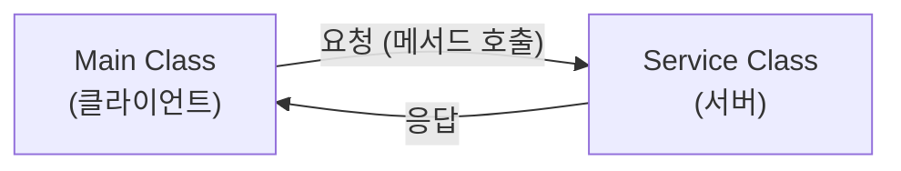
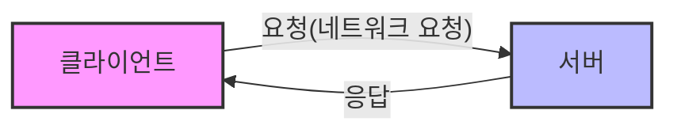
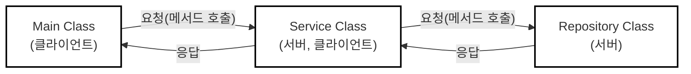

# 네트워크

## 1. 클라이언트와 서버

- **클라이언트**: 서비스를 요청하는 쪽이다. 식당에서 음식을 주문하는 손님처럼, 어떤 정보를 얻거나 작업을 처리해 달라고 요청하는 역할을 한다.
- **서버**: 클라이언트의 요청을 받아들이고 그 요청에 맞게 서비스를 제공하는 쪽이다. 식당에서 음식을 준비해 가져다주는 주방이나 웨이터와 같은 역할이다.
- 클라이언트가 요청을 보내고 서버가 이를 처리하여 응답을 돌려주는 이 구조를 **클라이언트-서버 모델**이라고 부른다.

### 1.1. 객체 간의 클라이언트-서버 관계

- `Main` 객체가 `Service` 객체의 메서드를 호출하면, `Main` 객체는 작업을 요청하는 **클라이언트**가 되고, `Service` 객체는 이를 수행하는 **서버**가 된다.
- 여기서 **응답**이란 단순히 결과값을 반환하는 것만을 뜻하지 않고, **요청한 서비스를 수행한 것 자체**를 의미한다. (반환 타입이 `void`여도 작업을 수행했다면 서버 역할을 한 것이다.)

### 1.2. 네트워크 상의 클라이언트-서버 관계

- 네트워크는 여러 대의 컴퓨터가 서로 연결되어 데이터를 주고받는 환경(예: 인터넷)이며, 여기서도 클라이언트-서버 모델이 핵심 역할을 한다.
- 스마트폰으로 웹사이트에 접속할 때 스마트폰이 클라이언트, 웹사이트를 운영하는 컴퓨터가 서버가 되어 웹페이지를 요청하고 응답받는 원리다.

### 1.3. 클라이언트와 서버가 동시에 될 수 있다

- 객체나 컴퓨터 시스템은 상황에 따라 역할이 유동적으로 변할 수 있다.
- `Main`이 `Service`를 호출할 때는 `Service`가 서버지만, 그 `Service`가 다시 `Repository`를 호출할 때는 `Service`가 클라이언트, `Repository`가 서버가 된다.
- 즉, 하나의 대상이 상황에 따라 **서버이면서 동시에 클라이언트**가 될 수 있다.
