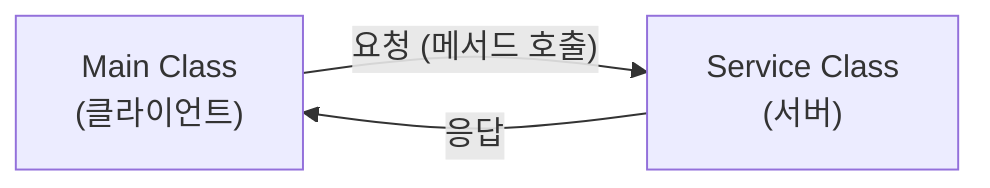
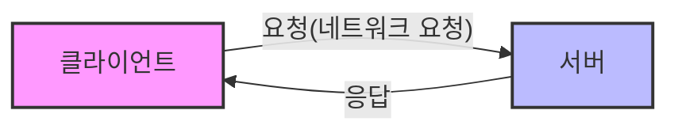
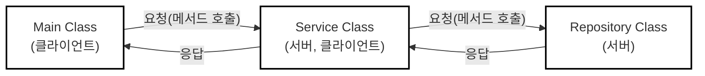

# 네트워크

## 1. 클라이언트와 서버

- **클라이언트**: 서비스를 요청하는 쪽이다. 식당에서 음식을 주문하는 손님처럼, 어떤 정보를 얻거나 작업을 처리해 달라고 요청하는 역할을 한다.
- **서버**: 클라이언트의 요청을 받아들이고 그 요청에 맞게 서비스를 제공하는 쪽이다. 식당에서 음식을 준비해 가져다주는 주방이나 웨이터와 같은 역할이다.
- 클라이언트가 요청을 보내고 서버가 이를 처리하여 응답을 돌려주는 이 구조를 **클라이언트-서버 모델**이라고 부른다.

### 1.1. 객체 간의 클라이언트-서버 관계



- `Main` 객체가 `Service` 객체의 메서드를 호출하면, `Main` 객체는 작업을 요청하는 **클라이언트**가 되고, `Service` 객체는 이를 수행하는 **서버**가 된다.
- 여기서 **응답**이란 단순히 결과값을 반환하는 것만을 뜻하지 않고, **요청한 서비스를 수행한 것 자체**를 의미한다. (반환 타입이 `void`여도 작업을 수행했다면 서버 역할을 한 것이다.)

### 1.2. 네트워크 상의 클라이언트-서버 관계



- 네트워크는 여러 대의 컴퓨터가 서로 연결되어 데이터를 주고받는 환경(예: 인터넷)이며, 여기서도 클라이언트-서버 모델이 핵심 역할을 한다.
- 스마트폰으로 웹사이트에 접속할 때 스마트폰이 클라이언트, 웹사이트를 운영하는 컴퓨터가 서버가 되어 웹페이지를 요청하고 응답받는 원리다.

### 1.3. 클라이언트와 서버가 동시에 될 수 있다



- 객체나 컴퓨터 시스템은 상황에 따라 역할이 유동적으로 변할 수 있다.
- `Main`이 `Service`를 호출할 때는 `Service`가 서버지만, 그 `Service`가 다시 `Repository`를 호출할 때는 `Service`가 클라이언트, `Repository`가 서버가 된다.
- 즉, 하나의 대상이 상황에 따라 **서버이면서 동시에 클라이언트**가 될 수 있다.

## 2. 네트워크 기본 이론

[인터넷 통신](../HTTP/http-internet-communication.md)

## 3. InetAddress

- 자바의 **`InetAddress`** 클래스를 사용하면 호스트 이름(Domain)을 통해 대상의 IP 주소를 찾을 수 있다.
- IP 주소를 찾는 과정은 다음과 같다.
  - 먼저 `InetAddress.getByName("호스트명")` 메서드를 사용하여 IP 주소 조회를 요청한다.
  - 이 과정에서 운영체제 시스템의 **로컬 호스트 파일**을 가장 먼저 확인한다.
    - 리눅스, Mac: `/etc/hosts`
    - 윈도우: `C:\Windows\System32\drivers\etc\hosts`
  - 만약 호스트 파일에 해당 이름이 정의되어 있지 않다면, 외부의 **DNS 서버**에 요청하여 최종적으로 IP 주소를 얻어온다.

## 4. Socket 연결과정

### 4.1. 클라이언트

```java
Socket socket = new Socket("localhost", PORT);
DataInputStream input = new DataInputStream(socket.getInputStream());
DataOutputStream output = new DataOutputStream(socket.getOutputStream());

output.writeUTF("TEST");
String received = input.readUTF();
```

- `localhost`를 통해 지정된 포트(예: 12345)로 TCP 접속을 시도한다.
- `localhost`는 IP가 아니므로 내부적으로 `InetAddress`를 사용하여 `127.0.0.1`이라는 매핑된 IP를 찾은 후 접속을 시도한다.
- 연결이 성공적으로 완료되면 서버와 통신할 수 있는 연결점인 **`Socket`** 객체를 반환한다.
- `Socket`은 서버와 데이터를 주고받기 위한 **스트림**을 제공한다.
  - **`InputStream`**: 서버에서 전달한 데이터를 클라이언트가 받을 때 사용한다.
  - **`OutputStream`**: 클라이언트에서 서버에 데이터를 전달할 때 사용한다.
- 순수 바이트(`byte`) 단위 변환의 번거로움을 줄이기 위해, 주로 `DataInputStream`이나 `DataOutputStream` 같은 보조 스트림을 연결하여 자바 데이터 타입 메시지를 편리하게 주고받는다.

### 4.2. 서버

```java
ServerSocket serverSocket = new ServerSocket(PORT);
```

- 클라이언트가 지정된 포트로 접속할 수 있도록 서버는 포트를 열어두어야 하며, 이때 **`ServerSocket`**(서버 소켓)이라는 특별한 소켓을 사용한다.
- 클라이언트가 해당 포트에 연결을 시도하면 운영체제(OS) 계층에서 **TCP 3-way handshake**가 발생하고 TCP 연결이 완료된다.
- 연결이 완료되면 서버의 운영체제는 **backlog queue**라는 공간에 클라이언트와 서버의 TCP 연결 정보(IP, PORT)를 보관한다.

```java
Socket socket = serverSocket.accept();
```

- `ServerSocket`은 단지 클라이언트와의 접속 연결(TCP)만 지원하는 특별한 소켓이므로, 실제 정보를 주고받기 위해서는 일반 **`Socket`** 객체가 별도로 필요하다.
- **`accept()`** 메서드를 호출하면 `backlog queue`에서 대기 중인 TCP 연결 정보를 조회한다.
  - 만약 큐에 연결 정보가 없다면 새로운 연결 정보가 생성될 때까지 **대기(블로킹)** 한다.
  - 연결 정보를 기반으로 통신용 `Socket` 객체를 생성하여 반환하고, 사용한 정보는 큐에서 제거한다.
- 연결된 소켓을 통해 클라이언트와 서버는 서로 데이터를 주고받게 되며, 클라이언트의 Output은 서버의 Input으로, 서버의 Output은 클라이언트의 Input으로 교차 연결된다.

### 4.3. 클라이언트와 랜덤 포트

- TCP 통신 시에는 클라이언트와 서버 양쪽 모두의 IP와 포트 정보가 필요하다.
- 클라이언트가 접속할 위치를 알아야 하므로 **서버의 포트는 명확하게 고정**되어 있어야 한다.
- 반면 통신을 시작하는 클라이언트의 경우에는 자신의 포트를 명시적으로 지정할 필요가 없다.
- 포트를 생략하고 연결을 시도하면, 클라이언트 PC의 운영체제가 현재 사용하지 않는 남는 포트 중 하나를 **랜덤으로 자동 할당**하여 통신에 사용한다.

## 5. ServerSocket과 여러 클라이언트

- 서버는 `ServerSocket`을 특정 포트(예: 12345)에 열어둔다.
- 50000번 포트를 사용하는 첫 번째 클라이언트가 접속을 시도하면, 운영체제(OS) 계층에서 **TCP 3-way handshake**가 발생하여 TCP 연결이 완료된다.
- 연결이 완료되면 서버의 OS는 **backlog queue**에 이 TCP 연결 정보를 보관한다.
- 이 시점에서 클라이언트 측은 이미 TCP 연결이 완료되었으므로 소켓 객체가 정상 생성되지만, **서버 측은 아직 일반 소켓 객체가 생성되지 않은 상태**이다.
- 연이어 60000번 포트를 사용하는 두 번째 클라이언트가 접속하더라도 동일하게 TCP 연결이 완료되고 큐에 정보가 쌓인다.
- 서버가 데이터를 주고받기 위해서는 큐의 정보를 기반으로 소켓을 획득해야 하므로, `ServerSocket.accept()`를 호출하여 큐에서 순서대로 첫 번째(50000번) 클라이언트용 소켓 객체를 먼저 생성한다.
- 이때 두 번째(60000번) 클라이언트는 서버 측 소켓 객체가 아직 없더라도 **TCP 연결 자체는 이미 완료된 상태**이므로 서버로 메시지를 먼저 보낼 수 있다.

### 5.1. Socket을 통해 스트림으로 메시지를 주고받는 과정

- **메시지 전송 흐름**
  - 클라이언트가 메시지를 보낼 때: 클라이언트 애플리케이션 → **OS TCP 송신 버퍼** → 클라이언트 네트워크 카드
  - 서버가 메시지를 읽을 때: 서버 네트워크 카드 → **OS TCP 수신 버퍼** → 서버 애플리케이션
- 두 번째(60000번) 클라이언트가 보낸 메시지는 서버 애플리케이션이 소켓을 통해 아직 읽어 들이지 않았기 때문에, **서버 OS의 TCP 수신 버퍼에서 대기**하게 된다.
- **핵심 원리**
  - 일반 소켓 객체 없이 서버 소켓만 열려 있어도 **TCP 연결 자체는 완료**된다 (서버 소켓은 연결 대기만 담당).
  - 하지만 연결 이후에 실제로 애플리케이션 레벨에서 메시지를 주고받으려면 반드시 **일반 소켓 객체가 필요**하다.
  - `accept()`는 이미 연결된 TCP 정보를 바탕으로 서버 측 소켓 객체를 생성하며, 이 소켓의 스트림을 통해 OS TCP 수신 버퍼의 메시지를 읽거나 전송할 수 있다.
  - `accept()` 메서드는 backlog 큐에 새로운 연결 정보가 들어올 때까지 계속 대기하는 **블로킹(Blocking)** 메서드이다.

### 5.2. 단일 스레드 서버의 한계

```java
ServerSocket serverSocket = new ServerSocket(12345);
Socket socket = serverSocket.accept(); // 블로킹

while(true) {
    String received = input.readUTF(); // 블로킹
    output.writeUTF(toSend);
}
```

- 단일 스레드로 동작하는 서버에서는 둘 이상의 클라이언트를 동시에 처리하지 못한다.
- 서버의 `main` 스레드가 특정 클라이언트와 메시지를 주고받는 루프(`while`)에 갇혀 있으면, 새로운 클라이언트가 접속하더라도 **`accept()` 메서드를 절대로 호출할 수 없다**.
- 네트워크 통신에는 다음과 같은 두 가지 핵심 **블로킹 작업**이 존재한다.
  - **`accept()`**: 새로운 클라이언트와의 접속 연결을 맺기 위해 대기
  - **`readXxx()`**: 연결된 클라이언트로부터 메시지가 도착하기를 대기
- 하나의 스레드에서 어느 한쪽의 블로킹 메서드에 멈춰 있으면 다른 작업을 전혀 수행할 수 없으므로, 이러한 각각의 블로킹 작업은 반드시 **별도의 스레드**를 할당하여 분리해서 처리해야 한다.

### 5.3. 멀티 스레드 서버의 동작 원리

```java
while (true) {
    Socket socket = serverSocket.accept(); // 블로킹
    log("소켓 연결: " + socket);

    SessionV3 session = new SessionV3(socket);
    Thread thread = new Thread(session);
    thread.start();
}
```

```java
public class SessionV3 implements Runnable {

    private final Socket socket;

    public SessionV3(Socket socket) {
        this.socket = socket;
    }

    @Override
    public void run() {
        try {
            DataInputStream input = new DataInputStream(socket.getInputStream());
            DataOutputStream output = new DataOutputStream(socket.getOutputStream());

            while (true) {
                // 클라이언트로부터 문자 받기
                String received = input.readUTF();
                log("client -> server: " + received);

                if (received.equals("exit")) {
                    break;
                }

                // 클라이언트에게 문자 보내기
                String toSend = received + " World!";
                output.writeUTF(toSend);
                log("client <- server: " + toSend);
            }

            // 자원 정리
            log("연결 종료: " + socket);
            input.close();
            output.close();
            socket.close();
        } catch (IOException e) {
            throw new RuntimeException(e);
        }
    }
}
```

- 클라이언트가 서버에 접속하면 서버 소켓의 `accept()` 메서드가 통신용 **`Socket`** 을 반환한다.
- `main` 스레드는 이 소켓 정보를 기반으로 `Runnable`을 구현한 **`Session`** 이라는 별도의 객체를 만들고, 이를 새로운 스레드(예: `Thread-0`)에서 실행한다.
- 생성된 `Session` 객체와 새 스레드는 해당 클라이언트 전담이 되어 메시지를 서로 주고받는다.
- 또 다른 새로운 접속(TCP 연결)이 발생하면, `main` 스레드는 다시 새로운 `Session` 객체를 생성하고 또 다른 별도의 스레드(예: `Thread-1`)에 처리를 맡기는 과정을 반복한다.

#### 역할의 분리

- **`main` 스레드의 역할**
  - 서버 소켓을 생성하고 `serverSocket.accept()`를 호출하여 새로운 연결을 **대기(블로킹)** 한다.
  - 새로운 접속이 발생할 때마다 전담 `Session` 객체와 **별도의 스레드를 생성**하여 실행을 위임하고, 자신은 즉시 다음 연결을 받기 위해 대기 상태로 돌아간다.
- **`Session` 전담 스레드의 역할**
  - 생성자를 통해 할당받은 특정 클라이언트의 **`Socket`** 객체를 전달받는다.
  - `Runnable`을 구현하여 `main` 스레드와는 **분리된 별도의 스레드에서 실행**된다.
  - 오직 자신과 연결된 단일 클라이언트와 스트림을 통해 메시지를 **반복해서 주고받는 역할**만 온전히 수행한다.

## 6. 자원 정리

- 앞서 다룬 멀티 스레드 서버 구조에서 접속 중인 클라이언트를 강제로 종료시키면, TCP 연결이 비정상적으로 끊어지면서 서버의 `readUTF()` 메서드 등에서 **예외가 발생**한다.
- 문제는 이러한 예외로 인해 정상적인 실행 흐름이 중단되어, 사용하던 소켓이나 스트림을 닫는 **자원 정리가 제대로 수행되지 않는다**는 점이다.
- 서버는 일반 PC와 달리 자주 재시작하지 않으므로, 닫히지 않은 자원(메모리, 포트 등)이 계속 누적되면 결국 자원 고갈로 인해 **서버 시스템 전체가 다운되는 치명적인 문제**로 이어질 수 있다.
- **자원 정리 순서**
  - 서로 관련된 자원을 해제할 때는 **나중에 생성한 자원을 먼저 정리**해야 한다.
  - 예를 들어 `resource1`을 만들고 이를 기반으로 `resource2`를 생성했다면, 자원을 닫을 때는 역순으로 `resource2`, `resource1` 순서로 처리해야 한다.

### 6.1. try-catch-finally 자원 정리의 문제점

```java
try {
    resource1 = new ResourceV1("resource1");
    resource2 = new ResourceV1("resource2");

    resource1.call();
    resource2.callEx(); // CallException 발생
} catch (CallException e) {
    System.out.println("ex: " + e);
    throw e;
} finally {
    if (resource2 != null) {
        resource2.closeEx(); // CloseException 발생!
    }
    if (resource1 != null) {
        resource1.closeEx(); // 이 코드 호출 안됨!
    }
}
```

- `finally` 블록을 사용하면 실행 결과와 상관없이 자원 정리 코드가 호출되도록 할 수 있지만, 객체 생성 도중 예외가 발생할 수 있으므로 매번 번거로운 **`null` 체크**가 필요하다.
- 더 큰 문제는 위와 같은 `try-catch-finally` 구조가 다음과 같은 **두 가지 치명적인 한계**를 가진다는 점이다.
  - **자원 정리 누락 문제**
    - `finally` 블록 안에서 `resource2`를 닫다가 예외(`CloseException`)가 발생하면 그 즉시 실행 흐름이 밖으로 던져진다.
    - 결과적으로 그 아래에 작성된 `resource1.closeEx()`는 아예 호출되지 않아 **나머지 자원이 정상적으로 닫히지 않는 문제**가 발생한다.
  - **핵심 예외 소실 문제**
    - 실제 비즈니스 로직에서 발생한 진짜 원인인 **핵심 예외**(`CallException`)가 발생했음에도 불구하고, 자원을 정리하다 발생한 부가적인 예외(`CloseException`)가 이를 **덮어씌워 버린다**.
    - 메서드를 호출한 쪽에서는 진짜 원인인 핵심 예외가 아니라 `finally`에서 덮어씌워진 예외를 받게 되므로, 원인 파악과 디버깅이 매우 어려워진다.

### 6.2. 개선된 finally 자원 정리와 남은 한계

```java
try {
    resource1 = new ResourceV1("resource1");
    resource2 = new ResourceV1("resource2");

    resource1.call();
    resource2.callEx(); // CallException 발생
} catch (CallException e) {
    System.out.println("ex: " + e);
    throw e;
} finally {
    if (resource2 != null) {
        try {
            resource2.closeEx(); // CloseException 발생!
        } catch (CloseException e) {
            // close()에서 발생한 예외는 버린다. 필요하면 로깅 정도
            System.out.println("close ex: " + e);
        }
    }
    if (resource1 != null) {
        try {
            resource1.closeEx();
        } catch (CloseException e) {
            System.out.println("close ex: " + e);
        }
    }
}
```

- `finally` 블록 안에서 각각의 자원을 닫을 때 발생하는 예외를 다시 `try-catch`로 잡아서 처리하도록 코드를 개선한 방식이다.
- 자원 정리 시점에 발생한 예외는 당장 더 처리할 수 있는 부분이 없으므로, **로그를 남겨서 개발자가 인지**할 수 있게 하는 정도로 충분하다.
- 이렇게 수정하면 이전 코드에서 발생했던 **두 가지 치명적인 문제**를 해결할 수 있다.
  - `close()` 시점에 예외가 던져지더라도 이를 내부에서 처리하므로, 흐름이 끊기지 않고 **이후의 다른 자원들을 정상적으로 닫을 수 있다**.
  - 자원 정리 중 발생한 부가 예외가 기존의 예외를 덮어씌우는 현상을 방지하여, 진짜 원인인 **핵심 예외가 안전하게 보존**된다.
- 치명적인 문제들은 해결되었지만, 이 방식 역시 코드 구조상 다음과 같은 **여러 한계점**이 여전히 남아 있다.
  - `try` 블록과 `finally` 블록의 변수 스코프(범위)가 달라서, 자원 변수를 **선언함과 동시에 할당할 수 없다**.
  - `catch` 블록이 실행된 이후에야 `finally`가 호출되므로 **자원 정리가 조금 늦어진다**.
  - 개발자가 실수로 `close()` 호출 코드를 작성하지 않아 자원이 누락될 **휴먼 에러의 위험성**이 존재한다.
  - 자원은 생성한 순서의 역순으로 닫아야 하는데, 개발자가 **닫는 순서를 실수할 가능성**이 있다.
- 과거 수많은 자바 개발자들을 고통받게 했던 이러한 복잡한 자원 정리 문제들을 한 번에 깔끔하게 해결해 주는 문법이 바로 **`try-with-resources`** 구문이다.

### 6.3. try-with-resources 구문을 통한 완벽한 자원 정리

```java
public class ResourceV2 implements AutoCloseable {
    @Override
    public void close() throws CloseException {
        System.out.println(name + " close");
        throw new CloseException(name + " ex");
    }
}
```

```java
try (ResourceV2 resource1 = new ResourceV2("resource1");
     ResourceV2 resource2 = new ResourceV2("resource2")) {

    resource1.call();
    resource2.callEx(); // CallException 발생
} catch (CallException e) {
    System.out.println("ex: " + e);
    throw e; // CallException
}
```

- `try-with-resources` 구문을 사용하려면 해당 자원 클래스가 반드시 **`AutoCloseable`** 인터페이스를 구현해야 한다.
- 위 코드에서는 자원이 닫힐 때 `close()` 메서드가 항상 `CloseException`을 던지도록 설정했다.
- **`try-with-resources`** 구문은 단순히 `close()`를 자동으로 호출해 주는 것을 넘어, 앞서 `finally` 방식에서 겪었던 문제들을 해결하는 강력한 장치이다.

#### try-with-resources의 장점

- **리소스 누수 방지**: 모든 리소스가 무조건 제대로 닫히도록 보장하여, `finally` 블록 작성 누락이나 내부 자원 해제 코드 누락 등의 휴먼 에러를 원천적으로 예방한다.
- **코드 간결성 및 가독성 향상**: 명시적으로 `close()`를 호출하는 복잡한 코드가 사라져 코드가 훨씬 간결해진다.
- **스코프 범위 한정**: 리소스로 사용되는 변수(`resource1`, `resource2`)의 스코프(범위)가 `try` 블록 안으로만 깔끔하게 한정되므로 유지보수가 쉬워진다.
- **조금 더 빠른 자원 해제**: 기존 방식처럼 `catch`나 `finally`로 넘어간 후 닫는 것이 아니라, `try` 블록의 실행이 끝나는 즉시 `close()`를 우선 호출하여 자원을 더 빠르게 반납한다.
- **정확한 자원 정리 순서**: 먼저 선언한 자원을 나중에 정리하는 역순 구조를 알아서 안전하게 지켜준다.

#### 예외 처리와 부가 예외(Suppressed) 포함

- 만약 핵심 로직을 실행하다가 예외가 발생하고, 자원을 닫는 `close()` 과정에서도 부가 예외가 동시에 발생하면 어떻게 될까?
- 기존 `finally` 구조에서는 부가 예외가 핵심 예외를 덮어씌워 버렸지만, `try-with-resources`는 진짜 원인인 **핵심 예외를 정상적으로 반환**한다.
- 이때 자원을 닫다가 발생한 부가 예외는 버려지지 않고, 핵심 예외 안에 **`Suppressed`(억제된 예외)** 형태로 안전하게 담겨서 함께 반환된다.
- 개발자는 디버깅 시 **`e.getSuppressed()`** 메서드를 호출하여 자원 정리 중에 발생한 부가 예외 내역도 빠짐없이 확인할 수 있다.
- 참고로 자바 예외 처리의 `e.addSuppressed(ex)` 기능 역시 이 `try-with-resources` 문법과 함께 도입된 기능이다.

### 6.4. 참고 - 윈도우 OS에서 오류 발생

- 클라이언트 프로세스를 직접 종료하여 클라이언트와 서버의 TCP 연결이 함께 종료될 때, 운영체제(OS)에 따라 발생하는 예외가 다르다.
- 맥(Mac) OS에서는 `java.io.EOFException`이 발생하지만, 윈도우(Windows) OS에서는 **`java.net.SocketException: Connection reset`** 이 발생한다.
- 하지만 두 예외 모두 **`java.io.IOException`** 의 자식 클래스이므로, `catch (IOException e)` 구문을 통해 동일하게 잡아서 처리할 수 있다.
- 이렇게 OS별로 예외 차이가 발생하는 이유는, 소켓을 정상적으로 닫지 않고 프로그램이 종료되었을 때 각 OS가 남아있는 TCP 연결을 정리하는 방식이 다르기 때문이다.
  - **Mac**: 남아있는 TCP 연결을 **정상 종료** 방식으로 처리한다.
  - **Windows**: 남아있는 TCP 연결을 **강제 종료** 방식으로 처리한다.

### 6.5. 외부 자원의 try-with-resources 활용

```java
try (socket;
     DataInputStream input = new DataInputStream(socket.getInputStream());
     DataOutputStream output = new DataOutputStream(socket.getOutputStream())) {

    // ...

} catch (IOException e) {
    log(e);
}
```

- `Socket` 객체처럼 현재 클래스(`Session`) 내부에서 직접 생성하는 것이 아니라 **외부에서 전달(주입)받은 객체**도 `try-with-resources` 구문을 통해 안전하게 자원을 해제할 수 있다.
- 위 예제 코드처럼 `try` 괄호 선언부에 새로 객체를 생성하지 않고 기존 객체의 참조 변수(`socket`)만 단독으로 넣어두면, 해당 블록이 끝나는 자원 정리 시점에 알아서 **`AutoCloseable`의 `close()` 메서드가 정상적으로 호출**된다. (자바 9부터 지원되는 문법)
