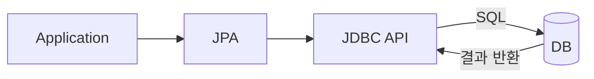
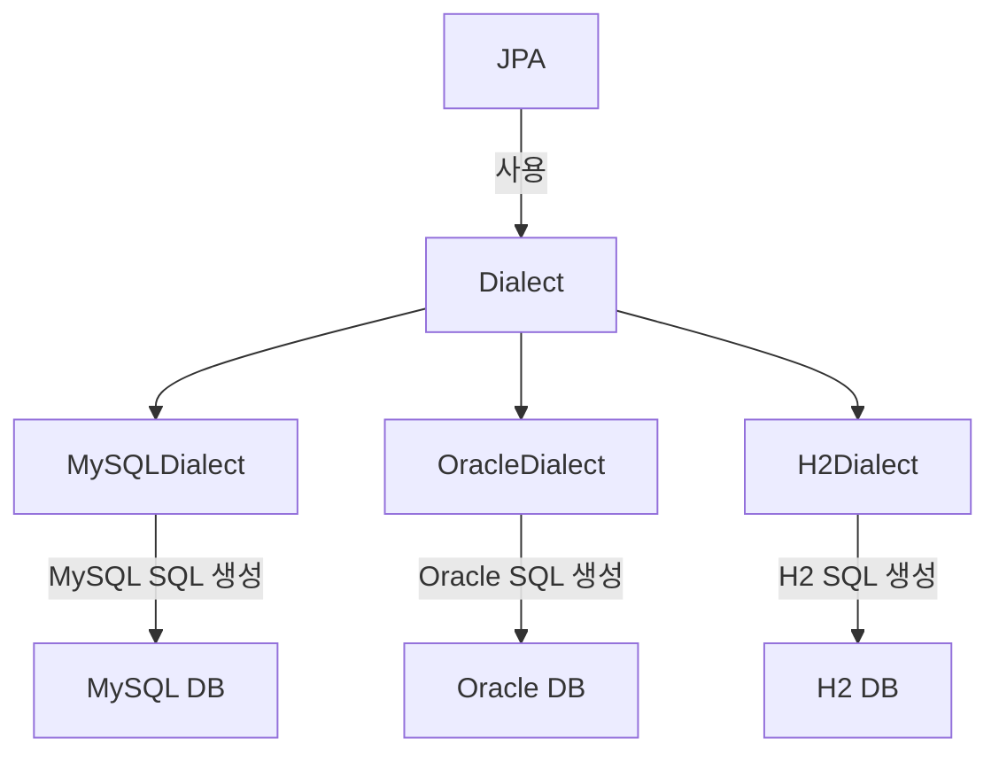

# JPA

## JPA가 어려운 이유

1. 객체-테이블 매핑: 객체와 테이블을 제대로 설계하고 매핑하는 방법을 모르면, JPA를 사용할 때 혼란이 올 수 있다.
2. JPA 내부 동작 방식: JPA의 내부 동작 방식을 잘 이해하지 못하면, 성능 문제나 잘못된 동작을 유발할 수 있다.

## SQL 중심적인 개발의 문제점

애플리케이션은 객체지향 언어로 개발되고, 데이터베이스는 관계형 데이터베이스를 사용한다. 이로 인해 객체를 관계형 데이터베이스에 저장하고 조회하는 일이 많아지며, SQL 작성이 많아지기 때문에 SQL 의존적인 개발을 피하기 어려운 상황이 발생한다.

## 패러다임 불일치

객체와 관계형 데이터베이스 간의 차이가 존재한다

1. 상속
   - 객체는 상속 관계를 사용하지만, 관계형 데이터베이스에서는 슈퍼타입/서브타입 관계로 표현.
2. 연관관계
   - 객체는 참조를 사용하지만, 데이터베이스는 외래 키를 사용.
3. 객체 그래프 탐색
   - 객체는 자유롭게 객체 그래프를 탐색할 수 있지만, 데이터베이스는 처음 실행하는 SQL에 따라 실행 범위가 결정된다.
4. 데이터 식별 방법: 동일한 데이터를 가리키는 객체가 데이터베이스에서 여러 번 조회될 때마다 매번 다른 메모리 주소를 가진 객체가 생성된다. 이 객체들은 같은 데이터를 참조하지만, 각각은 서로 다른 객체로 인식된다.

---

## JPA(Java Persistence API)

- 자바 진형의 ORM 기술 표준
- 애플리케이션과 JDBC 사이에서 동작한다.

- Application: 애플리케이션에서 ORM(JPA)을 통해 데이터를 조회하고 저장한다.
- JPA: SQL을 생성하고, JDBC를 통해 DB와 연결된다.
- JDBC: Java에서 DB와 직접 연결하는 API로, SQL 실행을 담당한다.
- Database: 최종적으로 데이터를 저장하는 관계형 데이터베이스.

## ORM (Object-Relational Mapping)

- ORM은 객체지향 프로그래밍에서 객체를 관계형 데이터베이스에 저장할 수 있게 해주는 기법이다.
- 객체는 객체대로 설계하고, 관계형 데이터베이스는 관계형 데이터베이스대로 설계한 뒤, ORM 프레임워크가 중간에서 두 개를 매핑한다.

## 왜 JPA를 사용해야 하는가

1. 객체 중심 개발
   - 기존의 SQL 중심 개발에서 객체 중심 개발로 전환할 수 있다. 이를 통해 코드가 더 직관적이고 유지보수가 쉬워진다.
2. 생산성 향상
   - SQL을 직접 작성할 필요가 줄어들고, 반복적인 데이터 접근 코드가 줄어든다.
3. 패러다임 불일치 해결
   - 객체와 관계형 데이터베이스 간의 차이를 해결해준다. 상속, 연관 관계, 객체 그래프 탐색 등의 문제를 JPA가 내부적으로 해결해준다.
4. 성능 향상
   - JPA는 다양한 성능 최적화 기능을 제공한다. 지연 로딩(Lazy Loading), 캐싱, 배치 처리 등을 통해 성능을 향상시킬 수 있다.
5. 추상화 및 벤더 독립성
   - 데이터베이스 벤더에 종속되지 않으며, 다양한 데이터베이스를 지원한다.
6. 표준
   - JPA는 자바 진영에서 표준으로 채택된 기술로, 다른 ORM 프레임워크와의 호환성도 뛰어나다.

## 데이터베이스 방언(Dialect)

데이터베이스 방언(Dialect)은 각 DBMS가 제공하는 SQL의 변형으로, 표준 SQL(ANSI SQL)을 기반으로 하여 DBMS 특화 기능이나 문법을 추가한 것이다. MySQL, PostgreSQL, Oracle, SQL Server는 각각 고유한 SQL 방언을 사용한다.
JPA는 특정 데이터베이스에 종속되지 않는다. -> 추상화 및 벤더 독립성

## 영속성 관리

[영속성 관리](./jpa-persistence.md)

## 엔티티 매핑

[엔티티 매핑](./jpa-entity-mapping.md)

## 연관관계 매핑 기초

[연관관계 매핑 기초](./jpa-relationship-mapping-basic.md)

## 다양한 연관관계 매핑

[다양한 연관관계 매핑](./jpa-relationship-mapping.md)

## 고급 매핑

[고급 매핑](./jpa-relationship-mapping-advanced.md)

## 프록시와 연관관계 정리

[프록시와 연관관계 정리](./jpa-proxy-association.md)
