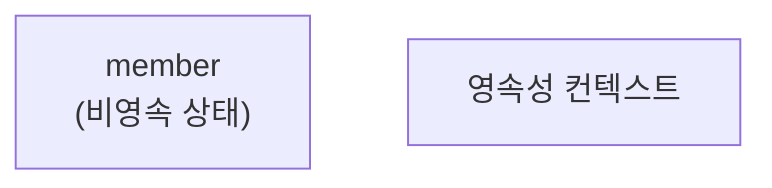
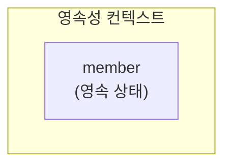
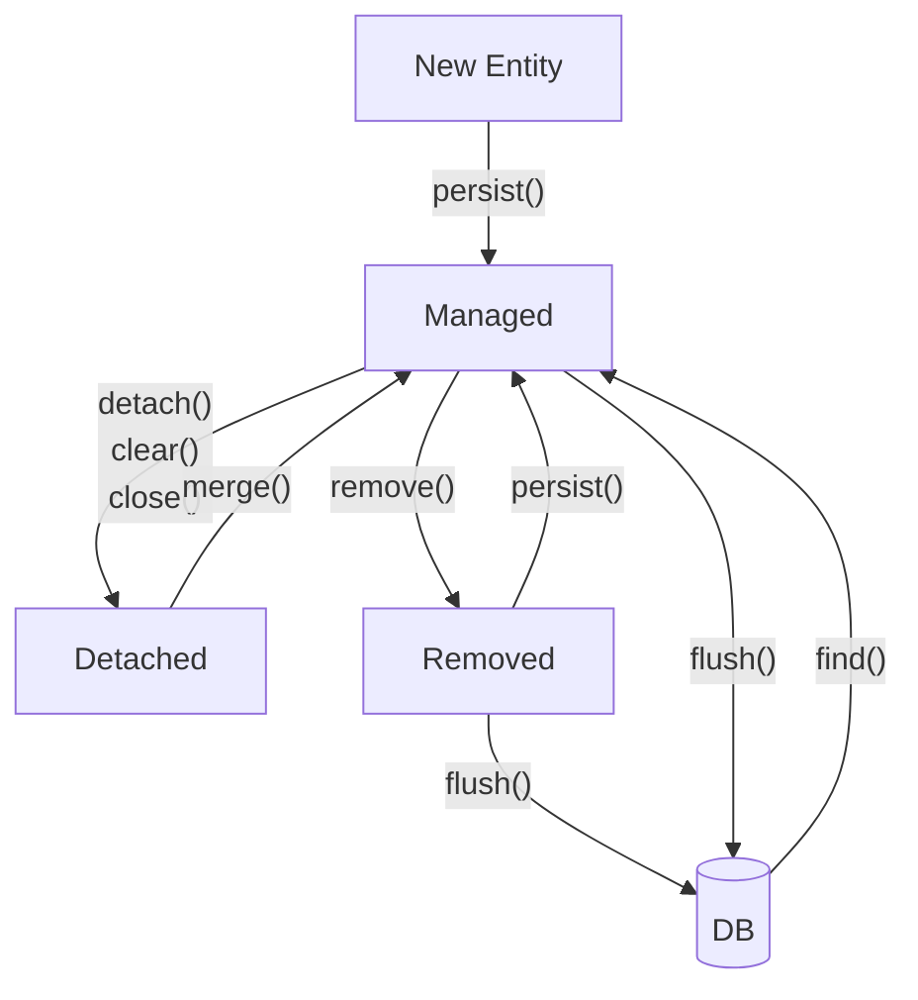

# 영속성 관리

## 엔티티(Entity)

- JPA에서 데이터베이스 테이블과 1:1로 매핑되는 자바 클래스다.
- 데이터베이스의 행을 자바 객체로 표현하며, 객체지향적인 프로그래밍 방식으로 데이터베이스 작업을 할 수 있도록 지원한다.

## 영속성 컨텍스트(Persistence Context)

- 엔티티를 영구적으로 저장하는 환경으로, 애플리케이션과 데이터베이스 간의 중간 저장소 역할을 한다.
- 실제로 메모리에 존재하는 물리적인 객체가 아니라, 엔티티의 상태를 관리하기 위한 논리적인 개념이다.
- 직접 접근할 수 없으며,  `EntityManager` 를 통해서만 접근할 수 있다.

## 엔티티 매니저(EntityManager)

- 영속성 컨텍스트와 애플리케이션 간의 인터페이스 역할을 한다.
- 엔티티를 관리하고 데이터베이스와 상호작용하는 데 필요한 주요 API를 제공한다.
- 트랜잭션 범위 내에서 생성되며, 트랜잭션이 끝나면 닫혀야 한다. 
- 재사용이 불가능하며, 멀티 쓰레드 환경에서 공유하면 안 된다.

## 엔티티 매니저 팩토리(EntityManagerFactory)

- 애플리케이션 전체에서 하나만 생성하여 공유한다.
- `EntityManager`를 생성하는 역할을 하며, 데이터베이스 연결과 관련된 리소스를 관리한다.
- 애플리케이션 종료 시 close()를 호출하여 자원을 해제해야 한다.

## 엔티티 매니저, 엔티티 매니저 팩토리 예제 코드

```java
import jakarta.persistence.EntityManager;
import jakarta.persistence.EntityManagerFactory;
import jakarta.persistence.EntityTransaction;
import jakarta.persistence.Persistence;

public class JpaExample {
	public static void main(String[] args) {
		// EntityManagerFactory 생성 (애플리케이션 전체에서 하나만 생성)
		EntityManagerFactory emf = Persistence.createEntityManagerFactory("hello");

		// EntityManager 생성 (사용할 때마다 생성)
		EntityManager em = emf.createEntityManager();

		// 트랜잭션 시작
		EntityTransaction tx = em.getTransaction();
		tx.begin();

		try {
			// 비즈니스 로직 실행
			tx.commit(); // 트랜잭션 커밋
		}
		catch(Exception e) {
			tx.rollback(); // 예외 발생 시 롤백
		}
		finally {
			em.close(); // EntityManager 종료
		}

		emf.close(); // 애플리케이션 종료 시 EntityManagerFactory 닫기
	}
}

```

## 엔티티의 생명주기

### 비영속(new/transient)

영속성 컨텍스트와 관게가 없는 **새로운** 상태
`persist()` 를 호출하기 전까지는 영속성 컨텍스트에 저장되지 않는다.



```java
// 객체를 생성한 상태(비영속)
Member memeber = new Member();
member.setId("member1");
member.setUsername("회원1");
```

### 영속(managed)

영속성 컨텍스트에 **관리**되는 상태
`persist()` 를 호출하면 엔티티가 영속성 컨텍스트에 저장된다.



```java
EntityManager em = emf.createEntityManager();
em.getTransaction().begin();

Member member = new Member();
member.setId("member1");
member.setUsername("회원1");

// 객체를 저장한 상태 (영속)
em.persist(member);
```

### 준영속(detached)

영속성 컨텍스트에 저장되었다가 **분리**된 상태
`detach()` , `clear()` , `close()` 를 호출하면 영속성 컨텍스트에서 관리되지 않는다.

```java
// 회원 엔티티를 영속성 컨텍스트에서 분리한 상태(준영속)
em.detach(member);
```

### 삭제(removed)

엔티티가 **삭제**된 상태
remove()를 호출하면 해당 엔티티는 영속성 컨텍스트에서 제거되고, 트랜잭션을 커밋하면 데이터베이스에서도 삭제된다.

```java
// 객체를 삭제한 상태(삭제)
em.remove(member);
```

### 정리



- `persist()`: 비영속 → 영속
- `detach()` ,  `clear()` ,  `close()` : 영속 → 준영속
- `merge()`: 준영속 → 영속
- `remove()`: 영속 → 삭제
- `flush()`: 변경 사항을 즉시 DB에 반영
- `find()`: DB에서 데이터를 조회하여 영속 상태로 변경

## 영속성 컨텍스트의 이점

영속성 컨텍스트는 엔티티의 상태를 관리하며, 다양한 최적화 기능을 제공하여 애플리케이션의 성능과 일관성을 향상시킨다.

### 1. 엔티티 조회, 1차 캐시

- JPA는 영속성 컨텍스트 내부에 1차 캐시(First-Level Cache) 를 제공한다.
- 동일한 엔티티를 여러 번 조회할 경우, 데이터베이스에 쿼리를 보내지 않고 메모리(1차 캐시)에서 값을 가져온다.
- 성능 최적화와 데이터베이스 부하 감소 효과를 얻을 수 있다.

```java
// 엔티티 조회 시 첫 번째는 DB에서 가져오고, 두 번째는 1차 캐시에서 조회됨
Member member1 = em.find(Member.class, 1L); // DB 조회 → 1차 캐시에 저장
Member member2 = em.find(Member.class, 1L); // 1차 캐시에서 조회 (DB 조회 X)
```

### 2. 동일성 보장

- 영속성 컨텍스트는 같은 트랜잭션 내에서 동일한 엔티티 객체를 반환한다.
- 같은 id 값을 가진 엔티티를 조회하면 항상 같은 인스턴스가 반환되며, == 비교가 가능하다.
- 반복 가능한 읽기(REPEATABLE READ) 등급의 트랜잭션 격리 수준을 애플리케이션 차원에서 제공하여, 데이터베이스 부하를 줄인다.

```java
Member memberA = em.find(Member.class, 1L);
Member memberB = em.find(Member.class, 1L);

System.out.println(memberA == memberB); // true (같은 인스턴스)
```

### 3. 트랜잭션을 지원하는 쓰기 지연(transcational write-behind)

- JPA는 트랜잭션이 커밋될 때까지 INSERT, UPDATE, DELETE 쿼리를 지연시켜 한꺼번에 실행한다.
- 이를 통해 불필요한 데이터베이스 I/O를 최소화하고, 성능을 향상시킨다.
- hibernate에서는 hibernate.jdbc.batch_size 옵션을 통해 한 번에 처리할 수 있는 쿼리 수를 지정할 수 있다.

```java
em.persist(member1);
em.persist(member2);
em.persist(member3);

// 트랜잭션 커밋 시, INSERT 쿼리가 한꺼번에 실행됨
tx.commit();
```

### 4. 변경 감지(dirty check)

- 영속성 컨텍스트는 엔티티의 변경 사항을 자동으로 감지하여 변경된 필드만 업데이트하는 UPDATE 쿼리를 생성한다.
- 변경 감지 동작 방식
  - 스냅샷 저장: 데이터베이스에서 엔티티를 조회하면, 조회 시점의 값(스냅샷) 을 내부적으로 저장한다.
  - 변경 사항 비교: 엔티티의 값을 변경하면, 스냅샷과 현재 상태를 비교하여 변경된 필드를 찾는다.
  - 트랜잭션 커밋 시점에 반영: `flush()` 또는 `commit()` 시점에 변경 사항을 감지하고, 변경된 필드만 포함된 UPDATE SQL을 실행한다.
  - SQL 직접 작성 없이 자동 반영: 변경 감지를 통해 명시적인 UPDATE SQL을 작성할 필요 없이 JPA가 자동으로 처리해준다.

```java
Member member = em.find(Member.class, 1L); // 1차 캐시에 저장 & 스냅샷 저장
member.setUsername("변경된 회원"); // 값 변경 (UPDATE 실행 X)

// 트랜잭션 커밋 시점에서 변경 감지 → UPDATE 실행
tx.commit();
```

### 5. 지연 로딩(lazy loading)

- 실제 엔티티가 필요할 때까지 데이터베이스 조회를 지연한다.
- 연관된 엔티티를 즉시 조회하는 즉시 로딩(Eager Loading) 대신, 지연 로딩(Lazy Loading) 을 사용하여 성능을 최적화할 수 있다.

```java
@Entity
public class Member {
    @Id @GeneratedValue
    private Long id;
    
    @ManyToOne(fetch = FetchType.LAZY) // 지연 로딩 설정
    private Team team;
}

Member member = em.find(Member.class, 1L); // Team 엔티티 조회 X (프록시 객체)
System.out.println(member.getTeam().getName()); // 이때 쿼리 실행 (Team 조회)
```

## 플러시

- 플러시(Flush) 는 영속성 컨텍스트의 변경 내용을 데이터베이스에 반영하는 과정이다.
- 하지만 영속성 컨텍스트를 비우지는 않으며, 단순히 변경 사항을 DB에 반영할 뿐이다.
- 트랜잭션 작업 단위에서 커밋 직전에 동기화하는 것이 중요하다.

### 플러시가 발생할 때 일어나는 동작

- 변경 감지
- 수정된 엔티티 쓰기 지연 SQL 저장소에 등록
- 쓰기 지연 SQL 저장소의 쿼리를 데이터베이스에 전송

### 영속성 컨텍스트를 플러시 하는 방법

- `em.flush()` -> 직접 호출
- 트랜잭션 커밋 -> 자동 호출
- JPQL 쿼리 실행 -> 자동 호출

### JPQL 쿼리 실행 시 플러시가 되는 이유

JPQL은 SQL을 직접 실행하므로, DB와 영속성 컨텍스트의 데이터 불일치를 방지하기 위해 자동으로 `flush()` 가 발생한다.
