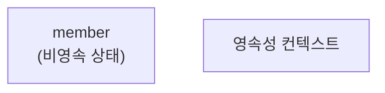
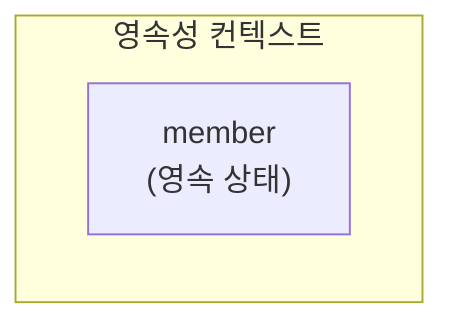
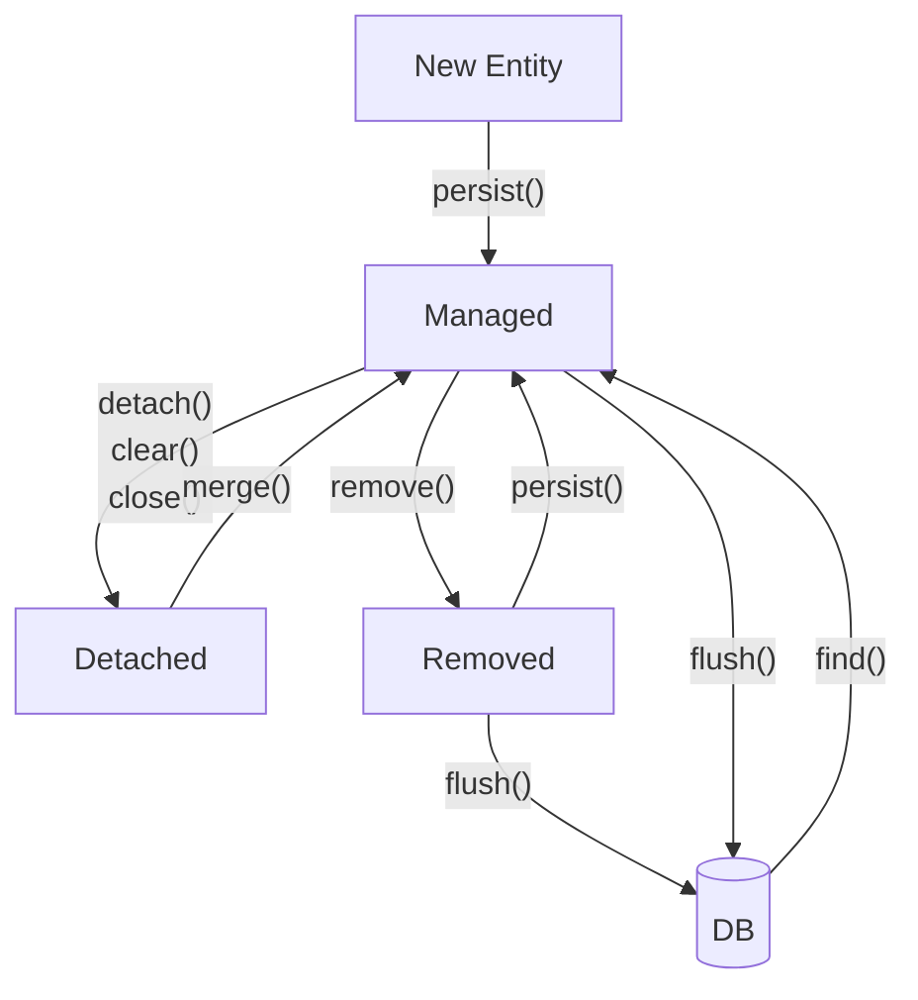

# 영속성 관리

## 엔티티(Entity)

- JPA에서 데이터베이스 테이블과 1:1로 매핑되는 자바 클래스다.
- 데이터베이스의 행을 자바 객체로 표현하며, 객체지향적인 프로그래밍 방식으로 데이터베이스 작업을 할 수 있도록 지원한다.

## 영속성 컨텍스트(Persistence Context)

- 엔티티를 영구적으로 저장하는 환경으로, 애플리케이션과 데이터베이스 간의 중간 저장소 역할을 한다.
- 실제로 메모리에 존재하는 물리적인 객체가 아니라, 엔티티의 상태를 관리하기 위한 논리적인 개념이다.
- 직접 접근할 수 없으며,  `EntityManager` 를 통해서만 접근할 수 있다.

## 엔티티 매니저(EntityManager)

- 영속성 컨텍스트와 애플리케이션 간의 인터페이스 역할을 한다.
- 엔티티를 관리하고 데이터베이스와 상호작용하는 데 필요한 주요 API를 제공한다.
- 트랜잭션 범위 내에서 생성되며, 트랜잭션이 끝나면 닫혀야 한다. 
- 재사용이 불가능하며, 멀티 쓰레드 환경에서 공유하면 안 된다.

## 엔티티 매니저 팩토리(EntityManagerFactory)

- 애플리케이션 전체에서 하나만 생성하여 공유한다.
- `EntityManager`를 생성하는 역할을 하며, 데이터베이스 연결과 관련된 리소스를 관리한다.
- 애플리케이션 종료 시 close()를 호출하여 자원을 해제해야 한다.

## 엔티티 매니저, 엔티티 매니저 팩토리 예제 코드

```java
import jakarta.persistence.EntityManager;
import jakarta.persistence.EntityManagerFactory;
import jakarta.persistence.EntityTransaction;
import jakarta.persistence.Persistence;

public class JpaExample {
	public static void main(String[] args) {
		// EntityManagerFactory 생성 (애플리케이션 전체에서 하나만 생성)
		EntityManagerFactory emf = Persistence.createEntityManagerFactory("hello");

		// EntityManager 생성 (사용할 때마다 생성)
		EntityManager em = emf.createEntityManager();

		// 트랜잭션 시작
		EntityTransaction tx = em.getTransaction();
		tx.begin();

		try {
			// 비즈니스 로직 실행
			tx.commit(); // 트랜잭션 커밋
		}
		catch(Exception e) {
			tx.rollback(); // 예외 발생 시 롤백
		}
		finally {
			em.close(); // EntityManager 종료
		}

		emf.close(); // 애플리케이션 종료 시 EntityManagerFactory 닫기
	}
}

```

## 엔티티의 생명주기

### 비영속(new/transient)

영속성 컨텍스트와 관게가 없는 **새로운** 상태
`persist()` 를 호출하기 전까지는 영속성 컨텍스트에 저장되지 않는다.



```java
// 객체를 생성한 상태(비영속)
Member memeber = new Member();
member.setId("member1");
member.setUsername("회원1");
```

### 영속(managed)

영속성 컨텍스트에 **관리**되는 상태
`persist()` 를 호출하면 엔티티가 영속성 컨텍스트에 저장된다.



```java
EntityManager em = emf.createEntityManager();
em.getTransaction().begin();

Member member = new Member();
member.setId("member1");
member.setUsername("회원1");

// 객체를 저장한 상태 (영속)
em.persist(member);
```

### 준영속(detached)

영속성 컨텍스트에 저장되었다가 **분리**된 상태
`detach()` , `clear()` , `close()` 를 호출하면 영속성 컨텍스트에서 관리되지 않는다.

```java
// 회원 엔티티를 영속성 컨텍스트에서 분리한 상태(준영속)
em.detach(member);
```

### 삭제(removed)

엔티티가 **삭제**된 상태
remove()를 호출하면 해당 엔티티는 영속성 컨텍스트에서 제거되고, 트랜잭션을 커밋하면 데이터베이스에서도 삭제된다.

```java
// 객체를 삭제한 상태(삭제)
em.remove(member);
```

### 정리



- `persist()`: 비영속 → 영속
- `detach()` ,  `clear()` ,  `close()` : 영속 → 준영속
- `merge()`: 준영속 → 영속
- `remove()`: 영속 → 삭제
- `flush()`: 변경 사항을 즉시 DB에 반영
- `find()`: DB에서 데이터를 조회하여 영속 상태로 변경
