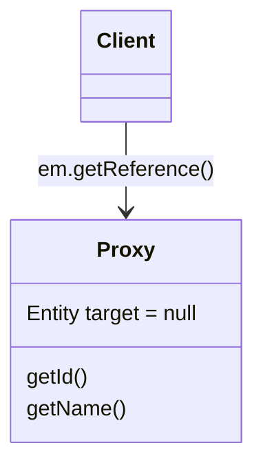
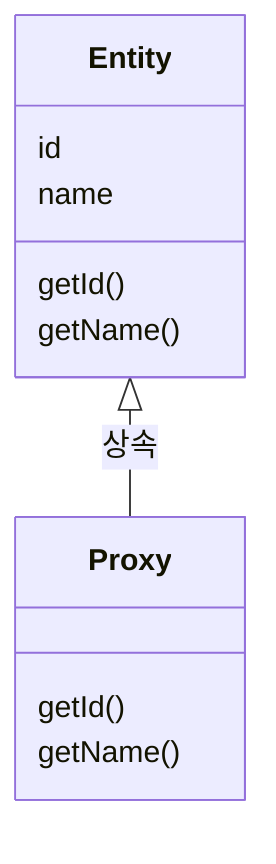
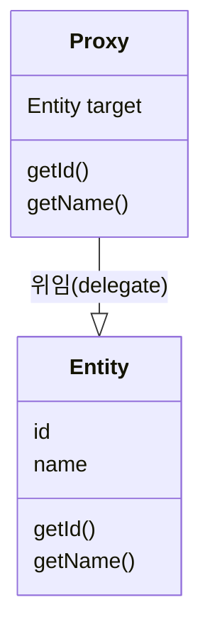
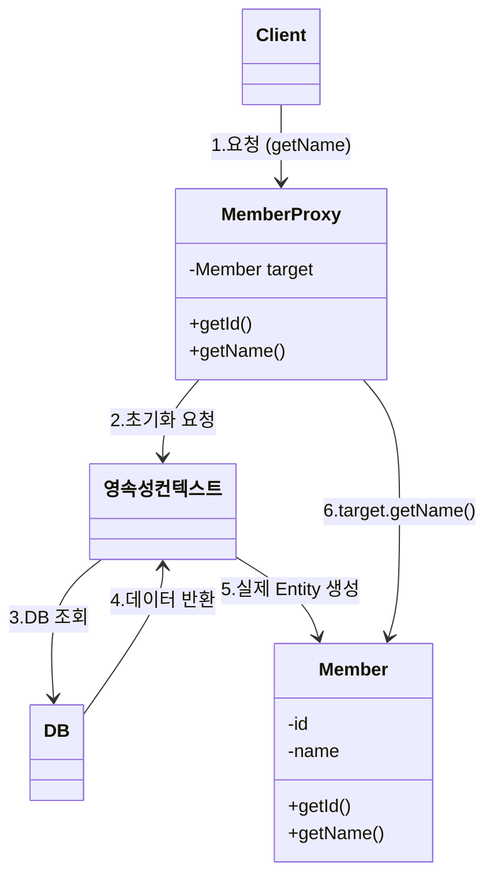
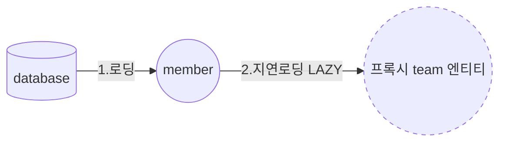
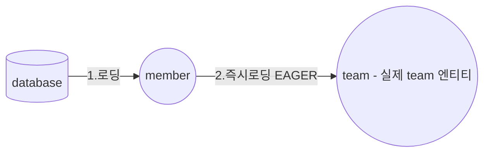

# 프록시와 연관관계 정리

## 프록시

### 프록시가 필요한 이유

- 회원을 조회할 때, 팀 정보가 필요하지 않다면 팀 데이터를 즉시 가져오지 않고, 나중에 필요할 때만 데이터베이스에서 조회하여 **불필요한 리소스 낭비를 줄일 수 있다.**
- 프록시를 사용하면 **실제 엔티티 대신 가짜(프록시) 객체를 먼저 반환하고, 해당 객체가 처음 사용될 때 데이터베이스에서 실제 데이터를 가져오는 방식**으로 동작한다.

### `em.find()` VS `em.getReference()`

| 메서드              | 동작 방식                                          |
| ------------------- | -------------------------------------------------- |
| `em.find()`         | 데이터베이스를 조회하여 실제 엔티티를 반환한다.    |
| `em.getReference()` | 데이터베이스 조회를 미루는 프록시 객체를 반환한다. |

- `em.find()`는 즉시 데이터베이스에서 엔티티를 조회하는 반면, `em.getReference()`는 프록시 객체를 반환하고, 실제 데이터가 필요할 때까지 데이터베이스 조회를 미룬다.



### 프록시 객체 특징

- 실제 클래스를 상속받아 만들어진다.
- 실제 클래스와 겉모양이 동일하다. (`instanceof`로 확인 가능)
- 처음 사용할 때 **한 번만 초기화**된다. 초기화 후에는 실제 객체를 참조한다.
- 사용하는 입장에서는 진짜 객체인지 프록시 객체인지 구분하지 않고 사용하면 된다.(이론상)



- 실제 객체를 참조(target)로 보관하며, 필요할 때 데이터베이스에서 조회한다.
- 프록시 객체를 호출하면, 내부적으로 실제 객체의 메서드를 실행한다.



### 프록시 객체의 초기화 과정

1. 클라이언트가 `memberProxy.getName()`을 호출한다.
   - `memberProxy`는 아직 실제 엔티티를 로드하지 않은 상태이다.
2. 프록시가 **영속성 컨텍스트에 초기화 요청을 보낸다.**
3. **영속성 컨텍스트에서 1차 캐시 확인 및 데이터베이스 조회를 수행한다.**
4. 데이터베이스에서 **실제 엔티티 데이터를 반환한다.**
5. **실제 엔티티를 생성하고 프록시 객체의 `target`에 연결한다.**
6. **프록시 객체가 실제 엔티티의 `getName()`을 실행한다.**



## 프록시 객체 사용 시 주의할 점

- **프록시 객체는 실제 엔티티로 변경되지 않는다.**
  - 초기화되더라도 여전히 프록시 객체이며, 내부적으로 실제 엔티티를 참조할 뿐이다.
- **프록시 객체는 원본 엔티티를 상속받는다.**
  - `==` 비교를 하면 실패할 수 있으므로, `instanceof`를 사용해야 한다.
- **영속성 컨텍스트에 같은 엔티티가 존재하면 `em.getReference()` 호출 시 실제 엔티티를 반환한다.**
  - 같은 트랜잭션 내에서는 `==` 비교 시 `true`가 나와야 하기 때문이다.
- **영속성 컨텍스트에서 분리된(detached) 상태에서 프록시를 초기화하면 예외가 발생한다.**
  - 데이터베이스에서 데이터를 조회할 수 없기 때문이다.

### 프록시 확인

| 확인 방법                                       | 설명                                             |
| ----------------------------------------------- | ------------------------------------------------ |
| `emf.getPersistenceUnitUtil().isLoaded(entity)` | 프록시 인스턴스의 초기화 여부를 확인한다.        |
| `entity.getClass().getName()`                   | 프록시 객체의 클래스명을 출력하여 확인한다.      |
| `org.hibernate.Hibernate.initialize(entity)`    | 프록시 객체를 강제로 초기화한다. (JPA 표준 아님) |

- JPA 표준에는 프록시 강제 초기화 기능이 없으며, 메서드를 호출하면 자동으로 초기화된다.

## 즉시 로딩과 지연 로딩

### 지연 로딩(LAZY)

"[프록시가 필요한 이유](#프록시가-필요한-이유)"를 해결하기 위해 **지연 로딩(LAZY)** 을 사용한다.

```java
@Entity
public class Member {

    @Id @GeneratedValue
    private Long id;

    private String name;

    @ManyToOne(fetch = FetchType.LAZY) // 지연 로딩 설정
    @JoinColumn(name = "team_id")
    private Team team;
}
```



- `em.find()`를 통해 `member`를 불러올 때, `team`의 패치 타입이 `LAZY`로 설정되어 있으면 **가짜 프록시 객체**를 가져온다.
- 그 뒤 `team`을 실제 사용하는 시점에 **프록시가 초기화되면서 DB에서 데이터를 조회**한다.

## 즉시 로딩(EAGER)

Member와 Team을 자주 함께 사용하는 경우 **즉시 로딩(EAGER)**을 설정할 수 있다.

```java
@Entity
public class Member {

    @Id @GeneratedValue
    private Long id;

    private String name;

    @ManyToOne(fetch = FetchType.EAGER) // 즉시 로딩 설정
    @JoinColumn(name = "team_id")
    private Team team;
}
```



- `em.find()`를 통해 `member`를 불러올 때, `team`의 패치 타입이 `EAGER`로 설정되어 있으면 **실제 team 엔티티를 함께 가져온다.**
- JPA 구현체는 가능하면 **JOIN을 사용하여 SQL 한 번에 데이터를 조회**한다.

### 프록시와 즉시 로딩 주의

- **지연 로딩만 사용**해야 한다.(특히 실무에서)
  - 즉시 로딩을 적용하면 예상하지 못한 SQL이 발생한다.
- **즉시 로딩은 JPQL에서 `N + 1 문제`를 일으킨다.**
- 즉시 로딩 대신에 **`JPQL fetch 조인`이나 `엔티티 그래프 기능`을 사용**해야 한다.
- **`@ManyToOne`, `@OneToOne`은 기본이 즉시 로딩이기 때문에 `LAZY`로 설정해야 한다.**
- **`@OneToMany`, `@ManyToMany`는 기본이 지연 로딩이다.**

### N + 1 문제

`memeber` 엔티티를 조회할 때 `team`이 즉시 로딩(EAGER)로 설정되어 있다면, `SELECT * FROM member`이 1번 실행되고, member의 수(N)만큼 추가적인 team 조회 쿼리(N번 실행)가 발생하여 N + 1 문제가 발생한다.

```sql
SELECT * FROM member; -- 1번 실행
SELECT * FROM team WHERE team_id = ?; -- 멤버 수(N)만큼 실행
```

## 영속성 전이(CASCADE)

- 특정 엔티티를 **영속 상태로 만들 때**, 연관된 엔티티도 **함께 영속 상태로 만들고 싶을 때 사용**한다.
  - 예를 들어 **부모 엔티티를 저장할 때 자식 엔티티도 함께 저장**하고 싶다면 `CASCADE`를 사용하면 된다.
- **연관관계를 매핑하는 것과는 관련이 없으며, 단순히 편의성을 제공하는 기능**이다.
- **부모-자식 관계에서 부모가 자식의 생명 주기를 관리할 때 적절하다.**
  - 부모가 삭제될 때 자식도 함께 삭제되는 등 **라이프사이클이 유사한 경우 사용**하면 좋다.
  - 예) **게시판(Board)과 첨부 파일(File)** 관계에서 부모(게시판)가 삭제될 때, 자식(첨부 파일)도 함께 삭제되는 경우.
- **부모가 자식의 단일 소유자인 경우에 사용하면 좋다.**
- **여러 부모가 하나의 자식을 관리하는 경우 사용하면 안 된다.**
  - 예) **하나의 파일이 여러 개의 게시판에서 공유**되는 경우, 게시판 하나가 삭제될 때 파일이 함께 삭제되면 문제가 발생할 수 있다.

### 영속성 전이 종류

| 옵션    | 설명                                                    |
| ------- | ------------------------------------------------------- |
| ALL     | 모든 영속성 전이 옵션을 적용한다.                       |
| PERSIST | 부모를 저장할 때만 자식도 함께 저장된다.                |
| REMOVE  | 부모가 삭제될 때 자식도 함께 삭제된다.                  |
| MERGE   | 부모가 병합될 때(변경 감지) 자식도 함께 병합된다.       |
| REFRESH | 부모가 `refresh()` 호출될 때 자식도 함께 반영된다.      |
| DETACH  | 부모가 `detach()` 될 때 자식도 함께 준영속 상태가 된다. |

**실무에서는 `ALL`, `PERSIST`, `REMOVE`를 주로 사용한다.**

### 예제 코드

```java
@Entity
public class Parent {

    @Id @GeneratedValue
    private Long id;

    private String name;

    @OneToMany(mappedBy="parent", cascasde=CascadeType.PERSIST) // 영속성 전이 설정
    private List<Child> childList = new ArrayList<>();

    public void addChild(Child child) {
        childList.add(child);
        child.setParent(this);
    }
}
```

```java
@Entity
public class Child {

    @Id @GeneratedValue
    private Long id;

    private String name;

    @ManyToOne
    @JoinColumn(name="parent_id")
    private Parent parent;

    public void setParent(Parent parent) {
        this.parent = parent
    }
}
```

## 고아 객체

- 부모 엔티티와 **연관관계가 끊어진 자식 엔티티**를 의미한다.

### 고아 객체 제거

- 부모 엔티티와의 연관관계가 끊어져 **고아 객체가 된(참조가 제거된) 자식 엔티티를 자동으로 삭제**하는 기능이다.

```java
@Entity
public class Parent {

    @Id @GeneratedValue
    private Long id;

    private String name;

    @OneToMany(mappedBy="parent", cascasde=CascadeType.ALL, orphanRemoval = true) // 고아 객체 제거 설정
    private List<Child> childList = new ArrayList<>();

    public void addChild(Child child) {
        childList.add(child);
        child.setParent(this);
    }

    public List<Child> getChildList() {
		return childList;
	}
}
```

```java
@Entity
public class Child {

    @Id @GeneratedValue
    private Long id;

    private String name;

    @ManyToOne
    @JoinColumn(name="parent_id")
    private Parent parent;

    public void setParent(Parent parent) {
        this.parent = parent
    }
}
```

```java
Parent parent = em.find(Parent.class, id);
parent.getChildList().remove(0); // DELETE FROM CHILD WHERE ID = ? 실행
```

### 고아 객체 삭제 기능 주의사항

- **참조하는 곳이 하나일 때만 사용해야 한다.**
- **특정 엔티티가 개인 소유할 때만 사용해야 한다.**
- **`@OneToOne`, `@OneToMany` 관계에서만 적용 가능하다.**
- **고아 객체 제거 기능을 활성화하면, 부모를 제거할 때 자식도 함께 제거된다.**(`CascadeType.REMOVE`와 동일한 동작)

## 영속성 전이 + 고아 객체, 생명 주기

- 스스로 생명주기를 관리하는 엔티티는 `em.persist()`로 영속화하고, `em.remove()`로 제거하며 생명주기를 직접 관리할 수 있다.
- **`CascadeType.ALL`과 `orphanRemoval = true`를 설정하면, 부모 엔티티를 통해 자식의 생명 주기를 관리할 수 있다.**
- 도메인 주도 설계(DDD)의 Aggregate Root 개념을 구현할 때 유용하다.

### Aggregate Root

- Aggregate는 시스템이 기대하는 책임을 수행하면서 일관성을 유지하는 단위로, 명령을 수행하기 위해 함께 조회되고 업데이트해야 하는 최소 단위이다.
- Aggregate 내부의 연관된 엔티티들은 **Aggregate Root를 통해서만 접근 및 관리**할 수 있다.
- Aggregate Root가 삭제되면, **연관된 엔티티들도 함께 삭제되는 규칙을 적용**할 수 있다.
