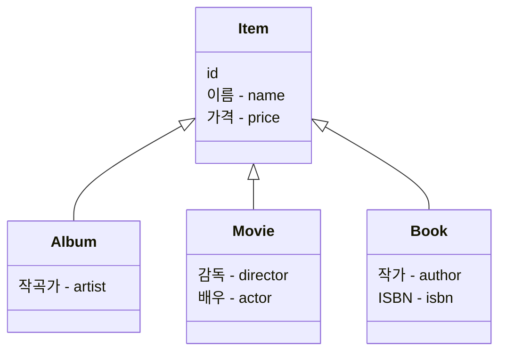
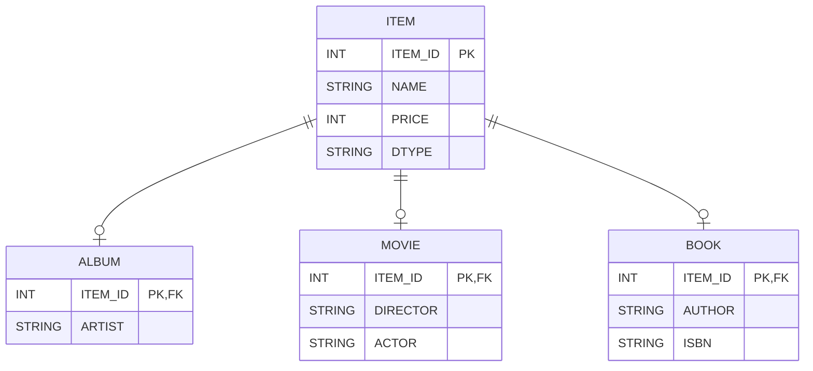
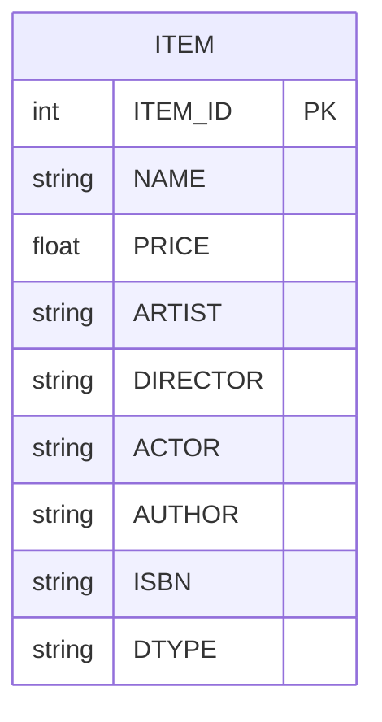
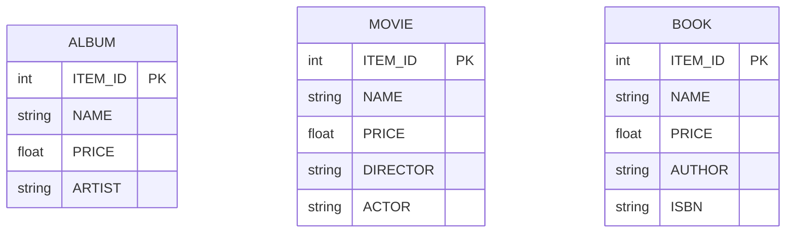

# 고급 매핑

## 상속 관계 매핑

- 관계형 데이터베이스에는 **상속 개념이 없으므로** 이를 슈퍼타입·서브타입 관계로 모델링한다.
- JPA는 객체의 상속 구조를 **세 가지 방식으로 매핑**할 수 있도록 지원한다.

| 전략                                          | 설명                                                                                  |
| --------------------------------------------- | ------------------------------------------------------------------------------------- |
| 조인 전략 (JOINED)                            | 부모와 자식 엔티티를 각각 테이블로 만들고, **조인을 사용하여 조회**하는 방식          |
| 단일 테이블 전략 (SINGLE_TABLE)               | 모든 엔티티 데이터를 하나의 테이블에 저장하고, **구분 컬럼(DTYPE)으로 구별**하는 방식 |
| 구현 클래스마다 테이블 전략 (TABLE_PER_CLASS) | 자식 엔티티별로 **각각 테이블을 생성**하며, 테이블이 독립적으로 존재하는 방식         |



### 사용 어노테이션

| 어노테이션             | 설명                                                                                                  | 주요 속성                                                                                                         |
| ---------------------- | ----------------------------------------------------------------------------------------------------- | ----------------------------------------------------------------------------------------------------------------- |
| `@Inheritance`         | 부모 클래스에 선언하여 상속 매핑 전략을 지정한다.                                                     | `strategy`: `JOINED`(조인 전략), `SINGLE_TABLE`(단일 테이블 전략), `TABLE_PER_CLASS`(구현 클래스마다 테이블 전략) |
| `@DiscriminatorColumn` | 부모 클래스에 선언하여 구분 컬럼(DTYPE)을 지정한다. (JOINED, SINGLE_TABLE 전략에서 사용)              | `name`: 컬럼명 <br> 지정하지 않으면 `DTYPE`으로 지정된다.                                                         |
| `@DiscriminatorValue`  | 자식 엔티티에 저장될 구분 컬럼 값을 지정한다. <br> 구분 컬럼(DTYPE)에 저장될 값을 지정할 때 사용한다. | `value`: 저장할 값 <br> 지정하지 않으면 기본적으로 엔티티 이름이 저장된다.                                        |

### 조인 전략

부모와 자식 엔티티를 각각 테이블로 만들고, **조인을 사용하여 조회하는 방식**이다.

- 장점
  - 테이블이 정규화되어 데이터의 중복이 최소화된다.
  - 외래 키 참조 무결성 제약 조건을 활용할 수 있다.
  - 저장 공간을 효율적으로 사용할 수 있다.
- 단점
  - 조회 시 조인을 많이 사용해야 하므로 성능이 저하될 수 있다.
  - 조회 쿼리가 복잡해진다.
  - 데이터를 저장할 때 INSERT SQL이 부모, 자식 테이블에 각각 실행되므로 2번 호출된다.



```java
@Entity
@Inheritance(strategy = InheritanceType.JOINED)
@DiscriminatorColumn(name = "DTYPE")
public abstract class Item {
    @Id @GeneratedValue
    private Long id;

    private String name;
}

@Entity
@DiscriminatorValue("ALBUM")
public class Album extends Item {
    private String artist;
}

@Entity
@DiscriminatorValue("BOOK")
public class Book extends Item {
    private String author;
    private String isbn;
}

@Entity
@DiscriminatorValue("MOVIE")
public class Movie extends Item {
    private String director;
    private String actor;
}
```

### 단일 테이블 전략

모든 엔티티 데이터를 하나의 테이블에 저장하고, **구분 컬럼(DTYPE)으로 구별하는 방식**이다.

- 장점
  - 조인이 필요 없으므로 일반적으로 조회 성능이 빠르다.
  - 조회 쿼리가 단순하여 관리가 용이하다.
- 단점
  - 자식 엔티티가 매핑한 컬럼은 모두 `null`을 허용해야 한다.
  - 단일 테이블에 모든 데이터를 저장하므로, 테이블 크기가 커질 수 있다.
  - 테이블이 비효율적으로 커질 경우, 조회 성능이 오히려 저하될 수 있다.



```java
@Entity
@Inheritance(strategy = InheritanceType.SINGLE_TABLE)
@DiscriminatorColumn(name = "DTYPE")
public abstract class Item {
    @Id @GeneratedValue
    private Long id;

    private String name;
}

@Entity
@DiscriminatorValue("ALBUM")
public class Album extends Item {
    private String artist;
}

@Entity
@DiscriminatorValue("BOOK")
public class Book extends Item {
    private String author;
    private String isbn;
}

@Entity
@DiscriminatorValue("MOVIE")
public class Movie extends Item {
    private String director;
    private String actor;
}
```

### 구현 클래스마다 테이블 전략(사용 X)

자식 엔티티별로 **각각 테이블을 생성하며, 테이블이 독립적으로 존재하는 방식**이다.

- 장점
  - 서브타입을 명확하게 구분하여 사용할 때 효과적이다.
  - `not null` 제약 조건을 적용할 수 있어 데이터 무결성을 보장할 수 있다.
- 단점
  - 여러 자식 테이블을 함께 조회할 때 성능이 저하될 수 있다. (UNION SQL이 필요하다.)
  - 자식 테이블을 통합하여 쿼리하기 어렵다.
- 주의사항
  - `@GeneratedValue(strategy = GenerationType.IDENTITY)` IDENTITY 전략을 사용할 수 없다.(Cannot use identity column key generation with <union-subclass> mapping)
    - 구현 클래스마다 테이블 전략에서는 각 자식 엔티티가 독립적인 테이블을 가지므로, 부모 엔티티를 저장할 때 어느 테이블을 선택해야 할지 JPA가 결정할 수 없다.
    - IDENTITY 전략은 특정 테이블에서 자동 증가 키를 생성해야 하는데, 구현 클래스마다 테이블 전략에서는 부모 테이블 없이 자식 테이블만 존재하므로 사용할 수 없다.
    - 따라서 `TABLE` 전략 혹은 `SEQUENCE` 전략을 사용해야 한다.



```java
@Entity
@Inheritance(strategy = InheritanceType.TABLE_PER_CLASS)
public abstract class Item {
    @Id @GeneratedValue(strategy = GenerationType.AUTO)
    private Long id;

    private String name;
}

@Entity
public class Album extends Item {
    private String artist;
}

@Entity
public class Book extends Item {
    private String author;
    private String isbn;
}

@Entity
public class Movie extends Item {
    private String director;
    private String actor;
}
```
