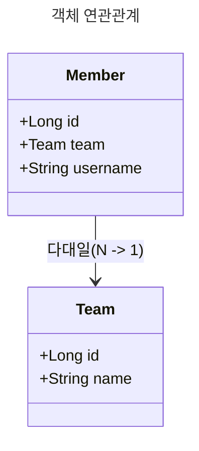
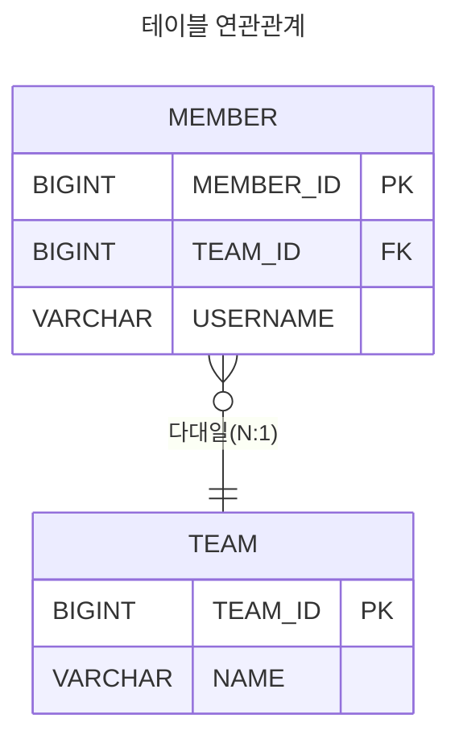
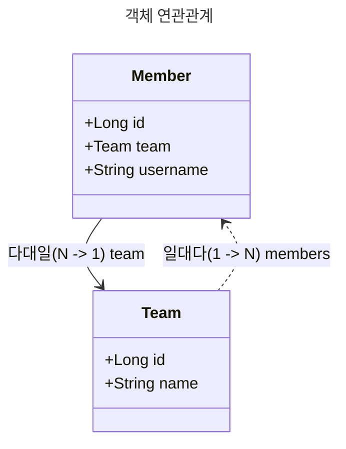

# 다양한 연관관계 매핑

## 연관관계 매핑 시 고려사항 3가지

JPA에서 객체 연관관계를 매핑할 때는 **다중성**, **단방향/양방향 여부**, **연관관계의 주인**을 고려해야 한다.

### 1. 다중성 (Multiplicity)

엔티티 간 관계의 형태에 따라 다음과 같은 매핑 어노테이션을 사용한다.

- **다대일 (N:1)** → `@ManyToOne`
- **일대다 (1:N)** → `@OneToMany`
- **일대일 (1:1)** → `@OneToOne`
- **다대다 (N:M)** → `@ManyToMany` (사용하지 않음)

### 2. 단방향 vs 양방향 연관관계

(1) 테이블 관점

- 관계형 데이터베이스에서는 **외래 키(Foreign Key) 하나만으로 양방향 조인이 가능**하다.
- 즉, 방향이라는 개념 없이 자유롭게 데이터를 조회할 수 있다.

(2) 객체 관점

- **객체는 참조 필드가 있는 쪽에서만 다른 객체를 참조**할 수 있다.
- 한쪽 객체에서만 참조하는 경우 → **단방향 연관관계**
- 서로 참조하는 경우 → **양방향 연관관계** (단방향 연관관계를 두 개 설정한 것과 동일)

### 3. 연관관계의 주인 (Owner of Relationship)

JPA에서는 **어느 객체가 외래 키를 관리할 것인지**를 결정해야 한다.

- **테이블 관점**: 외래 키 하나로 두 테이블이 양방향 연관관계를 맺는다.
- **객체 관점**: 두 객체가 각각 참조를 가지며 양방향 연관관계를 맺는다.
- **연관관계의 주인**: **외래 키를 실제로 관리하는 객체**
  - 주인은 `@JoinColumn`을 선언하고, 외래 키 값을 변경할 수 있다.
- **주인이 아닌 반대편 객체**: `mappedBy`를 사용하여 연관관계의 주인을 지정
  - 단순 조회만 가능하고, 외래 키 변경이 불가능하다.

## 다대일(N:1)

### 다대일 단방향

- **특징**: 다대일(N:1) 관계에서 다(N) 쪽이 외래 키를 가짐.
- **구현 방법**: 외래 키가 있는 객체(`Member`)에서 `@ManyToOne`으로 매핑.
- **테이블 연관관계**: `MEMBER` 테이블에 `TEAM_ID`(FK) 컬럼 존재.

### 다대일 양방향

**특징**: 다대일 단방향과 동일하지만, 반대 방향에서도 참조 가능.
**연관관계의 주인**: Member(외래 키를 가진 쪽)에서 관리.
**테이블 구조**: 단방향과 동일 (TEAM_ID가 MEMBER에 존재).

