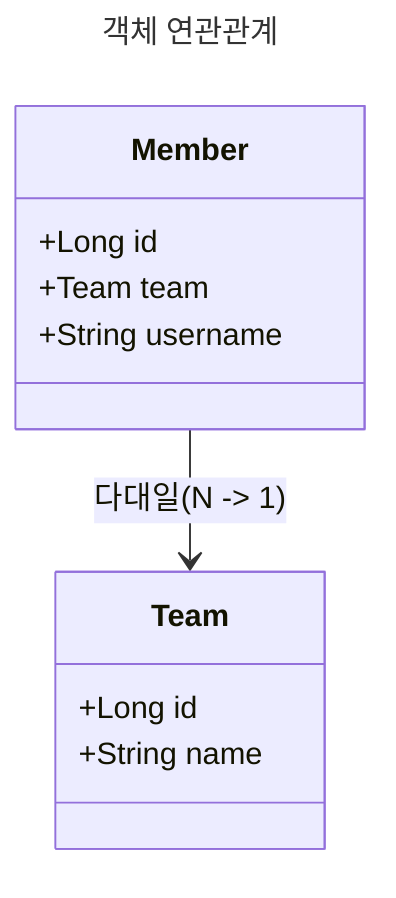
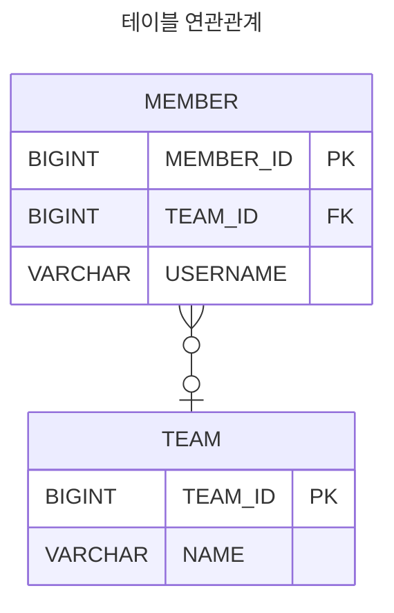
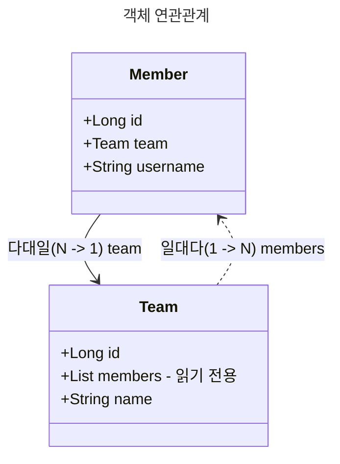
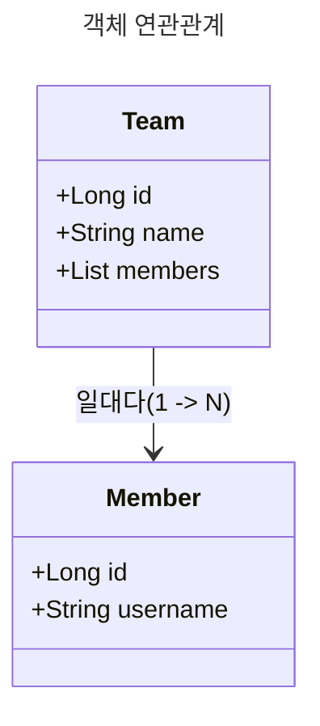
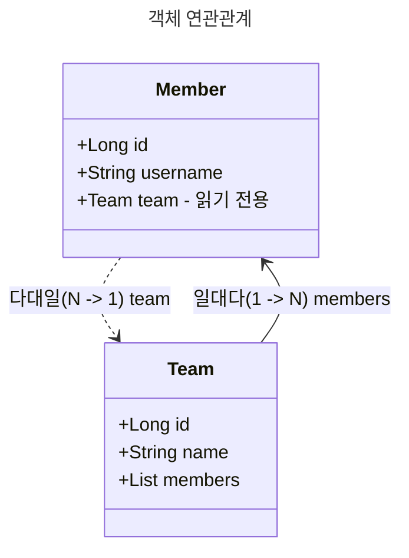

# 다양한 연관관계 매핑

## 연관관계 매핑 시 고려사항 3가지

JPA에서 객체 연관관계를 매핑할 때는 **다중성**, **단방향/양방향 여부**, **연관관계의 주인**을 고려해야 한다.

### 1. 다중성 (Multiplicity)

엔티티 간 관계의 형태에 따라 다음과 같은 매핑 어노테이션을 사용한다.

- **다대일 (N:1)** → `@ManyToOne`
- **일대다 (1:N)** → `@OneToMany`
- **일대일 (1:1)** → `@OneToOne`
- **다대다 (N:M)** → `@ManyToMany` (사용하지 않음)

### 2. 단방향 vs 양방향 연관관계

(1) 테이블 관점

- 관계형 데이터베이스에서는 **외래 키(Foreign Key) 하나만으로 양방향 조인이 가능**하다.
- 즉, 방향이라는 개념 없이 자유롭게 데이터를 조회할 수 있다.

(2) 객체 관점

- **객체는 참조 필드가 있는 쪽에서만 다른 객체를 참조**할 수 있다.
- 한쪽 객체에서만 참조하는 경우 → **단방향 연관관계**
- 서로 참조하는 경우 → **양방향 연관관계** (단방향 연관관계를 두 개 설정한 것과 동일)

### 3. 연관관계의 주인 (Owner of Relationship)

JPA에서는 **어느 객체가 외래 키를 관리할 것인지**를 결정해야 한다.

- **테이블 관점**: 외래 키 하나로 두 테이블이 양방향 연관관계를 맺는다.
- **객체 관점**: 두 객체가 각각 참조를 가지며 양방향 연관관계를 맺는다.
- **연관관계의 주인**: **외래 키를 실제로 관리하는 객체**
  - 주인은 `@JoinColumn`을 선언하고, 외래 키 값을 변경할 수 있다.
- **주인이 아닌 반대편 객체**: `mappedBy`를 사용하여 연관관계의 주인을 지정
  - 단순 조회만 가능하고, 외래 키 변경이 불가능하다.

## 다대일(N:1)

### 다대일 단방향

- **특징**: 다대일(N:1) 관계에서 다(N) 쪽이 외래 키를 가짐.
- **구현 방법**: 외래 키가 있는 객체(`Member`)에서 `@ManyToOne`으로 매핑.
- **테이블 연관관계**: `MEMBER` 테이블에 `TEAM_ID`(FK) 컬럼 존재.

### 다대일 양방향

**특징**: 다대일 단방향과 동일하지만, 반대 방향에서도 참조 가능.
**연관관계의 주인**: Member(외래 키를 가진 쪽)에서 관리.
**테이블 구조**: 단방향과 동일 (TEAM_ID가 MEMBER에 존재).

## 일대다(1:N)

### 일대다 단방향

- **특징**: **일(1)이 연관관계의 주인**이 되는 관계이다.
- **객체 연관관계**: `Team`이 `Member` 목록을 관리한다.
- **테이블 연관관계**: 외래 키(`TEAM_ID`)가 MEMBER 테이블에 위치한다.
- **제약 사항**:
  - `@JoinColumn`을 꼭 사용해야 한다. 사용하지 않으면 조인 테이블 방식을 사용하여 중간에 테이블을 하나 추가한다.
  - 객체 설계와 테이블 설계 불일치 → 외래 키 관리가 어렵다.
  - 추가적인 `UPDATE SQL` 실행 → 성능 문제가 발생 가능하다.
  - **권장되지 않는 방식** → **다대일 양방향 매핑을 추천**.
    - 외래 키를 `Member`에서 관리하여 객체와 테이블 설계를 일치시킬 수 있다.
    - 추가적인 `UPDATE SQL`을 실행하지 않는다.

### 일대다 양방향

- **공식적인 매핑 방식이 아니다.** → JPA에서 지원하는 일반적인 방식은 아니다.
- `@ManyToOne`과 `@JoinColumn(insertable=false, updatable=false)`을 이용해 **읽기 전용 필드**를 추가하여 구현한다.
- **실제로는 다대일 단방향 + 읽기 전용 필드 조합**이다.
- **추천 방식이 아니다.** → **다대일 양방향(`@ManyToOne + @OneToMany`)을 권장한다.**

