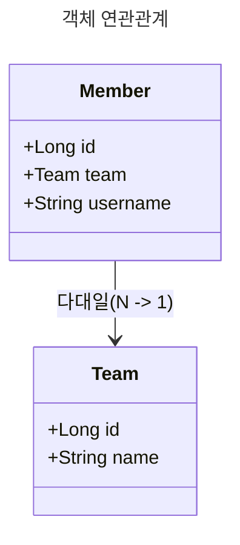
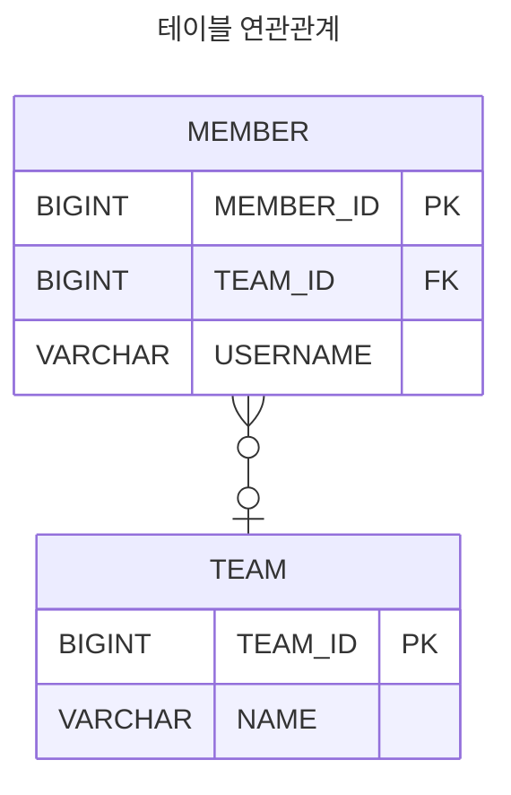
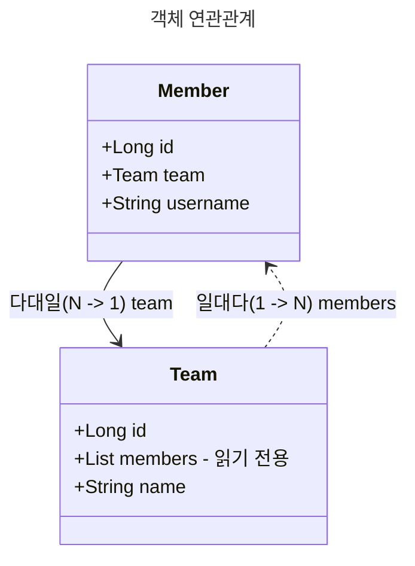
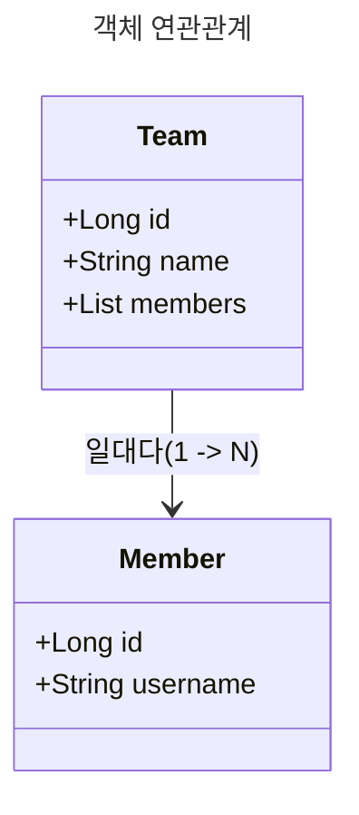
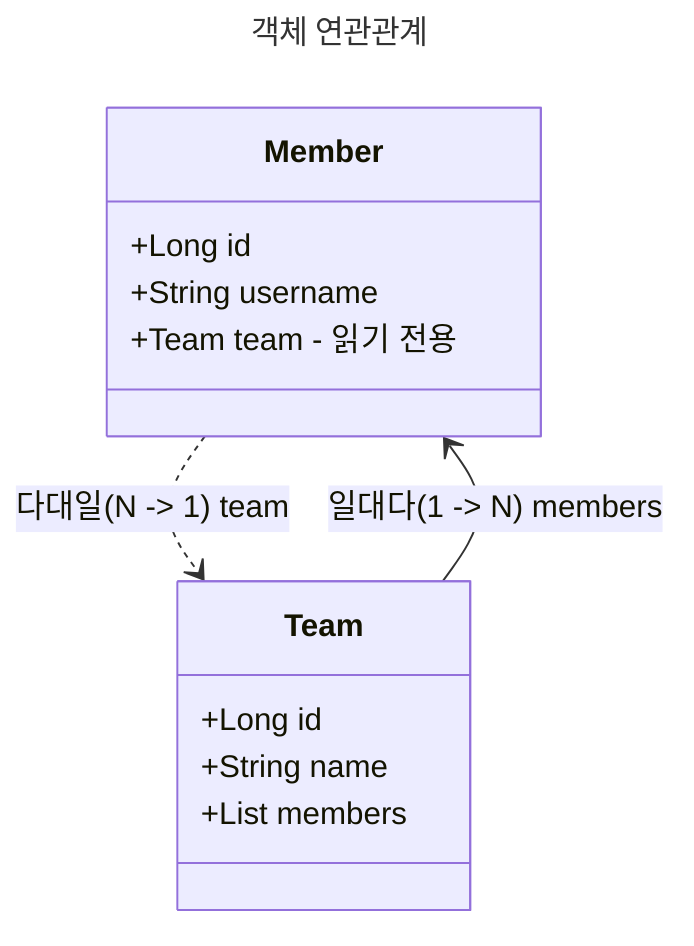
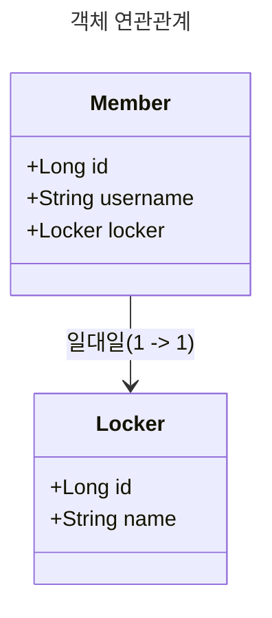
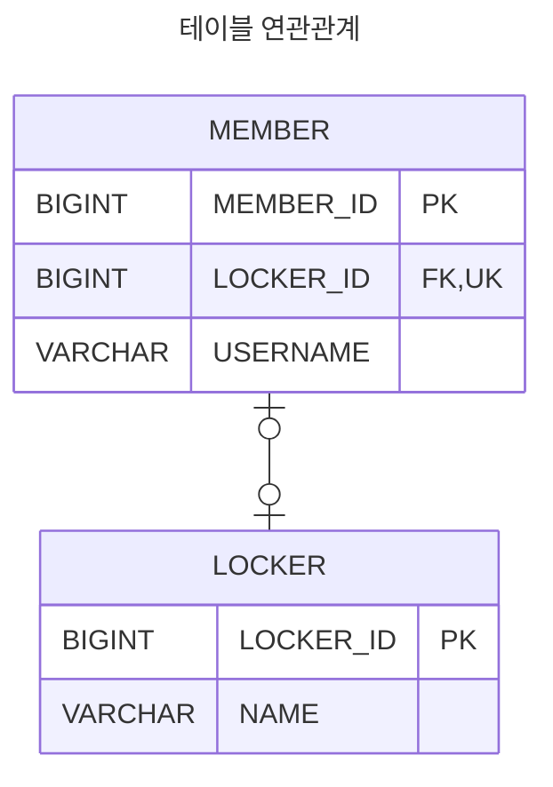
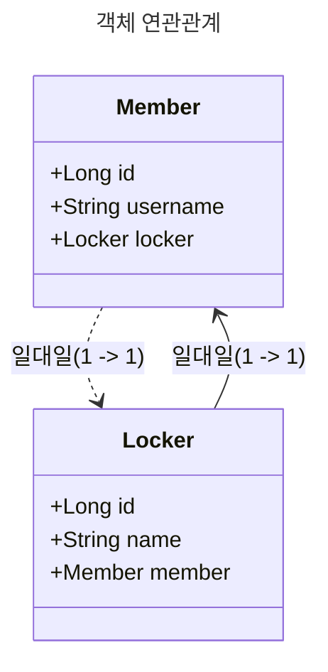
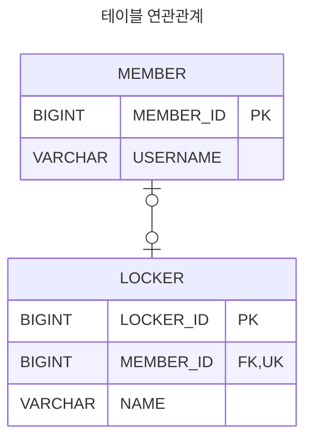
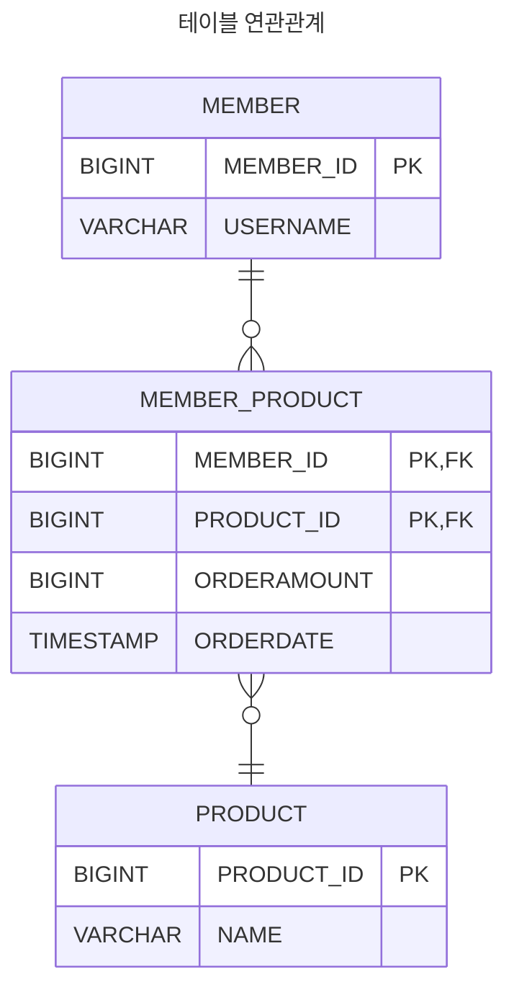

# 다양한 연관관계 매핑

## 연관관계 매핑 시 고려사항 3가지

JPA에서 객체 연관관계를 매핑할 때는 **다중성**, **단방향/양방향 여부**, **연관관계의 주인**을 고려해야 한다.

### 1. 다중성 (Multiplicity)

엔티티 간 관계의 형태에 따라 다음과 같은 매핑 어노테이션을 사용한다.

- **다대일 (N:1)** → `@ManyToOne`
- **일대다 (1:N)** → `@OneToMany`
- **일대일 (1:1)** → `@OneToOne`
- **다대다 (N:M)** → `@ManyToMany` (사용하지 않음)

### 2. 단방향 vs 양방향 연관관계

(1) 테이블 관점

- 관계형 데이터베이스에서는 **외래 키(Foreign Key) 하나만으로 양방향 조인이 가능**하다.
- 즉, 방향이라는 개념 없이 자유롭게 데이터를 조회할 수 있다.

(2) 객체 관점

- **객체는 참조 필드가 있는 쪽에서만 다른 객체를 참조**할 수 있다.
- 한쪽 객체에서만 참조하는 경우 → **단방향 연관관계**
- 서로 참조하는 경우 → **양방향 연관관계** (단방향 연관관계를 두 개 설정한 것과 동일)

### 3. 연관관계의 주인 (Owner of Relationship)

JPA에서는 **어느 객체가 외래 키를 관리할 것인지**를 결정해야 한다.

- **테이블 관점**: 외래 키 하나로 두 테이블이 양방향 연관관계를 맺는다.
- **객체 관점**: 두 객체가 각각 참조를 가지며 양방향 연관관계를 맺는다.
- **연관관계의 주인**: **외래 키를 실제로 관리하는 객체**
  - 주인은 `@JoinColumn`을 선언하고, 외래 키 값을 변경할 수 있다.
- **주인이 아닌 반대편 객체**: `mappedBy`를 사용하여 연관관계의 주인을 지정
  - 단순 조회만 가능하고, 외래 키 변경이 불가능하다.

## 다대일(N:1)

### 다대일 단방향

- **특징**: 다대일(N:1) 관계에서 다(N) 쪽이 외래 키를 가짐.
- **구현 방법**: 외래 키가 있는 객체(`Member`)에서 `@ManyToOne`으로 매핑.
- **테이블 연관관계**: `MEMBER` 테이블에 `TEAM_ID`(FK) 컬럼 존재.





### 다대일 양방향

**특징**: 다대일 단방향과 동일하지만, 반대 방향에서도 참조 가능.
**연관관계의 주인**: Member(외래 키를 가진 쪽)에서 관리.
**테이블 구조**: 단방향과 동일 (TEAM_ID가 MEMBER에 존재).




## 일대다(1:N)

### 일대다 단방향

- **특징**: **일(1)이 연관관계의 주인**이 되는 관계이다.
- **객체 연관관계**: `Team`이 `Member` 목록을 관리한다.
- **테이블 연관관계**: 외래 키(`TEAM_ID`)가 MEMBER 테이블에 위치한다.
- **제약 사항**:
  - `@JoinColumn`을 꼭 사용해야 한다. 사용하지 않으면 조인 테이블 방식을 사용하여 중간에 테이블을 하나 추가한다.
  - 객체 설계와 테이블 설계 불일치 → 외래 키 관리가 어렵다.
  - 추가적인 `UPDATE SQL` 실행 → 성능 문제가 발생 가능하다.
  - **권장되지 않는 방식** → **다대일 양방향 매핑을 추천**.
    - 외래 키를 `Member`에서 관리하여 객체와 테이블 설계를 일치시킬 수 있다.
    - 추가적인 `UPDATE SQL`을 실행하지 않는다.




### 일대다 양방향

- **공식적인 매핑 방식이 아니다.** → JPA에서 지원하는 일반적인 방식은 아니다.
- `@ManyToOne`과 `@JoinColumn(insertable=false, updatable=false)`을 이용해 **읽기 전용 필드**를 추가하여 구현한다.
- **실제로는 다대일 단방향 + 읽기 전용 필드 조합**이다.
- **추천 방식이 아니다.** → **다대일 양방향(`@ManyToOne + @OneToMany`)을 권장한다.**




## 일대일(1:1)

- 양쪽 모두 1개만 참조가 가능하다 → `1:1` 관계.
- 외래 키 위치를 선택할 수 있다.:
  - **주 테이블에 외래 키** → 일반적으로 사용된다.
  - **대상 테이블에 외래 키** → **JPA에서 단방향 지원 X**.
- 외래 키에 유니크 제약 조건을 추가하는 것이 좋다. → `@OneToOne` + `@JoinColumn(unique = true)`.

### 일대일 단방향 - 주 테이블에 외래 키

- 주 테이블: `MEMBER` → `LOCKER_ID` 외래 키를 포함한다.
- `@OneToOne` + `@JoinColumn`을 사용한다..
- 구조는 다대일 단방향과 유사하다..





### 일대일 양방향 - 주 테이블에 외래 키

- 외래 키가 있는 `MEMBER`가 연관관계의 주인이다.
- 반대편(`Locker`)에 `mappedBy`를 적용한다.


### 일대일 단방향 - 대상 테이블에 외래 키

- JPA에서 지원하지 않는다.
- 객체 간 연관관계 매핑이 불가능하다.

### 일대일 양방향 - 대상 테이블에 외래 키

- 방법은 `일대일 양방향 - 주 테이블에 외래 키`와 동일하다.
- `mappedBy` 위치가 `Member`로 이동한다.





### 일대일 정리

- 주 테이블에 외래 키
  - 구조: 주 객체가 대상 객체를 참조하듯, **주 테이블에 외래 키를 둬서 대상 테이블을 조회**.
  - 특징: 객체지향 개발자가 선호, JPA 매핑이 편리.
  - 장점: 주 테이블만 조회해도 **대상 테이블의 데이터 존재 여부 확인 가능**.
  - 단점: 값이 없을 경우 **외래 키에 `NULL` 허용 필요**.
- 대상 테이블에 외래 키
  - 구조: 대상 테이블에 외래 키를 두고 **주 테이블을 참조**.
  - 특징: 전통적인 데이터베이스 개발자가 선호.
  - 장점: 주 테이블과 대상 테이블을 **1:1에서 1:N으로 변경 시 테이블 구조 유지 가능**.
  - 단점: **프록시 기능의 한계**로, 지연 로딩(`LAZY`) 설정해도 **항상 즉시 로딩(EAGER)**.

## 다대다(N:M)

- 관계형 데이터베이스는 **정규화된 테이블 2개만으로 다대다 관계를 표현하지 않는다**.
- **연결 테이블을 추가하여** 1:N, N:1 관계로 변환한다.
- 객체에서는 **컬렉션을 이용해 직접 다대다 관계를 표현한다**.
- `@ManyToMany`를 사용하고, `@JoinTable`을 통해 **연결 테이블을 지정한다**.
- **단방향, 양방향 매핑 모두 가능하다**.
- **실무에서 사용하지 않는다.**
  - **연결 테이블이 단순히 연결만 수행하지 않는다**.
  - 대부분의 경우 **연결 테이블에 추가적인 정보(등록일, 역할 등)를 저장한다**.
  - 따라서 `@ManyToMany`를 사용하기보다는 **연결 테이블을 엔티티로 승격하여 사용한다**.
  - `@ManyToMany` → `@OneToMany`, `@ManyToOne` 구조로 변환한다.



## 계층형 구조 매핑하기

- 엔티티가 **자기 자신을 참조하는 계층 구조**를 가진 경우, `@ManyToOne`과 `@OneToMany`를 사용하여 부모-자식 관계를 매핑한다.
- 연관관계 편의 메서드를 제공하여 **부모-자식 관계를 안전하게 설정**할 수 있도록 한다.

```java
@Entity
public class Category {

    @Id
    @GeneratedValue
    private Long id;

    private String name;

    // 부모 카테고리 (자기 자신을 참조)
    @ManyToOne
    @JoinColumn(name = "PARENT_ID")
    private Category parent;

    // 자식 카테고리 리스트 (자기 자신을 참조)
    @OneToMany(mappedBy = "parent")
    private List<Category> child = new ArrayList<>();

    // 연관관계 편의 메서드
    public void addChildCategory(Category child) {
        this.child.add(child);
        child.setParent(this);
    }

    public void setParent(Category parent) {
        this.parent = parent;
    }
}
```
