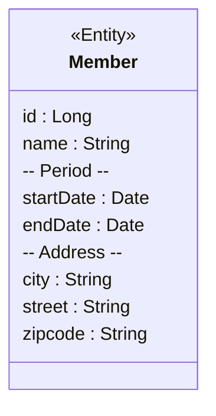
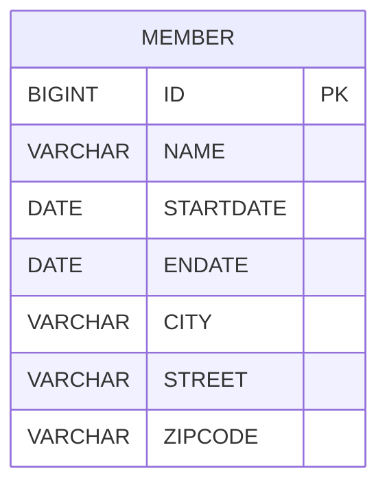

# 값 타입

## 기본 값 타입

### JPA의 데이터 타입 분류

- 엔티티 타입
  - `@Entity`로 정의하는 객체이다.
  - 데이터가 변해도 **식별자를 통해 지속해서 추적 가능**하다.
  - 예를 들어, 회원 엔티티의 키나 나이 값이 변경되어도 **식별자로 계속 인식 가능**하다.
- 값 타입
  - 단순히 값으로 사용하는 데이터 타입이다.
  - `int`, `Integer`, `String`처럼 식별자가 없고 값만 존재하는 타입이다.
  - 값 타입은 변경되면 새로운 값으로 완전히 대체된다.
  - 예를 들어, 숫자 `100`을 `200`으로 변경하면 기존 `100`이 사라지고 `200`으로 교체된다.

### 값 타입의 분류

- 기본 값 타입
  - 자바 기본 타입(`int`, `double`)
  - 래퍼 클래스(`Integer`, `Long`)
  - `String`
- 임베디드 타입(복합 값 타입)
  - 사용자 정의 객체를 하나의 타입으로 사용하는 방식이다.
- 컬렉션 값 타입
  - 자바 컬렉션(`List`, `Set`)에 기본 값 타입이나 임베디드 타입을 저장하는 방식이다.

### 기본 값 타입 특징

- 생명 주기가 **엔티티에 의존적**이다
  - 예를 들어, 회원 엔티티가 삭제되면 이름, 나이 같은 값 타입 필드도 함께 삭제된다.
- 값 타입은 **공유해서는 안 된다**.
  - 값 타입이 공유되면 한 엔티티의 값을 변경할 때 다른 엔티티의 값도 함께 변경될 수 있다.
  - 예를 들어, 한 회원의 이름을 변경할 때 다른 회원의 이름까지 함께 변경되면 안 된다.
- 예제: `String name`, `int age`와 같은 값들이 기본 값 타입이다.

### 참고 - 자바의 기본 타입은 공유할 수 없다.

- 기본 타입(primitive type)은 항상 값을 복사하므로 공유할 수 없다.
  - `int`, `double`과 같은 기본 타입은 별도의 메모리 공간을 가지며, 참조를 공유하지 않는다.
- 래퍼 클래스(`Integer`, `Long`)와 `String`은 공유 가능하지만, 변경할 수 없다.
  - 래퍼 클래스와 `String`은 **참조값을 공유할 수 있지만, 내부 값을 변경할 방법이 없다.**
  - 따라서 안전하게 사용할 수 있다.

## 임베디드 타입(복합 값 타입)

- 새로운 값 타입을 직접 정의할 수 있는 기능이다.
- 기본 값 타입을 묶어서 사용할 수 있으며, 복합 값 타입이라고도 한다.
- `int`, `String`과 같은 값 타입과 유사하지만, 객체로 관리할 수 있다.

### 임베디드 타입 예시

- 회원 엔티티가 이름, 근무 시작일, 근무 종료일, 주소 정보를 가진다고 가정한다.

  ```mermaid
  classDiagram
    class Member {
        Long id
        String name
        Date startDate
        Date endDate
        String city
        String street
        String zipcode
    }
  ```

- 근무 시작일과 종료일을 하나의 값 타입(근무 기간)으로 묶을 수 있다.
- 도시, 번지, 우편 번호를 하나의 값 타입(주소)으로 묶을 수 있다.
- 이러한 방식으로 값 타입을 구성할 때 임베디드 타입을 사용한다.

  ```mermaid
  classDiagram
    class Member {
        Long id
        String name
        Period workPeriod
        Address homeAddress
    }

    class Period {
      Date startDate
      Date endDate
      isWork()
    }

    class Address {
      String city
      String street
      String zipcode
    }
  ```

### 임베디드 타입 예제 코드

```java
@Entity
public class Member {

  @Id @GeneratedValue
  private Long id;

  private String name;

  @Embedded
  private Period workPeriod;

  @Embedded
  private Address homeAddress;
```

```java
@Embeddable
public class Period {

  private LocalDateTime startDate;

  private LocalDateTime endDate;

  public boolean isWork() {
    // ...
  }
}
```

```java
@Embeddable
public class Address {

  private String city;

  private String street;

  private String zipCode;
}
```

### 임베디드 타입 사용법

- `@Embeddable`: 값 타입을 정의하는 클래스에 선언한다.
- `@Embedded`: 값을 사용하는 엔티티 필드에 선언한다.
- **기본 생성자가 필수**이다.

### 임베디드 타입의 장점

- 재사용이 가능하다.
- 관련된 값들을 논리적으로 묶어 응집도를 높일 수 있다.
- 값 타입 내부에 의미 있는 메서드를 추가할 수 있다.
  - Period.isWork()처럼 해당 값 타입만 사용하는 의미 있는 메소드를 만들 수 있다.
- 임베디드 타입을 포함한 모든 값 타입은 값 타입을 소유한 엔티티의 생명주기를 의존한다.

### 임베디드 타입과 테이블 매핑





- 임베디드 타입은 엔티티의 일부이며, 별도의 테이블이 아닌 기존 엔티티 테이블에 매핑된다.
- 임베디드 타입을 사용하더라도 **테이블 구조는 변하지 않는다**.
- 객체를 더욱 세밀하게(`fine-grained`) 매핑할 수 있다.
- ORM 설계에서 테이블 수보다 클래스 수가 많아지는 것이 일반적이다.

### 임베디드 타입과 연관관계

- 임베디드 타입 내부에서 다른 엔티티와 연관관계를 맺을 수 있다.

```java
@Embeddable
public class Address {

  private String city;

  private String street;

  private String zipCode;

  @ManyToOne
    @JoinColumn(name = "country_id") // 연관관계 설정
    private Country country;
}
```

### @AttributeOverride 속성 재정의

- 같은 값 타입을 한 엔티티에서 여러 번 사용할 경우, 컬럼명이 중복될 수 있다.
- 이 문제를 해결하기 위해 **컬럼명을 재정의**해야 한다.
- `@AttributeOverride` 또는 `@AttributeOverrides`를 사용하여 컬럼명을 변경할 수 있다.

```java
@Entity
public class Member {

  @Id @GeneratedValue
  private Long id;

  private String name;

  @Embedded
  private Period workPeriod;

  @Embedded
  private Address homeAddress;

  @Embedded
  @AttributeOverrides({
    @AttributeOverride(name = "city", column = @Column(name = "WORK_CITY")),
    @AttributeOverride(name = "street", column = @Column(name = "WORK_STREET")),
    @AttributeOverride(name = "zipcode", column = @Column(name = "WORK_ZIPCODE"))
  })
  private Address workAddress;
```

### 임베디드 타입과 null

- 임베디드 타입의 필드 값이 `null`이면, 해당 타입이 매핑한 모든 컬럼 값도 `null`이 된다.
