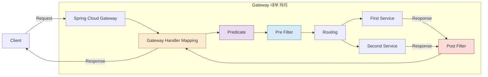

# API Gateway Service

## 1. API Gateway Service

- API Gateway는 사용자의 요청을 마이크로서비스에 **대신 전달하고 응답을 받아 클라이언트에 반환하는 Proxy 역할**을 한다.
- 시스템 내부 구조를 숨기고, 외부 요청을 **적절하게 가공하여 응답**하는 기능을 수행한다.
- 마이크로서비스가 계속 **추가, 변경되는 구조**에서 클라이언트가 매번 변경 사항을 반영하기 어렵기 때문에, **중간에 단일 진입점인 게이트웨이를 둔다**.
- 게이트웨이는 모든 마이크로서비스 요청을 **일괄적으로 처리하고**, 클라이언트는 오직 게이트웨이만 바라보게 된다.

## 2. API Gateway가 제공하는 기능

1. 인증 및 권한 부여
2. 서비스 검색 통합
3. 응답 캐싱
4. 정책 적용, 회로 차단기, QoS 및 재시도
5. 속도 제한
6. 부하 분석
7. 로깅, 추적, 상관 관계 분석
8. 헤더, 쿼리 문자열, 본문 변환
9. IP 화이트리스트(허용 목록) 설정

## 3. Spring Cloud에서의 MSA 간 통신 방식

### 3.1 RestTemplate

- **전통적인 HTTP 통신 방식**으로 많이 사용된다.
- 인스턴스를 생성하고 URL, 파라미터 등을 입력하여 **GET 또는 POST 요청을 직접 수행**한다.

```java
RestTemplate restTemplate = new RestTemplate();
restTemplate.getForObject("http://localhost:8080/", User.class, 200);
```

### 3.2 FeignClient

- **Spring Cloud에서 지원하는 선언형 HTTP 클라이언트**이다.
- 인터페이스에 `@FeignClient` 어노테이션을 붙이고, 마이크로서비스 이름과 엔드포인트 정보를 명시하면 **자동으로 HTTP 요청 코드가 생성**된다.
- **서비스 이름 기반으로 통신**하며, 직접 주소와 포트를 명시하지 않아도 된다.

```java
@FeignClient("stores")
public interface StoreClient {
    @RequestMapping(method = RequestMethod.GET, value = "/stores")
    List<Store> getStores();
}
```

## 4. Netflix Ribbon

- Netlix에서 만든 클라이언트 사이드 로드 밸런서이다.
- 클라이언트 사이드 로드 밸런서이기 때문에, 클라이언트 애플리케이션이 직접 마이크로서비스의 주소 정보를 관리한다.
- Health Check 기능이 있어 마이크로서비스가 정상적으로 작동 중인지 확인할 수 있다.
- 펑셔널 API 지원이 약하고, 비동기 처리에 어려움이 있다.
- Spring Cloud의 발전에 따라 현재는 잘 사용하지 않으며, Spring Cloud LoadBalancer로 대체되고 있다.

## 5. Netflix Zuul

- Netlix에서 만든 API Gateway로, 라우팅 및 필터링 기능을 제공한다.
- 클라이언트 요청을 받아서 적절한 마이크로서비스로 프록시 역할을 한다.
- 클라이언트는 여러 개의 마이크로서비스를 직접 호출하는 대신 Zuul을 통해 단일 진입점으로 요청을 보낸다.
- Zuul은 요청의 URI나 설정에 따라 내부적으로 서비스 라우팅을 수행한다.
  - 예를 들어 `/users` 요청은 유저 서비스로, `/orders` 요청은 주문 서비스로 라우팅할 수 있다.
- 필터를 통해 각각의 마이크로서비스에 요청이 될 때 사전에 호출되는 작업이나 사후에 호출되는 작업을 일괄적으로 처리할 수 있다.
  - 이를 활용하여 인증 서비스 연동이나 공통 로깅 기능을 수행할 수 있다.
- Spring Cloud에서는 현재 Spring Cloud Gateway로 대체되고 있다.

## 6. Spring Cloud Gateway - Filter



- Client가 요청을 보내면 Gateway가 이를 수신한다.
- Gateway 내부에서는 `Handler → Predicate → PreFilter` 순으로 필터링이 진행된다.
- Predicate는 요청 URL, Header 등 조건에 따라 라우팅 여부를 결정한다.
- PreFilter에서는 요청 데이터를 수정하거나 인증, 로깅 같은 사전 작업을 수행할 수 있다.
- 이후 요청은 설정된 라우팅 경로에 따라 FirstService 또는 SecondService로 전달된다.
- 각 서비스에서 응답이 완료되면 PostFilter를 거쳐 Gateway로 다시 돌아온다.
- PostFilter에서는 응답 데이터를 가공하거나 응답 헤더 추가 등의 작업을 수행할 수 있다.
- 최종적으로 Gateway는 클라이언트에게 응답을 반환한다.
- PreFilter, PostFilter는 .yml 설정 또는 Java 코드로 구현할 수 있다.
