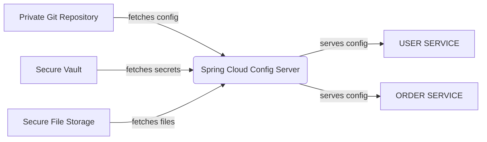

# Configuration Service

## 1. Spring Cloud Config

- 분산 시스템에서 서버, 클라이언트 구성에 필요한 설정 정보(`application.yml`)를 외부 시스템에서 관리한다.
- 하나의 중앙화된 저장소에 구성 요소를 관리할 수 있다.
- 각 마이크로서비스는 설정 정보를 Config Server로부터 읽어온다.
- 설정 변경 시 **애플리케이션을 다시 빌드하거나 배포하지 않고도 적용할 수 있다**.
- 애플리케이션 배포 파이프라인을 통해 각 환경에 맞는 구성 정보를 자동으로 적용할 수 있다.
- Git 저장소에 설정 파일을 두고 버전 관리가 가능하다.

## 2. 설정 파일 우선순위

1. 프로젝트의 `application.yaml`
2. 설정 저장소의 `application.yaml`
3. 프로젝트의 `application-{profile}.yaml`
4. 설정 저장소의 `{application name}/{application name}-{profile}.yaml`

- 설정 파일은 위의 순서로 적용되며, 뒤로 갈수록 우선순위가 높아진다.
- 설정 파일이 중복될 경우, **더 우선순위가 높은 파일의 값이 적용된다.**

## 3. 설정 파일 변경

- 설정을 수정한 뒤 반영하는 방법은 다음과 같다.

1. 서버 재기동
   - 가장 단순한 방법으로, 변경된 설정을 적용할 수 있지만 다운타임이 발생한다.
2. Actuator의 `/actuator/refresh` 호출
   - 수동으로 애플리케이션의 설정을 런타임 중에 갱신할 수 있다.
3. Spring Cloud Bus 사용
   - 메시지 브로커(RabbitMQ, Kafka 등)를 통해 설정 변경 사항을 **모든 인스턴스에 자동으로 전파**할 수 있다.

## 4. Spring Boot Actuator

- 애플리케이션의 상태를 확인하고 모니터링하기 위한 기능을 제공한다.
- 다양한 **운영 메트릭과 정보를 HTTP Endpoint로 노출**한다.
  - `/actuator/health`: 애플리케이션의 헬스 체크
  - `/actuator/metrics`: 애플리케이션의 메트릭 정보
  - `/actuator/env`: 현재 애플리케이션의 환경 변수
  - `/actuator/refresh`: 설정 변경 시 수동으로 재적용 요청
  - `/actuator/httpexchanges`: 최근 발생한 HTTP 요청/응답의 요약 정보
