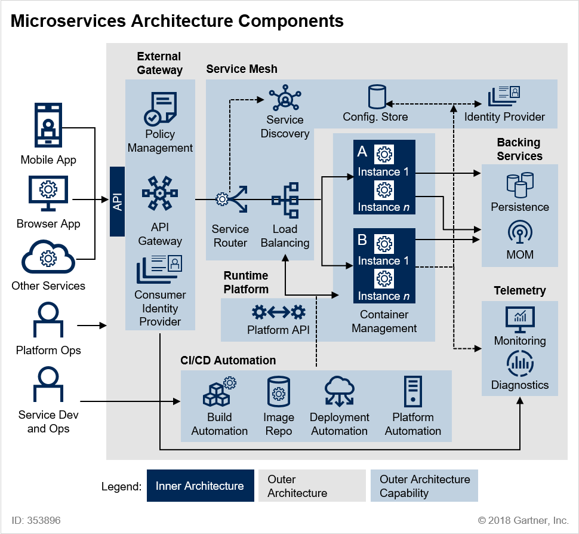
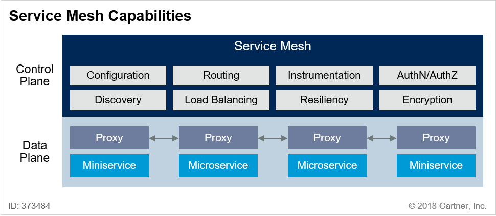

# Microservice와 Spring Cloud 소개

## 1. Software Architecture - Antifragile

- **Auto scaling**: 서비스에 트래픽이 몰릴 때 자동으로 서버 시스템을 확장하거나 축소할 수 있도록 하는 기능이다.
- **Microservices**: 하나의 거대한 시스템이 아닌, 작은 단위의 서비스들을 나누어 독립적으로 개발하고 배포할 수 있도록 구성한 아키텍처이다.
- **Chaos engineering**: 실제 운영 환경에서 장애를 일부러 발생시켜 시스템의 복원력과 장애 대응 능력을 테스트하는 방법론이다.
- **Continuous deployments**: 코드가 커밋되면 자동으로 테스트, 빌드, 배포까지 진행되어 변경 사항을 빠르게 운영 환경에 반영할 수 있도록 하는 방법이다.

## 2. Software Architecture - Cloud Native

- 확장 가능한 아키텍처
  - **수평적 확장에 유연한 구조로 시스템을 구성**할 수 있다.
  - 서버 인스턴스를 확장해 트래픽 부하를 분산시키고, 가용성을 확보할 수 있다.
  - 컨테이너 기반 패키징을 통해 배포가 간편하다.
  - 서비스 모니터링이 체계적으로 가능하다.
- 탄력적 아키텍처
  - 서비스의 생성, 통합, 배포가 유연하고 빠르며 비즈니스 요구 사항에 신속하게 대응할 수 있다.
  - 서비스 구조는 분할되어 독립적으로 관리된다.
  - **서비스 간 통신은 무상태(stateless) 프로토콜을 기반으로 한다**.
  - 서비스의 추가 및 삭제를 자동으로 감지하고 시스템이 적응할 수 있다.
  - 변경된 서비스 요청에 따라 동적으로 사용자 요청을 처리할 수 있다.
- 장애 격리
  - 특정 서비스에 오류가 발생해도, 그 장애가 전체 시스템에 영향을 주지 않도록 설계되어 있다.
  - **서비스 간 결합도가 낮아 하나의 서비스 장애가 다른 서비스로 전파되지 않는다**.

## 3. Cloud Native Application

- **Microservices**: 기능별로 분리된 독립적인 서비스들이 모여 전체 애플리케이션을 구성한다.
- **CI/CD**: 지속적인 통합(Continuous Integration), 지속적인 배포(Continuous Deployment), 지속적인 전달(Continuous Delivery)로 빠르고 안정적인 배포를 가능하게 한다.
  - 카나리 배포(Canary Deployment): 소수 사용자에게 먼저 배포해 이상 여부를 판단한 뒤 전체에 반영하는 방식이다.
  - 블루그린 배포(Blue-Green Deployment): 이전 버전(Blue)과 새 버전(Green)을 동시에 유지하면서 전환하는 방식이다.
- **DevOps**: 개발(Development), 품질보증(QA), 운영(Operations)의 협업을 강조하는 문화 및 방법론이다.
- **컨테이너 가상화**: 운영체제 위에서 여러 컨테이너를 독립적으로 실행하며, 가볍고 효율적인 리소스 사용이 가능하다.
  - **컨테이너는 격리성과 이식성을 제공하며, 클라우드 환경에서 핵심적인 요소로 작용한다**.

## 4. 12 Factors

- 애플리케이션이 Cloud 환경에서 올바르게 동작하기 위해 지켜야 하는 12가지 규칙이다.

1. Base Code: 애플리케이션은 하나의 코드 베이스로 관리되어야 하며, 동일한 코드로 운영과 개발 환경 모두에 배포되어야 한다.
2. Dependency Isolation: 애플리케이션의 모든 의존성은 명시적으로 선언되어야 한다.
3. Configurations: 설정은 코드로부터 완전히 분리되어야 하며, 런타임에 읽힐 수 있어야 한다.
4. Linkable Backing Services: DB 같은 백엔드 서비스는 설정만 바꾸면 교체 가능해야 하며, 코드 수정 없이 연결 또는 분리가 가능해야 한다.
5. Stages Of Creation (Build, Release, Run): 애플리케이션은 build → release → run의 단계로 엄격하게 구분되어야 한다.
6. Stateless Processes: 프로세스는 상태를 갖지 않아야 하며, 재시작 시 완전히 초기화될 수 있어야 한다.
7. Port Binding: 서비스는 자체 HTTP 서버를 실행하고 포트 바인딩을 통해 외부에 노출되어야 한다.
8. Concurrency: 앱은 수평 확장이 가능해야 하며, 동시성을 고려해 설계되어야 한다.
9. Disposability: 빠른 시작과 종료가 가능해야 하며, 종료 시에도 안전하게 마무리되어야 한다.
10. Development & Production Parity: 개발, 스테이징, 운영 환경은 최대한 유사하게 유지해야 한다.
11. Logs: 로그는 파일로 저장하지 않고, 스트림으로 외부 시스템에 전달되어야 한다.
12. Admin Processes: 운영 중인 환경에서도 일회성 관리 명령을 안전하게 실행할 수 있어야 한다.

## 5. 12 Factors + 3

1. API First: 서비스는 API 형태로 설계되고 제공되어야 한다.
2. Telemetry: 시스템 상태나 성능 지표는 수치화하고 시각화하여 제공되어야 한다.
3. Authentication and Authorization: 서비스는 인증과 인가 기능을 필수적으로 제공해야 한다.

## 6. Monolithic VS Microservice Architecture

- Monolithic
  - 애플리케이션을 개발함에 있어서 필요한 모든 요소를 **하나의 애플리케이션으로 통합**하여 개발하는 방식이다.
  - 데이터베이스, 백엔드, 프론트엔드까지 모든 기술이 하나의 코드베이스와 하나의 배포 단위로 구성된다.
  - 모든 서비스가 강하게 결합되어 있으며, **배포 시 전체 시스템을 함께 배포**하게 된다.
  - 장점
    - 구조가 단순하여 초기 개발과 배포가 쉽다.
    - 하나의 코드베이스로 구성되어 있어 디버깅이나 로깅이 직관적이다.
    - 네트워크 오버헤드가 없다(내부 메서드 호출로 동작한다).
    - 배포 및 테스트 환경 구성이 단순하다.
  - 단점
    - 규모가 커질수록 코드가 복잡해지고 유지보수가 어려워진다.
    - 하나의 서비스 변경이 전체 애플리케이션의 재배포를 요구한다.
    - 기능별 확장에 한계가 있다.
    - 부분 장애가 전체 시스템에 영향을 줄 수 있다.
- Microservice Architecture
  - 애플리케이션을 구성하는 각각의 기능을 **작고 독립적인 단위의 서비스로 분리**하여 개발하고 배포하는 방식이다.
  - 각 서비스는 **독립적인 배포와 확장**이 가능하며, 다른 서비스와 최소한의 통신으로 협력한다.
  - 특정 서비스에 변경이 생겨도 **전체 시스템에 영향을 주지 않고 부분적으로만 배포**할 수 있다.
  - 장점
    - 서비스별 독립적인 배포와 확장이 가능하다.
    - 장애 격리가 가능하다.
    - 서비스별로 기술 스택을 자유롭게 선택할 수 있다.
    - 소규모 팀 단위로 서비스 개발이 가능하다.
  - 단점
    - 분산 시스템으로 인해 복잡성이 증가한다.
    - 서비스 간 통신에 따른 네트워크 지연 및 장애 가능성이 있다.
    - 데이터 일관성 관리가 어렵다.
    - 통합 테스트와 로깅, 모니터링이 복잡하다.
    - 운영 및 배포 자동화 체계가 반드시 필요하다.

## 7. Microservice Architecture의 특징

1. Challenges
   - 기존의 개발 방식이나 아키텍처 패러다임을 **상당 부분 변경해야 한다**.
   - **조직 문화, 배포 방식, 운영 체계 등 전반적인 변화가 요구된다**.
2. Small Well-Chosen Deployable Units
   - 각 서비스는 **작고 명확한 역할을 수행하는 단위**로 분리되어 있다.
   - **독립적으로 배포 및 운영**이 가능하다.
3. Bounded Context
   - 각 마이크로서비스는 **자기만의 경계를 갖고 비즈니스 도메인에 집중**한다.
   - 서비스 간의 **책임이 명확히 구분되어야 한다**.
4. RESTful
   - **REST API 기반의 통신 방식**을 통해 서비스 간 상호작용을 수행한다.
   - **무상태(Stateless)한 HTTP 프로토콜**을 주로 사용한다.
5. Configuration Management
   - **서비스별 설정값을 중앙에서 관리하거나** 버전별로 외부에 분리해 관리한다.
   - 배포 환경에 따라 **유연하게 설정을 교체할 수 있어야 한다**.
6. Cloud Enabled
   - 클라우드 환경에서 동작하는 것을 전제로 한다.
   - **자원 할당, 장애 복구, 인프라 확장 등을 자동화**할 수 있어야 한다.
7. Dynamic Scale Up And Scale Down
   - **서비스 단위로 동적으로 확장과 축소가 가능해야 한다**.
   - 부하에 따라 **유연하게 대응**할 수 있어야 한다.
8. CI/CD
   - **지속적인 통합과 배포를 통한 자동화된 배포 체계**가 필요하다.
   - 빠른 피드백과 안정적인 릴리즈를 보장한다.
9. Visibility
   - 서비스 간 **모니터링과 추적(Trace)이 가능해야 한다**.
   - **로그, 지표, 트래픽 흐름 등을 실시간으로 관찰**할 수 있어야 한다.

## 8. MicroService Architecture Structures

1. 클라이언트가 **API Gateway**를 통해 서비스를 요청한다.
2. API Gateway는 **Service Router**에게 사용자의 요청을 어디로 보내야 할지 문의한다.
3. Service Router는 **Service Discovery**에 등록된 서비스 목록을 조회하여 필요한 마이크로 서비스의 위치를 확인한다.
4. 마이크로 서비스의 인스턴스가 여러 개 동작 중이라면, **Load Balancer**가 어떤 인스턴스에 접근할지 결정한다.
5. 마이크로 서비스의 **환경 설정 정보는 외부 설정 서버에 저장**되어 필요할 때 참조한다.
6. 마이크로 서비스는 **컨테이너 가상화 기술**을 기반으로 동작한다.
7. **CI/CD 파이프라인**을 통해 지속적인 통합 및 자동 배포가 이루어진다.
8. **Backing Services**에서는 데이터베이스, 메시징 시스템, 외부 API 등을 연결하여 사용한다.
9. **Telemetry** 시스템을 통해 마이크로 서비스의 상태를 실시간 모니터링하고 진단한다.

- **MSA 인프라 → 미들웨어**
  - 프록시, 인증, 권한 부여, 암호화, 서비스 검색, 요청 라우팅, 로드 밸런싱 등을 지원한다.
  - 장애가 발생했을 때 자동으로 복구하는 **자가 치유(Healing) 시스템**을 갖춘다.
  - **서비스 간의 통신 관련 기능을 자동화**하여 개발자의 부담을 줄인다.

## 9. SOA(Service-Oriented Architecture) VS MSA(Microservice Architecture)

- SOA
  - 재사용을 통한 비용 절감을 주요 목표로 한다.
  - 공통 서비스를 최대한 공유하며, 서비스 간의 통신을 위해 ESB(Enterprise Service Bus)를 활용한다.
  - 각 서비스는 중앙 집중형 통신 방식을 통해 상호작용한다.
  - 거대한 엔터프라이즈 환경에서 적합하며, 서비스 간의 의존성이 존재한다.
- MSA
  - 서비스 간 결합도를 낮추고 변화에 유연하게 대응하는 것이 핵심이다.
  - 각 서비스는 독립적으로 배포 및 운영될 수 있으며, 공유를 최소화한다.
  - REST API 기반의 경량 통신을 사용하며, ESB 대신 경량 메시지 브로커 또는 HTTP 통신을 선호한다.
  - 작고 자립적인 팀이 서비스 전체를 책임질 수 있는 구조를 지향한다.

## 10. Spring Cloud

- 분산 시스템(마이크로서비스)을 **쉽게 만들고 관리하기 위한 도구 모음**이다.
- 마이크로서비스 환경에서 **구성, 등록, 라우팅, 장애 대응, 메시징** 등의 기능을 지원하며, 복잡한 설정 없이 **표준화된 방식으로 자동화**할 수 있도록 돕는다.
- 여러 마이크로서비스를 연결하고 통합하는 데 필요한 기능들을 제공하는 **Spring의 서브 프로젝트 집합**이다.

### 주요 모듈

| 모듈명                       | 설명                                                                         |
| ---------------------------- | ---------------------------------------------------------------------------- |
| Spring Cloud Config Server   | 외부 설정 저장소를 관리하고 애플리케이션이 실행될 때 설정 정보를 제공한다.   |
| Eureka (Naming Server)       | 서비스 등록 및 검색 기능을 제공한다.                                         |
| Ribbon (Client-side LB)      | 클라이언트 측에서 로드 밸런싱을 수행한다.                                    |
| Spring Cloud Gateway         | API Gateway 역할을 수행하며 라우팅, 필터링, 인증 등을 제공한다.              |
| FeignClient                  | 선언형 REST 클라이언트로, 인터페이스처럼 외부 HTTP 요청을 할 수 있게 해준다. |
| Zipkin (Distributed Tracing) | 요청 흐름을 추적하고 모니터링하는 기능을 제공한다.                           |
| Netflix API Gateway          | 넷플릭스 오픈소스 기반의 강력한 API Gateway 역할을 한다.                     |
| Hystrix                      | 서킷 브레이커 패턴을 구현하여 서비스 간 장애 전파를 방지한다                 |
