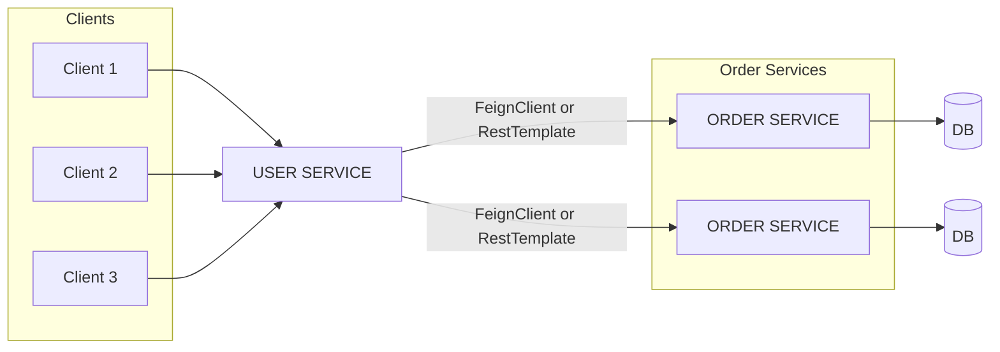
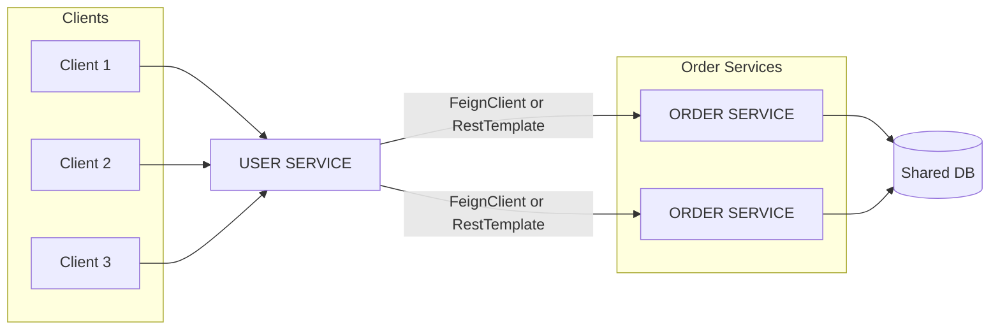
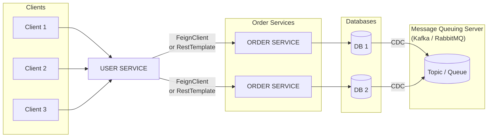
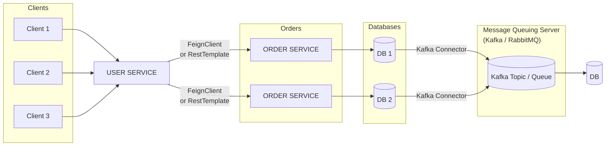

# Microservice간 통신

## 1. 통신 방식

- 동기방식 (Synchronous HTTP Communication)

  - 하나의 요청이 다른 서비스에 도달하고, **응답이 올 때까지 기다려야 다음 작업을 수행할 수 있는 방식**이다.
  - 예를 들어, 주문 서비스가 결제 서비스에 요청을 보내고 결제가 완료되어야 주문 처리를 계속할 수 있다.

- 비동기방식 (Asynchronous Communication over AMQP):
  - **요청을 보낸 뒤 응답을 기다리지 않고 작업을 이어가는 방식**이다.
  - 각 마이크로서비스는 AMQP 같은 메시지 큐 기반의 프로토콜을 통해 메시지를 주고받으며 독립적으로 동작할 수 있다.
  - 예를 들어, 주문 완료 메시지를 큐에 넣으면, 결제 서비스가 메시지를 수신해 결제를 처리한다.

## 2. 데이터 동기화 문제

- `order-service` 인스턴스를 여러 개 사용하고, 각 인스턴스가 별도의 데이터베이스를 사용하고 있다면 데이터 불일치 문제가 발생할 수 있다.
- 같은 주문에 대해 서로 다른 인스턴스가 다른 상태의 데이터를 유지할 수 있기 때문에 **데이터 일관성 보장**이 중요하다.

## 2.1 해결 방법

1. 하나의 데이터베이스 사용
   - 모든 인스턴스가 동일한 데이터베이스를 사용하도록 구성한다.
   - **데이터 일관성을 확보할 수 있지만**, **스케일 아웃에 제약**이 있을 수 있다.
   - 동시에 하나의 DB에 접근하기 때문에 동시성 및 트랜잭션 처리에 주의해야 한다.

2. Database 간 동기화
   - 각 인스턴스가 별도의 데이터베이스를 사용하면서, 메시지 큐(RabbitMQ 등)를 통해 데이터 변경 사항을 **다른 DB에 동기화**한다.
   - **이벤트 기반의 eventual consistency 모델**로 데이터 일관성을 유지한다.

3. Kafka Connector + DB
   - 단일 데이터베이스를 사용하고, 해당 DB의 변경 사항을 **Kafka에 이벤트로 전달**한다.
   - 다른 서비스는 Kafka를 통해 변경 이벤트를 수신하여 필요한 작업을 수행한다.
   - **데이터베이스 접근은 메시지 큐를 통해서만 이루어지도록 구성**해, 데이터 흐름을 중앙화할 수 있다.

