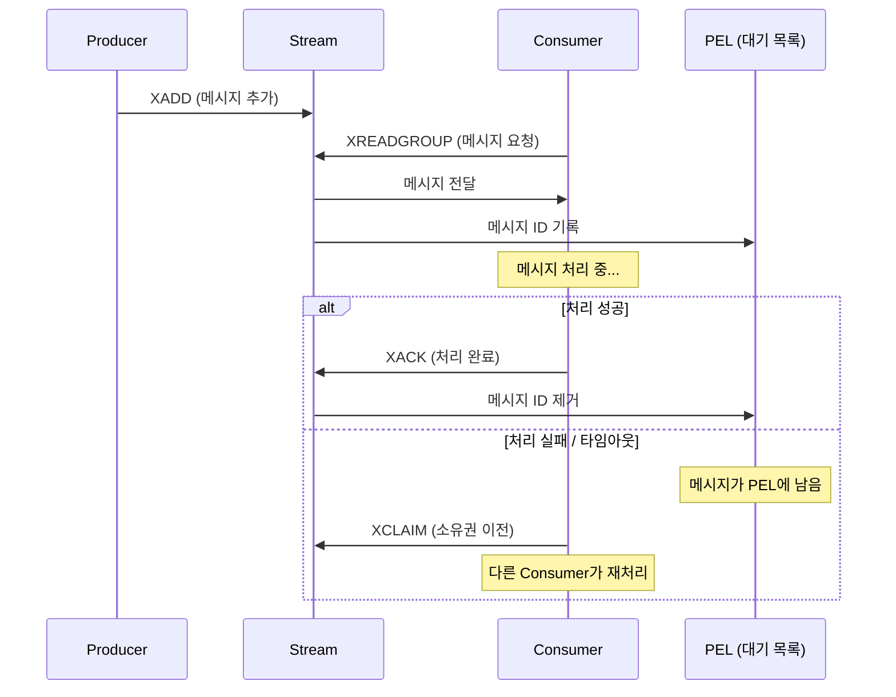

# Redis 심화 개념 및 활용 패턴

## 1. Loose Coupling을 위한 Redis Pub/Sub Messaging Pattern

- Redis는 단순한 **캐싱 툴**을 넘어 **메시지 큐(MQ)** 나 **분산 환경의 이벤트 버스** 등 다양한 영역에서 활용된다.
- **Pub/Sub 메시징**은 **Publisher(발행자)** 와 **Subscriber(구독자)** 의 약자로, **발행-구독 패턴**을 의미한다.
  - 발행자가 특정 채널에 메시지를 발행하면, 해당 채널을 구독 중인 모든 구독자가 **실시간으로 메시지**를 수신한다.
- Redis Pub/Sub은 메시지 브로커 구현체 중 **가장 단순한 형태**이다.
  - 복잡한 라우팅이나 영속성 제어 없이 순수한 **실시간 메시지 전파 및 수신**에만 집중한다.

### 1.1. 느슨한 결합 (Loose Coupling)

- 일반적인 MQ의 핵심 장점인 **느슨한 결합(Loose Coupling)** 을 지원하며, 발행자와 구독자 간의 **시간적·공간적 분리**를 제공한다.
- **시간적 분리 (Temporal Decoupling)**:
  - 일반적인 Pub/Sub과 달리 **Redis Pub/Sub은 메시지를 보관하지 않고 영속성을 지원하지 않는다**.
  - 따라서 정상적인 메시지 주고받기를 위해서는 **Publisher와 Subscriber 클라이언트가 모두 동시에 연결**되어 있어야 한다.
- **공간적 분리 (Spatial Decoupling)**:
  - 발행자와 구독자는 서로의 존재를 알 필요가 없으며, 오직 **채널 이름** 하나로 연결된다.
  - **마이크로서비스 아키텍처(MSA)** 환경에서 특정 서비스의 이벤트를 여러 서비스가 독립적으로 수신하는 **이벤트 기반 아키텍처(EDA)** 구현 시 핵심 역할을 한다.
  - 발행 측 서비스는 수신 측 서비스의 추가나 변경 여부를 전혀 신경 쓰지 않아도 된다.

### 1.2. 메시징 시스템 종류

- Redis Pub/Sub은 메시징 시스템 스펙트럼의 **가장 가벼운 지점**에 위치한다.
  - 디스크 저장을 거치지 않는 **Fire and Forget** 구조의 초경량 메모리 기반 시스템이다.
- **Redis Streams**: 메시지 보관 및 컨슈머 그룹(Consumer Group) 기능을 제공하는 중간 단계 시스템이다.
- **RabbitMQ, Apache Kafka**: 이벤트 영속성 및 디스크 저장에 특화된 무거운 메시징 전문 시스템이다.
- 따라서 Redis Pub/Sub은 **유실을 허용하는 가벼운 이벤트 전송**에 적합하며, 절대 유실되면 안 되는 핵심 비즈니스 데이터 처리에는 **적절하지 않다**.

### 1.3. 주요 기능 및 명령어

- **채널 구독 (`SUBSCRIBE`)**:
  - `SUBSCRIBE <Channel>` 명령으로 하나 이상의 채널을 구독한다.
  - 실행 즉시 클라이언트는 **구독 모드**로 전환되어 메시지를 대기하며, 독립된 복수 채널의 메시지를 동시에 수신할 수 있다.
  - 구독 해제 시에는 `UNSUBSCRIBE` 명령을 사용한다.
- **패턴 구독 (`PSUBSCRIBE`)**:
  - 와일드카드 문자를 활용해 복수의 채널을 한 번에 구독한다. (`*`: 0개 이상의 문자, `?`: 정확히 1개 문자)
  - **일반 구독과 패턴 구독은 내부적으로 독립 관리**된다.
  - 동일한 채널을 일반 구독과 패턴 구독으로 동시에 등록한 경우, 메시지 발행 시 **중복 수신**이 발생하므로 주의해야 한다.
- **메시지 발행 (`PUBLISH`)**:
  - `PUBLISH <Channel> <Message>` 명령으로 특정 채널에 메시지를 전송한다.
  - 발행 즉시 해당 채널의 모든 구독자에게 **실시간 브로드캐스팅**된다.

### 1.4. 내부 구현 방식 및 시간 복잡도

- Redis는 Pub/Sub 관리를 위해 두 가지 내부 데이터 구조를 사용한다.
  - **`PubSubChannels`**: **해시 테이블(Hash Table)** 구조이며, 키는 채널 이름, 값은 구독 클라이언트들의 **연결 리스트(Linked List)** 이다. (`SUBSCRIBE` 동작 방식)
  - **`PubSubPatterns`**: **연결 리스트** 구조이며, 각 노드는 패턴 문자열과 해당 패턴을 구독하는 클라이언트 리스트를 포함한다. (`PSUBSCRIBE` 동작 방식)
- **`PUBLISH` 명령어 실행 프로세스**:
  1. **채널 매칭**: `PubSubChannels` 해시 테이블에서 대상 채널을 조회한다. (**$O(1)$** 시간 복잡도)
  2. **구독자 전파**: 해당 채널의 연결 리스트를 순회하며 $N$명의 구독자에게 메시지를 복사·전달한다. (**$O(N)$** 시간 복잡도)
  3. **패턴 매칭**: `PubSubPatterns` 연결 리스트 전체를 순회하며 패턴 매칭을 수행한다. (**$O(P \times M)$** 시간 복잡도, $P$: 패턴 개수, $M$: 문자열 비교 비용)
- 패턴 구독은 전체 패턴 리스트를 순회해야 하므로 **상대적으로 리소스 소모가 큰 비싼 연산**이다.

### 1.5. 메모리 효율성 및 Fire and Forget 특성

- **영속성 부재**: 메시지를 메모리나 디스크에 저장하지 않는다.
- **최적화된 메모리 사용**:
  - 채널은 활성화된 구독자가 있을 때만 메모리에 생성된다.
  - 구독자가 없는 채널은 목록에서 완전히 제거되므로, 사용하지 않는 채널이 수천 개 존재해도 **메모리 소모는 거의 없다**.
- **Fire and Forget 구조의 특성**:
  - 메시지 전송 후 전송자는 수신 여부를 확인하지 않는다.
  - 디스크 I/O, 메모리 할당/해제, 전달 확인(ACK) 메커니즘을 배제하여 **최대의 메시지 전파 속도**를 확보한다.
  - 구독자가 없는 상태에서 발행된 메시지는 **즉시 유실**되며 별도로 보관되지 않는다.
  - 네트워크 장애가 발생해도 **재시도(Retry)를 수행하지 않으며**, 클라이언트 재연결 시 **유실된 메시지 복구는 불가능**하다.

### 1.6. Redis 클러스터 환경에서의 동작

- 일반 키-값 데이터는 해시 슬롯(Hash Slot) 기반으로 분산 저장되지만, Pub/Sub은 **모든 노드로 전파되는 브로드캐스팅 방식**으로 동작한다.
- **클러스터 동작 메커니즘**:
  - 노드 간 통신을 위한 **클러스터 버스(Cluster Bus)**(기본 포트 + 10000)를 통해 바이너리 프로토콜로 메시지를 전파한다.
  - 특정 노드에서 `PUBLISH` 실행 시, 해당 노드의 **로컬 구독자에게 우선 전송**한 뒤 클러스터 버스를 통해 **다른 모든 노드로 전파**하여 각 노드의 로컬 구독자에게 전달한다.
- **트래픽 증폭 문제**:
  - 전체 노드로 메시지가 복제되므로, 노드 수에 비례하여 전체 네트워크 트래픽이 크게 증가한다.
  - 예: 10개 노드 클러스터에서 10MB/s 수신 시 전체 네트워크 트래픽은 **최대 100MB/s까지 증폭**될 수 있다.
- **샤드 Pub/Sub (Shard Pub/Sub, Redis 7.0+)**:
  - 클러스터 트래픽 증폭을 해결하기 위해 도입되었으며, `SSUBSCRIBE`, `SPUBLISH` 명령을 사용한다.
  - 채널을 **해시 슬롯에 할당**하여 해당 슬롯을 담당하는 노드로만 메시지를 전달하므로 **네트워크 트래픽이 효과적으로 감소**한다.
  - 단, 발행자와 구독자가 **동일한 샤드 노드에 접속**해야 하며, **리샤딩(Resharding)** 발생 시 구독 커넥션이 끊어질 수 있다.

### 1.7. Master-Replica 환경에서의 동작

- Master-Replica 구조에서 일반 데이터는 마스터에서 레플리카로 복제되지만, **Pub/Sub 메시지는 레플리카로 복제되지 않는다**.
- 마스터에서 발행된 메시지는 **마스터에 직접 연결된 구독자에게만 전송**된다.
- 따라서 Pub/Sub 시스템을 운용할 때는 **모든 클라이언트가 마스터 노드에 직접 연결**되어야 한다.
- 이는 과거 데이터 보존이 아닌 **현재 시점의 즉시 전달**에 집중하는 Redis Pub/Sub의 디자인 철학을 반영한 구조이다.

## 2. Redis Transaction (MULTI/EXEC)

- Redis의 **트랜잭션(Transaction)** 은 여러 명령어를 **하나의 단위로 묶어 일괄 실행**하는 기능이다.
- **`MULTI`** 명령어로 트랜잭션을 시작하고 **`EXEC`** 명령어로 실행한다.
- `MULTI`와 `EXEC` 사이에 입력된 모든 명령어는 즉시 처리되지 않고 **내부 큐(Queue)에 적재**된 후, `EXEC` 호출 시점에 **순차적으로 일괄 실행**된다.
- Redis는 **단일 스레드**로 동작하므로 `EXEC` 실행 중에는 **다른 클라이언트의 요청이 개입할 수 없다**.

### 2.1. 트랜잭션이 필요한 이유

- 데이터의 **동시성 제어** 및 복수 명령어의 **원자적 실행 단위 묶음**을 구현하기 위해 사용된다.
- 예: 은행 계좌 이체(A 계좌 출금, B 계좌 입금)와 같이 반드시 연속으로 수행되어야 하는 연속 작업에 적용한다.

### 2.2. 전통적인 RDBMS 트랜잭션과의 차이: 롤백 미지원

- Redis 트랜잭션은 전통적인 데이터베이스(RDBMS)의 트랜잭션과 달리 **롤백(Rollback)을 지원하지 않는다**.
- 실행 도중 특정 명령어에서 런타임 오류가 발생해도 **이전에 실행된 명령어를 되돌리지 않는다**.
- 따라서 완전한 원자성과 무결성이 요구되는 핵심 금융 결제 로직에는 적합하지 않으며, **명령어 큐잉(Queuing) 및 일괄 배치 실행(Batch Execution)** 목적으로 활용하는 것이 적합하다.

### 2.3. 동작 방식 및 주요 명령어

- **`MULTI`**:
  - 트랜잭션 모드를 시작하는 명령어이다.
  - 실행 이후 입력되는 모든 명령어는 즉시 수행되지 않고 큐에 적재되며, 응답으로 **`QUEUED`** 를 반환한다.
- **`EXEC`**:
  - 큐에 저장된 모든 명령어를 **순차적으로 일괄 실행**한다.
  - 각 명령어의 처리 결과를 **배열(Array)** 형태로 반환한다.
  - 실행 중에는 싱글 스레드 특성으로 인해 다른 요청이 끼어들 수 없으므로 **완벽한 격리성(Isolation)** 을 제공한다.
- **`DISCARD`**:
  - 트랜잭션을 취소하고 큐에 적재된 모든 명령어를 폐기한다.
  - 큐가 비워지고 클라이언트는 일반 모드로 복귀하며, 적재되었던 명령어는 **전혀 실행되지 않는다**.
- **`WATCH`**:
  - 트랜잭션 진입 전 특정 키의 변경 여부를 감시(Optimistic Locking)하는 명령어이다.

### 2.4. 오류 처리: 문법 오류 vs 런타임 오류

- **문법 오류 (Syntax Error)**:
  - `MULTI` 단계에서 잘못된 명령어 구문을 입력하면 **즉시 에러가 반환**된다.
  - 문법 오류가 감지되면 이후 `EXEC`를 호출해도 **트랜잭션 전체가 실행되지 않고 거부**된다.
- **런타임 오류 (Runtime Error)**:
  - 문법은 정상이나 `EXEC` 실행 시점에 발생하는 오류이다. (예: String 키에 `LPUSH` 실행)
  - **해당 명령어만 실패** 처리되고, 큐에 포함된 **나머지 정상 명령어는 끝까지 실행**된다. (전체 롤백 미수행)

### 2.5. Redis 트랜잭션과 ACID 관점 비교

- **원자성 (Atomicity) — 부분적 지원**:
  - `EXEC` 실행 중 다른 요청의 개입은 차단되나, 런타임 오류 발생 시 실패한 명령어를 **롤백하지 않으므로** 완전한 원자성은 보장되지 않는다.
- **일관성 (Consistency) — 애플리케이션 책임**:
  - Redis는 데이터 타입 및 문법 수준의 일관성만 검증하며, 비즈니스 규칙(예: 잔액 음수 방지)은 보장하지 않는다.
  - 비즈니스 일관성은 애플리케이션 레벨에서 `WATCH` 명령어 등을 조합하여 직접 제어해야 한다.
- **격리성 (Isolation) — 완전 보장**:
  - 싱글 스레드 기반으로 `EXEC` 블록이 실행되므로 타 요청이 개입할 수 없어 **최고 수준의 직렬화 격리성**을 가진다.
- **지속성 (Durability) — 영속성 설정 종속**:
  - 트랜잭션 자체와 무관하며, Redis의 **AOF/RDB 영속성 설정**에 의존한다.
  - `fsync`가 `always`로 설정되어 있어야만 완벽한 지속성을 보장할 수 있다.

### 2.6. 파이프라이닝(Pipelining)과의 관계

- 트랜잭션은 여러 명령어를 묶어 전송하고 일괄 처리한다는 점에서 **파이프라이닝(Pipelining)** 과 유사하다.
- 다만 트랜잭션은 단일 실행 블록으로 묶여 **타 명령어의 개입을 차단(격리)** 하는 반면, 일반 파이프라이닝은 네트워크 패킷 최적화 중심이므로 격리성을 보장하지 않는다.

## 3. Pipelining과 RTT (Round Trip Time)

- **파이프라이닝(Pipelining)** 은 **여러 개의 명령어를 한 번에 전송하고 응답을 일괄 수신**하여 네트워크 비용을 줄이는 최적화 기법이다.
- 일반적인 요청 방식은 명령어를 1개 보낸 뒤 응답을 대기하지만, 파이프라이닝은 **응답 대기 없이 연속적으로 명령어를 전송**한다.
- Redis 서버는 수신한 명령어를 순차적으로 처리하여 출력 버퍼에 적재하고, 모든 처리가 완료되면 **일괄적으로 클라이언트에 반환**한다.

### 3.1. 파이프라이닝이 필요한 이유: RTT 최적화

- Redis 연산 속도는 마이크로초($\mu s$) 단위로 매우 빠르지만, 네트워크 왕복 지연인 **RTT(Round Trip Time)** 가 전체 응답 시간을 좌우하는 병목이 된다.
- 명령 실행 시간이 0.1ms이고 RTT가 10ms인 환경에서 100개의 명령을 개별 전송하면 **약 1초($10\text{ms} \times 100$)** 가 소요되며, 전체 시간의 99% 이상을 **네트워크 대기**에 낭비하게 된다.
- 파이프라이닝을 적용하면 100개의 명령어를 **단 1회의 RTT**로 묶어 전송하므로 전체 처리 시간을 극적으로 단축할 수 있다.

#### 3.1.1. RTT의 구성 요소와 네트워크 지연

- **RTT(Round Trip Time)** 는 패킷이 출발지에서 목적지에 도달한 후 다시 돌아오는 데 걸리는 시간이다.
- 전파 지연(물리적 거리), 전송 지연(라우터 및 스위치 경유), 장비별 패킷 처리 지연의 합으로 결정된다.
- 동일 데이터 센터 내부 대비 도시 간, 대륙 간 통신으로 갈수록 RTT가 크게 증가하므로, 클라우드 환경에서는 Redis 인스턴스의 **리전(Region) 및 네트워크 배치**가 매우 중요하다.

### 3.2. 파이프라이닝의 동작 원리

- **클라이언트 측 동작**:
  1. 파이프라인 진입 시 명령어를 즉시 네트워크로 전송하지 않고 **클라이언트 소켓 버퍼에 적재**한다.
  2. 버퍼가 차거나 명시적 플러시(Flush) 호출 시 대량의 명령어를 TCP 소켓을 통해 **한 번에 연속 전송**한다.
  3. 일괄 수신된 응답 패킷을 파싱하여 **명령어가 전달된 순서대로** 결과를 반환한다.
- **서버(Redis) 측 동작**:
  - Redis는 파이프라이닝 전용의 특수한 연산을 수행하지 않고 들어오는 명령어를 **이벤트 루프에서 순차 실행**한다.
  - 실행 결과는 클라이언트 출력 버퍼에 차례대로 쌓이며, 완료 시 **단일 패킷/배치 단위로 모아 응답**한다.
- **TCP 버퍼링 최적화**:
  - TCP 소켓의 송수신 버퍼를 활용해 패킷 수를 크게 줄임으로써 **네트워크 I/O 오버헤드를 대폭 감소**시킨다.

### 3.3. 운영 환경에서의 한계 및 고려사항

- 파이프라이닝은 동시성 제어나 롤백 기능을 지원하지 않으므로, 정합성이 중요한 로직에는 보상 트랜잭션 등 별도의 제어가 필요하다.
- 하지만 네트워크 지연이 주요 병목인 대용량 조회·적재 작업에서는 **코드 변경 없이 RTT를 최소화**할 수 있어 실무 적용 가치가 매우 높다.

### 3.4. 트랜잭션과 파이프라이닝 비교

| 구분                   | **파이프라이닝 (Pipelining)**                                                                    | **트랜잭션 (Transaction)**                                                                          |
| :--------------------- | :----------------------------------------------------------------------------------------------- | :-------------------------------------------------------------------------------------------------- |
| **주요 목적**          | **성능 최적화** (네트워크 RTT 최소화)                                                            | **정합성 보장** (명령어 일괄 묶음 실행 및 격리)                                                     |
| **핵심 키워드**        | 속도 향상                                                                                        | 실행 격리                                                                                           |
| **실행 시점**          | 명령어가 서버 소켓에 도착하는 즉시 순차 실행 _(명령어 사이에 다른 클라이언트 요청 개입 가능)_ | `MULTI` 후 큐에 적재되었다가 `EXEC` 호출 시 일괄 실행 _(실행 중 다른 클라이언트 요청 개입 불가)_ |
| **격리성 (Isolation)** | **보장하지 않음**                                                                                | **보장함**                                                                                          |
| **응답 방식**          | 즉각 실행 후 버퍼에 적재하여 일괄 반환 (**즉각적 응답**)                                         | `MULTI` 중에는 `QUEUED` 반환, `EXEC` 시 최종 결과 일괄 반환 (**지연된 응답**)                       |

- **파이프라이닝**은 격리성을 포기하고 **처리 성능(RTT 단축)** 에 집중하는 방식이다.
- **트랜잭션**은 실행 중 타 요청의 개입을 차단하여 **명령어 블록의 격리성**을 보장하는 방식이다.

## 4. Lua Script

- **Lua 스크립팅**은 Redis 서버 내부에서 경량 프로그래밍 언어인 Lua로 작성된 스크립트를 직접 실행하는 기능이다.
- 파이프라이닝 및 단순 트랜잭션(`MULTI`/`EXEC`)이 보장하지 못하는 **완벽한 원자성(Atomicity)** 을 지원한다.
- **`EVAL`** 명령어를 통해 스크립트를 전달하면 내장된 **Lua 인터프리터**가 이를 실행한다.
- 스크립트가 실행되는 동안 싱글 스레드 이벤트 루프가 독점되므로 다른 클라이언트의 요청이 끼어들 수 없으며, **중간 상태가 외부에 노출되지 않는다**.

### 4.1. Lua Script가 필요한 이유

- 단순 Redis 명령어 조합만으로는 조건문, 반복문, 복잡한 비즈니스 연산을 단일 요청으로 처리하기 어렵다.
- 애플리케이션에서 여러 단계의 통신을 수행할 경우 **네트워크 RTT가 누적**되고 **경쟁 상태(Race Condition)** 가 발생할 위험이 있다.
- **적용 예시: 재고 확인 후 차감 로직**
  - 일반적인 방식: `GET`(재고 확인) $\rightarrow$ 애플리케이션 조건 비교 $\rightarrow$ `DECR`(재고 차감) 순서로 동작하며, 중간에 다른 요청이 개입할 수 있다.
  - 분산 락 적용 시: 경쟁 상태는 해결되나 락 획득 및 해제로 인한 커넥션 점유와 오버헤드가 발생한다.
  - **Lua Script 적용 시**: 조건 검사부터 차감까지의 전 과정을 서버 내부에서 **단 1회의 통신과 원자적 단위**로 처리한다.

### 4.2. Lua 언어 채택 배경

- **가볍고 빠른 실행 속도**: 메모리 사용량이 적고 C 기반 프로그램에 임베딩하기 용이하다.
- **간결한 문법**: 학습 곡선이 낮아 스크립트 작성이 직관적이다.
- **샌드박스(Sandbox) 보안 환경**: 파일 시스템 접근이나 외부 네트워크 호출을 차단하여 Redis 서버의 안정성을 보장한다.

### 4.3. Lua 문법 기본 요약

- **동적 타입 언어**: 변수 선언 시 타입을 명시하지 않으며, 할당되는 값에 따라 타입이 결정된다.
- **변수 범위**:
  - `local` 키워드를 사용하여 **지역 변수**로 선언하는 것이 표준이다.
  - `local`을 생략하면 전역 변수가 되어 타 스크립트와의 충돌을 유발할 수 있다.
- **지원 타입**: `Nil`, `Boolean`, `Number`, `String`, `Table`, `Function` 등을 지원하며 주로 **Number, String, Table**이 사용된다.
- **조건문 및 불리언 규칙**:
  - `if ... then`, `elseif`, `else`, `end` 구조를 사용한다.
  - **`false`와 `nil`만 거짓으로 판별**하며, `0`과 빈 문자열(`""`)은 **참(true)** 으로 평가된다.
- **반복문**: `for i = 1, 10 do`와 테이블 순회를 위한 `for k, v in pairs(table) do` 구문을 지원한다.

### 4.4. EVAL 명령어 구조와 실행 흐름

- `EVAL <Script> <NumKeys> <Key1> <Key2> ... <Arg1> <Arg2> ...` 형태로 실행한다.
  - **NumKeys**: 전달할 Redis Key의 개수를 지정한다.
  - **Keys / Args 분리 이유**: Redis 클러스터 환경에서 해당 스크립트가 실행될 샤드 노드를 결정하기 위함이며, 대상 키들은 **동일한 해시 슬롯**에 속해야 한다.
  - **배열 접근**: 스크립트 내부에서는 `KEYS` 배열과 `ARGV` 배열로 전달된 인자에 접근하며, 인덱스는 **1부터 시작**한다. (예: `KEYS[1]`, `ARGV[1]`)
- **실행 흐름**:
  1. `EVAL` 호출 시 Redis는 스크립트를 Lua 인터프리터에 전달한다.
  2. 스크립트 실행 동안 이벤트 루프가 일시적으로 점유되며 타 클라이언트 요청은 대기 상태가 된다.
  3. 실행이 완료되면 결과를 반환하고 이벤트 루프 처리를 재개하여 **완벽한 격리성**을 보장한다.

### 4.5. 반환값 매핑 규칙

- Lua 스크립트의 `return` 값은 Redis RESP 프로토콜 형식으로 자동 변환된다.
  - **Number** $\rightarrow$ **Integer**
  - **String** $\rightarrow$ **Bulk String**
  - **Table** $\rightarrow$ **Array**
- **Boolean 변환 주의사항**:
  - `true`는 정수 **`1`** 로 변환된다.
  - `false`는 **`null` (`nil`)** 로 변환된다.

### 4.6. 스크립트 캐싱 최적화 (EVALSHA)

- `EVAL`은 매 요청마다 전체 스크립트를 전송하므로 네트워크 대역폭 소모와 파싱 오버헤드가 발생한다.
- 이를 해결하기 위해 SHA1 해시 기반 캐싱 명령어인 **`EVALSHA`** 를 사용한다.
- **동작 단계**:
  1. **`SCRIPT LOAD`**: 스크립트를 서버 메모리에 사전 캐싱하고 고유의 **SHA1 해시값(40자리)** 을 발급받는다.
  2. **`EVALSHA` 실행**: 클라이언트는 스크립트 본문 대신 40자리 SHA1 해시값만 전달하여 실행한다.
- **예외 처리 (`NOSCRIPT`)**:
  - Redis 서버 재시작 시 메모리 캐시가 초기화되므로 `EVALSHA` 호출 시 **`NOSCRIPT` 에러**가 발생할 수 있다.
  - 실무에서는 `EVALSHA`를 우선 시도하고, `NOSCRIPT` 반환 시 **`EVAL`로 전체 스크립트를 전송(Fallback)** 하여 캐시를 재생성하는 패턴을 적용한다.

### 4.7. Lua Script 작성 최적화 기법

- **명령어 호출 횟수 최소화**:
  - 스크립트 내부에서도 명령어 호출 오버헤드가 존재하므로 호출 횟수를 최소화한다.
  - 예: `EXISTS` 확인 후 `GET`을 호출하는 대신, 단일 `GET` 실행 후 `nil` 여부를 검사한다.
  - 다중 키 조회 시 반복문 내 개별 `GET` 대신 **`MGET`을 활용**한다.
- **Table 메모리 및 GC 관리**:
  - 큰 Table 생성은 가비지 컬렉션(GC) 부담을 가중시키므로 크기를 최소화하고 필요시 `local` 선언으로 스코프를 제한한다.
- **조기 반환 (Early Return)**:
  - 비즈니스 예외(재고 부족 등) 발생 시 즉시 `return` 처리하여 불필요한 후속 연산 및 I/O를 방지한다.
- **`EVALSHA` 상시 적용**:
  - 네트워크 패킷 크기와 인터프리터 파싱 비용을 줄여 서버 처리량을 극대화한다.

## 5. Redis Stream

- **Redis Stream**은 **Redis 5.0**에서 도입된 데이터 타입으로, 시간 순서대로 메시지를 기록하고 관리하는 **로그(Log) 기반의 메시징 브로커 구조**이다.
- Pub/Sub 모델과 유사하지만 **영속성(Persistence)** 과 **메시지 전달 보장** 기능이 추가되어, 외부 시스템(Apache Kafka, RabbitMQ 등) 없이도 Redis 자체로 안정적인 메시지 큐를 구현할 수 있다.

### 5.1. Stream의 핵심 특징

- **소비 후 메시지 유지**: 일반적인 큐와 달리 컨슈머가 메시지를 읽어도 즉시 삭제되지 않고 **스트림에 계속 보존**된다.
- **다중 소비자 그룹 지원**: **컨슈머 그룹(Consumer Group)** 을 생성하여 복수의 애플리케이션이 동일한 메시지 스트림을 서로 독립적으로 소비할 수 있다.
- **과거 시점 재조회**: 특정 타임스탬프나 ID를 지정하여 과거의 특정 시점 이후에 쌓인 메시지를 **다시 조회(Replay)** 할 수 있다.

### 5.2. 메시지 ID 및 데이터 구조

- **고유 메시지 ID**:
  - `<밀리초_타임스탬프>-<시퀀스번호>` 형태로 자동 생성된다. (예: `1704...-0`)
  - 하이픈 뒤의 시퀀스 번호는 **동일한 밀리초 단위 내에서 인입된 순서**를 구분한다.
  - ID 값은 반드시 **이전 ID보다 큰 값(엄격한 증가)** 이어야 하며, 과거 시점이나 중복된 ID는 추가할 수 없습니다
- **필드-값(Field-Value) 데이터 구조**:
  - Hash 타입과 유사하게 하나의 메시지 내부에 여러 개의 키-값 쌍을 저장할 수 있다. (예: `sensor_id 101 temp 36.5`)

### 5.3. List 기반 큐 대비 장점

- List 기반 큐(`LPUSH`/`RPOP`)는 메시지를 꺼내는 즉시 데이터가 삭제되므로, 처리 도중 컨슈머 장애가 발생하면 **데이터가 영구 유실**된다.
- Stream은 **`ACK` (Acknowledgement)** 메커니즘을 지원하여, 소비자가 처리를 완료하고 응답을 보내기 전까지 메시지를 안전하게 대기 목록에 유지하여 **재처리를 보장**한다.

### 5.4. 실무 활용 패턴

- **이벤트 소싱 (Event Sourcing)**: 상태 변경 이력을 순차적으로 Stream에 저장하고, 필요시 이를 재생하여 최종 상태를 복원한다.
- **로그 수집 및 실시간 데이터 파이프라인**: 대량의 로그 데이터를 시계열로 수집하고 실시간 처리 워커로 분산한다.
- **MSA 간 비동기 이벤트 전달**: 서비스 간 결합도를 낮추는 이벤트 기반 아키텍처(EDA)에서 **유실 없는 신뢰성 높은 메시지 전파**를 담당한다.

### 5.5. 주요 명령어

#### 5.5.1. 메시지 추가 (XADD)

- `XADD <Stream> <ID> <Field> <Value> ...` 형태로 메시지를 추가한다.
- ID 위치에 **`*`** 를 지정하면 현재 타임스탬프 기반의 고유 ID가 **자동 생성**된다.
- **`MAXLEN` 옵션**: `XADD stream MAXLEN 1000 * ...`처럼 지정 시 오래된 메시지를 자동으로 잘라내어 **스트림의 최대 길이를 제한**할 수 있다.

#### 5.5.2. 메시지 읽기 (XREAD)

- `XREAD [BLOCK <milliseconds>] STREAMS <Stream> <ID>` 형태로 메시지를 소비한다.
  - ID로 `0` 지정 시 **처음부터 전체 조회**한다.
  - 특정 ID 지정 시 **해당 ID 초과(이후)** 의 메시지만 반환한다.
- **`BLOCK` 옵션 활용**:
  - `BLOCK <ms>` 옵션과 마지막 수신을 의미하는 **`$`** ID를 조합하면 주기적 폴링 없이 **새 메시지 도착 시 즉시 이벤트를 수신(Long Polling)** 할 수 있어 리소스 낭비를 방지한다.

#### 5.5.3. 범위 조회 (XRANGE)

- `XRANGE <Stream> <Start> <End> [COUNT <N>]` 형태로 시작 ID부터 종료 ID까지의 메시지 범위를 조회한다. (`-`와 `+`를 활용해 전체 범위 지정 가능)

### 5.6. Consumer Group (컨슈머 그룹)

- 하나의 Stream 데이터를 여러 워커가 **분산 병렬 처리**할 수 있도록 지원하는 핵심 구조이다.
- **그룹 내 단일 할당**: Stream에 들어온 개별 메시지는 그룹 내의 **오직 1개 컨슈머에게만 전달**된다.
- **Last Delivered ID**: 그룹별로 마지막으로 전송 완료된 메시지 ID를 추적하며, 이후에 신규 가입한 컨슈머는 이미 전달 완료된 과거 메시지를 중복 수신하지 않는다.
- **독립적 다중 그룹 운용**: 하나의 Stream에 알림 그룹, 정산 그룹 등 복수의 컨슈머 그룹을 연결하면, **그룹 간에는 동일한 메시지가 복제 전달**되고 **그룹 내부에서는 컨슈머끼리 작업을 분배**하여 처리한다.

### 5.7. 메시지 생명주기와 PEL (Pending Entries List)

- **PEL (Pending Entries List)**:
  - 컨슈머가 메시지를 읽어갔으나 아직 처리 완료(`XACK`) 응답을 주지 않은 **처리 중 대기 목록**이다.
  - 컨슈머 프로세스가 예기치 않게 종료되어도 메시지가 유실되지 않도록 추적 상태를 유지한다.
- **처리 완료 확인 (`XACK`)**:
  - 비즈니스 로직 처리가 완료된 후 `XACK`를 호출하면 해당 메시지가 **PEL 목록에서 완전히 제거**된다.
- **장애 복구 및 소유권 이전 (`XPENDING`, `XCLAIM`)**:
  - **`XPENDING`**: 장시간 처리되지 않고 PEL에 머물러 있는 메시지 현황을 조회한다.
  - **`XCLAIM`**: 장애로 중단된 컨슈머의 메시지를 타 컨슈머로 **소유권을 강제 이전**하여 재처리할 수 있도록 지원한다.
- **At-Least-Once와 멱등성 (Idempotency)**:
  - Stream은 유실 없는 재처리 구조로 인해 **최소 한 번 이상 전달(At-Least-Once)** 을 보장한다.
  - 따라서 네트워크 순단이나 장애 재처리로 인해 동일 메시지가 재수신될 수 있으므로, 비즈니스 로직은 **멱등성(Idempotency)** 을 갖추도록 설계해야 한다.

### 5.8. 운영 시 주의 사항

- **메모리 지속 증가 관리**: Stream은 영속성을 보장하므로 데이터가 쌓일수록 메모리 사용량이 계속 늘어난다. `MAXLEN` 옵션이나 주기적인 삭제 배치, 아카이빙 전략이 필수적이다.
- **`XACK` 호출 누락 방지**: `XACK`를 호출하지 않으면 PEL 크기가 계속 증가하여 심각한 메모리 낭비를 유발한다.
- **컨슈머 장애 모니터링**: 처리 불능 상태의 메시지가 방치되지 않도록 **PEL 타임아웃 감지 및 `XCLAIM` 기반 복구 배치**를 구성해야 한다.

### 5.9. Pub/Sub vs Stream 비교

| 비교 항목           | **Pub/Sub**                                               | **Stream**                                                        |
| :------------------ | :-------------------------------------------------------- | :---------------------------------------------------------------- |
| **메시지 영속성**   | **미지원 (메모리 보관 없음)** 구독자 부재 시 즉시 유실 | **완전 지원 (디스크/메모리 저장)** 소비 후에도 메시지 보존     |
| **리소스 오버헤드** | **극도로 낮음** (매우 빠름)                               | **상대적으로 무거움** (상태 추적 및 저장)                         |
| **분산 및 재처리**  | **불가능** (단순 브로드캐스트)                            | **완전 지원** (컨슈머 그룹 분산, `ACK`, `XCLAIM` 재처리)          |
| **적합한 사용처**   | 일부 유실을 감수하는 실시간 알림, 채팅 브로드캐스트       | **유실이 절대 불가한 핵심 비즈니스 이벤트**, 주문/결제 파이프라인 |
