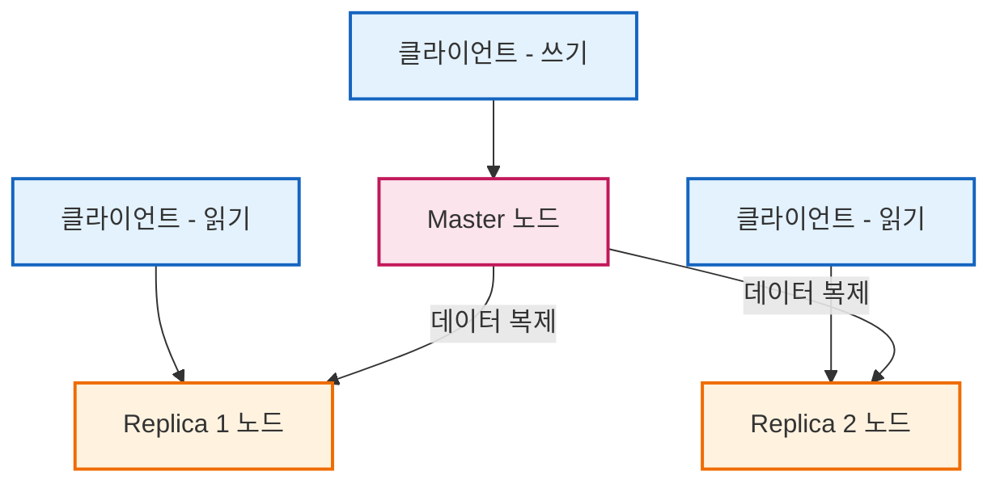
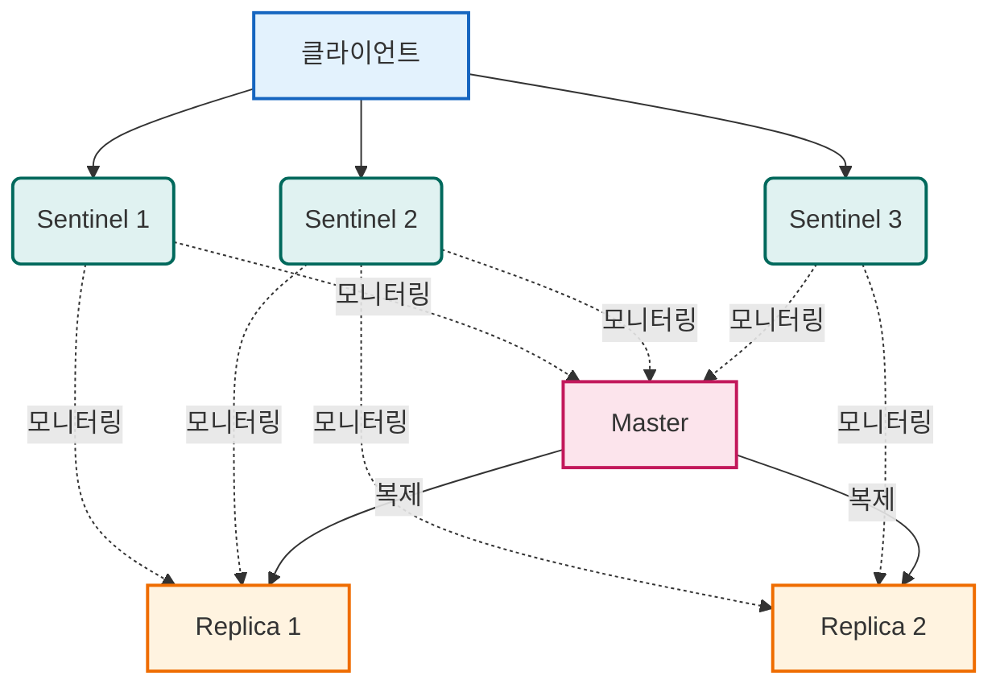
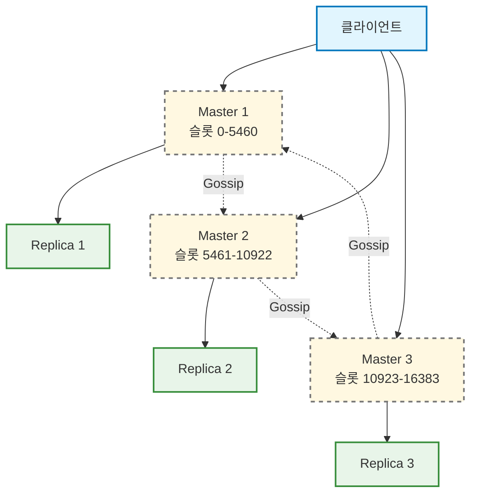

# Redis 클러스터 구성

## 1. 단일 인스턴스

- 가장 기본적인 구성 형태이다.
- 하나의 Redis 서버가 모든 읽기와 쓰기 요청을 전담하여 처리하는 구조이다.
- 데이터 분산이나 고가용성(HA)을 보장하지 않는다.
- 구조가 매우 간단하여 초기 설정 및 구축이 용이하다.
- 개발 환경이나 트래픽 부담이 적은 소규모 서비스에 적합하다.
- 서버가 1대뿐이므로 **단일 장애점(SPOF, Single Point of Failure)** 이 되어, 장애 발생 시 전체 서비스가 중단될 위험이 있다.
- 단일 서버의 메모리와 CPU 자원만 활용하므로 대규모 트래픽 처리에 한계가 있다.

## 2. Master-Replica 복제 구조

- **복제(Replication)** 기술을 활용해 동일한 데이터 사본을 유지하며 단일 인스턴스의 한계를 보완하는 구조이다.
- **1개의 마스터(Master) 노드**와 **여러 개의 레플리카(Replica) 노드**로 구성된다.
- **마스터 노드**는 데이터 **쓰기(Write) 작업**을 전담한다.
  - `SET`, `DEL`, `INCR` 등 데이터 변경 및 추가 명령은 모두 마스터로 전송된다.
  - 마스터는 요청을 처리한 후 변경 이력을 레플리카 노드로 전송한다.
- **레플리카 노드**는 마스터 데이터를 복제하여 최신 상태를 유지하며 **읽기 전용(Read-Only)** 으로 동작한다.
  - `GET`, `MGET` 등의 읽기 명령을 분산 처리하여 읽기 성능을 확장한다.
  - 장애 발생 시 데이터 백업 서버 역할을 수행한다.
- 마스터가 다운되면 레플리카 중 하나를 마스터로 승격시킬 수 있으나, **승격 과정이 수동**으로 진행되어 조치 기간 동안 서비스 중단이 발생할 수 있다.
- **초기 동기화 과정**은 아래 단계로 진행된다.
  - 레플리카가 마스터에 최초 연결 시, 마스터는 현재 메모리의 **전체 스냅샷**을 생성한다.
  - 생성된 **RDB 파일**을 네트워크를 통해 레플리카로 전송하며, 레플리카는 이를 메모리에 로드하여 초기화를 완료한다.
- 초기 동기화 이후에는 마스터에서 발생하는 모든 쓰기 명령이 **실시간 스트리밍 방식**으로 레플리카에 전달된다.

## 3. Sentinel

- **Sentinel**은 기본 Master-Replica 구조의 수동 장애 조치 한계를 해결하는 **독립 프로세스**이다.
- Redis 서버와 별도의 전용 포트(기본 26379)를 사용하며, Redis 노드 상태를 감시하는 **감시자 역할**을 수행한다.

### 3.1. 주요 기능

- **모니터링(Monitoring)**: 마스터와 모든 레플리카 노드에 주기적으로 `PING`을 보내 정상 동작 여부를 확인한다.
- **알림(Notification)**: 감시 중인 Redis 인스턴스에 문제가 발생하면 관리자나 외부 시스템에 장애 상황을 통보한다.
- **자동 장애 조치(Automatic Failover)**: 마스터 노드 다운 시 레플리카 중 하나를 새로운 마스터로 자동 승격하여 **서비스 중단 시간을 최소화**한다.

### 3.2. 고가용성 구성 (쿼럼, Quorum)

- Sentinel 프로세스 자체도 단일 지점 장애(SPOF)가 될 수 있으므로 **최소 3개 이상** 구축하는 것이 권장된다.
- 특정 Sentinel의 오판이나 네트워크 분할 현상을 방지하기 위해 **쿼럼(Quorum, 정족수)** 개념을 사용한다.
- 쿼럼 설정값이 2일 때, Sentinel 3개 중 2개 이상이 마스터 장애에 동의해야 실제 장애 조치가 수행된다.

### 3.3. 클라이언트 연결 방식

- 클라이언트는 Sentinel 노드에 먼저 접근하여 **현재 마스터의 IP 주소**를 조회한다.
- 반환받은 마스터 주소로 최종 요청을 전달하므로 마스터 변경 시에도 정상 연결을 유지할 수 있다.

### 3.4. 장애 감지 단계

1. **주관적 다운 (S-Down, Subjective Down)**: 개별 Sentinel이 `down-after-milliseconds`로 설정된 시간 동안 마스터 응답을 받지 못하면 해당 Sentinel 혼자 **주관적 다운 상태**로 판단한다.
2. **객관적 다운 (O-Down, Objective Down)**: 쿼럼 지정 수 이상의 Sentinel이 S-Down 상태 판단에 동의하면 **객관적 다운 상태**로 확정되고 장애 조치가 시작된다.

### 3.5. 장애 조치 (Failover) 프로세스

1. **리더 선출**: Sentinel 간 투표를 진행하여 실제 장애 조치를 수행할 **리더 Sentinel**을 선출한다.
2. **마스터 승격**: 리더 Sentinel이 최신 상태의 레플리카 노드 하나를 골라 **새로운 마스터로 승격**시킨다.
3. **재구성 (Reconfiguration)**: 나머지 레플리카 노드들이 신규 마스터를 바라보도록 **설정을 변경**한다.
4. **기존 마스터 전환**: 기존 마스터가 추후 복구되면 Sentinel이 이를 감지하여 **레플리카 노드로 강제 전환** 처리한다.

## 4. 샤딩 (Redis Cluster)

- **샤딩(Sharding)** 은 데이터를 여러 노드에 분산 저장하는 기법으로, 단일 서버의 **메모리 한계를 극복**할 수 있다.

### 4.1. 해시 슬롯 (Hash Slot)

- Redis 클러스터는 **해시 슬롯(Hash Slot)** 개념을 활용하여 데이터를 분산 관리한다.
- 전체 데이터 영역은 총 **16,384개의 해시 슬롯**으로 나뉘며, 모든 키는 해시 함수 계산을 거쳐 `0 ~ 16383` 사이의 슬롯 번호를 할당받는다.
- 각 마스터 노드는 전체 슬롯 중 일부분을 나누어 담당한다.
  - 예: 마스터 3대 구성 시 **Master 1**(0~5460), **Master 2**(5461~10922), **Master 3**(10923~16383)으로 분할 할당한다.

### 4.2. 노드 간 통신 및 고가용성

- 클러스터 노드끼리는 별도의 전용 포트를 사용해 **가십 프로토콜(Gossip Protocol)** 로 통신한다.
- 주기적인 정보 교환을 통해 담당 슬롯, 노드 상태, 마스터/레플리카 정보 등 **전체 상태를 파악**한다.
- 각 마스터는 하나 이상의 레플리카를 가질 수 있으며, 마스터 장애 시 **Sentinel 없이 자체적으로 레플리카를 마스터로 승격**시킨다.

### 4.3. 클라이언트 요청 처리 매커니즘

- 클라이언트가 명령어를 전송하면 노드는 해당 키의 해시 슬롯을 계산한다.
- 자신이 담당하는 슬롯이 아닐 경우 `MOVED` 응답을 반환하여 올바른 노드로 재요청하도록 안내한다.
- 클러스터 지원 클라이언트는 **슬롯 매핑 정보를 캐싱**하므로, 최초 연결 이후에는 재요청 과정 없이 올바른 노드로 직접 요청을 전송한다.

### 4.4. 제약 사항 및 해시태그 (Hash Tag)

- 여러 키를 한 번에 처리하는 **멀티키 명령어**(`MGET`, `MSET` 등) 실행 시 모든 키가 **동일한 슬롯**에 위치해야 한다.
- 서로 다른 슬롯의 키를 동시에 조회하면 `CROSSSLOT` 에러가 발생한다.
- 이를 해결하기 위해 **해시태그(Hash Tag)** 기능을 활용한다.
- 키 이름에 중괄호를 사용(예: `{user:1000}:name`, `{user:1000}:age`)하면 **중괄호 안의 문자열만 해시 계산**에 사용되므로 두 키를 같은 슬롯에 강제 배치할 수 있다.
