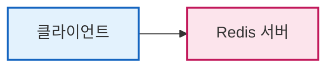
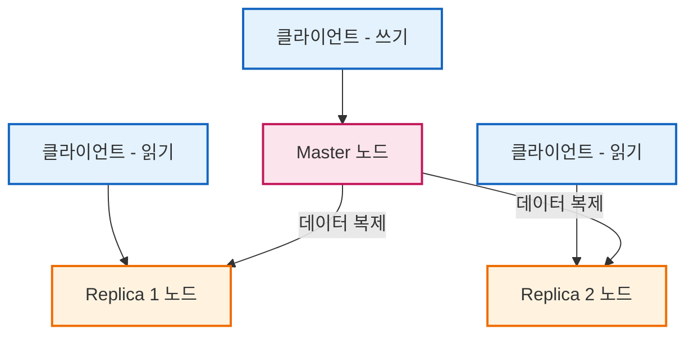

# Redis 클러스터 구성

## 1. 단일 인스턴스

- 가장 기본적인 구성 형태이다.
- 하나의 Redis 서버가 모든 읽기와 쓰기 요청을 전담하여 처리하는 구조이다.
- 데이터 분산이나 고가용성(HA)을 보장하지 않는다.
- 구조가 매우 간단하여 초기 설정 및 구축이 용이하다.
- 개발 환경이나 트래픽 부담이 적은 소규모 서비스에 적합하다.
- 서버가 1대뿐이므로 **단일 장애점(SPOF, Single Point of Failure)** 이 되어, 장애 발생 시 전체 서비스가 중단될 위험이 있다.
- 단일 서버의 메모리와 CPU 자원만 활용하므로 대규모 트래픽 처리에 한계가 있다.

## 2. Master-Replica 복제 구조

- **복제(Replication)** 기술을 활용해 동일한 데이터 사본을 유지하며 단일 인스턴스의 한계를 보완하는 구조이다.
- **1개의 마스터(Master) 노드**와 **여러 개의 레플리카(Replica) 노드**로 구성된다.
- **마스터 노드**는 데이터 **쓰기(Write) 작업**을 전담한다.
  - `SET`, `DEL`, `INCR` 등 데이터 변경 및 추가 명령은 모두 마스터로 전송된다.
  - 마스터는 요청을 처리한 후 변경 이력을 레플리카 노드로 전송한다.
- **레플리카 노드**는 마스터 데이터를 복제하여 최신 상태를 유지하며 **읽기 전용(Read-Only)** 으로 동작한다.
  - `GET`, `MGET` 등의 읽기 명령을 분산 처리하여 읽기 성능을 확장한다.
  - 장애 발생 시 데이터 백업 서버 역할을 수행한다.
- 마스터가 다운되면 레플리카 중 하나를 마스터로 승격시킬 수 있으나, **승격 과정이 수동**으로 진행되어 조치 기간 동안 서비스 중단이 발생할 수 있다.
- **초기 동기화 과정**은 아래 단계로 진행된다.
  - 레플리카가 마스터에 최초 연결 시, 마스터는 현재 메모리의 **전체 스냅샷**을 생성한다.
  - 생성된 **RDB 파일**을 네트워크를 통해 레플리카로 전송하며, 레플리카는 이를 메모리에 로드하여 초기화를 완료한다.
- 초기 동기화 이후에는 마스터에서 발생하는 모든 쓰기 명령이 **실시간 스트리밍 방식**으로 레플리카에 전달된다.
