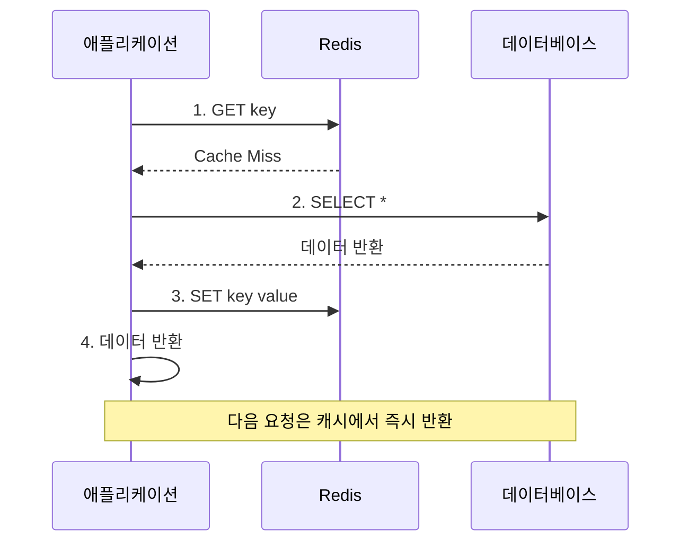
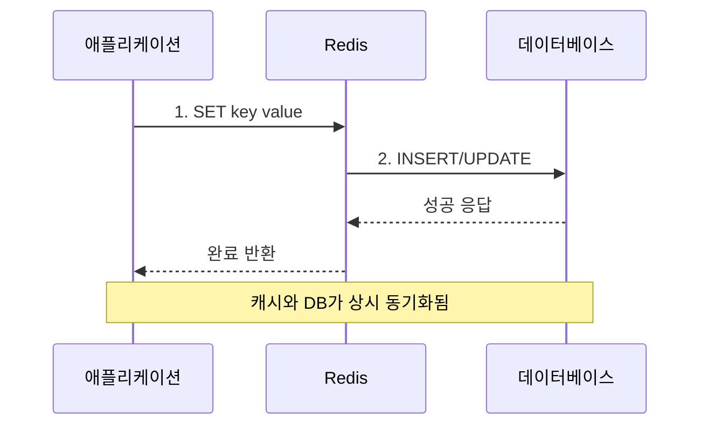
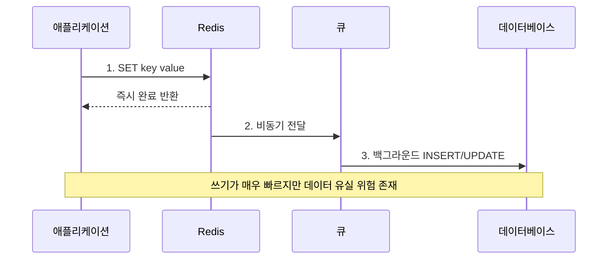
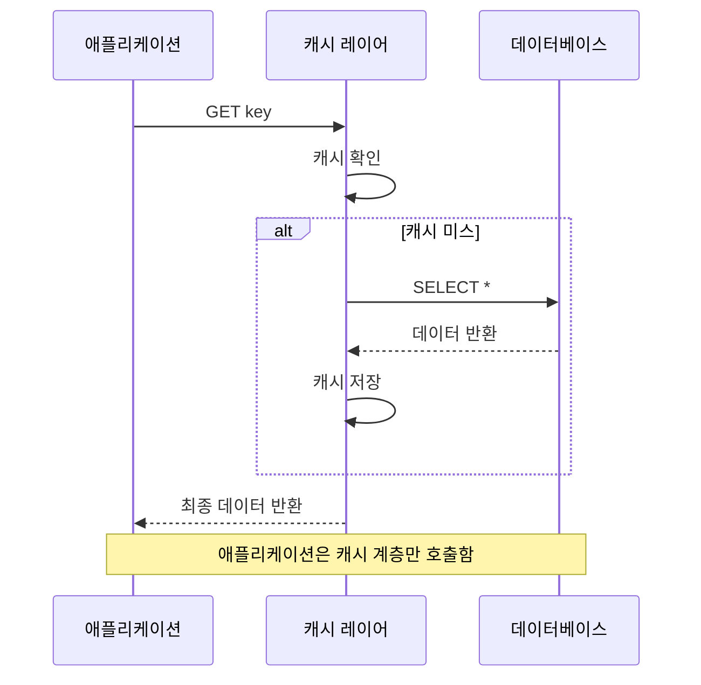
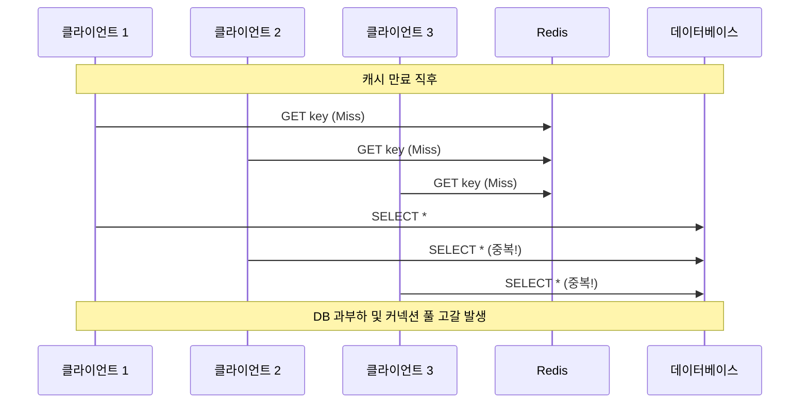

# Redis 환경 설정

## 1. 캐싱 전략 (Cache Aside, Write Through, Write Behind, Read Through)

- 캐싱을 도입할 때는 **데이터 저장소(DB)와 캐시 간의 일관성(Consistency)** 을 반드시 고려해야 한다.
- 캐시 전략을 잘못 수립하면 DB에는 최신 값이 반영되었으나 캐시에는 오래된 값이 남아있는 **데이터 불일치(Stale Data)** 문제가 장기화될 수 있다.

### 1.1. 캐싱이란

- **캐싱(Caching)**: 자주 사용하는 데이터를 메모리(RAM)와 같은 빠른 저장소에 보관하여 응답 성능을 극대화하는 기법이다.
- **주요 목적**:
  - **데이터베이스 부하 감소**: 빈번한 디스크 I/O를 방지하고 DB 단일 장애점(SPOF) 위험을 완화한다.
  - **응답 속도 개선**: 마이크로초($\mu s$) 단위의 빠른 데이터 조회를 제공한다.
- **성능과 일관성의 트레이드오프(Trade-off)**:
  - **강한 일관성 추구**: 데이터 변경 시마다 캐시를 반복 갱신·삭제하므로 시스템 전반의 성능 및 지연 시간이 저하된다.
  - **높은 성능 추구**: 캐시 TTL을 길게 유지하여 Cache Hit을 극대화하는 대신, 원본 데이터와의 일시적인 불일치를 감수해야 한다.

| 패턴              | 특징                                                                                                     |
| :---------------- | :------------------------------------------------------------------------------------------------------- |
| **Cache Aside**   | 가장 보편적인 방식으로, 애플리케이션이 캐시를 직접 제어하며 필요할 때만 데이터를 적재(Lazy Loading)한다. |
| **Write Through** | 쓰기 발생 시 Cache와 DB를 동기식으로 동시에 갱신하여 데이터 일관성을 상시 유지한다.                      |
| **Write Behind**  | 캐시에 우선 기록 후 백그라운드 큐를 통해 DB에 비동기 배치(Batch)로 반영한다.                             |
| **Read Through**  | 캐시 계층이 DB 조회를 전담하여 자동 로드하므로 애플리케이션 코드가 간결해진다.                           |

### 1.2. Cache Aside (Lazy Loading)

- 가장 단순하고 널리 쓰이는 방식으로, **조회 요청이 발생할 때만 캐시에 데이터를 적재**한다.

#### 읽기 및 쓰기 흐름



- **읽기 흐름**: 캐시 조회 $\rightarrow$ Hit 시 즉시 반환 / Miss 시 DB 조회 후 캐시 적재(`SET`) 및 결과 반환
- **쓰기 흐름**: 데이터베이스에 최신 값을 갱신한 뒤 **기존 캐시 키를 삭제(Evict)** 한다.

#### 예시 구현

```typescript
async function getUser(userId: number): Promise<User> {
  // 1. 캐시 확인
  const cachedUser = await cache.get(userId);
  if (cachedUser) {
    return JSON.parse(cachedUser);
  }

  // 2. 캐시 미스 시 DB 조회
  const user = await db.findUserById(userId);

  // 3. DB 조회 결과를 캐시에 저장 (다음 조회를 위한 최적화)
  await cache.set(userId, JSON.stringify(user));

  return user;
}

async function updateUser(user: User): Promise<void> {
  // 1. DB 갱신
  await db.updateUser(user);

  // 2. 캐시 무효화 (삭제)
  await cache.delete(user.id);
}
```

#### 장단점 및 고려사항

- **장점**:
  - 구현이 직관적이며 실제 조회된 데이터만 캐시되므로 **메모리가 효율적**이다.
  - Redis가 다운되어도 DB에서 직접 데이터를 읽어올 수 있어 **서비스 가용성을 유지**할 수 있다.
- **단점**:
  - 캐시 미스 시 DB 조회를 거쳐야 하므로 **첫 번째 요청에서 지연(Latency)** 이 발생한다.
  - DB 갱신 후 캐시 삭제 직전까지 일시적인 데이터 불일치가 발생할 수 있다.
- **동시 트래픽 문제**:
  - 캐시가 비어있는 상태에서 대량의 요청이 몰릴 경우 모든 요청이 DB로 집중되어 **커넥션 풀 고갈 및 서버 과부하**가 발생할 수 있다. (Cache Stampede 현상)

### 1.3. Write Through

- 쓰기 작업 발생 시 **Cache와 Database를 단일 흐름으로 동시에 갱신**하는 패턴이다.



- **쓰기 흐름**: 쓰기 요청이 캐시 계층으로 전달되면, 캐시가 DB에 쓰기 작업을 전달하고 두 작업이 모두 완료되어야 성공을 응답한다.
- **읽기 흐름**: 항상 캐시에서 우선 조회하며, 캐시 미스 시 DB에서 로드한다.

#### 예시 구현

```typescript
async function updateUser(userId: number, data: User): Promise<void> {
  // 1. 캐시 업데이트
  await redis.set(`user:${userId}`, JSON.stringify(data));

  // 2. 데이터베이스 업데이트 (동기 처리)
  await db.execute("UPDATE users SET ... WHERE id = ?", userId);
}

async function getUser(userId: number): Promise<User> {
  const cached = await redis.get(`user:${userId}`);
  if (cached) {
    return JSON.parse(cached);
  }

  const user = await db.query("SELECT * FROM users WHERE id = ?", userId);
  await redis.set(`user:${userId}`, JSON.stringify(user));

  return user;
}
```

#### 장단점

- **장점**:
  - 캐시와 DB가 상시 일치하여 **데이터 불일치 구간이 발생하지 않는다**.
  - 방금 작성된 데이터도 이미 캐시에 적재되어 있어 **읽기 지연이 최소화**된다.
  - DB 쓰기 완료가 보장되므로 캐시 장애 시에도 **데이터 유실 위험이 없다**.
- **단점**:
  - 모든 쓰기마다 Cache와 DB에 동시 쓰기를 수행하므로 **쓰기 지연(Latency)이 증가**한다.
  - 한 번 쓰인 후 다시 읽히지 않는 데이터까지 캐시되어 메모리가 낭비될 수 있다.
- **적합한 사용처**: **읽기 비중이 압도적으로 높고 쓰기가 드문 환경**(상품 카탈로그, 공지사항)이나 정합성이 중요한 금융/재고 데이터.

### 1.4. Write Behind (Write Back)

- 쓰기 요청을 **캐시에만 즉시 반영**한 뒤 성공을 반환하고, DB 쓰기는 백그라운드 큐/워커를 통해 **비동기 배치(Batch)로 처리**하는 패턴이다.



#### 예시 구현

```typescript
async function updateUser(userId: number, data: User): Promise<boolean> {
  // 1. 캐시 업데이트 (즉시 완료)
  await redis.set(`user:${userId}`, JSON.stringify(data));

  // 2. 비동기 큐에 작업 적재
  await redis.rpush(
    "write_queue",
    JSON.stringify({
      type: "update_user",
      userId: userId,
      data: data,
    }),
  );

  return true;
}

// 백그라운드 워커: 큐에서 대기하다가 DB 반영
async function worker(): Promise<void> {
  while (true) {
    const item = await redis.blpop("write_queue", 1);
    if (!item) {
      continue;
    }

    const task = JSON.parse(item[1]);

    if (task.type === "update_user") {
      await db.execute("UPDATE users SET ... WHERE id = ?", task.userId);
    }
  }
}
```

#### 장단점

- **장점**:
  - DB 디스크 I/O를 대기하지 않고 메모리에만 쓰므로 **쓰기 응답 속도가 극도로 빠르다**.
  - 여러 쓰기 요청을 모아 배치 쿼리로 DB에 반영하므로 **DB 부하를 획기적으로 줄인다**.
  - 쓰기 트래픽 폭증 시 큐가 버퍼 역할을 수행하여 시스템 장애를 방지한다.
- **단점**:
  - DB에 반영되기 전에 캐시나 큐 서버가 다운되면 **데이터가 영구 유실**될 수 있다.
  - 캐시에는 최신 데이터가 있으나 DB에는 아직 반영되지 않은 시차가 존재하여 타 시스템 조회 시 정합성이 깨질 수 있다.
  - 재시도, 순서 보장, 중복 처리 등 인프라 구현 복잡도가 높다.
- **적합한 사용처**: 초당 대량의 쓰기가 발생하며 소량의 데이터 유실을 감수할 수 있는 **조회수 통계, 로그 수집, 실시간 지표 집계** 등.

### 1.5. Read Through

- **애플리케이션은 오직 캐시 레이어만 상대**하며, 캐시 미스 시 캐시 레이어가 직접 DB 조회를 수행하고 데이터를 적재한 후 반환하는 패턴이다.



#### Cache Aside와의 차이점

- **책임의 분리**: Cache Aside는 애플리케이션 코드가 직접 캐시/DB 조회 흐름을 제어하지만, Read Through는 **캐시 추상화 계층이 데이터 로딩 책임을 캡슐화**한다.

#### 예시 구현

```typescript
function readThroughCache<T>(
  keyFunc: (...args: any[]) => string,
  fetchFunc: (...args: any[]) => Promise<T>,
  ttl: number = 3600,
) {
  return async (...args: any[]): Promise<T> => {
    const key = keyFunc(...args);

    // 1. 캐시 확인
    const cached = await redis.get(key);
    if (cached) {
      return JSON.parse(cached);
    }

    // 2. 캐시 미스 시 원본 DB 조회 함수 실행
    const result = await fetchFunc(...args);

    // 3. 캐시 저장
    await redis.setex(key, ttl, JSON.stringify(result));

    return result;
  };
}

// 사용 예시
async function fetchUserFromDB(userId: number): Promise<User> {
  return db.query("SELECT * FROM users WHERE id = ?", userId);
}

const getUser = readThroughCache<User>(
  (userId: number) => `user:${userId}`,
  fetchUserFromDB,
);
```

#### 장단점

- **장점**: 비즈니스 로직과 캐시 제어 로직이 분리되어 코드가 간결해지며, 일관된 캐싱 정책을 중앙에서 관리할 수 있다. (Spring `@Cacheable` 등)
- **단점**: 별도의 캐시 추상화 레이어를 구축해야 하며, 엔드포인트별 세부 튜닝 유연성이 다소 떨어질 수 있다.

### 1.6. Cache Stampede (Thundering Herd) 현상과 해결 방안



- 특정 핫키(Hot Key)의 캐시가 만료되는 순간, **동시에 수백~수천 개의 요청이 한꺼번에 DB로 몰려 커넥션 풀이 고갈되고 서버가 다운되는 현상**이다.

#### 해결 방안 1: PER (Probabilistic Early Recomputation) 알고리즘

```typescript
async function getUserWithEarlyRecompute(userId: number): Promise<User> {
  const cacheKey = `user:${userId}`;

  const cached = await redis.get(cacheKey);
  const ttl = await redis.ttl(cacheKey);

  if (cached) {
    const beta = 1; // 튜닝 계수 (1~10)
    const delta = (3600 - ttl) / 3600; // 현재 경과 시간 비율

    // 확률적 조기 갱신 조건 판별
    if (Math.random() < delta * beta) {
      const user = await db.query("SELECT * FROM users WHERE id = ?", userId);
      await redis.setex(cacheKey, 3600, JSON.stringify(user));
      return user;
    }

    return JSON.parse(cached);
  }

  // 캐시 미스 처리
  const user = await db.query("SELECT * FROM users WHERE id = ?", userId);
  await redis.setex(cacheKey, 3600, JSON.stringify(user));
  return user;
}
```

- 캐시가 완전히 만료되기 전, **남은 TTL과 연산 비용, 난수를 기반으로 확률적인 조기 갱신을 수행**하는 방식이다.
- 만료 시점에 가까워질수록 갱신 확률이 점진적으로 증가하여, 단 1개의 요청만 선제적으로 DB를 조회해 캐시를 갱신하도록 유도한다.

#### 해결 방안 2: 분산 락(Lock) 기반 제어 (`SETNX`)

```typescript
async function getUserWithLock(userId: number): Promise<User> {
  const cacheKey = `user:${userId}`;
  const lockKey = `lock:${cacheKey}`;

  const cached = await redis.get(cacheKey);
  if (cached) {
    return JSON.parse(cached);
  }

  // 락 획득 시도 (10초 만료)
  const acquired = await redis.set(lockKey, "1", "NX", "EX", 10);

  if (acquired) {
    try {
      // 락을 획득한 1개의 요청만 DB 조회 및 캐시 적재
      const user = await db.query("SELECT * FROM users WHERE id = ?", userId);
      await redis.setex(cacheKey, 3600, JSON.stringify(user));
      return user;
    } finally {
      // 락 해제
      await redis.del(lockKey);
    }
  } else {
    // 락 획득 실패 시 잠시 대기 후 재시도
    await new Promise((resolve) => setTimeout(resolve, 100));
    return getUserWithLock(userId);
  }
}
```

- 캐시 미스 발생 시 Redis의 `SET key value NX EX ttl` 또는 분산 락을 활용하여 **오직 1개의 요청만 락을 획득해 DB를 조회**하도록 제한한다.
- 락을 획득하지 못한 나머지 요청들은 잠시 대기한 뒤 캐시가 갱신되면 캐시에서 값을 읽어가도록 유도한다.

#### 해결 방안 3: 백그라운드 주기적 갱신 (Scheduler / Cron)

```typescript
async function backgroundRefresh(): Promise<void> {
  while (true) {
    const popularUsers = await getPopularUserIds();

    for (const userId of popularUsers) {
      const user = await db.query("SELECT * FROM users WHERE id = ?", userId);
      await redis.setex(`user:${userId}`, 3600, JSON.stringify(user));
    }

    // 30분 주기로 갱신
    await new Promise((resolve) => setTimeout(resolve, 1800000));
  }
}
```

- 캐시 만료 시간에 의존하지 않고, 별도의 백그라운드 스케줄러가 **주기적으로 DB에서 인기 데이터를 조회하여 캐시를 사전에 덮어쓰기(Warm-up)** 하는 방식이다.
- **특징**: Cache Miss 발생률을 0에 가깝게 유지할 수 있으나, 스케줄링 주기만큼의 데이터 변경 지연이 발생할 수 있어 실시간성이 덜 중요한 데이터에 적합하다.
