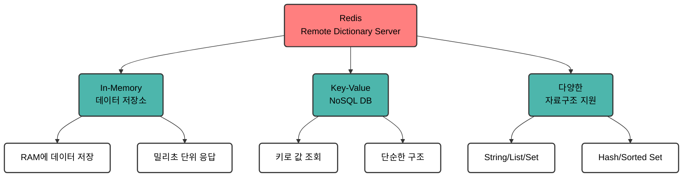
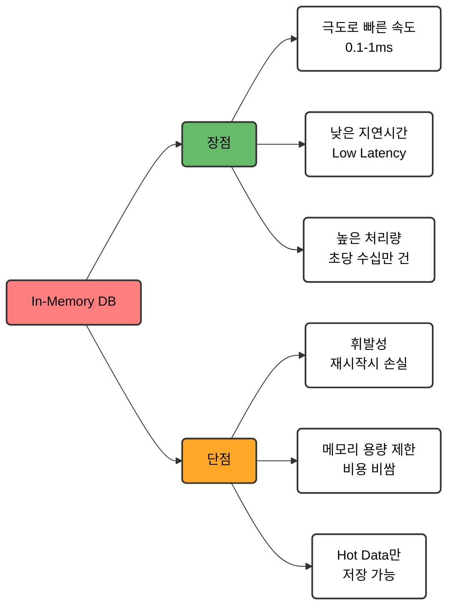

# Redis란

## 1. Redis

- Redis는 **Remote Dictionary Server**의 약자로 **오픈소스 In-Memory 저장소**이다.
- **키-값(Key-Value)** 기반의 **NoSQL** 데이터베이스다.
- 데이터를 모두 **메모리에 저장**하며, 영속성을 위한 작업은 메인 스레드를 방해하지 않도록 **백그라운드에서 주기적으로 스냅샷**을 찍어 저장한다.
- 메모리에 저장하기 때문에 매우 **빠른 I/O 성능**을 제공하여 대표적인 **캐싱 툴**로 활용된다.
- 하드웨어가 **메모리(RAM)** 로 구성되어 있으므로 **서버 확장 시 비용 부담이 크다**는 단점이 있다.

## 2. Redis의 역할

### 2.1. 성능 병목 해결

- 애플리케이션의 성능 저하는 주로 **복잡한 조회** 작업에서 발생한다.
- 복잡한 **조인(Join)** 이나 **집계 쿼리**는 수십에서 수백 밀리초(ms)까지 소요된다.
- 이때 **Redis를 캐시(Cache)로 도입**하면 동일한 데이터에 대해 훨씬 빠른 응답을 제공할 수 있다.
- 결과적으로 **데이터베이스의 부하를 줄이고** 사용자 응답 속도를 대폭 개선한다.

### 2.2. 확장성 향상

- 여러 백엔드 서버가 동시에 운영되는 환경에서는 **서버 간 데이터 공유**가 필요하다.
- 각 서버가 독립적으로 사용자 세션을 관리하면 **로드 밸런서**를 통해 다른 서버로 요청이 전달될 때 세션 정보를 유지할 수 없다.
- 이때 **Redis를 중앙 저장소로 활용**하면 모든 서버가 동일한 세션 정보에 접근 가능하다.

### 2.3. 실시간 처리

- **실시간 순위표**, **실시간 카운터**, **실시간 알림** 등 빠른 응답이 필요한 분야에 적합하다.
- 초당 수천 건 이상의 업데이트 요청을 **매우 높은 속도**로 처리할 수 있다.

### 2.4. 분산 시스템 (MSA)

- **마이크로서비스 아키텍처(MSA)** 에서 여러 서비스가 공유하는 데이터 저장소나 **메시지 큐** 역할을 수행할 수 있다.

### 2.5. 분산 환경에서 동시성 제어

- **분산 락(Distributed Lock)** 기능을 제공하여 동시성 문제를 해결한다.

## 3. Redis 주요 특징

### 3.1. In-Memory

- **극도로 빠른 속도**:
  - 데이터를 메모리에 저구하여 **밀리초(ms) 이하 단위의 응답 시간**을 제공한다.
  - **디스크 기반 저장소(HDD)** 는 헤드의 물리적 이동으로 인해 읽기 시 약 5~10ms가 소요되며, **SSD**는 0.1~0.2ms가 소요된다.
  - 또한 디스크에서 메모리로 데이터를 복사하고 **OS 파일 시스템**을 거치는 추가 시간이 발생한다.
  - 반면 **메모리 접근 속도는 나노초(ns) 단위**이므로 네트워크 지연과 Redis 자체 처리 시간만 고려하면 된다.
  - **MySQL**이나 **PostgreSQL** 등은 단순 조회 시 평균 10~100ms가 소요되고 복잡한 쿼리는 초 단위를 넘어가지만, Redis의 **GET 명령어**는 약 0.1~1ms 만에 완료된다.
- **높은 처리량**: MySQL이 초당 수천~수만 건을 처리하는 것에 비해, Redis는 **단일 인스턴스 기준 초당 10만 건 이상**의 작업을 처리할 수 있다.
- **낮은 지연 시간**: 캐싱 적용 시 일부 데이터 일관성 타협이 발생할 수 있으나, **높은 조회 성능**을 바탕으로 사용자 경험(UX)을 크게 개선한다.
- **부하 완화(트래픽 버퍼)**:
  - 갑작스러운 트래픽 폭주 시 데이터베이스는 **커넥션 풀 고갈**, **쿼리 대기**, **타임아웃** 및 CPU/IO 100% 도달로 다운될 수 있다.
  - Redis는 **중간 완충 역할**을 맡아 시스템 붕괴를 방지한다.
- **휘발성 특징**: 서버 재시작 시 데이터가 손실될 수 있으나, **AOF**나 **RDB** 같은 디스크 백업 방식을 통해 손실을 최소화한다.
- **메모리 용량 한계**:
  - RAM 확장 비용이 높으므로 모든 데이터를 저장할 수 없다.
  - 따라서 자주 액세스되는 **Hot Data** 위주로만 저장해야 하며, 주 데이터베이스 대체용으로는 적합하지 않다.

### 3.2. 다양한 자료구조 지원

- 단순 문자열 저장을 넘어 목적에 맞는 **풍부한 데이터 구조**를 제공한다.
  - **String**: 일반 캐싱, 토큰 저장, 단순 카운터 (`INCR`)
  - **List**: 작업 큐, 최근 게시물 목록 (순서 보장)
  - **Set**: 중복 제거 목록, 유일 방문자 수(UV) 계산, 집합 연산
  - **Hash**: 객체 형태 데이터 저장 (예: 사용자 프로필)
  - **Sorted Set (ZSET)**: 스코어(Score) 기준 자동 정렬 (실시간 랭킹, 가중치 큐)

### 3.3. 영속성 옵션 제공

- 메모리 내 데이터를 디스크에 저장하는 **RDB 스냅샷** 및 **AOF 로그** 기능을 지원한다.

### 3.4. 싱글 스레드 기반 동작

- 명령어 실행 기준 **싱글 스레드**로 동작하여 데이터 **원자성(Atomicity)** 을 보장하고 복잡한 **동시성 문제**를 예방한다.

### 3.5. 복제 및 고가용성

- **마스터-레플리카(Master-Replica)** 구조 및 Sentinel, Cluster 등을 통해 서비스의 **고가용성**을 확보할 수 있다.

## 4. 다른 데이터 저장소와 비교

| 비교 항목                  | **Redis**                                                    | **관계형 DB (RDBMS)** _(MySQL, PostgreSQL)_         | **Document DB** _(MongoDB)_                               | **In-Memory Cache** _(Memcached)_                         |
| :------------------------- | :----------------------------------------------------------- | :----------------------------------------------------- | :----------------------------------------------------------- | :----------------------------------------------------------- |
| **저장 위치 & 속도**       | **In-Memory** (Sub-ms, 초저지연)                          | **디스크 중심** (ms 단위, 인덱스/캐시 활용)         | **디스크 중심 + RAM 캐시** (수~수십 ms)                   | **In-Memory** (Sub-ms, 초저지연)                          |
| **데이터 구조**            | 다양한 자료구조 _(String, List, Set, Hash, ZSet 등)_      | 정형 테이블 Structure _(Row, Column)_               | BSON 문서 형태 _(JSON-like Document)_                     | 단순 Key-Value _(String / Binary만 가능)_                 |
| **저장 용량**              | **제한적 (RAM 용량)** _(Hot Data 위주 관리)_              | **대용량 가능 (디스크)** _(테라바이트 이상)_        | **대용량 가능 (디스크)** _(샤딩 기반 대규모 스케일아웃)_  | **제한적 (RAM 용량)** _(메모리 한계 존재)_                |
| **트랜잭션 (Transaction)** | **일부 지원** _(MULTI/EXEC 원자적 실행, Rollback 미지원)_ | **완벽 지원 (ACID)** _(강력한 트랜잭션 & Rollback)_ | **다중 문서 트랜잭션 지원** _(ACID 지원, RDBMS보단 느림)_ | **지원하지 않음**                                            |
| **고가용성 (HA)**          | **높음** _(Sentinel, Cluster 자동 Failover)_              | **높음** _(Replication, Clustering)_                | **높음** _(Replica Set 기반 자동 Failover)_               | **낮음 / 미지원** _(자체 Failover 없음, 클라이언트 처리)_ |
| **영속성 (Persistence)**   | **지원** _(RDB Snapshot, AOF)_                            | **기본 지원** _(WAL, Data File)_                    | **기본 지원** _(WiredTiger 엔진 디스크 저장)_             | **미지원 (휘발성)** _(재시작 시 데이터 손실)_             |
| **스레드 모델**            | **싱글 스레드** _(명령어 실행 기준)_                         | **멀티 스레드 / 프로세스**                             | **멀티 스레드**                                              | **멀티 스레드**                                              |
| **Pub/Sub (메시징)**       | **지원** _(Pub/Sub, Stream 기능 제공)_                    | **미지원** _(또는 제한적)_                             | **미지원** _(Change Streams로 유사 구현)_                    | **지원하지 않음**                                            |
| **주요 사용처**            | 캐싱, 세션 저장소, 실시간 랭킹, 분산 락, 메시지 큐           | 핵심 비즈니스 데이터, 결제/주문 (복잡한 쿼리/조인)     | 대규모 문서/로그 저장, 동적 스키마 서비스                    | 단순 텍스트/객체 데이터 Caching                              |
