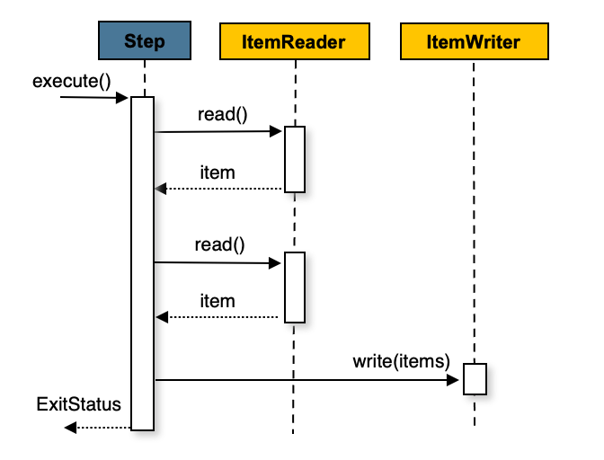

# Chunk

## 1. Chunk란?

- Chunk는 **데이터를 일정한 묶음(덩어리) 단위로 처리**하는 방식을 의미한다.
- Spring Batch에서 Chunk 기반 처리란, 데이터를 **하나씩 읽고 가공하여 일정 개수(Chunk size)만큼 모은 뒤 한 번에 저장**하는 구조이다.

## 2. Chunk 기반 처리의 특징

- **트랜잭션 단위는 Chunk 기준으로 묶인다.**
  - Chunk 내의 모든 처리가 끝나면 트랜잭션이 커밋되고,
  - 중간에 실패가 발생하면 해당 Chunk 단위까지만 롤백된다.
  - 이전 Chunk에서 커밋된 데이터는 롤백되지 않는다.
- **처리 흐름**
  1. Reader에서 데이터를 하나씩 읽어온다.
  2. Processor에서 읽은 데이터를 가공한다.
  3. 일정 개수(Chunk size)만큼 모이면,
  4. Writer에 전달하여 일괄 저장한다.
- 이 구조는 **메모리 낭비를 줄이고, 대량 데이터 처리 시 효율적인 트랜잭션 관리**가 가능하도록 한다.

## 3. 처리 예시



```java
for(int i = 0; i < totalSize; i += chunkSize) {
    List<Object> items = new ArrayList<>();
    for(int j = 0; j < chunkSize; j++) {
        // 데이터 읽기
        Object item = itemReader.read();
        // 가공
        Object processedItem = itemProcessor.process(item);
        // 임시 저장
        items.add(processedItem);
    }
    // 일괄 저장
    itemWriter.write(items);
}
```

- 위 코드는 chunkSize 단위로 데이터를 처리하는 일반적인 구조를 보여준다.
- 내부적으로 Spring Batch가 이와 유사한 방식으로 처리한다.
