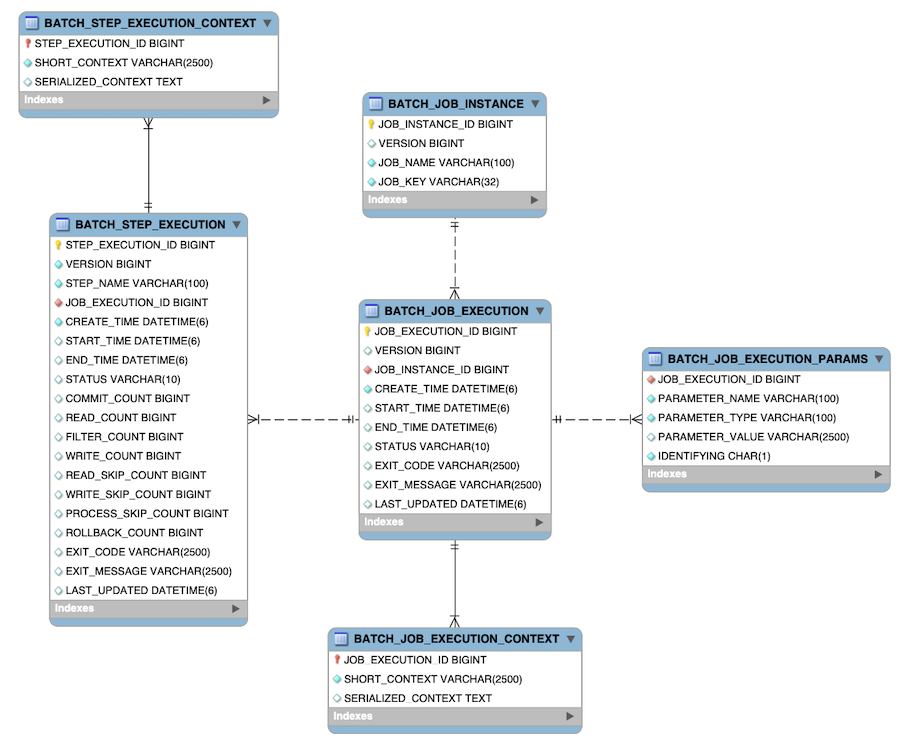

# 메타 테이블

- Spring Batch는 배치 작업의 수행 정보(작업 시간, 실행 파라미터, 정상 수행 여부 등)를 기록하기 위한 메타 테이블을 제공한다.
- 메타 테이블에 저장된 정보는 작업 실행 중 상태 추적, 실패 복구, 실행 이력 확인 등 다양한 목적으로 활용된다.
- Spring Batch Core JAR 파일에는 여러 데이터베이스 플랫폼에 맞는 메타 테이블 생성 SQL 스크립트가 포함되어 있다.
- 이 스크립트는 Job Repository 설정 시 자동으로 사용되며, 필요에 따라 인덱스나 제약 조건을 수정할 수 있다.
- SQL 파일은 `schema-<database>.sql` 형식으로 되어 있으며, `org.springframework.batch.core` 패키지 내부에 위치한다.



## 1. BATCH_JOB_INSTANCE 테이블

```sql
CREATE TABLE BATCH_JOB_INSTANCE  (
  JOB_INSTANCE_ID BIGINT  PRIMARY KEY,
  VERSION BIGINT,
  JOB_NAME VARCHAR(100) NOT NULL,
  JOB_KEY VARCHAR(32) NOT NULL
);
```

- `JobInstance` 객체의 정보를 저장하는 테이블이다.
- 전체 메타 테이블 계층에서 최상위에 위치하며, 하나의 Job 정의에 대한 실행 단위를 의미한다.

**컬럼 설명**

- `JOB_INSTANCE_ID`: Job 인스턴스를 식별하는 고유 ID이다. JobInstance의 getId 메서드를 통해 얻을 수 있다.
- `VERSION`: 낙관적 락을 위한 버전 정보이다. 레코드가 업데이트될 때마다 증가한다.
- `JOB_NAME`: Job 객체에서 가져온 Job 이름이다.
- `JOB_KEY`: 직렬화된 JobParameters를 기반으로 생성된 고유 키이다.

## 2. BATCH_JOB_EXECUTION_PARAMS 테이블

```sql
CREATE TABLE BATCH_JOB_EXECUTION_PARAMS  (
	JOB_EXECUTION_ID BIGINT NOT NULL ,
	PARAMETER_NAME VARCHAR(100) NOT NULL ,
	PARAMETER_TYPE VARCHAR(100) NOT NULL ,
	PARAMETER_VALUE VARCHAR(2500) ,
	IDENTIFYING CHAR(1) NOT NULL ,
	constraint JOB_EXEC_PARAMS_FK foreign key (JOB_EXECUTION_ID)
	references BATCH_JOB_EXECUTION(JOB_EXECUTION_ID)
);
```

- `JobParameters` 객체의 정보를 저장하는 테이블이다.
- 하나의 JobExecution에 0개 이상의 파라미터를 키-값 형태로 저장하며, JobInstance를 구분하는 데 사용된다.
- 기본 키가 존재하지 않는다.

**컬럼 설명**

- `JOB_EXECUTION_ID`: 파라미터가 속한 BATCH_JOB_EXECUTION의 외래 키이다.
- `PARAMETER_NAME`: 파라미터 이름이다.
- `PARAMETER_TYPE`: 파라미터의 데이터 타입이다.
- `PARAMETER_VALUE`: 실제 파라미터 값이다.
- `IDENTIFYING`: JobInstance 구분에 사용되는 파라미터인지 여부이다.

## 3. BATCH_JOB_EXECUTION 테이블

```sql
CREATE TABLE BATCH_JOB_EXECUTION  (
  JOB_EXECUTION_ID BIGINT  PRIMARY KEY ,
  VERSION BIGINT,
  JOB_INSTANCE_ID BIGINT NOT NULL,
  CREATE_TIME TIMESTAMP NOT NULL,
  START_TIME TIMESTAMP DEFAULT NULL,
  END_TIME TIMESTAMP DEFAULT NULL,
  STATUS VARCHAR(10),
  EXIT_CODE VARCHAR(20),
  EXIT_MESSAGE VARCHAR(2500),
  LAST_UPDATED TIMESTAMP,
  constraint JOB_INSTANCE_EXECUTION_FK foreign key (JOB_INSTANCE_ID)
  references BATCH_JOB_INSTANCE(JOB_INSTANCE_ID)
);
```

- `JobExecution` 객체의 정보를 저장하는 테이블이다.
- Job이 실행될 때마다 새로운 행이 생성된다.

**컬럼 설명**

- `JOB_EXECUTION_ID`: JobExecution을 식별하는 고유 ID이다. JobExecution 객체의 getId 메서드를 통해 얻을 수 있다.
- `VERSION`: 낙관적 락을 위한 버전 정보이다.
- `JOB_INSTANCE_ID`: 해당 실행이 속한 BATCH_JOB_INSTANCE의 외래 키이다.
- `CREATE_TIME`: JobExecution이 생성된 시각이다.
- `START_TIME`: Job이 실제로 시작된 시각이다.
- `END_TIME`: Job이 종료된 시각이다. 성공 여부와 관계없이 기록된다. 해당 Job이 실행 중이 아님에도 값이 비어 있다면 오류가 발생했으며, 프레임워크가 실패 직전에 마지막 저장을 하지 못한 것이다.
- `STATUS`: 실행 상태이다. BatchStatus Enum 값이다.(예: STARTED, COMPLETED)
- `EXIT_CODE`: 종료 코드이다.
- `EXIT_MESSAGE`: 종료 메시지 또는 에러 메시지이다.
- `LAST_UPDATED`: 마지막으로 업데이트된 시각이다.

## 4. BATCH_STEP_EXECUTION 테이블

```sql
CREATE TABLE BATCH_STEP_EXECUTION  (
  STEP_EXECUTION_ID BIGINT NOT NULL PRIMARY KEY ,
  VERSION BIGINT NOT NULL,
  STEP_NAME VARCHAR(100) NOT NULL,
  JOB_EXECUTION_ID BIGINT NOT NULL,
  CREATE_TIME TIMESTAMP NOT NULL,
  START_TIME TIMESTAMP DEFAULT NULL ,
  END_TIME TIMESTAMP DEFAULT NULL,
  STATUS VARCHAR(10),
  COMMIT_COUNT BIGINT ,
  READ_COUNT BIGINT ,
  FILTER_COUNT BIGINT ,
  WRITE_COUNT BIGINT ,
  READ_SKIP_COUNT BIGINT ,
  WRITE_SKIP_COUNT BIGINT ,
  PROCESS_SKIP_COUNT BIGINT ,
  ROLLBACK_COUNT BIGINT ,
  EXIT_CODE VARCHAR(20) ,
  EXIT_MESSAGE VARCHAR(2500) ,
  LAST_UPDATED TIMESTAMP,
  constraint JOB_EXECUTION_STEP_FK foreign key (JOB_EXECUTION_ID)
  references BATCH_JOB_EXECUTION(JOB_EXECUTION_ID)
);
```

- `StepExecution` 객체의 정보를 저장하는 테이블이다.
- 하나의 Step이 실행될 때마다 JobExecution과 연결된 StepExecution이 생성된다.

**컬럼 설명**

- `STEP_EXECUTION_ID`: StepExecution을 식별하는 고유 ID이다.
- `VERSION`: 낙관적 락을 위한 버전 정보이다.
- `STEP_NAME`: 실행된 Step의 이름이다.
- `JOB_EXECUTION_ID`: 연결된 BATCH_JOB_EXECUTION의 외래 키이다.
- `CREATE_TIME`: 생성 시각이다.
- `START_TIME`: Step이 시작된 시각이다.
- `END_TIME`: Step이 종료된 시각이다. 성공 여부와 관계없이 기록된다. 해당 Job이 실행 중이 아님에도 값이 비어 있다면 오류가 발생했으며, 프레임워크가 실패 직전에 마지막 저장을 하지 못한 것이다.
- `STATUS`: 실행 상태이다. BatchStatus Enum 값이다. (예: STARTED, COMPLETED)
- `COMMIT_COUNT`: 커밋된 트랜잭션 수이다.
- `READ_COUNT`: 읽은 데이터 수이다.
- `FILTER_COUNT`: 필터링된 데이터 수이다.
- `WRITE_COUNT`: 기록된 데이터 수이다.
- `READ_SKIP_COUNT`: 읽기 중 스킵된 건수이다.
- `WRITE_SKIP_COUNT`: 쓰기 중 스킵된 건수이다.
- `PROCESS_SKIP_COUNT`: 처리 중 스킵된 건수이다.
- `ROLLBACK_COUNT`: 롤백된 횟수이다.
- `EXIT_CODE`: 종료 코드이다.
- `EXIT_MESSAGE`: 종료 메시지이다.
- `LAST_UPDATED`: 마지막 업데이트 시각이다.

## 5. BATCH_JOB_EXECUTION_CONTEXT 테이블

```sql
CREATE TABLE BATCH_JOB_EXECUTION_CONTEXT  (
  JOB_EXECUTION_ID BIGINT PRIMARY KEY,
  SHORT_CONTEXT VARCHAR(2500) NOT NULL,
  SERIALIZED_CONTEXT CLOB,
  constraint JOB_EXEC_CTX_FK foreign key (JOB_EXECUTION_ID)
  references BATCH_JOB_EXECUTION(JOB_EXECUTION_ID)
);
```

- Job의 `ExecutionContext`와 관련된 정보를 저장한다.
- 각 JobExecution에는 하나의 Job ExecutionContext가 존재하며, 이는 해당 Job 실행에 필요한 모든 수준의 데이터를 포함한다.
- 작업 도중 실패가 발생했을 때 복구를 위한 상태 정보이다.
- 이를 통해 JobInstance이 중단된 지점부터 다시 시작할 수 있도록 해준다.

**컬럼 설명**

- `JOB_EXECUTION_ID`: JobExecution의 외래 키이다.
- `SHORT_CONTEXT`: 직렬화된 Context의 축약 문자열이다.
- `SERIALIZED_CONTEXT`: 전체 Context를 직렬화한 값이다.

## 6. BATCH_STEP_EXECUTION_CONTEXT 테이블

```sql
CREATE TABLE BATCH_STEP_EXECUTION_CONTEXT  (
  STEP_EXECUTION_ID BIGINT PRIMARY KEY,
  SHORT_CONTEXT VARCHAR(2500) NOT NULL,
  SERIALIZED_CONTEXT CLOB,
  constraint STEP_EXEC_CTX_FK foreign key (STEP_EXECUTION_ID)
  references BATCH_STEP_EXECUTION(STEP_EXECUTION_ID)
);
```

- Step의 `ExecutionContext`와 관련된 정보를 저장한다.
- 각 StepExecution에는 하나의 StepExecutionContext가 존재하며, 이는 해당 Step 실행에 필요한 모든 수준의 데이터를 포함한다.
- 작업 도중 실패가 발생했을 때 복구를 위한 상태 정보이다.
- 이를 통해 JobInstance이 중단된 지점부터 다시 시작할 수 있도록 해준다.

**컬럼 설명**

- `STEP_EXECUTION_ID`: StepExecution의 외래 키이다.
- `SHORT_CONTEXT`: 직렬화된 Context의 축약 문자열이다.
- `SERIALIZED_CONTEXT`: 전체 Context를 직렬화한 값이다.
