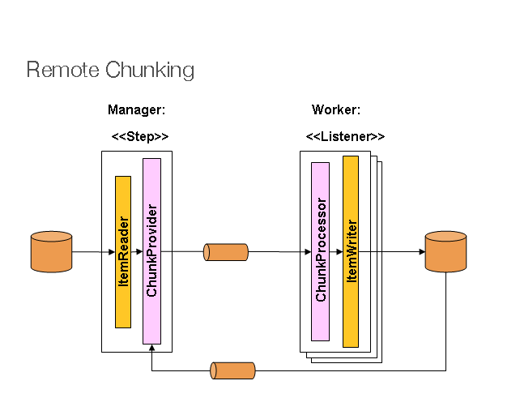
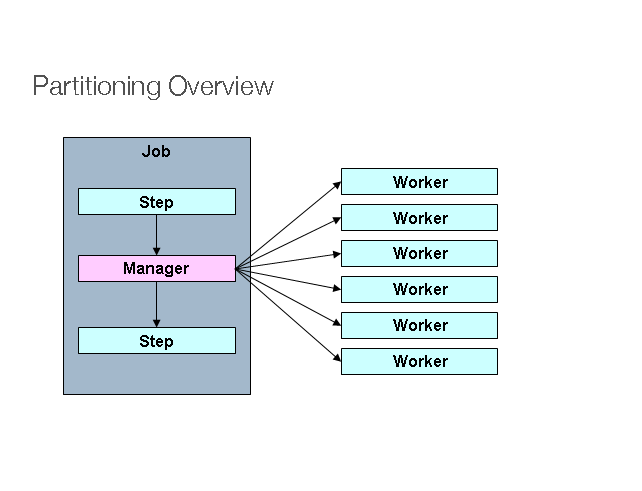

# 스케일링과 병렬 처리

## 1. 스케일링과 병렬 처리

- 대부분의 배치 처리는 **단일 스레드/프로세스 기반**으로도 충분히 수행 가능하다.
- 그러나 **대용량 데이터를 빠르게 처리해야 하는 상황**이나 **API 응답 지연으로 인한 처리 속도 저하** 등의 이슈로 인해 병렬 처리를 도입해야 할 때가 있다.
- Spring Batch는 **단일 프로세스 내 멀티 스레드 처리**와 **다중 프로세스 처리 방식**을 모두 지원한다.

### 병렬 처리 방법

1. **Multi-thread Step** (단일 프로세스)
2. **Parallel Steps** (단일 프로세스)
3. **Remote Chunking** (다중 프로세스)
4. **Step Partitioning** (단일 또는 다중 프로세스)

## 2. Multi-thread Step

- 하나의 Step 내부에서 여러 스레드가 동시에 Chunk 단위를 처리하는 방식이다.
- `TaskExecutor`를 설정하여 Step의 Reader, Processor, Writer가 **병렬 스레드에서 동작**하도록 만든다.
- 가장 간단하게 병렬 처리를 적용할 수 있는 방법이다.

### 2.1 장점

- 설정이 간단하다.
- 별도의 인프라 구성이나 배포 없이 기존 Job에 병렬 처리를 도입할 수 있다.

### 2.2 단점

- **동시성 문제가 발생할 수 있다.**
  - 예: 상태를 가지는 `ItemReader`를 여러 스레드가 공유할 경우 충돌 발생 가능성 있음.
  - 해결 방법: `SynchronizedItemStreamReader`와 같은 **Thread-safe한 Reader** 사용 필요.
- 처리 순서가 보장되지 않는다.
- **데이터베이스 커넥션 풀**은 스레드 수 이상으로 설정해야 한다.

### 2.3 예제 코드

```java
@Bean
public TaskExecutor taskExecutor() {
    return new SimpleAsyncTaskExecutor("spring_batch");
}

@Bean
public Step sampleStep(TaskExecutor taskExecutor, JobRepository jobRepository, PlatformTransactionManager transactionManager) {
	return new StepBuilder("sampleStep", jobRepository)
				.<String, String>chunk(10, transactionManager)
				.reader(itemReader()) // Thread-safe wrapper 적용 필요
				.writer(itemWriter())
				.taskExecutor(taskExecutor)
				.build();
}
```

## 3. Parallel Steps

- 하나의 Job 내부에서 여러 Step 흐름을 나누고, 이 흐름들을 **병렬로 실행**하는 방식이다.
- 병렬 처리가 필요한 작업을 **논리적으로 분리된 Flow 단위**로 구성하고, 이를 `split()` 메서드를 통해 실행한다.
- `TaskExecutor`를 설정하면 각각의 Flow가 **별도의 스레드에서 비동기적으로 실행**된다.
- 모든 병렬 Flow가 완료된 후에 다음 Step으로 전이된다.

### 3.1 장점

- 설정이 간단하고, 별도의 멀티 프로세스 환경 없이도 병렬 처리가 가능하다.
- 병렬 Flow는 순서와 무관하게 동시에 처리되어 전체 Job 수행 시간이 단축된다.
- Flow 간 의존성이 없는 경우 유용하다.

### 3.2 단점

- 병렬 Step 간 리소스 충돌이 발생할 수 있어, Thread-safe한 구성 필요
- Flow 간 의존 관계가 존재하는 경우 병렬 처리가 어렵고, 설계가 복잡해질 수 있다.
- 각 Step의 예외 처리 및 트랜잭션 경계가 명확하지 않으면 장애 추적이 어렵다.

### 3.3 예제 코드

```java
@Bean
public Job job(JobRepository jobRepository) {
    return new JobBuilder("job", jobRepository)
        .start(splitFlow())   // Flow 1, 2 병렬 실행
        .next(step4())        // 병렬 처리 후 실행될 Step
        .build()
        .build();
}

@Bean
public Flow splitFlow() {
    return new FlowBuilder<SimpleFlow>("splitFlow")
        .split(taskExecutor())        // 병렬 실행 지정
        .add(flow1(), flow2())        // 병렬 실행할 Flow 정의
        .build();
}

@Bean
public Flow flow1() {
    return new FlowBuilder<SimpleFlow>("flow1")
        .start(step1())
        .next(step2())
        .build();
}

@Bean
public Flow flow2() {
    return new FlowBuilder<SimpleFlow>("flow2")
        .start(step3())
        .build();
}

@Bean
public TaskExecutor taskExecutor() {
    return new SimpleAsyncTaskExecutor("spring_batch");
}
```

## 4. Remote Chunking



- Spring Batch에서 **Step 내부 로직(Reader → Processor → Writer)** 을 **여러 프로세스에 분산**시켜 처리하는 방식이다.
- **Manager**는 데이터를 읽고 Chunk 단위로 메시지를 전송하며, **Worker**는 메시지를 수신하고 처리 및 저장을 담당한다.
- 이들 간의 통신은 **미들웨어(Message Queue, 예: JMS, RabbitMQ, Kafka 등)** 를 통해 이루어진다.
- Manager는 `ItemReader`를 통해 데이터를 읽고, **Chunk 단위로 묶은 데이터를 메시지 형태로 MQ에 전송**한다.
- Worker는 MQ로부터 메시지를 수신하고, `ItemProcessor`와 `ItemWriter`를 통해 실제 비즈니스 처리를 수행한다.

### 4.1 장점

- 처리 로직을 여러 Worker 인스턴스에 **병렬 분산**할 수 있어 **수평 확장**에 적합하다.
- Reader-Processor-Writer 간의 역할이 분리되어 있어 **처리 병목을 완화**할 수 있다.
- 기존 로컬 Step 구성 방식과 동일한 `ItemReader`, `ItemProcessor`, `ItemWriter`를 사용할 수 있어 **구성 재사용이 용이**하다.
- **미들웨어 수준에서 자동으로 부하 분산**이 이루어진다.

### 4.2 단점

- **구성 복잡도**가 높다. (Manager, Worker, MQ 간의 연동 필요)
- 미들웨어가 반드시 **전달 보장** 및 **내구성**을 갖추어야 한다.
- **트랜잭션 관리 및 예외 처리**가 어렵다.
- **작업 상태 추적 및 모니터링이 어렵다.**

## 5. Partitioning



- 하나의 Step을 **여러 청크로 분할하여 병렬 처리**하는 방식이다.
- **단일 Job 내에서 동일한 Step 정의를 기반으로 여러 파티션을 동시에 실행**함으로써, **대용량 데이터 처리 시 성능을 향상**시킬 수 있다.
- Spring Batch는 이를 위해 `PartitionStep`이라는 특수한 Step 구현체와, 전략 인터페이스인 `StepExecutionSplitter`와 `PartitionHandler`를 제공한다.
- 이 구조는 병렬 실행을 구성할 수 있는 SPI(Service Provider Interface)의 일종이며, 로컬 또는 원격 환경 모두에서 동작 가능하다.

### 5.1 구조 설명

- 하나의 Step을 N개의 파티션으로 분할하고, **각 파티션은 별도의 StepExecution으로 병렬 실행**된다.
- 모든 파티션은 **동일한 Step 정의를 공유**하지만, **처리하는 데이터 범위는 서로 다르다.**
- `Manager Step`은 파티션 분할을 담당하며, 각각의 `Worker Step`이 실질적인 작업을 수행한다.
- Worker는 **로컬 스레드**일 수도 있고, **원격 서비스**일 수도 있다.
- **JobRepository**가 각 파티션 실행의 중복 방지를 보장한다.

### 5.2 장점

- **데이터를 범위 기반 또는 키 기반으로 나누어 병렬 처리**할 수 있어 대용량 처리에 매우 효과적이다.
- **하나의 Step 정의를 재사용**하면서 병렬 실행이 가능하다.
- **구성에 따라 멀티 스레드 혹은 다중 프로세스 실행**이 가능하다.
- 실제 데이터 처리 로직인 Reader/Processor/Writer는 **일반적인 방식 그대로 사용 가능**하다.

### 5.3 단점

- 분할 전략을 구현해야 하므로 **구성에 대한 학습과 설계가 필요**하다.
- Manager와 Worker 간 **데이터 전달 방식 설정이 다소 복잡**할 수 있다.
- 각 파티션의 결과를 수집하거나 Rollback할 때 **처리 단위를 신중히 고려**해야 한다.

### 5.4 예제 코드

```java
@Bean
public Step step1Manager(JobRepository jobRepository) {
    return new StepBuilder("step1.manager", jobRepository)
        .<String, String>partitioner("step1", partitioner()) // 파티셔너 설정
        .step(step1()) // 파티션마다 실행될 Step 정의
        .gridSize(10) // 병렬 실행할 파티션 개수
        .taskExecutor(taskExecutor()) // 병렬 처리를 위한 TaskExecutor
        .build();
}
```
