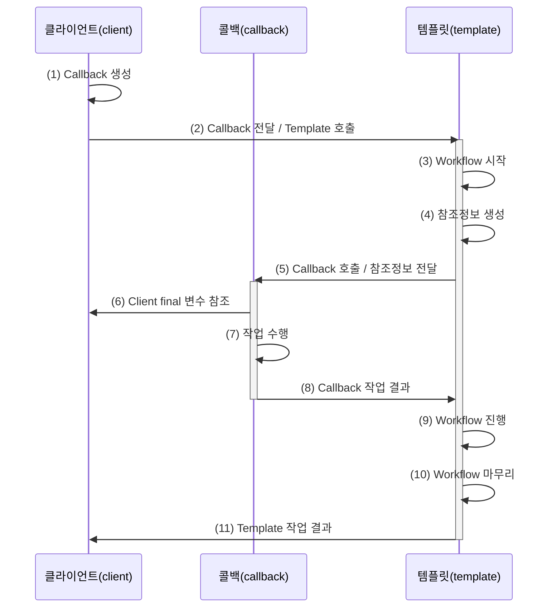

# 템플릿

## 1. 템플릿(Template)

- **템플릿**은 특정 목적을 달성하기 위해 미리 정의해 둔 구조적 틀이다.
- 고정된 전체 실행 흐름 안에 변경 가능한 로직을 삽입하여 동작하도록 설계된 오브젝트이다.

### 1.1. 템플릿 메소드 패턴(Template Method Pattern)

- 변하지 않는 기본 알고리즘 골격을 가진 템플릿 메소드를 슈퍼클래스에 정의한다.
- 상황에 따라 확장되거나 변경되는 세부 로직은 서브클래스의 메소드에서 오버라이딩하여 구현하도록 위임하는 패턴이다.

## 2. 콜백(Callback)

- **콜백은 실행을 목적으로 다른 오브젝트의 메소드에 파라미터로 전달되는 오브젝트이다**.
- 일반적인 파라미터와 달리 값을 참조하기 위함이 아니라, 특정 로직이 담긴 메소드를 실행시키는 것이 목적이다.
- 단일 메소드를 가진 함수형 인터페이스(SAM, Single Abstract Method) 타입의 인스턴스 또는 람다식(Lambda) 형태로 전달된다.

### 2.1. 템플릿/콜백은 전략 패턴의 특수한 형태

- 템플릿은 전략 패턴의 **컨텍스트(Context)** 역할을 담당한다.
- 콜백은 컨텍스트에 전달되는 **전략(Strategy)** 역할을 담당한다.
- 템플릿/콜백 패턴은 단일 메소드를 가진 전략 인터페이스를 익명 클래스나 람다식으로 매번 주입해 사용하는 형태의 특화된 전략 패턴이다.

### 2.2. 메소드 주입

- 의존 오브젝트가 인스턴스 생성 시점이 아닌 **메소드 호출 시점에 파라미터로 전달되는 방식**이다.
- 동적으로 실행 전략을 변경할 수 있는 의존관계 주입(DI)의 한 종류이다.
- 공식 명칭으로 **메소드 호출 주입(Method Call Injection)** 이라고 부른다.

### 2.3. 템플릿/콜백의 작업 흐름

### 2.4. 스프링이 제공하는 템플릿

#### RestTemplate

- HTTP API 요청과 응답을 처리하는 동기식 템플릿이다.
  - HTTP 클라이언트 라이브러리 확장: `ClientHttpRequestFactory` 전략을 사용한다.
  - 메시지 바디를 변환하는 전략: `HttpMessageConverter`를 사용한다.
- **ClientHttpRequestFactory**
  - 다양한 HTTP 클라이언트 기술을 추상화하여 `ClientHttpRequest`를 생성하는 전략 인터페이스이다.
  - `SimpleClientHttpRequestFactory`: JDK 기본 `HttpURLConnection`을 사용한다.
  - `JdkClientHttpRequestFactory`: Java 11 표준 `HttpClient`를 사용한다.
  - `ReactorNettyClientRequestFactory`: Netty 기반 클라이언트를 사용한다.
  - `JettyClientHttpRequestFactory`: Jetty HTTP 클라이언트를 사용한다.
  - `OkHttp3ClientHttpRequestFactory`: Square사의 `OkHttpClient`를 사용한다.
- `doExecute()`
  - HTTP API 호출 워크플로우(Workflow)를 정의하고 있는 핵심 템플릿 메소드이며 두 개의 콜백을 전달받는다.
    - `RequestCallback`: 요청 헤더와 본문을 준비하고 작성하는 콜백 인터페이스이다.
    - `ResponseExtractor`: HTTP 응답 데이터를 원하는 오브젝트 타입으로 추출 및 변환하는 콜백 인터페이스이다.
  - `execute()`, `getForObject()`, `postForEntity()` 등 개발 편의를 위한 다양한 래퍼(Wrapper) 메소드를 제공한다.

#### 그 외 스프링 템플릿

- `JdbcTemplate`: JDBC 기반 데이터 접근 및 SQL 실행을 지원하는 템플릿이다.
- `JmsTemplate`: JMS(Java Message Service) 기반 메시지 송수신 작업을 처리하는 템플릿이다.
- `TransactionTemplate`: 프로그래밍 방식으로 트랜잭션 경계를 설정하고 관리하는 템플릿이다.
- `HibernateTemplate`: 하이버네이트(Hibernate) 세션 관리 및 데이터 처리를 지원하는 레거시 템플릿이다.
- `SqlSessionTemplate`: MyBatis 연동 시 스프링 트랜잭션과 통합된 `SqlSession`을 제공하는 템플릿이다.
